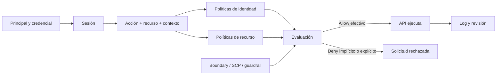

# Clase 222 — IAM en la nube: identidades, roles y permisos

> Parte: **10 — Seguridad en la nube y contenedores** · Fuente: *AWS IAM User Guide y AWS Well-Architected: Identity and Access Management*
> ⏱️ Duración estimada: **120 min** · Nivel: **Intermedio**

---

## 🎯 Objetivo

Dominar la gestión de identidad y acceso (IAM) como el verdadero perímetro de la nube: cómo se
modelan usuarios, grupos, roles y políticas; cómo se evalúa una petición; y cómo aplicar privilegio
mínimo evitando las rutas de escalada de privilegios que buscan los atacantes.

## 📚 Resultados de aprendizaje

Al finalizar, el alumno podrá:

1. **Modelar** identidades humanas y de máquina con roles asumibles en lugar de claves estáticas.
2. **Escribir** políticas IAM basadas en el principio de privilegio mínimo.
3. **Explicar** la lógica de evaluación (deny explícito > allow > deny implícito).
4. **Detectar** permisos peligrosos que permiten escalada (`iam:PassRole`, `iam:CreatePolicyVersion`, etc.).
5. **Auditar** una cuenta buscando credenciales inactivas y permisos excesivos.

## 🗺️ Temas

| # | Tema | Por qué importa |
|---|------|-----------------|
| 1 | Principals: usuarios, grupos, roles | Base del modelo de acceso |
| 2 | Políticas de identidad vs de recurso | Definen permisos desde dos lados |
| 3 | Roles asumibles y STS | Credenciales temporales en lugar de claves largas |
| 4 | Lógica de evaluación de permisos | Predecir si una acción se permite o deniega |
| 5 | Privilegio mínimo y límites de permisos | Reducen el blast radius |
| 6 | Escalada de privilegios IAM | Rutas que convierten un permiso menor en admin |
| 7 | Federación y SSO | Centralizar identidades corporativas |

## 🧠 Explicación en profundidad

Una decisión IAM no es «el usuario tiene un rol». Es la evaluación de una solicitud concreta: principal y sesión, acción, recurso, contexto, políticas aplicables y límites superiores. Esta clase usa AWS para estudiar la lógica explícita y después traduce el razonamiento a Azure RBAC y Google Cloud IAM.



El diagrama enseña que la credencial autentica y la política autoriza. En AWS una solicitud parte de denegación implícita; necesita un `Allow` aplicable y un `Deny` explícito prevalece. Sin embargo, la interacción exacta entre políticas de identidad, recurso, boundaries, SCP y sesiones cambia por tipo de principal y acceso cross-account. Memorizar «allow menos deny» no basta: se debe usar la documentación y el simulador con el contexto real.

### Personas, cargas y sesiones

Las personas deberían federarse desde un proveedor corporativo y obtener sesiones temporales con MFA o controles adaptativos. Las cargas usan identidades de servicio o roles vinculados a la plataforma. Una clave estática descargada crea un secreto que debe almacenarse, rotarse y atribuirse; una sesión temporal reduce duración, pero todavía puede ser robada y usada hasta expirar o ser revocada por mecanismos disponibles.

### Privilegio mínimo como proceso

El permiso mínimo no se diseña una sola vez. Se parte de acciones necesarias, se acotan recursos, se agregan condiciones de región, red, etiquetas o servicio y se prueban casos permitidos y denegados. Luego se usan logs de acceso para retirar permisos no utilizados. Un `Resource: "*"` puede ser requerido por una API sin soporte granular, pero debe documentarse y compensarse; un wildcard no es automáticamente una vulnerabilidad ni automáticamente aceptable.

### Rutas indirectas de escalada

`iam:PassRole` no equivale por sí solo a administrador. Se vuelve peligroso cuando el principal puede pasarlo a un servicio que ejecutará acciones bajo un rol más potente y puede controlar esa carga. De modo similar, editar una trust policy, crear versiones de funciones o enlazar roles puede producir nuevas rutas. El análisis construye un grafo de relaciones y valida una cadena completa, no una lista de permisos «peligrosos» aislados.

## 📖 Definiciones y características

- **Usuario IAM:** identidad de larga duración con credenciales propias. *Clave:* preferir roles; los usuarios con claves estáticas son un riesgo si se filtran.
- **Rol IAM:** identidad asumible que otorga credenciales temporales vía STS. *Clave:* sin secreto permanente, ideal para servicios y federación.
- **Política:** documento JSON con `Effect`, `Action`, `Resource` y `Condition`. *Clave:* define permisos de forma declarativa.
- **Policy de recurso:** adjunta al recurso (bucket, cola) en vez de a la identidad. *Clave:* permite acceso cross-account controlado.
- **Permission boundary:** conjunto que limita permisos máximos otorgables por políticas de identidad. *Clave:* no concede acceso y debe combinarse con otros límites y políticas.
- **`sts:AssumeRole`:** acción que cambia de identidad. *Clave:* base de la federación y de muchas rutas de escalada.
- **Escalada de privilegios:** cadena que permite obtener capacidades superiores a las previstas. *Clave:* requiere demostrar acciones, recursos, rol destino, trust policy y control efectivo de la carga.

## 🔍 Caso razonado — desplegar una Lambda con `PassRole`

Una identidad puede crear funciones y pasar un rol con lectura de un bucket sensible. Si también puede definir el código, invocar la función y recuperar su salida, existe una ruta hacia esos datos. Si la política de confianza no admite Lambda, `PassRole` está condicionado a otro servicio o la función no puede devolver contenido, la cadena cambia.

La corrección no es eliminar todo `PassRole`: se restringe el ARN del rol, `iam:PassedToService`, acciones de creación y destino de salida; se separan roles de despliegue y ejecución. Las pruebas incluyen una operación legítima que debe funcionar y otra con un rol no autorizado que debe fallar.

## ✅ Criterio de dominio

Dominas la clase cuando puedes explicar una decisión con principal, sesión, acción, recurso, contexto y cada política aplicable; produces pruebas allow/deny; y demuestras o refutas una ruta de escalada completa sin llamar «admin» a un permiso aislado.

## 🧰 Herramientas y preparación

- CLI del proveedor (`aws`, `az`, `gcloud`) con una cuenta de laboratorio.
- **Prowler** y **ScoutSuite** para auditar IAM (se profundiza en la clase 231).
- **Pacu** (framework de explotación AWS) y **PMapper** para grafos de escalada IAM. Úsalos **solo** en tu propia cuenta de laboratorio.

```bash
# Enumerar usuarios y sus claves de acceso (AWS)
aws iam list-users
aws iam list-access-keys --user-name lab-user
# Simular si una acción está permitida
aws iam simulate-principal-policy \
  --policy-source-arn arn:aws:iam::123456789012:user/lab-user \
  --action-names s3:DeleteBucket
```

## 🧪 Laboratorio guiado

> ⚠️ Contenido con componente ofensivo. Ejecuta todo **exclusivamente en tu propia cuenta de laboratorio**.

1. Crea un usuario `lab-user` sin permisos y un rol `lab-admin-role` con `AdministratorAccess`.
2. Adjunta a `lab-user` una política que solo permita `iam:PassRole` y `ec2:RunInstances`.
3. Con **PMapper**, genera el grafo de la cuenta: `pmapper graph create` y luego `pmapper query "who can do iam:* with *"`. Observa cómo el usuario aparente-mínimo puede escalar a admin lanzando una instancia con el rol admin.
4. Reproduce la ruta manualmente: lanza una instancia EC2 pasando `lab-admin-role` y obtén sus credenciales temporales desde el servicio de metadatos.
5. **Mitiga:** aplica un *permission boundary* a `lab-user` y añade una `Condition` que restrinja qué roles puede pasar (`iam:PassedToService`). Repite el ataque y verifica que ahora falla.
6. Audita la cuenta con `prowler aws -c iam_*` y revisa hallazgos de claves inactivas y políticas con comodín `*`.
7. Elimina las credenciales de larga duración y sustitúyelas por roles asumibles.

## ✍️ Ejercicios

1. Escribe una política que permita listar un bucket concreto pero denegar borrar objetos.
2. Convierte una integración basada en clave estática en un rol asumido por un servicio.
3. Explica el resultado de una petición con un `Deny` explícito y un `Allow` simultáneos.
4. Añade una `Condition` que exija MFA para acciones destructivas.
5. Usa PMapper para identificar caminos hacia un rol privilegiado dentro de las cuentas y relaciones que la credencial auditora pudo observar; declara límites de cobertura.
6. Diseña un esquema de permission boundaries para un equipo que autoadministra sus recursos.

## 📝 Reto verificable

Parte de una política demasiado amplia (`"Action": "*"`, `"Resource": "*"`) y refactorízala a
privilegio mínimo para un caso de uso concreto (una app que lee de una tabla y escribe en una cola).

**Criterio de aceptación:** la política final solo incluye las acciones estrictamente necesarias sobre
los ARNs concretos, incluye al menos una `Condition`, y `simulate-principal-policy` confirma que las
acciones legítimas se permiten y una acción no relacionada se deniega.

## ⚠️ Errores comunes

| Síntoma / mensaje | Causa y cómo arreglar |
|-------------------|-----------------------|
| `AccessDenied` inesperado | SCP u organización deniega arriba; revisa políticas heredadas y deny explícitos. |
| Política con `"Action": "*"` en producción | Privilegio excesivo; refactoriza a acciones concretas y usa Access Analyzer. |
| Claves de acceso en el código | Credenciales estáticas filtrables; migra a roles y rota/revoca de inmediato. |
| `iam:PassRole` sin condición | Ruta de escalada; restringe con `Condition` sobre servicio y rol destino. |
| Usuarios inactivos con claves activas | Falta de revisión; deshabilita credenciales sin uso > 90 días. |

## ❓ Preguntas frecuentes

**❓ ¿Rol o usuario para una aplicación?**
Prefiere identidad de carga o rol temporal cuando la plataforma lo soporte. Reduce credenciales estáticas, pero todavía debes limitar permisos, proteger la carga y comprender expiración y revocación de sesiones.

**❓ ¿Qué pasa si una política de identidad permite algo y una de recurso lo deniega?**
Un `Deny` explícito aplicable prevalece sobre un `Allow`; sin `Allow` aplicable existe denegación implícita. La política relevante cambia por tipo de principal, recurso, sesión y acceso cross-account.

**❓ ¿Cómo aplico privilegio mínimo sin frenar al equipo?**
Empieza permisivo pero mide: usa Access Analyzer/policy usage para ver qué se usa realmente y recorta lo no utilizado. Itera en vez de adivinar.

## 🔗 Referencias verificables y alcance

- AWS IAM User Guide. <https://docs.aws.amazon.com/IAM/latest/UserGuide/> — fuente oficial para identidades, roles, políticas y STS.
- AWS — IAM policy evaluation logic. <https://docs.aws.amazon.com/IAM/latest/UserGuide/reference_policies_evaluation-logic.html> — reglas oficiales; revisar las variantes por principal y acceso cross-account.
- Microsoft Entra ID. <https://learn.microsoft.com/en-us/entra/identity/> — documentación oficial para identidad y federación Microsoft.
- Google Cloud IAM overview. <https://cloud.google.com/iam/docs/overview> — referencia oficial para principals, roles, políticas y herencia en Google Cloud.
- PMapper. <https://github.com/nccgroup/PMapper> — herramienta abierta para modelar relaciones AWS; los caminos deben validarse contra políticas efectivas.
- Rhino Security Labs — IAM privilege escalation. <https://rhinosecuritylabs.com/aws/aws-privilege-escalation-methods-mitigation/> — investigación técnica complementaria, no especificación de autorización.

## 📥 Material descargable

- 📄 [Guía en PDF](./clase-222-guia.pdf) — versión imprimible de esta clase.
- 🎞️ [Presentación (PPTX)](./clase-222-presentacion.pptx) — deck para proyectar en clase.

## ⬅️ Clase anterior

[Clase 221 — Fundamentos de seguridad en la nube y responsabilidad compartida](../221-fundamentos-de-seguridad-en-la-nube-y-responsabilidad-compartida/README.md)

## ➡️ Siguiente clase

[Clase 223 — Seguridad en AWS](../223-seguridad-en-aws/README.md)
