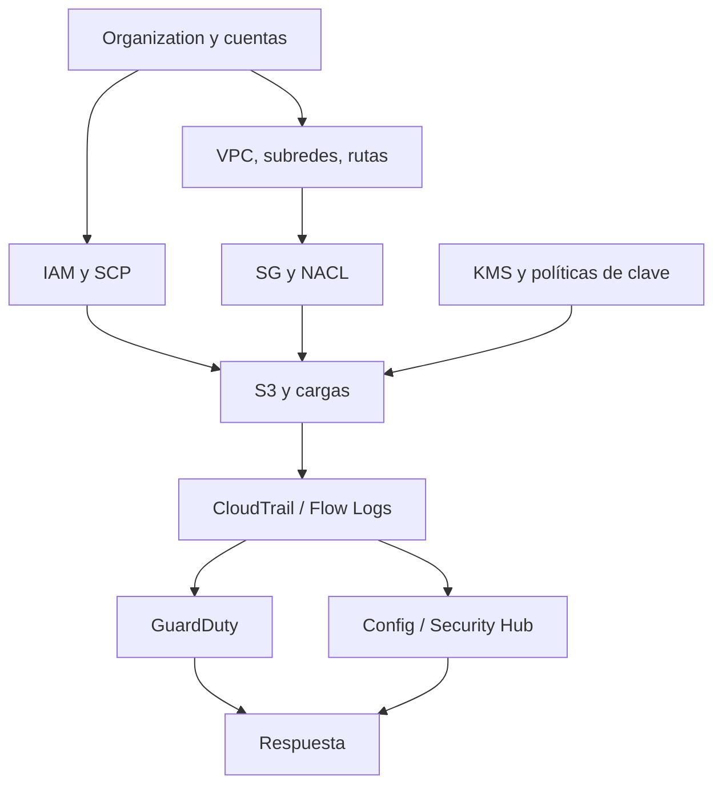

# Clase 223 — Seguridad en AWS

> Parte: **10 — Seguridad en la nube y contenedores** · Fuente: *AWS Well-Architected Framework: Security Pillar y CIS Amazon Web Services Foundations Benchmark*
> ⏱️ Duración estimada: **130 min** · Nivel: **Intermedio**

---

## 🎯 Objetivo

Endurecer una cuenta de AWS aplicando los controles nativos clave: segmentación de red con VPC y
security groups, protección de datos con cifrado y KMS, aislamiento de almacenamiento S3, y los
servicios de seguridad gestionados (GuardDuty, Security Hub, Config). Al terminar, el alumno podrá
llevar una cuenta desde su estado por defecto hasta una postura alineada con el CIS Benchmark.

## 📚 Resultados de aprendizaje

Al finalizar, el alumno podrá:

1. **Diseñar** una VPC segura con subredes públicas/privadas, security groups y NACLs.
2. **Bloquear** el acceso público a S3 y aplicar cifrado en reposo con KMS.
3. **Habilitar** GuardDuty, Security Hub y Config para detección y postura continua.
4. **Configurar** VPC Flow Logs y CloudTrail multi-región para trazabilidad.
5. **Interpretar** los hallazgos del CIS AWS Benchmark en una cuenta real.

## 🗺️ Temas

| # | Tema | Por qué importa |
|---|------|-----------------|
| 1 | VPC, subredes y security groups | Segmentación de red y control de tráfico |
| 2 | S3: block public access y políticas | Evaluar acceso público, compartido y excepciones legítimas |
| 3 | Cifrado en reposo y KMS | Protege datos y controla claves |
| 4 | GuardDuty | Detección de amenazas basada en logs |
| 5 | Security Hub | Consolidación de hallazgos y benchmarks |
| 6 | AWS Config | Inventario y evaluación de cumplimiento continuo |
| 7 | CloudTrail y Flow Logs | Auditoría de API y tráfico de red |

## 🧠 Explicación en profundidad

AWS organiza seguridad a través de cuentas, regiones y servicios. Una arquitectura defendible separa cargas y entornos en cuentas, aplica guardrails organizacionales y luego configura controles de identidad, red, datos y detección. La clase no busca memorizar productos, sino entender qué pregunta responde cada uno y qué deja fuera.



La lectura es descendente: organización limita el espacio de decisión; IAM autoriza API; VPC define conectividad; KMS añade control criptográfico; logs observan; GuardDuty y Security Hub interpretan fuentes distintas. Security Hub agrega hallazgos y estándares, mientras Config registra configuración y evalúa reglas. Ninguno corrige automáticamente todas las causas salvo una automatización explícita y autorizada.

### Red: ruta, estado y punto de aplicación

Una subred no es «pública» por su nombre, sino por rutas, gateway y posibilidad de asignar dirección accesible. Security Groups son stateful y expresan permisos sobre interfaces; NACL operan stateless por subred y requieren reglas de ida y retorno. Network Firewall, WAF y controles de aplicación responden a otras capas. Abrir `0.0.0.0/0` en un SG solo produce exposición si existe una ruta y un servicio escuchando, pero sigue siendo un estado que debe justificarse.

### S3, KMS y acceso efectivo

S3 Block Public Access combina controles en organización, cuenta, bucket y access point; AWS aplica la combinación más restrictiva relevante. Esto ayuda a impedir políticas o ACL públicas, pero no evita accesos excesivos de principals autenticados ni compartición no pública. Se revisan bucket policy, IAM, access points, propiedad de objetos y Access Analyzer.

KMS protege claves y registra uso, pero cifrado en reposo no limita a un principal que tiene simultáneamente permiso al dato y a `Decrypt`. La separación de administración y uso, condiciones y política de clave importan tanto como activar cifrado.

### Telemetría y cobertura regional

CloudTrail registra actividades cubiertas; management events y data events tienen cobertura y costo distintos. VPC Flow Logs son metadatos, no contenido. GuardDuty procesa fuentes administradas según plan y región; Security Hub consolida hallazgos si está habilitado y configurado. El diseño enumera regiones, cuentas, delegación administrativa, retención y destino separado antes del incidente.

## 📖 Definiciones y características

- **VPC:** red virtual aislada dentro de AWS. *Clave:* subredes privadas sin ruta a Internet reducen exposición.
- **Security Group:** firewall stateful a nivel de instancia. *Clave:* solo permite (allow); denegar es no incluir la regla.
- **NACL:** firewall stateless a nivel de subred. *Clave:* permite reglas deny explícitas, complementa a los SG.
- **S3 Block Public Access:** conjunto de cuatro controles aplicables en varios ámbitos. *Clave:* bloquea formas de acceso público, pero no reemplaza la revisión de acceso autenticado y compartido.
- **KMS:** servicio de gestión de claves. *Clave:* separa quién administra la clave de quién la usa; auditable vía CloudTrail.
- **GuardDuty:** servicio administrado de detección que usa fuentes y planes documentados. *Clave:* cobertura, región, características habilitadas y contexto determinan los hallazgos.
- **Security Hub:** servicio de postura y agregación de hallazgos. *Clave:* centraliza estándares y productos, pero requiere priorización y remediación fuera del panel.

## 🔍 Caso razonado — bucket cifrado pero expuesto a una cuenta externa

Un bucket tiene BPA activo y cifrado KMS, pero una bucket policy permite lectura a una cuenta asociada completa. No es «público» en el sentido de acceso anónimo y BPA puede no bloquear el patrón, aunque el alcance sea excesivo. Access Analyzer identifica acceso externo; el equipo determina qué rol concreto lo necesita y reduce principal, prefijo y condiciones.

Después verifica que la cuenta externa también posee permiso KMS, revisa CloudTrail data events disponibles y prueba acceso permitido y denegado. El caso demuestra que cifrado, BPA y policy resuelven preguntas distintas y que un check verde aislado no equivale a confidencialidad efectiva.

## ✅ Criterio de dominio

Dominas la clase cuando puedes seguir una solicitud desde cuenta y principal hasta ruta, SG, política de recurso y KMS; distinguir prevención, registro y detección; y documentar cobertura regional y una excepción de acceso con pruebas positivas y negativas.

## 🧰 Herramientas y preparación

- CLI `aws` configurada con un perfil de laboratorio y MFA.
- **Prowler** para el CIS AWS Benchmark: `pip install prowler`.
- Cuenta de laboratorio dedicada; no uses la cuenta de producción.

```bash
# Comprobar que S3 no permite acceso público a nivel de cuenta
aws s3control get-public-access-block --account-id 123456789012
# Habilitar GuardDuty en la región actual
aws guardduty create-detector --enable
```

## 🧪 Laboratorio guiado

1. Crea una VPC con una subred pública (con Internet Gateway) y una privada (sin ruta directa a Internet).
2. Lanza una instancia en la subred privada y comprueba que no es accesible desde Internet; da acceso solo vía un bastión o SSM Session Manager.
3. Crea un bucket S3, sube un objeto y verifica que **Block Public Access** está activo a nivel de cuenta y bucket. Intenta hacerlo público y confirma que se bloquea.
4. Activa cifrado por defecto con una clave KMS gestionada por ti y revisa la política de la clave.
5. Habilita **CloudTrail** multi-región con un bucket dedicado y cifrado, y **VPC Flow Logs** hacia CloudWatch.
6. Activa **GuardDuty**, **Config** (con reglas gestionadas) y **Security Hub** con el estándar CIS.
7. Ejecuta `prowler aws --compliance cis_2.0_aws` y compara los hallazgos con lo que muestra Security Hub. Corrige al menos tres hallazgos de severidad alta y vuelve a ejecutar.

## ✍️ Ejercicios

1. Escribe una regla de security group que permita SSH solo desde tu IP y HTTPS desde cualquier origen.
2. Crea una política de bucket que exija cifrado en las peticiones `PutObject`.
3. Configura una regla de Config que marque como no conforme cualquier volumen EBS sin cifrar.
4. Interpreta un hallazgo de GuardDuty de tipo `UnauthorizedAccess:IAMUser/InstanceCredentialExfiltration`.
5. Diseña una arquitectura de cuentas con una cuenta de logging centralizado.
6. Habilita el acceso a instancias vía SSM en lugar de SSH y explica la ventaja de seguridad.

## 📝 Reto verificable

Toma una cuenta de laboratorio "recién creada" y llévala a una postura base: sin buckets públicos,
CloudTrail multi-región activo, GuardDuty y Security Hub habilitados, y cifrado por defecto en S3 y EBS.

**Criterio de aceptación:** una ejecución de `prowler aws --compliance cis_2.0_aws` muestra 0
hallazgos críticos/altos en las secciones de S3, logging y cifrado, y Security Hub reporta esos
controles como `PASSED`.

## ⚠️ Errores comunes

| Síntoma / mensaje | Causa y cómo arreglar |
|-------------------|-----------------------|
| Bucket "public" pese a política privada | ACL heredada o BPA desactivado; activa Block Public Access a nivel de cuenta. |
| SG "no funciona" al denegar un puerto | Los SG solo permiten; para deny explícito usa NACL a nivel de subred. |
| GuardDuty sin hallazgos aunque hay actividad | Un hallazgo depende de región, plan, fuente y lógica de detección. Verifica cobertura sin asumir que toda actividad genera alerta. |
| El trail no contiene el evento esperado | Revisa región, categoría, selector y fecha. Event history aporta ciertos management events recientes, pero no reemplaza un trail organizacional y su retención. |
| `AccessDenied` al usar una clave KMS | Falta permiso en la política de la clave; añade el principal a `kms:Decrypt`. |

## ❓ Preguntas frecuentes

**❓ ¿Security Group o NACL?**
Usa ambos. El SG es stateful y va en la instancia (control fino); el NACL es stateless, va en la subred y sirve para bloqueos amplios (deny) que el SG no puede expresar.

**❓ ¿GuardDuty reemplaza a un SIEM?**
No. GuardDuty detecta amenazas conocidas a partir de los logs de AWS; un SIEM correlaciona múltiples fuentes. Lo habitual es enviar los hallazgos de GuardDuty al SIEM.

**❓ ¿Debo usar claves gestionadas por AWS o por el cliente (CMK)?**
Para control de auditoría, rotación y separación de deberes, usa claves gestionadas por el cliente (CMK). Las gestionadas por AWS son cómodas pero dan menos control sobre la política.

## 🔗 Referencias verificables y alcance

- AWS Well-Architected — Security Pillar. <https://docs.aws.amazon.com/wellarchitected/latest/security-pillar/welcome.html> — principios oficiales de diseño.
- Amazon S3 — Blocking public access. <https://docs.aws.amazon.com/AmazonS3/latest/userguide/access-control-block-public-access.html> — semántica oficial de los cuatro controles y ámbitos.
- AWS IAM policy evaluation. <https://docs.aws.amazon.com/IAM/latest/UserGuide/reference_policies_evaluation-logic.html> — base para acceso efectivo de identidad y recurso.
- Amazon GuardDuty. <https://docs.aws.amazon.com/guardduty/> — fuentes, planes y operación oficial; no garantiza detectar toda actividad adversaria.
- CIS AWS Foundations Benchmark. <https://www.cisecurity.org/benchmark/amazon_web_services> — baseline independiente de configuración, no evaluación total de arquitectura.
- Prowler. <https://github.com/prowler-cloud/prowler> — automatiza checks; validar alcance, versión y permisos del rol auditor.

## 📥 Material descargable

- 📄 [Guía en PDF](./clase-223-guia.pdf) — versión imprimible de esta clase.
- 🎞️ [Presentación (PPTX)](./clase-223-presentacion.pptx) — deck para proyectar en clase.

## ⬅️ Clase anterior

[Clase 222 — IAM en la nube: identidades, roles y permisos](../222-iam-en-la-nube-identidades-roles-y-permisos/README.md)

## ➡️ Siguiente clase

[Clase 224 — Seguridad en Azure](../224-seguridad-en-azure/README.md)
