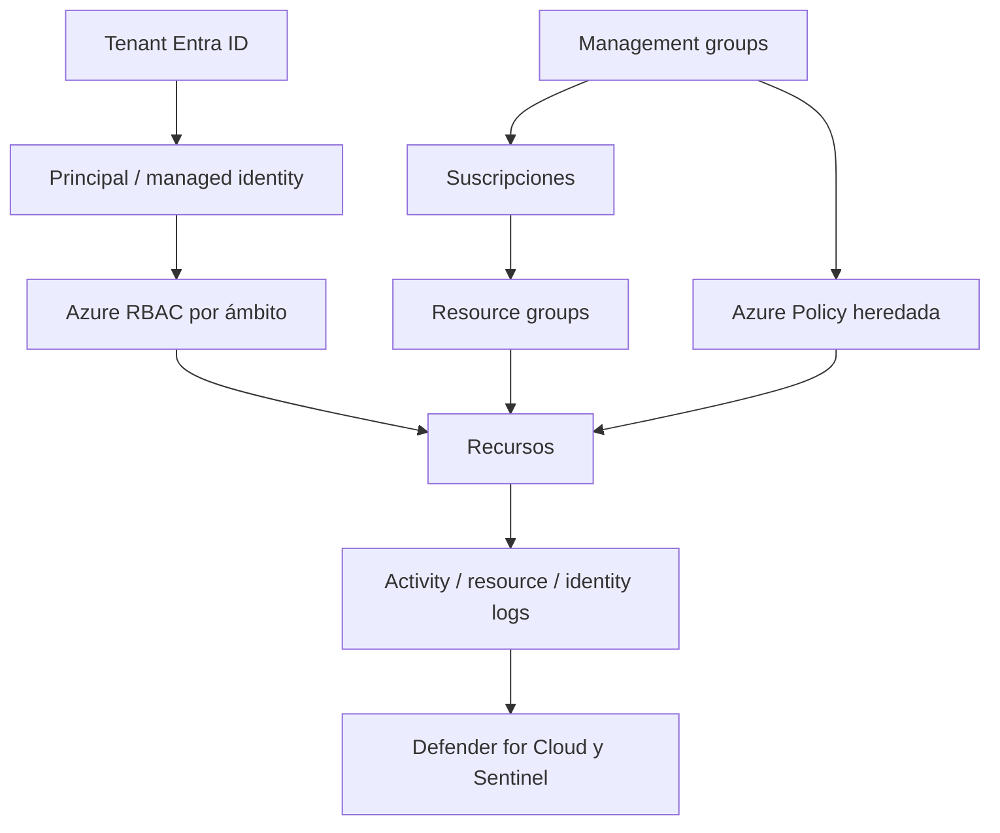

# Clase 224 — Seguridad en Azure

> Parte: **10 — Seguridad en la nube y contenedores** · Fuente: *Microsoft Cloud Security Benchmark y documentación oficial de Microsoft Defender for Cloud*
> ⏱️ Duración estimada: **120 min** · Nivel: **Intermedio**

---

## 🎯 Objetivo

Asegurar una suscripción de Azure aplicando su modelo de identidad (Microsoft Entra ID), control de
acceso (RBAC), gobierno (Azure Policy y Management Groups), red (NSG, Firewall) y los servicios de
seguridad gestionados (Defender for Cloud, Sentinel). Al terminar, el alumno sabrá endurecer una
suscripción según el Microsoft Cloud Security Benchmark.

## 📚 Resultados de aprendizaje

Al finalizar, el alumno podrá:

1. **Modelar** identidades y accesos con Entra ID y Azure RBAC.
2. **Aplicar** gobierno con Azure Policy y jerarquía de Management Groups.
3. **Segmentar** red con NSG, subredes y Azure Firewall.
4. **Interpretar** el Secure Score y las recomendaciones de Defender for Cloud.
5. **Proteger** secretos y claves con Azure Key Vault.

## 🗺️ Temas

| # | Tema | Por qué importa |
|---|------|-----------------|
| 1 | Entra ID (antes Azure AD) | Directorio y autenticación de toda la nube Microsoft |
| 2 | Azure RBAC y roles | Control de acceso a recursos por ámbito |
| 3 | Management Groups y Azure Policy | Gobierno y cumplimiento a escala |
| 4 | Network Security Groups y Firewall | Segmentación y filtrado de tráfico |
| 5 | Defender for Cloud y Secure Score | Postura y detección de amenazas |
| 6 | Key Vault | Gestión de secretos, claves y certificados |
| 7 | Microsoft Sentinel | SIEM/SOAR nativo en la nube |

## 🧠 Explicación en profundidad

Azure separa el tenant de identidad de la jerarquía de administración de recursos. Microsoft Entra ID autentica identidades; Azure RBAC autoriza acciones sobre management groups, suscripciones, grupos de recursos y recursos. Confundir ambos planos produce asignaciones que parecen correctas pero no cubren la API o el dato esperado.



El diagrama muestra dos árboles que convergen: identidad y recursos. Una asignación RBAC contiene principal, definición de rol y ámbito; la herencia baja por la jerarquía. Azure Policy evalúa propiedades de recursos y puede auditar, denegar, modificar o desplegar configuración según definición y efecto. Policy no concede permisos de uso y RBAC no obliga a que el recurso cumpla una configuración.

### Red y acceso privado

NSG aplica reglas stateful a NIC o subred y resuelve prioridades numéricas; una regla con número menor tiene mayor prioridad. Azure Firewall ofrece control centralizado y otras capacidades; Private Endpoint lleva un servicio PaaS a una interfaz en VNet, pero DNS y acceso público deben revisarse. La existencia de un endpoint privado no demuestra que el endpoint público quedó deshabilitado.

### Claves, secretos e identidades administradas

Key Vault conserva claves, secretos y certificados con modelos de autorización y logging. Una managed identity permite que una carga obtenga token sin secreto de aplicación almacenado. Esto reduce secretos estáticos, pero la identidad todavía necesita RBAC mínimo, rotación de valores gestionados y protección frente a una carga comprometida que pueda solicitar tokens.

### Postura, protección y SIEM

Defender for Cloud combina recomendaciones de postura con planes de protección de cargas. Secure Score prioriza mejoras según el modelo del producto, no cuantifica por sí solo el riesgo empresarial. Sentinel ingiere datos, ejecuta analíticas y coordina incidentes; su capacidad depende de conectores, esquema, retención, reglas y respuesta. El diseño une Activity Log, Entra sign-in/audit logs y logs de recurso sin asumir que uno contiene todo.

## 📖 Definiciones y características

- **Microsoft Entra ID:** servicio de identidad y directorio. *Clave:* autenticación, Conditional Access y gobierno de identidades complementan la autorización Azure RBAC.
- **Azure RBAC:** asignación de roles (Owner, Contributor, Reader…) por ámbito. *Clave:* el ámbito puede ser suscripción, grupo de recursos o recurso.
- **Management Group:** contenedor jerárquico de suscripciones. *Clave:* permite aplicar policy heredada a toda la organización.
- **Azure Policy:** reglas que auditan o fuerzan configuraciones. *Clave:* efecto `Deny` bloquea despliegues no conformes.
- **NSG:** filtro stateful sobre subred o NIC. *Clave:* el número de prioridad menor se evalúa antes; se consideran reglas efectivas en ambos ámbitos.
- **Defender for Cloud:** capacidades de postura y protección según planes habilitados. *Clave:* Secure Score representa recomendaciones del servicio, no una medida completa de riesgo.

## 🔍 Caso razonado — Contributor no puede leer un secreto

Una persona tiene `Contributor` en un grupo de recursos y puede configurar el Key Vault, pero la lectura del valor depende del modelo de acceso al plano de datos. El equipo distingue control plane y data plane, revisa RBAC efectivo del vault y evita asignar `Owner` como solución rápida. Otorga un rol de lectura de secretos en el ámbito mínimo solo a la managed identity de la aplicación.

Luego Azure Policy exige deshabilitar acceso público y usar Private Endpoint. La prueba verifica DNS desde la carga, denegación desde una red externa y registros del acceso. El caso conecta identidad, red, configuración y evidencia sin confundir administración del recurso con lectura del contenido.

## ✅ Criterio de dominio

Dominas la clase cuando puedes dibujar tenant y jerarquía de recursos, explicar una asignación RBAC efectiva por ámbito, diferenciar Policy de autorización, validar NSG/Private Endpoint y diseñar acceso a Key Vault mediante managed identity con logs y pruebas de denegación.
- **Key Vault:** almacén gestionado de secretos y claves. *Clave:* acceso vía RBAC/policy y auditado.

## 🧰 Herramientas y preparación

- CLI `az` autenticada en una suscripción de laboratorio.
- **ScoutSuite** con el proveedor `azure` para auditoría.
- **Prowler** también soporta Azure (`prowler azure`).

```bash
# Listar asignaciones de rol en la suscripción
az role assignment list --all -o table
# Ver el estado de Defender for Cloud
az security pricing list -o table
```

## 🧪 Laboratorio guiado

1. Crea un grupo de recursos de laboratorio y asigna a un usuario el rol **Reader** solo en ese ámbito; verifica que no puede crear recursos.
2. Habilita **MFA** y una política de **Conditional Access** que exija MFA para roles administrativos.
3. Define un **Management Group** y aplica una **Azure Policy** que deniegue la creación de cuentas de almacenamiento con acceso público. Intenta crear una y confirma el `Deny`.
4. Crea una VNet con dos subredes y un **NSG** que permita solo HTTPS entrante; asocia el NSG a la subred.
5. Habilita **Defender for Cloud** en la suscripción, revisa el **Secure Score** y aplica tres recomendaciones prioritarias.
6. Crea un **Key Vault**, guarda un secreto y concede acceso a una identidad administrada (managed identity) en vez de credenciales estáticas.
7. Ejecuta `scout azure` o `prowler azure --compliance cis_2.0_azure` y corrige los hallazgos altos de red y almacenamiento.

## ✍️ Ejercicios

1. Asigna un rol personalizado que permita solo iniciar/detener VMs, sin borrarlas.
2. Escribe una Azure Policy que exija etiquetas obligatorias en todos los recursos.
3. Configura un NSG con reglas por prioridad y explica cuál gana ante un conflicto.
4. Integra una managed identity para que una VM lea un secreto de Key Vault sin credenciales.
5. Conecta Defender for Cloud a Microsoft Sentinel y crea una regla de detección.
6. Interpreta una recomendación de Secure Score y estima su impacto en la puntuación.

## 📝 Reto verificable

Endurece una suscripción de laboratorio: MFA obligatorio para admins, una Azure Policy de `Deny`
sobre almacenamiento público aplicada por Management Group, Defender for Cloud activo y un Key Vault
con acceso solo por managed identity.

**Criterio de aceptación:** intentar crear una cuenta de almacenamiento pública es bloqueado por la
policy, el Secure Score sube respecto al estado inicial, y `prowler azure` reporta como `PASS` los
controles de MFA y almacenamiento.

## ⚠️ Errores comunes

| Síntoma / mensaje | Causa y cómo arreglar |
|-------------------|-----------------------|
| Rol asignado pero sin permisos esperados | Ámbito equivocado; verifica si se asignó a recurso, grupo o suscripción. |
| Policy no bloquea despliegues | Efecto en `Audit` en vez de `Deny`; cambia el efecto y reasigna. |
| NSG "no aplica" a una VM | Regla de menor prioridad la anula, o el NSG está en la subred equivocada. |
| Secreto en el código de la app | No se usó Key Vault + managed identity; migra y rota el secreto. |
| Secure Score estancado | Recomendaciones marcadas como exentas; revisa exenciones y aplica los controles. |

## ❓ Preguntas frecuentes

**❓ ¿Cuál es la diferencia entre roles de Entra ID y roles de Azure RBAC?**
Los roles de Entra ID gobiernan el directorio (usuarios, grupos, apps); los de Azure RBAC gobiernan recursos (VMs, storage). Un Global Admin de Entra no es automáticamente Owner de recursos.

**❓ ¿Defender for Cloud tiene coste?**
El nivel CSPM básico es gratuito; los planes de protección de cargas (servidores, contenedores, bases de datos) se facturan por recurso. Actívalos según el riesgo.

**❓ ¿Managed identity o service principal con secreto?**
Managed identity cuando el servicio y la arquitectura la soporten: evita una credencial de aplicación administrada por el equipo. Aun así, protege la carga, limita su RBAC y monitorea la emisión y uso de tokens.

## 🔗 Referencias verificables y alcance

- Microsoft Cloud Security Benchmark. <https://learn.microsoft.com/security/benchmark/azure/> — baseline oficial de controles y responsabilidades.
- Azure RBAC. <https://learn.microsoft.com/azure/role-based-access-control/> — documentación oficial de roles, asignaciones y ámbitos.
- Azure Policy. <https://learn.microsoft.com/azure/governance/policy/overview> — efectos, herencia y evaluación oficial; no reemplaza RBAC.
- Defender for Cloud. <https://learn.microsoft.com/azure/defender-for-cloud/> — planes y capacidades actuales; confirmar qué está habilitado.
- Azure Key Vault best practices. <https://learn.microsoft.com/azure/key-vault/general/best-practices> — recomendaciones oficiales de identidad, red, rotación y recuperación.
- CIS Azure Foundations Benchmark. <https://www.cisecurity.org/benchmark/azure> — baseline complementaria con versión y perfil explícitos.

## 📥 Material descargable

- 📄 [Guía en PDF](./clase-224-guia.pdf) — versión imprimible de esta clase.
- 🎞️ [Presentación (PPTX)](./clase-224-presentacion.pptx) — deck para proyectar en clase.

## ⬅️ Clase anterior

[Clase 223 — Seguridad en AWS](../223-seguridad-en-aws/README.md)

## ➡️ Siguiente clase

[Clase 225 — Seguridad en Google Cloud Platform](../225-seguridad-en-google-cloud-platform/README.md)
