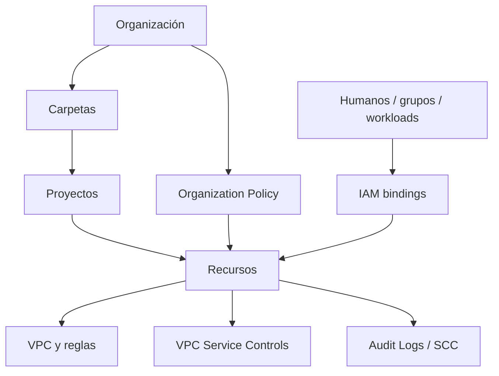

# Clase 225 — Seguridad en Google Cloud Platform

> Parte: **10 — Seguridad en la nube y contenedores** · Fuente: *Google Cloud Security Foundations Guide y CIS Google Cloud Platform Foundation Benchmark*
> ⏱️ Duración estimada: **120 min** · Nivel: **Intermedio**

---

## 🎯 Objetivo

Asegurar un proyecto de Google Cloud aplicando su jerarquía de recursos (organización, carpetas,
proyectos), IAM basado en roles y service accounts, VPC y firewall, y los servicios de seguridad
(Security Command Center, VPC Service Controls). Al terminar, el alumno sabrá endurecer un proyecto
GCP conforme al CIS GCP Benchmark.

## 📚 Resultados de aprendizaje

Al finalizar, el alumno podrá:

1. **Estructurar** la jerarquía de recursos y heredar políticas desde la organización.
2. **Gestionar** IAM con roles predefinidos y service accounts sin claves estáticas.
3. **Configurar** VPC, reglas de firewall y Private Google Access.
4. **Habilitar** Security Command Center e interpretar sus hallazgos.
5. **Aplicar** Organization Policies para prevenir configuraciones inseguras.

## 🗺️ Temas

| # | Tema | Por qué importa |
|---|------|-----------------|
| 1 | Jerarquía: organización, carpetas, proyectos | Herencia de políticas y aislamiento |
| 2 | IAM y service accounts | Identidad de humanos y cargas |
| 3 | Organization Policies | Guardarraíles preventivos a escala |
| 4 | VPC y reglas de firewall | Segmentación de red |
| 5 | Security Command Center | CSPM y detección de amenazas |
| 6 | Cloud KMS y CMEK | Cifrado con claves gestionadas por el cliente |
| 7 | VPC Service Controls | Perímetros contra exfiltración de datos |

## 🧠 Explicación en profundidad

Google Cloud organiza recursos en organización, carpetas y proyectos. El proyecto es unidad de APIs, cuotas, billing y aislamiento administrativo, pero hereda políticas desde niveles superiores. Diseñar seguridad significa decidir dónde colocar cargas y controles para que la herencia ayude sin crear permisos demasiado amplios.



La jerarquía transmite IAM y restricciones, pero resuelve problemas diferentes. IAM indica quién puede ejecutar qué acción sobre un recurso. Organization Policy limita configuraciones permitidas. VPC controla conectividad. VPC Service Controls crea perímetros alrededor de servicios compatibles para reducir exfiltración mediante credenciales válidas; no es un firewall general ni sustituye IAM.

### Identidad humana y de carga

Las cuentas de servicio representan workloads. Las claves JSON descargables convierten la identidad en un secreto reutilizable; se prefieren identidades adjuntas y federación de cargas cuando la plataforma lo admite. También se revisa quién puede `actAs` una service account, crear claves o modificar bindings, porque esas capacidades pueden formar rutas indirectas.

Los roles básicos como Owner, Editor y Viewer son amplios. Roles predefinidos o personalizados reducen alcance, pero un rol personalizado exige mantenimiento cuando las APIs cambian. Policy Intelligence y logs ayudan a revisar uso; la ausencia de una llamada durante un periodo no siempre significa que el permiso jamás será necesario.

### Red, perimetros de datos y cifrado

Las reglas firewall VPC tienen dirección, prioridad, acción, objetivo y fuente/destino; las reglas implícitas son parte del resultado. Shared VPC separa administración de red y proyectos de servicio. CMEK ofrece control adicional de clave para servicios compatibles, pero revocar una clave puede interrumpir datos y requiere procedimiento probado.

VPC Service Controls evalúa accesos a servicios protegidos, identidades y contexto. Una regla de ingreso/egreso o nivel de acceso mal diseñado puede abrir el perímetro o bloquear operación legítima. Se despliega primero con pruebas y observación, documentando puentes, proyectos y APIs compatibles.

## 📖 Definiciones y características

- **Jerarquía de recursos:** organización → carpetas → proyectos → recursos. *Clave:* las políticas IAM se heredan hacia abajo.
- **Service account:** identidad para cargas y automatización. *Clave:* evita claves descargables; usa Workload Identity.
- **Rol predefinido:** conjunto de permisos mantenido por Google para una función. *Clave:* se distingue de roles básicos y personalizados y se asigna en el ámbito mínimo.
- **Organization Policy:** restricción declarativa a nivel de organización/carpeta. *Clave:* bloquea, por ejemplo, IPs públicas en VMs.
- **Firewall de VPC:** reglas allow/deny por prioridad y etiquetas. *Clave:* implícitamente deniega entrante y permite saliente.
- **Security Command Center (SCC):** panel central de postura y amenazas. *Clave:* detecta misconfiguraciones y actividad sospechosa.
- **VPC Service Controls:** control contextual para servicios compatibles dentro de perímetros. *Clave:* reduce ciertas rutas de exfiltración, pero requiere IAM, reglas de ingreso/egreso y pruebas.

## 🔍 Caso razonado — service account sin clave y perímetro incompleto

Una carga en GKE necesita leer BigQuery. En vez de descargar una clave, usa Workload Identity Federation for GKE y un binding mínimo. El proyecto está dentro de un perímetro VPC Service Controls, pero una exportación hacia un proyecto externo legítimo falla. El equipo no deshabilita el perímetro: crea una regla de egreso específica para identidad, servicio y destino, y prueba que otro destino permanece denegado.

Cloud Audit Logs registra el principal técnico y la operación; para atribuir al despliegue se relacionan Kubernetes ServiceAccount, workload y binding. El caso muestra cómo identidad, perímetro y auditoría se necesitan mutuamente.

## ✅ Criterio de dominio

Dominas la clase cuando puedes predecir herencia en organización/carpetas/proyectos, separar IAM de Organization Policy, evitar claves de service account mediante identidad de carga y diseñar una excepción VPC Service Controls mínima con pruebas permitidas y denegadas.

## 🧰 Herramientas y preparación

- CLI `gcloud` autenticada en un proyecto de laboratorio.
- **ScoutSuite** con proveedor `gcp` y **Prowler** (`prowler gcp`).
- Habilita las APIs necesarias antes de empezar (`gcloud services enable`).

```bash
# Ver la política IAM del proyecto
gcloud projects get-iam-policy my-lab-project
# Listar service accounts y sus claves
gcloud iam service-accounts list
gcloud iam service-accounts keys list --iam-account SA_EMAIL
```

## 🧪 Laboratorio guiado

1. Crea un proyecto de laboratorio dentro de una carpeta y aplica un rol `Viewer` a un usuario a nivel de carpeta; verifica la herencia hacia el proyecto.
2. Crea una **service account** para una carga y asígnale solo el rol mínimo. **No descargues una clave JSON**; usa Workload Identity o impersonación.
3. Aplica una **Organization Policy** que impida VMs con IP externa (`constraints/compute.vmExternalIpAccess`). Intenta crear una VM pública y confirma el bloqueo.
4. Configura una VPC con una regla de firewall que permita solo SSH desde un rango concreto vía IAP; deja el resto denegado por defecto.
5. Habilita **Security Command Center** (tier Standard) y revisa hallazgos de tipo *Public Bucket* o *Open Firewall*.
6. Cifra un bucket con **CMEK** usando una clave de Cloud KMS y revisa la política de la clave.
7. Ejecuta `prowler gcp --compliance cis_2.0_gcp` y corrige tres hallazgos de severidad alta; vuelve a ejecutar para verificar.

## ✍️ Ejercicios

1. Diseña una jerarquía de carpetas para separar producción, staging y sandbox.
2. Crea un rol personalizado que permita leer objetos de un bucket pero no listarlos.
3. Escribe una Organization Policy que restrinja las regiones donde se pueden crear recursos.
4. Configura Private Google Access para que una VM sin IP pública acceda a APIs de Google.
5. Interpreta un hallazgo de SCC de tipo `PUBLIC_BUCKET_ACL`.
6. Diseña un perímetro de VPC Service Controls alrededor de Cloud Storage.

## 📝 Reto verificable

Endurece un proyecto de laboratorio: sin service account keys descargables, Organization Policy que
prohíbe IPs externas, SCC habilitado, y al menos un bucket cifrado con CMEK.

**Criterio de aceptación:** crear una VM con IP externa es bloqueado por la policy, no existen claves
de service account activas, y `prowler gcp` reporta como `PASS` los controles de IAM y de exposición
pública que fallaban al inicio.

## ⚠️ Errores comunes

| Síntoma / mensaje | Causa y cómo arreglar |
|-------------------|-----------------------|
| `Permission denied` pese a rol asignado | Rol asignado en el ámbito equivocado; recuerda la herencia jerárquica. |
| Service account key filtrada en un repo | Se descargó una clave JSON; revócala y migra a Workload Identity. |
| VM sigue creándose con IP pública | Organization Policy en modo audit o no propagada; verifica el constraint y el ámbito. |
| Firewall "no bloquea" tráfico | La VPC permite saliente por defecto; añade reglas deny explícitas si hace falta. |
| SCC sin hallazgos | Tier Standard limitado; para detección avanzada activa Premium/Enterprise. |

## ❓ Preguntas frecuentes

**❓ ¿Por qué evitar las claves JSON de service account?**
Son secretos de larga duración que suelen terminar en repositorios o discos. Workload Identity y la impersonación proveen credenciales temporales sin archivo que filtrar.

**❓ ¿Organization Policy o IAM?**
Se complementan: IAM decide *quién puede hacer qué*; Organization Policy define *qué está permitido en absoluto* (guardarraíles), independientemente de los permisos IAM.

**❓ ¿Qué protege VPC Service Controls que IAM no?**
IAM controla el acceso por identidad; VPC Service Controls crea un perímetro que impide que datos salgan a proyectos o redes fuera del perímetro aunque haya credenciales válidas, mitigando exfiltración.

## 🔗 Referencias verificables y alcance

- Google Cloud Security Foundations. <https://cloud.google.com/architecture/security-foundations> — guía oficial de organización, red, identidad y logging fundacional.
- Google Cloud IAM. <https://cloud.google.com/iam/docs> — documentación oficial de principals, roles, políticas y cuentas de servicio.
- Organization Policy. <https://cloud.google.com/resource-manager/docs/organization-policy/overview> — restricciones y herencia; no concede permisos IAM.
- VPC Service Controls. <https://cloud.google.com/vpc-service-controls/docs/overview> — alcance, perímetros y limitaciones oficiales.
- Security Command Center. <https://cloud.google.com/security-command-center/docs> — postura y hallazgos según tier y servicios habilitados.
- CIS Google Cloud Platform Foundation Benchmark. <https://www.cisecurity.org/benchmark/google_cloud_computing_platform> — baseline independiente; fijar versión y perfil.

## 📥 Material descargable

- 📄 [Guía en PDF](./clase-225-guia.pdf) — versión imprimible de esta clase.
- 🎞️ [Presentación (PPTX)](./clase-225-presentacion.pptx) — deck para proyectar en clase.

## ⬅️ Clase anterior

[Clase 224 — Seguridad en Azure](../224-seguridad-en-azure/README.md)

## ➡️ Siguiente clase

[Clase 226 — Ataques y pentest en entornos cloud](../226-ataques-y-pentest-en-entornos-cloud/README.md)
