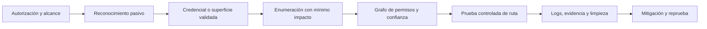

# Clase 226 — Ataques y pentest en entornos cloud

> Parte: **10 — Seguridad en la nube y contenedores** · Fuente: *MITRE ATT&CK for Cloud (IaaS matrix) y Rhino Security Labs — AWS Pentesting research*
> ⏱️ Duración estimada: **150 min** · Nivel: **Avanzado**

---

> ⚠️ **Aviso ético.** Esta clase enseña técnicas ofensivas. Practícalas **únicamente en tu propia
> cuenta de laboratorio o con autorización escrita y explícita del propietario**. El pentest de la
> nube además requiere respetar las políticas de pruebas del proveedor. Atacar recursos ajenos es
> ilegal.

## 🎯 Objetivo

Aprender la metodología de pentest en la nube: reconocimiento, enumeración de recursos e IAM,
explotación de misconfiguraciones (credenciales expuestas, buckets, metadatos, roles), escalada de
privilegios, movimiento lateral y persistencia, todo mapeado a MITRE ATT&CK for Cloud.

## 📚 Resultados de aprendizaje

Al finalizar, el alumno podrá:

1. **Enumerar** recursos y permisos de una cuenta a partir de credenciales de acceso limitado.
2. **Explotar** el servicio de metadatos de instancia (IMDS) para robar credenciales de rol.
3. **Escalar** privilegios aprovechando permisos IAM peligrosos.
4. **Identificar** persistencia y movimiento lateral en la nube.
5. **Mapear** cada técnica a una táctica de MITRE ATT&CK for Cloud.

## 🗺️ Temas

| # | Tema | Por qué importa |
|---|------|-----------------|
| 1 | Reconocimiento externo | OSINT, buckets y subdominios expuestos |
| 2 | Credenciales y sesiones expuestas | Evaluar validez, alcance y revocación sin asumir frecuencia universal |
| 3 | Enumeración IAM | Descubrir qué se puede hacer con lo que hay |
| 4 | Abuso de metadatos (IMDS/SSRF) | Robo de credenciales de rol de instancia |
| 5 | Escalada de privilegios | De acceso limitado a administrador |
| 6 | Movimiento lateral y persistencia | Mantener acceso y expandirse |
| 7 | Mapeo a MITRE ATT&CK Cloud | Lenguaje común para reporte |

## 🧠 Explicación en profundidad

Un pentest cloud autorizado evalúa relaciones de confianza y decisiones API, no solo puertos. El contrato debe identificar cuentas, suscripciones o proyectos; regiones; identidades de prueba; técnicas prohibidas; límites de costo y disponibilidad; tratamiento de datos; contactos y destrucción de recursos. Además se verifica la política vigente del proveedor: la autorización del cliente no permite afectar infraestructura compartida ni otros tenants.



El diagrama impone puntos de control. Descubrir un nombre de bucket no autoriza leer objetos; obtener una credencial de laboratorio no autoriza enumerar otras cuentas; hallar una ruta teórica no obliga a ejecutarla si su impacto excede las reglas. Cada paso registra comando, identidad, hora, respuesta y recurso creado.

### De credencial a capacidad efectiva

Una clave o token puede estar expirado, revocado, limitado por sesión o sujeto a condiciones. Primero se identifica la cuenta y principal con una API inocua y autorizada. Luego se enumeran capacidades mediante documentación, simuladores, mensajes de error y llamadas controladas. Los `AccessDenied` no justifican fuerza bruta indiscriminada: también son evidencia de límites y pueden activar controles.

Las rutas de escalada combinan acciones. Crear una función solo importa si se puede elegir rol, código, invocación y salida. Modificar una policy requiere una versión efectiva y capacidad de usar el principal. El reporte dibuja precondiciones y separa ruta potencial, ruta validada e impacto demostrado.

### Metadatos, SSRF y defensa en profundidad

IMDS está disponible desde instancias según plataforma y configuración. En AWS, IMDSv2 usa un token obtenido por `PUT` y hop limit configurable, lo que reduce varias rutas de SSRF, pero no corrige una aplicación que permite solicitudes arbitrarias desde la propia instancia ni un rol excesivo. La mitigación combina validación de URL, controles de egress, IMDSv2 requerido, hop limit, roles mínimos y monitoreo.

### Persistencia y cierre del laboratorio

Crear claves, usuarios, roles, funciones o suscripciones puede simular persistencia, pero cada artefacto genera riesgo y costo. Se usan nombres etiquetados, TTL, presupuesto y lista de limpieza. La prueba termina verificando que no quedan recursos ni credenciales y que los logs permiten reconstruirla. ATT&CK ayuda a comunicar la técnica; no sustituye impacto, precondiciones o remediación específica.

## 📖 Definiciones y características

- **IMDS (Instance Metadata Service):** servicio local que entrega metadatos y, según configuración, credenciales de identidad de la carga. *Clave:* versión, token, hop limit y rol efectivo determinan exposición.
- **SSRF hacia metadatos:** forzar a la app a pedir el endpoint de metadatos. *Clave:* clásico vector para robar credenciales en la nube.
- **Enumeración IAM:** determinar capacidades mediante políticas, simulación y llamadas autorizadas de bajo impacto. *Clave:* los resultados se interpretan con contexto y límites superiores.
- **Persistencia:** crear usuarios/claves/roles ocultos o backdoors en funciones. *Clave:* sobrevive a la rotación de la credencial inicial.
- **Pacu:** framework de investigación AWS con módulos de enumeración y validación. *Clave:* automatiza llamadas con la identidad configurada y debe limitarse a laboratorios autorizados.

## 🔍 Caso razonado — SSRF con un rol casi sin permisos

En CloudGoat, una aplicación permite solicitar una URL interna y el tester obtiene una sesión temporal desde IMDS. Antes de celebrar «compromiso de AWS», identifica rol, expiración y permisos. La sesión solo puede leer un objeto concreto. Esa lectura demuestra impacto limitado; no demuestra control de cuenta.

El informe separa falla de aplicación, acceso a metadatos y exceso o adecuación del rol. La mitigación exige corregir SSRF y requerir IMDSv2, pero también prueba que retirar el permiso innecesario reduce el impacto incluso si la aplicación recae. Finalmente revoca la sesión cuando procede, destruye el escenario y confirma el evento en CloudTrail.

## ✅ Criterio de dominio

Dominas la clase cuando defines reglas de compromiso cloud, conviertes una credencial en un grafo de capacidades, validas una ruta con impacto mínimo, mapeas técnica sin exagerar alcance y entregas evidencia de limpieza, costo y detección.
- **CloudGoat/CloudFoxable:** entornos vulnerables intencionados para practicar. *Clave:* seguros y legales para entrenar.
- **MITRE ATT&CK for Cloud:** matriz de tácticas/técnicas específicas de nube. *Clave:* estandariza el reporte.

## 🧰 Herramientas y preparación

- **Pacu**, **ScoutSuite**, **PMapper**, **enumerate-iam**, y las CLIs oficiales.
- **CloudGoat** (Rhino Security Labs) para desplegar escenarios vulnerables en TU cuenta de laboratorio.
- Un entorno aislado y presupuesto controlado (los recursos cuestan dinero).

```bash
# Desplegar un escenario vulnerable de laboratorio
python3 cloudgoat.py create iam_privesc_by_rollback
# Enumerar permisos de una credencial obtenida (en laboratorio)
enumerate-iam --access-key AKIA... --secret-key ...
```

## 🧪 Laboratorio guiado

> Todo se ejecuta en tu **cuenta de laboratorio** con CloudGoat. No apuntes a infraestructura ajena.

1. Despliega el escenario `iam_privesc_by_rollback` de CloudGoat; recibirás credenciales de acceso limitado.
2. **Reconocimiento IAM:** con `enumerate-iam` y `aws iam get-user`, mapea qué permisos tienes.
3. Identifica el permiso peligroso (p. ej. `iam:CreatePolicyVersion` con `--set-as-default`) que permite reescribir una política.
4. **Escala:** crea una nueva versión de una política adjunta a tu usuario que conceda `*:*` y márcala por defecto; verifica que ahora eres admin.
5. Repite con el escenario `ec2_ssrf`: explota una app con SSRF para leer `http://169.254.169.254/latest/meta-data/iam/security-credentials/` y roba las credenciales del rol.
6. Usa esas credenciales para enumerar y acceder a un bucket S3 (movimiento lateral).
7. **Mapea** cada paso a MITRE ATT&CK for Cloud (Initial Access, Discovery, Privilege Escalation, Lateral Movement).
8. **Remedia:** activa IMDSv2 obligatorio, aplica permission boundaries y elimina el permiso de escalada. Repite el ataque y confirma que falla.
9. Destruye el escenario con `cloudgoat destroy` para no dejar recursos ni coste.

## ✍️ Ejercicios

1. Enumera los roles y caminos asumibles que PMapper puede observar desde una identidad de laboratorio y registra permisos o cuentas fuera de cobertura.
2. Explica por qué IMDSv2 mitiga el robo de credenciales por SSRF.
3. Redacta la sección de "escalada de privilegios" de un informe de pentest con evidencias.
4. Identifica tres técnicas de persistencia en AWS y su detección en CloudTrail.
5. Resuelve otro escenario de CloudGoat y documenta el kill chain.
6. Diseña una regla de detección para la creación anómala de claves de acceso IAM.

## 📝 Reto verificable

Resuelve de principio a fin un escenario de CloudGoat que empiece con acceso limitado y termine en
administrador, documentando el camino y luego aplicando las remediaciones que lo cierren.

**Criterio de aceptación:** el informe incluye cada paso con el comando usado, la técnica ATT&CK
correspondiente y la evidencia; tras aplicar las remediaciones, reejecutar el ataque falla en el
punto de escalada.

## ⚠️ Errores comunes

| Síntoma / mensaje | Causa y cómo arreglar |
|-------------------|-----------------------|
| `AccessDenied` al enumerar | Permisos realmente mínimos; prueba rutas indirectas (assume-role, passrole). |
| Metadatos devuelven 401 | IMDSv2 activo; necesitas un token PUT primero, o el ataque está mitigado. |
| Recursos de CloudGoat siguen facturando | Olvidaste `cloudgoat destroy`; destrúyelos siempre al terminar. |
| El proveedor bloquea el escaneo | Actividad marcada como abuso; respeta la política de pentest del proveedor. |
| No hay evidencia para el informe | No se registró la salida; captura comandos y respuestas desde el inicio. |

## ❓ Preguntas frecuentes

**❓ ¿Necesito permiso del proveedor para hacer pentest en la nube?**
Depende. Muchas pruebas a tus propios recursos están permitidas sin aviso previo, pero ciertas actividades (p. ej. stress/DoS) requieren autorización. Revisa siempre la política de pruebas del proveedor y ten permiso escrito del dueño de la cuenta.

**❓ ¿Por qué el robo de credenciales de instancia es tan crítico?**
Porque el rol de la instancia suele tener permisos amplios; con esas credenciales el atacante actúa como el servicio legítimo, sin contraseña que romper. Por eso IMDSv2 y roles mínimos son clave.

**❓ ¿CloudGoat es seguro para practicar?**
Sí, despliega recursos vulnerables **en tu propia cuenta** de forma intencionada y reproducible. Aun así, aíslalos y destrúyelos al terminar para evitar exposición y coste.

## 🔗 Referencias verificables y alcance

- AWS Customer Support Policy for Penetration Testing. <https://aws.amazon.com/security/penetration-testing/> — actividades permitidas y prohibidas; consultar antes de cada prueba.
- MITRE ATT&CK — Cloud Matrix. <https://attack.mitre.org/matrices/enterprise/cloud/> — vocabulario de comportamientos, no autorización ni prueba de impacto.
- AWS — Instance Metadata Service. <https://docs.aws.amazon.com/AWSEC2/latest/UserGuide/configuring-instance-metadata-service.html> — semántica oficial de IMDSv2, token y configuración.
- CloudGoat. <https://github.com/RhinoSecurityLabs/cloudgoat> — laboratorio deliberadamente vulnerable; revisar costos y destruir recursos.
- Pacu. <https://github.com/RhinoSecurityLabs/pacu> — herramienta abierta; validar módulos y llamadas antes de ejecutarlos.
- Rhino Security Labs — AWS privilege escalation. <https://rhinosecuritylabs.com/aws/aws-privilege-escalation-methods-mitigation/> — investigación complementaria que requiere contraste con evaluación IAM oficial.

## 📥 Material descargable

- 📄 [Guía en PDF](./clase-226-guia.pdf) — versión imprimible de esta clase.
- 🎞️ [Presentación (PPTX)](./clase-226-presentacion.pptx) — deck para proyectar en clase.

## ⬅️ Clase anterior

[Clase 225 — Seguridad en Google Cloud Platform](../225-seguridad-en-google-cloud-platform/README.md)

## ➡️ Siguiente clase

[Clase 227 — Seguridad de contenedores: Docker](../227-seguridad-de-contenedores-docker/README.md)
