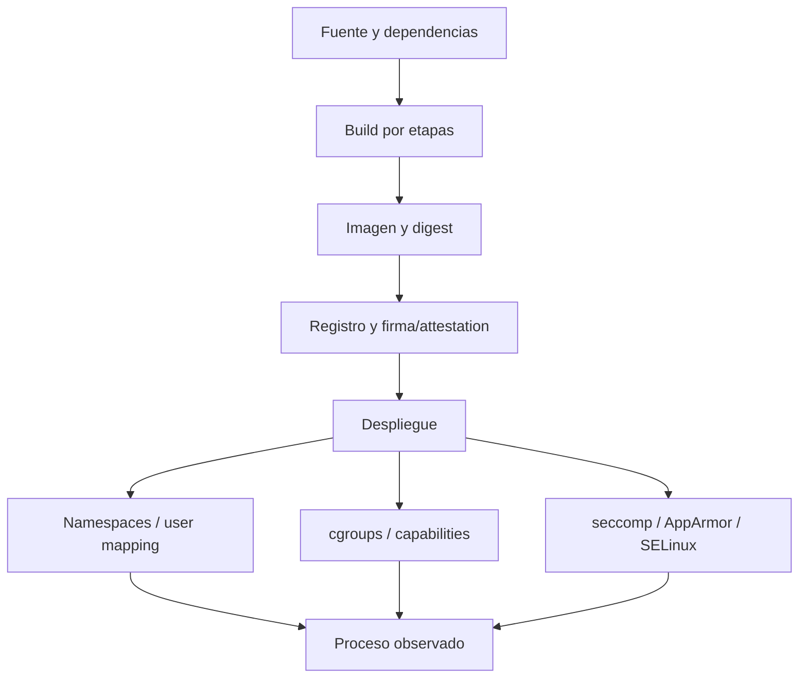

# Clase 227 — Seguridad de contenedores: Docker

> Parte: **10 — Seguridad en la nube y contenedores** · Fuente: *Liz Rice, "Container Security" (O'Reilly) y CIS Docker Benchmark*
> ⏱️ Duración estimada: **130 min** · Nivel: **Intermedio**

---

## 🎯 Objetivo

Entender cómo se aísla realmente un contenedor (namespaces, cgroups, capabilities) y aplicar
seguridad en las tres fases del ciclo de vida: construcción de imágenes, almacenamiento/registro y
ejecución. Al terminar, el alumno podrá escanear imágenes con Trivy, endurecer un Dockerfile y
configurar el runtime según el CIS Docker Benchmark.

## 📚 Resultados de aprendizaje

Al finalizar, el alumno podrá:

1. **Explicar** el aislamiento de contenedores (namespaces, cgroups, capabilities) y sus límites.
2. **Construir** imágenes mínimas y sin secretos con multi-stage builds.
3. **Escanear** imágenes en busca de CVEs y secretos con Trivy.
4. **Ejecutar** contenedores con privilegio mínimo (usuario no root, capabilities recortadas, read-only).
5. **Auditar** un host Docker con Docker Bench for Security.

## 🗺️ Temas

| # | Tema | Por qué importa |
|---|------|-----------------|
| 1 | Namespaces y cgroups | Base del aislamiento; no es una VM |
| 2 | Capabilities y user namespaces | Reducir privilegios del proceso |
| 3 | Imágenes y capas | Superficie de vulnerabilidades y secretos |
| 4 | Dockerfile seguro y multi-stage | Imágenes pequeñas y limpias |
| 5 | Escaneo de imágenes (Trivy) | Detectar CVEs antes de desplegar |
| 6 | Runtime seguro (seccomp, AppArmor) | Contener el proceso en ejecución |
| 7 | Registro y firma de imágenes | Cadena de suministro confiable |

## 🧠 Explicación en profundidad

Un contenedor es un conjunto de procesos aislados mediante mecanismos del kernel y empaquetados con un filesystem. No posee un kernel independiente como una VM convencional. Por eso el riesgo depende tanto de imagen y configuración como del daemon, host y kernel compartido.



El diagrama recorre dos vidas: cadena de suministro y runtime. Una imagen sin CVE conocida puede ejecutarse con `--privileged` y mounts peligrosos; una configuración restrictiva no corrige una dependencia vulnerable. La evidencia debe cubrir digest, procedencia, contenido, usuario, capabilities, mounts, red y perfiles efectivos.

### Aislamiento y privilegio

Namespaces separan vistas de PID, red, montajes, IPC, hostname y usuarios; cgroups limitan y contabilizan recursos. Capabilities dividen privilegios de root, pero algunas como `SYS_ADMIN` abarcan operaciones amplias. User namespaces o modo rootless pueden mapear root del contenedor a un usuario no privilegiado del host, con limitaciones funcionales que deben probarse.

`--privileged` amplía dispositivos y capabilities y relaja controles; no debe describirse simplemente como «root del host», porque el resultado depende de mounts, kernel y runtime, pero rompe buena parte del modelo esperado. También son críticos el socket Docker, `hostPath`, `hostNetwork` y dispositivos.

### Imagen, capas y secretos

Cada instrucción de build puede crear capas recuperables. Borrar un secreto en una capa posterior no elimina el contenido anterior. BuildKit secrets permiten montar material durante un paso sin copiarlo a la imagen, siempre que el comando tampoco lo persista. Multi-stage reduce herramientas en la salida, pero no demuestra ausencia de vulnerabilidades ni secretos.

El escáner relaciona paquetes con bases de vulnerabilidades y puede producir falsos positivos o carecer de contexto de explotabilidad. Se conserva versión, base, digest y política de excepción. La firma vincula una identidad con un digest y declaración; no garantiza que el contenido sea seguro.

### Runtime y reducción verificable

Se ejecuta como usuario no root, filesystem de solo lectura, capabilities eliminadas y recursos limitados. Docker aplica un perfil seccomp predeterminado cuando la plataforma lo soporta; AppArmor o SELinux agregan restricciones. Cada excepción se prueba: si la app necesita escribir, se monta solo la ruta y capacidad necesarias, en lugar de desactivar el perfil completo.

## 📖 Definiciones y características

- **Namespace:** aísla la vista de un proceso (PID, red, montajes, usuarios). *Clave:* es el mecanismo central de aislamiento del contenedor.
- **cgroup:** limita recursos (CPU, memoria, PIDs). *Clave:* previene abuso de recursos y algunas denegaciones de servicio.
- **Capability:** privilegio granular del kernel (p. ej. `CAP_NET_ADMIN`). *Clave:* recórtalas con `--cap-drop=ALL` y añade solo las necesarias.
- **Contenedor privilegiado:** modo que amplía dispositivos, capabilities y acceso respecto del perfil normal. *Clave:* aumenta sustancialmente rutas hacia el host y exige justificación excepcional.
- **Multi-stage build:** compilar en una etapa y copiar artefactos seleccionados a otra. *Clave:* reduce toolchain final; no elimina secretos persistidos por comandos o archivos copiados incorrectamente.
- **Distroless / scratch:** imágenes con conjunto mínimo de runtime. *Clave:* reducen componentes, pero complican diagnóstico y no eliminan vulnerabilidades de la aplicación.

## 🔍 Caso razonado — una aplicación que necesita escribir y escuchar en 80

La imagen original corre como root, contiene compilador y escribe en `/tmp` y `/var/cache/app`. El equipo usa multi-stage, crea un UID no root y monta `tmpfs` solo en ambas rutas. En kernels modernos puede usar un puerto no privilegiado o ajustar la configuración; si requiere `NET_BIND_SERVICE`, agrega únicamente esa capability y mantiene las demás eliminadas.

Trivy encuentra una CVE en una biblioteca que la app no carga. La excepción no se cierra como «falso positivo» sin más: documenta digest, paquete, ruta, análisis de alcance, fecha de revisión y versión que la corregirá. El runtime se prueba con filesystem read-only y perfil seccomp activo.

## ✅ Criterio de dominio

Dominas la clase cuando puedes explicar qué aísla cada mecanismo, reconstruir una imagen sin secretos en capas, fijarla por digest y ejecutar la carga con usuario, mounts, capabilities y perfiles mínimos, documentando cada excepción y su prueba.
- **Seccomp:** filtra syscalls disponibles al contenedor. *Clave:* el perfil por defecto ya bloquea syscalls peligrosas.

## 🧰 Herramientas y preparación

- Docker Engine en un host Linux de laboratorio.
- **Trivy** para escaneo de imágenes/filesystem: `docker run aquasec/trivy`.
- **Docker Bench for Security** para auditar el host según CIS.
- **Hadolint** para lint de Dockerfiles.

```bash
# Escanear una imagen en busca de CVEs y secretos
trivy image --severity HIGH,CRITICAL nginx:latest
# Ver capabilities y perfil seccomp de un contenedor en ejecución
docker inspect --format '{{ .HostConfig.CapAdd }} {{ .HostConfig.SecurityOpt }}' mi_contenedor
```

## 🧪 Laboratorio guiado

> 🧪 **Laboratorio ejecutable del programa:** [`devsecops-pipeline`](../../../labs/devsecops-pipeline/README.md) — son las **capas 4 y 5** del lab de DevSecOps: un Dockerfile con diez antipatrones y las CVE del sistema base.

1. Ejecuta `docker run -it --rm alpine sh` y explora los namespaces con `lsns` desde el host para ver el aislamiento.
2. Compara en una VM desechable la salida de `capsh --print` de un contenedor normal y otro `--privileged`, sin montar discos ni acceder a datos del host. Documenta qué controles se ampliaron y elimina ambos.
3. Escribe un Dockerfile inseguro (corriendo como root, con secretos en `ENV`) y pásalo por **Hadolint**; corrige los hallazgos.
4. Refactoriza a un **multi-stage build** con imagen final `distroless` o `scratch`, usuario no root (`USER 1000`) y sin secretos.
5. Escanea ambas imágenes con `trivy image` y compara el número de CVEs y el tamaño.
6. Ejecuta el contenedor endurecido: `docker run --read-only --cap-drop=ALL --security-opt=no-new-privileges --user 1000 mi_imagen`.
7. Audita el host con **Docker Bench for Security** y corrige al menos tres hallazgos (daemon con TLS, `userns-remap`, logging).

## ✍️ Ejercicios

1. Enumera las capabilities por defecto de un contenedor y explica cuáles quitarías.
2. Convierte una imagen basada en `ubuntu` a una `distroless` y mide la reducción de CVEs.
3. Configura un contenedor con sistema de archivos read-only y un volumen escribible acotado.
4. Escribe un `.dockerignore` que evite filtrar `.env` y `.git`.
5. Firma una imagen y verifica su firma antes de desplegar.
6. Explica por qué un contenedor comprometido puede afectar al host y cómo mitigarlo.

## 📝 Reto verificable

Toma una imagen de aplicación real y prodúcela endurecida: multi-stage, base mínima, usuario no root,
sin secretos, y ejecución con capabilities recortadas y read-only.

**Criterio de aceptación:** `trivy image` no reporta CVEs CRÍTICAS ni secretos en la imagen final, la
imagen corre como UID no root, y `docker inspect` confirma `CapDrop: [ALL]` y `ReadonlyRootfs: true`.

## ⚠️ Errores comunes

| Síntoma / mensaje | Causa y cómo arreglar |
|-------------------|-----------------------|
| `permission denied` al escribir en read-only | El proceso necesita escribir; monta un volumen/tmpfs acotado para esa ruta. |
| Secreto visible en `docker history` | Se pasó por `ENV`/`ARG` o `COPY`; usa build secrets o inyección en runtime. |
| Contenedor corre como root sin querer | Falta `USER` en el Dockerfile; añádelo y ajusta permisos de archivos. |
| Trivy reporta cientos de CVEs | Imagen base gorda/antigua; cambia a base mínima y actualiza. |
| `--privileged` "necesario" para que funcione | No se identificó la operación requerida. Traza el fallo y concede solo capability, dispositivo o mount estrictamente justificado. |

## ❓ Preguntas frecuentes

**❓ ¿Un contenedor es tan seguro como una máquina virtual?**
No. Comparten el kernel del host; una fuga o un contenedor privilegiado pueden comprometer el host. Para aislamiento fuerte se usan sandboxes como gVisor o Kata Containers.

**❓ ¿Por qué correr como no root si el contenedor ya está aislado?**
Porque si el atacante escapa del contenedor o explota una capability, ser root dentro facilita el escape hacia el host. El usuario no root reduce el impacto de un compromiso.

**❓ ¿Dónde guardo los secretos si no en el Dockerfile?**
Fuera de las capas de imagen, mediante un gestor y una identidad de carga. La entrega en runtime también debe evitar exposición en variables, comandos, logs, dumps y archivos con permisos amplios.

## 🔗 Referencias verificables y alcance

- Docker Engine security. <https://docs.docker.com/engine/security/> — documentación oficial de namespaces, daemon, capabilities y user namespaces.
- Docker seccomp profiles. <https://docs.docker.com/engine/security/seccomp/> — comportamiento oficial del perfil predeterminado y excepciones.
- NIST SP 800-190. <https://doi.org/10.6028/NIST.SP.800-190> — riesgos y recomendaciones de ciclo de vida de contenedores.
- CIS Docker Benchmark. <https://www.cisecurity.org/benchmark/docker> — baseline versionada; comprobar aplicabilidad al runtime y distribución.
- Docker Bench for Security. <https://github.com/docker/docker-bench-security> — automatiza una selección de checks CIS; documentar versión, host y pruebas no ejecutables.
- Trivy. <https://github.com/aquasecurity/trivy> — proyecto primario de escaneo; interpretar base, alcance y configuración.
- Liz Rice, _Container Security_. <https://www.oreilly.com/library/view/container-security/9781492056690/> — explicación complementaria de mecanismos Linux.

## 📥 Material descargable

- 📄 [Guía en PDF](./clase-227-guia.pdf) — versión imprimible de esta clase.
- 🎞️ [Presentación (PPTX)](./clase-227-presentacion.pptx) — deck para proyectar en clase.

## ⬅️ Clase anterior

[Clase 226 — Ataques y pentest en entornos cloud](../226-ataques-y-pentest-en-entornos-cloud/README.md)

## ➡️ Siguiente clase

[Clase 228 — Seguridad de Kubernetes: arquitectura](../228-seguridad-de-kubernetes-arquitectura/README.md)
