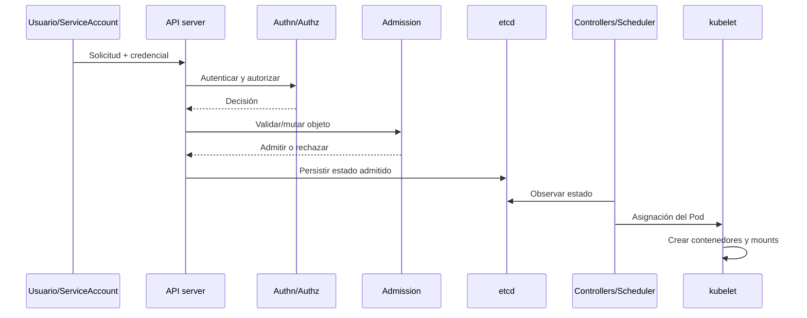

# Clase 228 — Seguridad de Kubernetes: arquitectura

> Parte: **10 — Seguridad en la nube y contenedores** · Fuente: *Martin & Hausenblas, "Hacking Kubernetes" (O'Reilly) y documentación oficial de Kubernetes*
> ⏱️ Duración estimada: **120 min** · Nivel: **Intermedio**

---

## 🎯 Objetivo

Comprender la arquitectura de Kubernetes desde la perspectiva de la seguridad: los componentes del
plano de control (API server, etcd, scheduler, controller manager) y del plano de datos (kubelet,
kube-proxy, container runtime), cómo se comunican y dónde están sus superficies de ataque. Es la base
para el hardening y los ataques de la clase siguiente.

## 📚 Resultados de aprendizaje

Al finalizar, el alumno podrá:

1. **Describir** los componentes del plano de control y de datos y su función.
2. **Identificar** las superficies de ataque de cada componente (API, etcd, kubelet).
3. **Explicar** el flujo de una petición: autenticación, autorización (RBAC) y admission control.
4. **Distinguir** los objetos de seguridad clave: ServiceAccount, Secret, NetworkPolicy, RBAC.
5. **Desplegar** un clúster de laboratorio para practicar.

## 🗺️ Temas

| # | Tema | Por qué importa |
|---|------|-----------------|
| 1 | Plano de control vs plano de datos | Separa cerebro y músculo del clúster |
| 2 | API server como punto central | Media solicitudes declarativas y controles de acceso |
| 3 | etcd | Conserva el estado persistido del clúster y requiere protección específica |
| 4 | kubelet | Agente por nodo; su API es un vector clásico |
| 5 | Flujo authn → authz → admission | Cómo se autoriza cada acción |
| 6 | RBAC y ServiceAccounts | Identidad y permisos dentro del clúster |
| 7 | Namespaces y NetworkPolicy | Aislamiento lógico y de red |

## 🧠 Explicación en profundidad

Kubernetes mantiene un estado deseado mediante controladores. El usuario envía objetos al API server; después autenticación, autorización y admission determinan si se aceptan. etcd conserva el estado persistido y los controladores hacen converger workloads. Seguridad requiere proteger esa cadena completa y el camino desde un Pod hasta el nodo.



El diagrama muestra que no «todo» tráfico del clúster pasa por el API server: las operaciones declarativas sí, pero el tráfico entre aplicaciones sigue otra ruta. Un control de admission puede impedir un Pod inseguro al crearlo; NetworkPolicy regula conectividad compatible con el CNI; el runtime y nodo aplican aislamiento.

### Identidad, autorización y admisión

Autenticación establece nombre y grupos; autorización decide verbos sobre recursos; admission examina o modifica el objeto después de autorizar y antes de persistir. RBAC combina Role/ClusterRole con bindings. Un RoleBinding puede enlazar un ClusterRole dentro de un namespace, detalle importante para interpretar alcance.

ServiceAccounts son identidades namespaced para workloads. Los tokens proyectados actuales pueden tener audiencia y expiración, pero un Pod comprometido puede usarlos mientras sean válidos. Se deshabilita automount cuando no se necesita y se limita RBAC; no se depende solo de duración.

### etcd, kubelet y nodos

etcd debe usar autenticación mutua, red restringida, backups protegidos y cifrado de recursos sensibles cuando corresponda. Kubernetes Secret usa base64 en su representación, no cifrado por ese hecho; el cifrado en reposo debe configurarse. No todo estado externo —volúmenes, logs o secretos de terceros— vive en etcd, por lo que «contiene todo» es impreciso.

kubelet ejecuta Pods asignados y expone APIs operativas. Autenticación, autorización webhook, certificados y acceso a `nodes/proxy` importan. Comprometer un nodo puede exponer workloads y credenciales locales aunque el API server esté bien configurado.

### Namespace y red

Namespaces organizan nombres, cuotas, RBAC y políticas namespaced; no crean aislamiento de kernel ni red automáticamente. NetworkPolicy funciona solo si el plugin de red la implementa y selecciona Pods por etiquetas. Una política default-deny sin allow de DNS o dependencias puede romper la aplicación; el diseño se deriva de flujos observados y requisitos.

## 📖 Definiciones y características

- **API server:** frontend del plano de control para operaciones de recursos Kubernetes. *Clave:* procesa autenticación, autorización y admission; el tráfico de aplicación no sigue necesariamente esa ruta.
- **etcd:** almacén consistente del estado persistido por Kubernetes. *Clave:* puede contener Secrets y credenciales; acceso, transporte, backups y cifrado requieren protección.
- **kubelet:** agente de nodo que administra Pods asignados. *Clave:* sus APIs requieren autenticación y autorización; permisos proxy también amplían acceso.
- **RBAC:** control de acceso por roles (Role/ClusterRole + Binding). *Clave:* privilegio mínimo dentro del clúster.
- **ServiceAccount:** identidad de los pods frente al API server. *Clave:* su token, si se roba, da acceso a la API.
- **Admission controller:** valida o muta objetos antes de persistirlos. *Clave:* aplica políticas sobre solicitudes admitidas, con alcance y excepciones configurables.

## 🔍 Caso razonado — Pod sin token que necesita hablar con una API externa

Una aplicación solo consume una API externa y no necesita Kubernetes API. El manifiesto establece `automountServiceAccountToken: false`; RBAC no concede permisos y NetworkPolicy permite DNS y el destino necesario. Si posteriormente incorpora descubrimiento de ConfigMaps, el equipo no monta un token con `default` amplio: crea ServiceAccount, Role de lectura sobre nombres concretos y Binding en el namespace.

La prueba usa `kubectl auth can-i` para casos positivos y negativos, inspecciona mounts del Pod y valida flujos. El caso muestra que identidad, admisión y red son capas distintas y que una necesidad nueva debe cambiar el diseño explícitamente.

## ✅ Criterio de dominio

Dominas la clase cuando puedes seguir una petición por authn, authz, admission, etcd y reconciliación; explicar qué no pasa por esa ruta; diseñar ServiceAccount/RBAC mínimo; y demostrar los límites de namespace, NetworkPolicy, kubelet y Secret.
- **NetworkPolicy:** API para expresar aislamiento L3/L4 según selección y direcciones. *Clave:* el efecto depende del CNI, políticas aplicables y flujos permitidos.

## 🧰 Herramientas y preparación

- **kind** o **minikube** para un clúster local de laboratorio.
- **kubectl** configurado; **kube-bench** y **kubeaudit** (se profundizan en la clase 229).
- Opcional: **Lens** o **k9s** para visualizar el clúster.

```bash
# Crear un clúster de laboratorio con kind
kind create cluster --name lab
# Ver los componentes del plano de control
kubectl get pods -n kube-system
# Inspeccionar el flujo de autorización de una acción
kubectl auth can-i create pods --as system:serviceaccount:default:default
```

## 🧪 Laboratorio guiado

1. Crea un clúster con `kind create cluster` y examina los pods de `kube-system` (API server, etcd, scheduler, controller-manager, kube-proxy, CoreDNS).
2. Describe el pod de **etcd** y localiza dónde guarda los datos; comenta por qué su cifrado en reposo y su acceso restringido son críticos.
3. Explora el flujo de autorización: usa `kubectl auth can-i --list` con distintas identidades para ver qué puede hacer cada una.
4. Crea un namespace `app` y despliega un pod; observa el **ServiceAccount** por defecto y su token montado.
5. Comprueba que, por defecto, un pod puede alcanzar a otro en distinto namespace (sin NetworkPolicy).
6. Inspecciona la API del **kubelet** (solo lectura, en laboratorio) y comenta por qué debe requerir autenticación.
7. Dibuja un diagrama del flujo de una petición `kubectl apply`: cliente → API server → authn → authz (RBAC) → admission → etcd → controladores → kubelet.

## ✍️ Ejercicios

1. Enumera cada componente del plano de control y una consecuencia de su compromiso.
2. Explica por qué etcd cifrado en reposo es una defensa clave para los Secrets.
3. Describe la diferencia entre Role y ClusterRole con un ejemplo.
4. Identifica qué escucha en los puertos 6443 y 10250 y su riesgo.
5. Dibuja el flujo authn → authz → admission para una creación de pod.
6. Explica qué aísla un namespace y qué NO aísla por defecto.

## 📝 Reto verificable

Despliega un clúster de laboratorio y produce un mapa de su superficie de ataque: componentes,
puertos que exponen, identidad que usan y qué protege cada control (RBAC, admission, NetworkPolicy).

**Criterio de aceptación:** el mapa lista API server, etcd, kubelet y scheduler con su puerto y riesgo;
identifica el flujo authn→authz→admission; y señala al menos tres controles con el objeto Kubernetes
que los implementa.

## ⚠️ Errores comunes

| Síntoma / mensaje | Causa y cómo arreglar |
|-------------------|-----------------------|
| "Pensé que namespace = aislamiento fuerte" | Los namespaces separan nombres, no red ni kernel; añade NetworkPolicy y RBAC. |
| Token de ServiceAccount montado sin necesidad | Riesgo si el pod se compromete; usa `automountServiceAccountToken: false`. |
| etcd accesible sin TLS | Exposición total del estado; exige TLS mutuo y restringe el acceso. |
| `Forbidden` al aplicar un manifiesto | RBAC deniega la acción; ajusta el Role/Binding de la identidad. |
| kubelet API abierta en 10250 | Permite exec en pods; exige autenticación y autorización webhook. |

## ❓ Preguntas frecuentes

**❓ ¿Por qué el API server es el objetivo principal de un atacante?**
Porque media cambios declarativos y expone recursos según autorización. Protegerlo es central, pero kubelet, etcd, nodos, runtime y red también poseen superficies que pueden evitar controles esperados.

**❓ ¿Qué pasa si un atacante lee etcd directamente?**
Puede leer el estado persistido accesible, incluidos Secrets almacenados allí. El impacto depende de permisos y cifrado configurado; se restringen red y certificados, se cifra material sensible y se protegen backups.

**❓ ¿RBAC está activo por defecto?**
En clústeres modernos sí, pero muchas instalaciones dejan roles amplios o ServiceAccounts con permisos excesivos. RBAC solo protege si se configura con privilegio mínimo.

## 🔗 Referencias verificables y alcance

- Kubernetes — Cluster Architecture. <https://kubernetes.io/docs/concepts/architecture/> — componentes y reconciliación oficiales.
- Kubernetes — Controlling Access to the API. <https://kubernetes.io/docs/concepts/security/controlling-access/> — secuencia oficial de autenticación, autorización y admisión.
- Kubernetes — RBAC Authorization. <https://kubernetes.io/docs/reference/access-authn-authz/rbac/> — semántica de roles, bindings y verbos.
- Kubernetes — Security Checklist. <https://kubernetes.io/docs/concepts/security/security-checklist/> — recomendaciones actuales, incluidas Secrets y tokens.
- NIST SP 800-190. <https://doi.org/10.6028/NIST.SP.800-190> — guía de riesgos de contenedores; complementar con versión Kubernetes desplegada.
- Martin y Hausenblas, _Hacking Kubernetes_. <https://www.oreilly.com/library/view/hacking-kubernetes/9781492081722/> — ejemplos complementarios, no documentación normativa.

## 📥 Material descargable

- 📄 [Guía en PDF](./clase-228-guia.pdf) — versión imprimible de esta clase.
- 🎞️ [Presentación (PPTX)](./clase-228-presentacion.pptx) — deck para proyectar en clase.

## ⬅️ Clase anterior

[Clase 227 — Seguridad de contenedores: Docker](../227-seguridad-de-contenedores-docker/README.md)

## ➡️ Siguiente clase

[Clase 229 — Kubernetes: hardening y ataques](../229-kubernetes-hardening-y-ataques/README.md)
