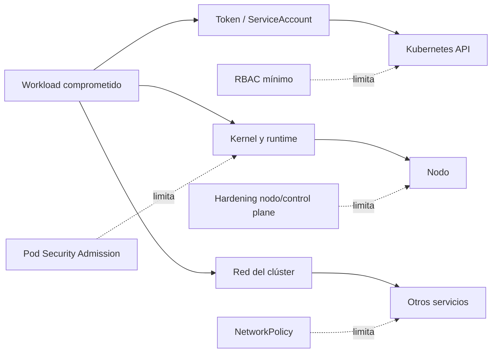

# Clase 229 — Kubernetes: hardening y ataques

> Parte: **10 — Seguridad en la nube y contenedores** · Fuente: *Martin & Hausenblas, "Hacking Kubernetes" (O'Reilly) y CIS Kubernetes Benchmark*
> ⏱️ Duración estimada: **150 min** · Nivel: **Avanzado**

---

> ⚠️ **Aviso ético.** Esta clase incluye técnicas ofensivas (escape de pods, abuso de RBAC, acceso a
> etcd/kubelet). Practícalas **solo en tu propio clúster de laboratorio o con autorización explícita**.

## 🎯 Objetivo

Endurecer un clúster Kubernetes según el CIS Benchmark y, a la vez, reproducir los ataques más
comunes para entender por qué cada control importa: pods privilegiados y escape al nodo, abuso de
tokens de ServiceAccount, escalada por RBAC, y acceso a kubelet/etcd. El alumno usará kube-bench,
Pod Security Admission y NetworkPolicies para cerrar esas vías.

## 📚 Resultados de aprendizaje

Al finalizar, el alumno podrá:

1. **Auditar** un clúster con kube-bench contra el CIS Kubernetes Benchmark.
2. **Aplicar** Pod Security Admission, `securityContext` y NetworkPolicies restrictivas.
3. **Reproducir** un escape de pod privilegiado y su mitigación.
4. **Detectar** y corregir permisos RBAC peligrosos que permiten escalada.
5. **Restringir** el token de ServiceAccount y el acceso a kubelet/etcd.

## 🗺️ Temas

| # | Tema | Por qué importa |
|---|------|-----------------|
| 1 | kube-bench y CIS Benchmark | Base objetiva de hardening |
| 2 | Pod Security Admission | Reemplaza a las PodSecurityPolicies |
| 3 | securityContext y escape de pods | Contener el proceso y evitar el salto al nodo |
| 4 | RBAC peligroso y escalada | `create pods`, `escalate`, `bind` como vías a admin |
| 5 | Abuso de tokens de ServiceAccount | Movimiento lateral dentro del clúster |
| 6 | NetworkPolicy por defecto denegar | Contener movimiento lateral de red |
| 7 | Acceso a kubelet y etcd | Rutas críticas que pueden evitar controles del API server |

## 🧠 Explicación en profundidad

Hardening de Kubernetes reduce caminos desde una carga comprometida hacia otras cargas, la API o el nodo. Un benchmark aporta controles verificables para una distribución y versión, pero no conoce la aplicación ni sustituye un modelo de amenazas. La clase conecta baseline, políticas de Pod, RBAC, red y nodos mediante pruebas de comportamiento.



El diagrama toma un Pod comprometido como punto de partida. Cada control limita una rama, pero ninguno cubre todas. PSA no restringe llamadas API del ServiceAccount; RBAC no impide un escape de kernel; NetworkPolicy no endurece el contenedor. La defensa se evalúa por rutas que permanecen.

### Pod Security Standards y `securityContext`

Pod Security Admission aplica niveles `privileged`, `baseline` y `restricted` mediante labels de namespace en modos `enforce`, `audit` y `warn`. La versión de la política puede fijarse para evitar cambios inesperados. `restricted` exige varias prácticas, pero no configura recursos, red, imagen confiable ni lógica de aplicación.

`runAsNonRoot`, `allowPrivilegeEscalation: false`, capabilities eliminadas, seccomp y filesystem read-only se prueban con la imagen real. Un UID no root todavía puede acceder a datos montados; read-only root no protege volúmenes escribibles; seccomp no corrige RBAC.

### Permisos que crean permisos

Kubernetes documenta que crear workloads puede permitir montar Secrets, usar ServiceAccounts del namespace o acceder a volúmenes. `bind`, `escalate`, `impersonate`, aprobación de CSR, modificación de admission webhooks y acceso `nodes/proxy` son capacidades sensibles. El análisis no se limita a buscar `cluster-admin`: modela qué objeto puede crear o modificar el principal.

### Red, kubelet y etcd

Default-deny cambia el namespace a aislamiento por selección, pero necesita un CNI compatible y reglas explícitas para DNS, ingress controllers y dependencias. El acceso directo a kubelet o etcd puede evitar controles esperados del API server; se restringe por red, certificados, autenticación, autorización y administración del proveedor. En servicios gestionados, el cliente verifica qué componentes controla y qué evidencia entrega el proveedor.

## 📖 Definiciones y características

- **Pod Security Admission (PSA):** admission controller con niveles `privileged`/`baseline`/`restricted`. *Clave:* `restricted` bloquea pods peligrosos por namespace.
- **securityContext:** ajustes de seguridad del pod/contenedor (runAsNonRoot, readOnlyRootFilesystem, drop capabilities). *Clave:* el equivalente al hardening de Docker en K8s.
- **Escape de pod:** obtener capacidades o acceso fuera del aislamiento previsto del contenedor. *Clave:* configuración privilegiada, mounts y vulnerabilidades pueden facilitarlo; el impacto debe demostrarse.
- **RBAC `escalate`/`bind`:** verbos para crear roles con permisos no poseídos o enlazar roles. *Clave:* son sensibles, pero su impacto depende de recursos, ámbitos y bindings disponibles.

## 🔍 Caso razonado — `create pods` sin `get secrets`

Un desarrollador no puede leer Secrets por API, pero puede crear Pods y elegir cualquier ServiceAccount del namespace. Crea un Pod que monta un Secret usado por otra aplicación. La política parecía mínima si solo se observaba `get secrets`; el análisis de rutas muestra acceso indirecto mediante workload.

La corrección separa namespaces por confianza, limita quién crea workloads, controla ServiceAccounts utilizables, aplica PSA Restricted y reduce Secrets montables por diseño. Una prueba negativa confirma que el principal ya no puede crear el Pod peligroso, mientras su despliegue legítimo sigue funcionando.

## ✅ Criterio de dominio

Dominas la clase cuando puedes convertir un hallazgo de benchmark en riesgo contextual, aplicar PSA con versión y modos, demostrar una ruta indirecta RBAC, construir NetworkPolicy desde flujos y explicar qué controles permanecen en nodo, kubelet y etcd.
- **Token de ServiceAccount:** JWT montado en el pod para hablar con la API. *Clave:* si se roba, el atacante actúa como ese SA.
- **NetworkPolicy default-deny:** conjunto de políticas que aísla Pods seleccionados en ingress y/o egress. *Clave:* establece allowlists si el CNI la implementa y las dependencias se modelan.
- **kube-bench:** herramienta que evalúa el CIS Benchmark. *Clave:* automatiza la auditoría de hardening.

## 🧰 Herramientas y preparación

- Clúster de laboratorio (**kind**/**minikube**) sobre el que tengas control total.
- **kube-bench**, **kubeaudit**, **kubescape**, **Trivy** (modo `k8s`) y **kubectl**.
- Un CNI que soporte NetworkPolicy (p. ej. Calico) para las prácticas de red.

```bash
# Auditar el clúster con kube-bench (CIS)
kube-bench run --targets master,node
# Ver permisos peligrosos con kubeaudit
kubeaudit all -f manifest.yaml
# Escaneo integral del clúster con Trivy
trivy k8s --report summary cluster
```

## 🧪 Laboratorio guiado

> Todo en tu **clúster de laboratorio**. No apuntes a clústeres ajenos.

1. Ejecuta **kube-bench** y anota los hallazgos del plano de control y de los nodos.
2. **Ataque — pod privilegiado:** despliega un pod con `securityContext.privileged: true` y `hostPID: true`; desde él, accede al filesystem del nodo (`nsenter`/`chroot` al host). Comprueba el escape.
3. **Mitigación:** activa **Pod Security Admission** en modo `restricted` en el namespace y vuelve a intentar desplegar el pod privilegiado; confirma que el admission lo rechaza.
4. **Ataque — RBAC:** crea un Role con `create pods` y demuestra cómo, montando un pod con un ServiceAccount potente, se escala a más permisos.
5. **Mitigación:** aplica privilegio mínimo, elimina verbos `escalate`/`bind` innecesarios y usa `automountServiceAccountToken: false` donde no se requiera.
6. **Ataque — red:** demuestra que un pod comprometido alcanza a otros pods. Aplica una **NetworkPolicy default-deny** y permite solo el tráfico necesario; verifica el aislamiento.
7. Endurece cada Deployment con `securityContext` (runAsNonRoot, readOnlyRootFilesystem, drop ALL capabilities) y reejecuta kube-bench/kubeaudit para confirmar la mejora.

## ✍️ Ejercicios

1. Escribe un `securityContext` que impida correr como root y monte el filesystem read-only.
2. Convierte un namespace a Pod Security `restricted` y ajusta los pods que dejen de desplegar.
3. Encuentra con kubeaudit todos los pods que permiten privilege escalation.
4. Diseña una NetworkPolicy default-deny y una regla que permita solo el tráfico de una app a su base de datos.
5. Identifica qué ClusterRoles otorgan `*` sobre `*` y propuestas de recorte.
6. Documenta un escape de pod y la combinación exacta de controles que lo bloquea.

## 📝 Reto verificable

Parte de un clúster "por defecto" con un Deployment vulnerable y llévalo a un estado endurecido:
PSA `restricted`, NetworkPolicy default-deny, RBAC mínimo y securityContext en todos los pods.

**Criterio de aceptación:** el ataque de pod privilegiado del laboratorio ya no puede desplegarse
(rechazado por PSA), kube-bench muestra los controles antes fallidos como `PASS`, y un pod
comprometido ya no alcanza a otros pods por red.

## ⚠️ Errores comunes

| Síntoma / mensaje | Causa y cómo arreglar |
|-------------------|-----------------------|
| PSA no bloquea pods peligrosos | Namespace en modo `privileged` o solo `warn`; ponlo en `enforce: restricted`. |
| NetworkPolicy "no hace nada" | El CNI no la soporta; usa Calico/Cilium y aplica default-deny primero. |
| Pod no arranca tras hardening | `runAsNonRoot` sin usuario válido o ruta que exige escritura; ajusta UID y monta tmpfs. |
| RBAC amplio "porque es más fácil" | Superficie de escalada enorme; refactoriza a Roles concretos por namespace. |
| Token de SA permite más acceso del esperado | El ServiceAccount o una ruta indirecta posee permisos amplios. Revisa RBAC efectivo, audiencia, expiración y necesidad de automount. |

## ❓ Preguntas frecuentes

**❓ ¿Por qué desapareció PodSecurityPolicy y qué la reemplaza?**
Las PSP se eliminaron en Kubernetes 1.25 por ser complejas y confusas. Su reemplazo es Pod Security Admission (niveles baseline/restricted por namespace) o políticas con OPA Gatekeeper/Kyverno.

**❓ ¿Un pod comprometido significa clúster comprometido?**
No necesariamente, pero puede escalar: si el pod es privilegiado escapa al nodo; si su ServiceAccount tiene permisos altos, ataca la API. Hardening (PSA, securityContext, RBAC mínimo, NetworkPolicy) rompe esa cadena.

**❓ ¿Es suficiente kube-bench para asegurar el clúster?**
Es una base excelente de configuración CIS, pero no cubre RBAC excesivo, imágenes vulnerables ni cargas mal escritas. Complétalo con kubeaudit, Trivy y revisión de NetworkPolicies.

## 🔗 Referencias verificables y alcance

- Kubernetes — Pod Security Admission. <https://kubernetes.io/docs/concepts/security/pod-security-admission/> — niveles, modos y versionado oficiales.
- Kubernetes — RBAC Good Practices. <https://kubernetes.io/docs/concepts/security/rbac-good-practices/> — rutas de escalada documentadas por el proyecto.
- Kubernetes — Network Policies. <https://kubernetes.io/docs/concepts/services-networking/network-policies/> — semántica y dependencia del plugin.
- CIS Kubernetes Benchmark. <https://www.cisecurity.org/benchmark/kubernetes> — baseline según distribución y versión.
- kube-bench. <https://github.com/aquasecurity/kube-bench> — automatización del benchmark; revisar target y configuración.
- Martin y Hausenblas, _Hacking Kubernetes_. <https://www.oreilly.com/library/view/hacking-kubernetes/9781492081722/> — escenarios complementarios controlados.

## 📥 Material descargable

- 📄 [Guía en PDF](./clase-229-guia.pdf) — versión imprimible de esta clase.
- 🎞️ [Presentación (PPTX)](./clase-229-presentacion.pptx) — deck para proyectar en clase.

## ⬅️ Clase anterior

[Clase 228 — Seguridad de Kubernetes: arquitectura](../228-seguridad-de-kubernetes-arquitectura/README.md)

## ➡️ Siguiente clase

[Clase 230 — Seguridad de Infrastructure as Code (Terraform)](../230-seguridad-de-infrastructure-as-code-terraform/README.md)
