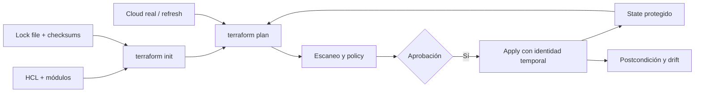

# Clase 230 — Seguridad de Infrastructure as Code (Terraform)

> Parte: **10 — Seguridad en la nube y contenedores** · Fuente: *HashiCorp Terraform docs y OWASP Infrastructure as Code Security*
> ⏱️ Duración estimada: **120 min** · Nivel: **Intermedio**

---

## 🎯 Objetivo

Aplicar seguridad al código que define la infraestructura. El alumno aprenderá a escanear
configuraciones Terraform en busca de misconfiguraciones (tfsec/Checkov), a proteger el estado
(`state`) que contiene datos sensibles, a evitar secretos en el código y a integrar estos controles
en el pipeline para detectar problemas antes de desplegar.

## 📚 Resultados de aprendizaje

Al finalizar, el alumno podrá:

1. **Escanear** código Terraform con tfsec y Checkov e interpretar hallazgos.
2. **Proteger** el `state` remoto (cifrado, bloqueo, acceso restringido).
3. **Evitar** secretos en el código y en el state mediante gestores de secretos.
4. **Integrar** validación de seguridad IaC en un pipeline CI (`plan` + escaneo + policy).
5. **Aplicar** policy-as-code para bloquear despliegues inseguros.

## 🗺️ Temas

| # | Tema | Por qué importa |
|---|------|-----------------|
| 1 | IaC y drift | Reproducibilidad y coherencia con lo desplegado |
| 2 | Escaneo estático (tfsec/Checkov) | Detectar misconfig antes de aplicar |
| 3 | Gestión del state | Contiene secretos y estado sensible |
| 4 | Datos sensibles en configuración, plan y state | Comprender cuándo se almacenan, ocultan u omiten |
| 5 | Módulos y proveedores confiables | Cadena de suministro de IaC |
| 6 | Policy-as-code (OPA/Sentinel) | Guardarraíles automáticos |
| 7 | IaC en el pipeline CI/CD | Shift-left de la seguridad de infra |

## 🧠 Explicación en profundidad

Terraform compara configuración, state y objetos remotos para producir un plan. Seguridad debe revisar los tres: HCL expresa intención, el plan muestra cambios calculados y el state enlaza direcciones Terraform con objetos reales y atributos. Un escáner que solo lee HCL puede perder valores calculados; una policy sobre plan puede encontrar valores desconocidos hasta `apply`.



El diagrama incluye dependencias y credencial de ejecución porque el pipeline es parte de la superficie. El archivo `.terraform.lock.hcl` fija selecciones y hashes de providers, pero actualmente no fija módulos remotos de la misma manera; los módulos requieren versión o referencia inmutable y revisión de origen.

### State y secretos

State puede contener contraseñas, claves y metadatos sensibles. Marcar una variable `sensitive` oculta su presentación en CLI, pero no impide necesariamente almacenarla. Terraform actual incorpora valores `ephemeral` y argumentos write-only en versiones y providers compatibles; antes de usarlos se comprueba soporte. El backend necesita cifrado, acceso mínimo, locking, versionado, logs y recuperación.

Leer un secreto desde Vault mediante un data source puede escribirlo igualmente en state si un recurso lo conserva. «Usar un vault» no es suficiente: se revisa el flujo completo desde obtención hasta provider, plan, state, logs y recurso final.

### Escaneo, policy y valores desconocidos

tfsec y Checkov aplican reglas sobre configuración; OPA o Sentinel pueden evaluar JSON del plan. Las políticas deben probarse con casos permitidos, denegados y valores desconocidos. Una regla «todo S3 debe ser privado» puede bloquear un sitio público legítimo; la excepción debe tener dueño, alcance y expiración.

### Drift y cadena de suministro

`terraform plan` actualiza estado observado según modo y puede revelar cambios externos, pero la detección depende de credenciales, refresh y recursos gestionados. Un recurso fuera del state no aparece automáticamente como drift del módulo. El pipeline fija Terraform y providers, revisa cambios de lock, usa credenciales OIDC temporales y separa plan de apply con aprobación basada en riesgo.

## 📖 Definiciones y características

- **Infrastructure as Code (IaC):** definir infraestructura en archivos versionados. *Clave:* auditable y reproducible, pero un error se replica a escala.
- **Terraform state:** archivo con el mapeo entre código y recursos reales. *Clave:* puede contener secretos en texto plano; protégelo.
- **Drift:** divergencia entre estado deseado, state y objeto remoto. *Clave:* `plan` puede revelar cambios de recursos gestionados según refresh, permisos y provider; no inventaría recursos desconocidos.
- **tfsec / Checkov:** escáneres estáticos de IaC. *Clave:* encuentran buckets públicos, SG abiertos, cifrado ausente.
- **Policy-as-code:** reglas (OPA/Rego, Sentinel) que aprueban o bloquean planes. *Clave:* impide desplegar lo no conforme.
- **Backend remoto:** almacenamiento coordinado del state. *Clave:* capacidades de cifrado, locking, acceso, auditoría y recuperación dependen del backend y versión.
- **Módulo:** paquete reutilizable de Terraform. *Clave:* verifica origen y versión para la cadena de suministro.

## 🔍 Caso razonado — contraseña marcada `sensitive` que sigue en state

Un módulo recibe `db_password` con `sensitive = true`. La salida CLI la oculta, pero el provider la conserva en el atributo del recurso y aparece en el state. El equipo confirma el comportamiento sobre un laboratorio, mueve generación y consumo a un mecanismo write-only soportado o rediseña la entrega, y protege versiones previas del backend.

Checkov deja pasar el código después del cambio, pero la verificación no termina allí: se inspecciona el plan JSON, se limita el rol CI, se prueba una policy que bloquea exposición pública y se ejecuta una consulta post-apply. La lección es seguir el dato y el recurso, no confiar en una etiqueta.

## ✅ Criterio de dominio

Dominas la clase cuando puedes explicar HCL–plan–state–cloud, demostrar qué valor sensible persiste, fijar providers y módulos, escribir una policy con pruebas y límites, y detectar drift declarando recursos y permisos cubiertos.

## 🧰 Herramientas y preparación

- **Terraform** instalado y un proveedor de laboratorio configurado.
- **tfsec**, **Checkov** y **terrascan** para escaneo estático.
- **OPA/Conftest** para policy-as-code.

```bash
# Escaneo estático de un directorio Terraform
tfsec .
checkov -d .
# Validar un plan contra políticas OPA
terraform plan -out plan.tfplan && terraform show -json plan.tfplan > plan.json
conftest test plan.json
```

## 🧪 Laboratorio guiado

1. Escribe un módulo Terraform inseguro: un bucket con `acl = "public-read"`, un security group con `0.0.0.0/0` en el puerto 22 y un recurso sin cifrado.
2. Ejecuta `tfsec .` y `checkov -d .`; anota los identificadores de cada hallazgo y su severidad.
3. Corrige el código: bloquea acceso público, restringe el SG a un rango, activa cifrado en reposo. Reejecuta los escáneres hasta 0 hallazgos altos.
4. Configura un **backend remoto** cifrado con bloqueo (por ejemplo S3 + DynamoDB) y verifica que el state ya no queda en local sin protección.
5. Elimina cualquier secreto del código; inyéctalo desde variables de entorno o un gestor de secretos y comprueba que no aparece en el `.tf`.
6. Escribe una política **OPA/Conftest** que rechace planes con recursos sin cifrado o con acceso público, e intégrala tras `terraform plan`.
7. Simula el pipeline: `fmt` → `validate` → `tfsec`/`checkov` → `plan` → `conftest` → (aprobación) → `apply`. Falla el pipeline si el escaneo encuentra un hallazgo crítico.

## ✍️ Ejercicios

1. Corrige un hallazgo concreto de tfsec y documenta la regla que lo detectó.
2. Migra un state local a un backend remoto cifrado con bloqueo.
3. Escribe una política Rego que exija etiquetas obligatorias en todos los recursos.
4. Detecta drift introduciendo un cambio manual y ejecutando `terraform plan`.
5. Fija (pin) la versión de un módulo y de un proveedor y explica por qué.
6. Integra el escaneo IaC como paso obligatorio en un workflow de CI.

## 📝 Reto verificable

Toma un repositorio Terraform con misconfiguraciones y déjalo "verde": sin hallazgos críticos en
tfsec/Checkov, con state remoto cifrado y bloqueado, sin secretos en el código, y con una policy OPA
que bloquea recursos inseguros en el pipeline.

**Criterio de aceptación:** `tfsec` y `checkov` reportan 0 hallazgos críticos/altos, `conftest`
rechaza un plan que reintroduzca un bucket público, y no hay ningún secreto en texto plano en los
`.tf` ni en el backend.

## ⚠️ Errores comunes

| Síntoma / mensaje | Causa y cómo arreglar |
|-------------------|-----------------------|
| Secreto visible en `terraform.tfstate` | El recurso guardó el valor en el state; usa un gestor de secretos y cifra el backend. |
| tfsec pasa pero el recurso sigue inseguro | Regla suprimida con `#tfsec:ignore`; revisa las supresiones injustificadas. |
| `Error acquiring the state lock` | Otro `apply` en curso o lock huérfano; espera o libera con `force-unlock` con cuidado. |
| Drift no detectado | Cambios fuera de Terraform; ejecuta `plan` periódicamente y usa detección de drift. |
| Módulo malicioso o desactualizado | Origen no verificado; fija versión y usa fuentes confiables. |

## ❓ Preguntas frecuentes

**❓ ¿Por qué el state de Terraform es sensible?**
Porque puede contener valores en texto plano (contraseñas de bases de datos, claves) y el mapa completo de tu infraestructura. Debe cifrarse en reposo, tener acceso restringido y bloqueo para evitar corrupción.

**❓ ¿tfsec o Checkov?**
Ambos son buenos; suelen usarse juntos porque sus reglas no coinciden al 100%. Checkov cubre más frameworks (Terraform, CloudFormation, Kubernetes) y tfsec es muy rápido para Terraform. Ejecuta los dos en CI.

**❓ ¿El escaneo estático reemplaza al CSPM?**
No. El escaneo IaC detecta problemas *antes* de desplegar (shift-left); el CSPM (clase 231) evalúa lo *ya desplegado* en tiempo de ejecución, incluyendo cambios hechos fuera de Terraform. Se complementan.

## 🔗 Referencias verificables y alcance

- Terraform — State. <https://developer.hashicorp.com/terraform/language/state> — propósito, almacenamiento y operación oficial.
- Terraform — Manage sensitive data. <https://developer.hashicorp.com/terraform/language/manage-sensitive-data> — diferencias vigentes entre `sensitive`, `ephemeral` y write-only, con requisitos de versión.
- Terraform — Dependency lock file. <https://developer.hashicorp.com/terraform/language/files/dependency-lock> — alcance de selección y hashes de providers.
- Open Policy Agent — Terraform. <https://www.openpolicyagent.org/docs/terraform> — evaluación de plan y limitaciones de valores desconocidos.
- Checkov. <https://www.checkov.io/> y tfsec. <https://github.com/aquasecurity/tfsec> — herramientas primarias; documentar versión, reglas y supresiones.
- OWASP IaC Security Cheat Sheet. <https://cheatsheetseries.owasp.org/cheatsheets/Infrastructure_as_Code_Security_Cheat_Sheet.html> — recomendaciones complementarias, no especificación de Terraform.

## 📥 Material descargable

- 📄 [Guía en PDF](./clase-230-guia.pdf) — versión imprimible de esta clase.
- 🎞️ [Presentación (PPTX)](./clase-230-presentacion.pptx) — deck para proyectar en clase.

## ⬅️ Clase anterior

[Clase 229 — Kubernetes: hardening y ataques](../229-kubernetes-hardening-y-ataques/README.md)

## ➡️ Siguiente clase

[Clase 231 — Cloud Security Posture Management (CSPM)](../231-cloud-security-posture-management-cspm/README.md)
