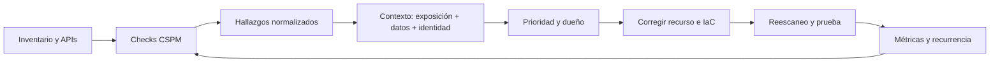

# Clase 231 — Cloud Security Posture Management (CSPM)

> Parte: **10 — Seguridad en la nube y contenedores** · Fuente: *Documentación de Prowler y ScoutSuite, y CIS Benchmarks multi-cloud*
> ⏱️ Duración estimada: **120 min** · Nivel: **Intermedio**

---

## 🎯 Objetivo

Aprender a evaluar y mantener de forma continua la postura de seguridad de una o varias nubes con
herramientas CSPM de código abierto (Prowler, ScoutSuite). El alumno sabrá ejecutar auditorías
multi-cloud, priorizar hallazgos por severidad y marco (CIS, PCI, etc.), generar informes y establecer
un ciclo de remediación medible.

## 📚 Resultados de aprendizaje

Al finalizar, el alumno podrá:

1. **Explicar** qué es CSPM y por qué complementa al escaneo IaC.
2. **Ejecutar** Prowler y ScoutSuite contra AWS/Azure/GCP.
3. **Priorizar** hallazgos por severidad, marco de cumplimiento e impacto.
4. **Generar** informes reproducibles para auditoría y para el equipo.
5. **Diseñar** un ciclo de remediación con métricas de postura.

## 🗺️ Temas

| # | Tema | Por qué importa |
|---|------|-----------------|
| 1 | Qué es CSPM | Visibilidad continua de misconfiguraciones |
| 2 | CSPM vs escaneo IaC | Runtime vs pre-despliegue |
| 3 | Prowler | Automatizar checks con alcance, versión y credencial conocidos |
| 4 | ScoutSuite | Auditoría con informe HTML navegable |
| 5 | Marcos de cumplimiento | CIS, PCI-DSS, HIPAA, ISO 27001 |
| 6 | Priorización de hallazgos | Evitar la fatiga de alertas |
| 7 | Ciclo de remediación y métricas | Mejorar la postura con el tiempo |

## 🧠 Explicación en profundidad

CSPM compara configuración efectiva con reglas de seguridad y cumplimiento. El resultado es un hallazgo, no una vulnerabilidad explotable demostrada ni una prioridad empresarial automática. Para convertirlo en trabajo útil se agrega contexto: exposición, privilegio, sensibilidad de datos, ruta de ataque, dueño, compensaciones y origen IaC.



El ciclo vuelve al check porque la postura cambia. Una corrección manual puede ser revertida por Terraform; una corrección en código puede no alcanzar recursos creados fuera del pipeline. Por eso el ticket vincula recurso, cuenta, regla, evidencia, repositorio, excepción y fecha de verificación.

### Cobertura antes que cantidad

Prowler y ScoutSuite usan APIs con una credencial. Un `AccessDenied` puede convertir un check en desconocido, no en conforme. Se documentan cuentas, regiones, servicios, permisos, versión, checks deshabilitados y errores. «Cientos de checks» no es una medida de cobertura si faltan datos o el servicio no está soportado.

Los frameworks aportan requisitos con objetivos distintos. CIS define benchmarks de configuración; PCI DSS, ISO 27001 o una política interna requieren alcance y evidencia adicional. Un mapeo de herramienta es una ayuda, no certificación de cumplimiento.

### Priorizar y aceptar riesgo

Severidad del producto es un dato. Un bucket públicamente accesible con datos sensibles puede ser urgente; el mismo patrón en un sitio estático previsto requiere revisar integridad, origen y excepción. Un rol potente sin ruta de uso puede tener prioridad distinta a una credencial activa que puede asumirlo. Las excepciones incluyen justificación, control compensatorio, aprobador, vencimiento y revisión.

### Métricas que no incentiven ocultar

Contar hallazgos abiertos castiga inventarios más completos. Se miden cobertura de cuentas y servicios, edad por severidad contextual, tiempo a triage, tiempo a corrección, recurrencia, excepciones vencidas y porcentaje corregido en IaC. Las tendencias se segmentan por equipo y criticidad sin confundir volumen con riesgo total.

## 📖 Definiciones y características

- **CSPM:** gestión continua de la postura de seguridad en la nube. *Clave:* detecta misconfiguraciones en recursos *ya desplegados*.
- **Prowler:** herramienta open source con cientos de checks para AWS/Azure/GCP/K8s. *Clave:* mapea a CIS y otros marcos.
- **ScoutSuite:** auditor multi-cloud que genera un informe HTML navegable. *Clave:* ideal para revisión visual y priorización.
- **Baseline de seguridad:** conjunto de controles mínimos esperados. *Clave:* referencia contra la que se mide la postura.
- **Severidad:** estimación técnica producida por una regla o producto. *Clave:* orienta, pero la prioridad incorpora exposición, datos, privilegio, explotabilidad y negocio.
- **Drift de postura:** aparición de nuevas misconfiguraciones con el tiempo. *Clave:* exige auditoría continua, no puntual.
- **Remediación:** cambio que corrige causa y estado efectivo. *Clave:* se aplica al recurso y a su fuente declarativa y se verifica mediante reescaneo y prueba.

## 🔍 Caso razonado — dos security groups con el mismo check

Prowler marca dos SG con SSH desde Internet. Uno está asociado a una instancia apagada sin IP pública; el otro a un bastion con IP pública y contraseña habilitada. La regla es idéntica, pero la ruta y el impacto no. El segundo se prioriza, se migra a acceso administrado o rango autorizado y se revisan autenticaciones; el primero también se corrige en Terraform para evitar exposición futura.

La evidencia de cierre incluye diff IaC, plan, estado efectivo y reescaneo. Si el bastion conserva una excepción temporal, se documentan dueño, origen permitido, MFA/clave, logs y vencimiento.

## ✅ Criterio de dominio

Dominas la clase cuando puedes ejecutar una auditoría con cobertura declarada, distinguir conforme de desconocido, contextualizar hallazgos iguales de forma distinta, corregir recurso e IaC y presentar métricas que midan cobertura, edad y recurrencia.

## 🧰 Herramientas y preparación

- **Prowler** (`pip install prowler`) y **ScoutSuite** (`pip install scoutsuite`).
- Credenciales de solo lectura (rol/SA de auditoría) en la cuenta objetivo.
- Un directorio para almacenar informes con fecha para comparar evolución.

```bash
# Auditar AWS contra CIS con salida en varios formatos
prowler aws --compliance cis_2.0_aws -M html json-ocsf csv
# Auditar con ScoutSuite (genera informe HTML)
scout aws
# Filtrar solo checks de severidad alta/crítica
prowler aws --severity high critical
```

## 🧪 Laboratorio guiado

1. Crea un rol/SA de **solo lectura** para auditoría en tu cuenta de laboratorio (privilegio mínimo, sin permisos de escritura).
2. Ejecuta `prowler aws --compliance cis_2.0_aws -M html csv` y abre el informe HTML; identifica los hallazgos críticos.
3. Ejecuta `scout aws` y navega el informe: compara cómo ScoutSuite agrupa por servicio frente a la vista por control de Prowler.
4. **Prioriza:** filtra por `--severity critical high` y construye una lista de los 10 hallazgos a remediar primero, justificando el orden por impacto.
5. Remedia al menos tres (por ejemplo: activar cifrado por defecto, cerrar un SG abierto, habilitar CloudTrail) usando lo aprendido en la clase 223.
6. Vuelve a ejecutar Prowler y compara el número de hallazgos antes/después; calcula el porcentaje de mejora.
7. Automatiza: programa la auditoría (cron/CI) y guarda los informes con fecha para medir el **drift de postura** a lo largo del tiempo.

## ✍️ Ejercicios

1. Ejecuta Prowler filtrando por un servicio concreto (p. ej. solo S3) e interpreta la salida.
2. Genera un informe en formato OCSF/JSON y explica para qué sirve integrarlo en un SIEM.
3. Mapea cinco hallazgos a su control CIS correspondiente.
4. Diseña un criterio de priorización que combine severidad y exposición a Internet.
5. Compara los hallazgos de Prowler y ScoutSuite sobre la misma cuenta y explica diferencias.
6. Define tres métricas de postura (p. ej. % de recursos conformes, MTTR de remediación).

## 📝 Reto verificable

Audita una cuenta de laboratorio, prioriza y remedia hasta reducir a cero los hallazgos críticos, y
documenta la mejora con dos ejecuciones de Prowler (antes/después).

**Criterio de aceptación:** la segunda ejecución muestra 0 hallazgos críticos y un número de altos
inferior al inicial; el informe incluye la lista priorizada, la evidencia de cada remediación y al
menos una métrica de postura calculada.

## ⚠️ Errores comunes

| Síntoma / mensaje | Causa y cómo arreglar |
|-------------------|-----------------------|
| Prowler falla con `AccessDenied` en muchos checks | Rol de auditoría sin permisos de lectura; usa la política gestionada de auditoría/seguridad. |
| Miles de hallazgos abruman al equipo | Falta de priorización; filtra por severidad y exposición antes de repartir trabajo. |
| Los hallazgos reaparecen | Se corrigió a mano y el IaC volvió a desplegar lo inseguro; corrige también en Terraform. |
| Informe sin contexto de negocio | Todo tratado igual; añade criticidad del recurso a la priorización. |
| Auditoría solo una vez | La postura deriva; automatiza ejecuciones periódicas y compara. |

## ❓ Preguntas frecuentes

**❓ ¿CSPM sustituye al escaneo de IaC?**
No, se complementan. El escaneo IaC (clase 230) previene antes de desplegar; el CSPM detecta lo que ya está desplegado, incluidos cambios manuales o de terceros que el IaC no ve.

**❓ ¿Necesito una herramienta comercial de CSPM?**
Para empezar no. Prowler y ScoutSuite cubren muy bien AWS/Azure/GCP con cientos de checks. Las soluciones comerciales añaden correlación, priorización avanzada y remediación automatizada a escala.

**❓ ¿Cómo evito la fatiga de alertas?**
Prioriza: no todos los hallazgos importan igual. Cruza severidad con exposición a Internet y criticidad del recurso, remedia primero lo explotable y automatiza la supresión justificada de falsos positivos.

## 🔗 Referencias verificables y alcance

- Prowler. <https://github.com/prowler-cloud/prowler> — proyecto primario y checks; fijar versión, provider, regiones y permisos.
- ScoutSuite. <https://github.com/nccgroup/ScoutSuite> — proyecto primario de recolección e informe; un reporte HTML no sustituye priorización.
- CIS Benchmarks. <https://www.cisecurity.org/cis-benchmarks> — baselines versionadas y perfiladas.
- AWS Security Hub. <https://docs.aws.amazon.com/securityhub/> — postura y agregación gestionadas según estándares y regiones habilitados.
- Microsoft Defender for Cloud CSPM. <https://learn.microsoft.com/azure/defender-for-cloud/concept-cloud-security-posture-management> — capacidades y planes oficiales actuales.

## 📥 Material descargable

- 📄 [Guía en PDF](./clase-231-guia.pdf) — versión imprimible de esta clase.
- 🎞️ [Presentación (PPTX)](./clase-231-presentacion.pptx) — deck para proyectar en clase.

## ⬅️ Clase anterior

[Clase 230 — Seguridad de Infrastructure as Code (Terraform)](../230-seguridad-de-infrastructure-as-code-terraform/README.md)

## ➡️ Siguiente clase

[Clase 232 — Seguridad serverless](../232-seguridad-serverless/README.md)
