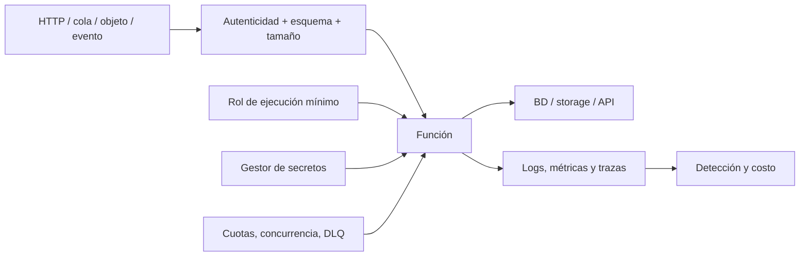

# Clase 232 — Seguridad serverless

> Parte: **10 — Seguridad en la nube y contenedores** · Fuente: *OWASP Serverless Top 10 y documentación de AWS Lambda / Azure Functions / Google Cloud Functions*
> ⏱️ Duración estimada: **120 min** · Nivel: **Intermedio**

---

## 🎯 Objetivo

Asegurar cargas serverless (funciones como servicio) entendiendo cómo cambia el modelo de amenazas
cuando no hay servidor que endurecer: la superficie se traslada al código de la función, a sus
permisos IAM, a sus disparadores (triggers) y a sus dependencias. El alumno aplicará privilegio
mínimo por función, gestión segura de secretos y controles frente a inyección y abuso.

## 📚 Resultados de aprendizaje

Al finalizar, el alumno podrá:

1. **Describir** el modelo de amenazas serverless y el OWASP Serverless Top 10.
2. **Aplicar** privilegio mínimo por función (un rol IAM por función).
3. **Proteger** disparadores (API Gateway, colas, buckets) frente a abuso.
4. **Gestionar** secretos y variables de entorno de forma segura.
5. **Mitigar** inyección, dependencias vulnerables y denial-of-wallet.

## 🗺️ Temas

| # | Tema | Por qué importa |
|---|------|-----------------|
| 1 | Modelo de amenazas serverless | La superficie se mueve al código y a IAM |
| 2 | Permisos por función | Un rol excesivo = escalada si la función cae |
| 3 | Event injection | Los eventos vienen de fuentes no confiables |
| 4 | Secretos en funciones | Variables de entorno no son un vault |
| 5 | Dependencias y cadena de suministro | Paquetes vulnerables en el bundle |
| 6 | Abuso de concurrencia y costo | Relacionar disponibilidad, cuotas, bucles y presupuesto |
| 7 | Observabilidad de funciones | Trazas y logs para detección |

## 🧠 Explicación en profundidad

Serverless elimina la administración directa de servidores para el cliente, no la responsabilidad sobre código, dependencias, eventos, identidad, configuración y datos. La unidad de amenaza no es solo la función: es la cadena trigger → transformación → función → servicios descendentes → respuesta.



El diagrama sitúa validación antes del código y controles operativos alrededor. Un evento emitido por un servicio cloud todavía puede contener datos controlados por un usuario. Autenticar el origen no valida el payload; validar JSON no autoriza la operación; parametrizar una consulta no limita el rol de ejecución.

### Identidad por función y confianza entre eventos

Reutilizar un rol amplio entre funciones mezcla blast radius. Cada función o grupo coherente obtiene acciones y recursos mínimos, con condiciones cuando sean estables. También se protege quién puede actualizar código, variables, layers, destinations y rol. Una identidad administrada elimina claves estáticas, pero una ejecución comprometida puede usar sus tokens efectivos.

Los eventos se validan por esquema, tamaño, tipos, identificadores y relación con el recurso esperado. En flujos asíncronos se consideran reintentos, idempotencia, orden, dead-letter queues y poison messages. Un mismo evento procesado dos veces no debe duplicar transferencias o privilegios.

### Costo, disponibilidad y bucles

Un atacante o error puede generar invocaciones, fan-out o bucles entre servicios. «Denial-of-wallet» es una etiqueta útil, pero el efecto puede incluir throttling y caída. Se usan límites de concurrencia, cuotas, rate limiting en la entrada, budgets y alarmas; un budget alerta y no siempre detiene consumo. Los límites se prueban para no bloquear carga legítima ni agotar dependencias compartidas.

### Secretos, dependencias y observabilidad

Variables de entorno pueden cifrarse en reposo, pero suelen ser legibles para identidades con permisos de configuración o para el proceso. Se usa un gestor y cache controlado con rotación. Dependencias y layers se fijan, escanean y reconstruyen. Logs evitan payloads y secretos, conservan request/correlation ID, identidad, resultado, latencia y errores; trazas explican llamadas distribuidas con muestreo conocido.

## 📖 Definiciones y características

- **Función como servicio (FaaS):** código que corre bajo demanda sin gestionar servidores. *Clave:* no parcheas SO, pero sí el código y sus permisos.
- **Trigger/evento:** fuente que invoca la función (HTTP, cola, objeto en bucket). *Clave:* el payload del evento es entrada no confiable.
- **Rol de ejecución:** identidad IAM que asume la función. *Clave:* debe ser mínimo y exclusivo por función.
- **Event injection:** uso de campos de un evento para alterar una operación posterior. *Clave:* autenticar origen, validar esquema y usar APIs seguras resuelven riesgos diferentes.
- **Abuso de costo/concurrencia:** invocaciones, fan-out o bucles que consumen cuota y presupuesto. *Clave:* combina límites, idempotencia, alertas y protección en la fuente.
- **Cold start:** primera invocación tras inactividad. *Clave:* relevante para timeouts y para no cachear secretos inseguros.
- **Variables de entorno:** config inyectada en la función. *Clave:* no son secretas por sí solas; usa un gestor de secretos y cifrado.

## 🔍 Caso razonado — objeto que dispara un bucle

Una función transforma cada archivo subido y escribe el resultado en el mismo bucket/prefijo que activa el trigger. El archivo de salida vuelve a invocarla y produce un bucle. No es necesariamente un atacante: es una relación de eventos mal diseñada con impacto de costo y disponibilidad.

La corrección separa prefijos o buckets, filtra eventos, agrega idempotencia y limita concurrencia. La prueba crea un objeto benigno, confirma una sola transformación, revisa métrica de invocaciones y verifica que un payload sobredimensionado o con esquema inválido se rechaza sin registrarlo completo.

## ✅ Criterio de dominio

Dominas la clase cuando puedes modelar una cadena de evento completa, asignar rol mínimo por función, diseñar idempotencia y límites, entregar secretos sin exponerlos y demostrar con logs/métricas qué ocurrió durante reintentos y rechazo.

## 🧰 Herramientas y preparación

- Una cuenta de laboratorio con AWS Lambda (o Azure Functions / Cloud Functions).
- **Serverless Framework** o **SAM** para desplegar; **cfn-nag**/**Checkov** para revisar plantillas.
- Un escáner de dependencias (p. ej. `npm audit`, `pip-audit`, Trivy) y un gestor de secretos (clase 233).

```bash
# Revisar los permisos del rol de ejecución de una Lambda
aws lambda get-function --function-name mi-func \
  --query 'Configuration.Role'
# Escanear dependencias del paquete de la función
pip-audit -r requirements.txt
```

## 🧪 Laboratorio guiado

1. Despliega una función simple (p. ej. procesa un objeto subido a un bucket) con Serverless Framework en tu cuenta de laboratorio.
2. Revisa su **rol de ejecución**: si tiene permisos amplios, recórtalo a solo las acciones necesarias (leer ese bucket, escribir en esa cola).
3. **Event injection:** añade a la función una consulta construida con datos del evento sin sanear y demuestra la inyección (en laboratorio); luego parametriza/valida la entrada y confirma la mitigación.
4. Mueve un "secreto" de una variable de entorno a un gestor de secretos (Secrets Manager/Key Vault) y recupéralo en runtime con permisos mínimos.
5. Escanea las dependencias del paquete con `pip-audit`/`npm audit`/Trivy y actualiza las vulnerables.
6. Configura **límites de concurrencia** y presupuesto/alarma de coste para mitigar denial-of-wallet.
7. Habilita trazas (X-Ray/Application Insights) y logs estructurados; provoca un error y compruébalo en el log.

## ✍️ Ejercicios

1. Reescribe un rol de ejecución amplio a privilegio mínimo para un caso concreto.
2. Valida y sanea el payload de un evento HTTP antes de usarlo en una consulta.
3. Migra tres secretos de variables de entorno a un gestor de secretos.
4. Añade un límite de concurrencia y una alarma de coste a una función.
5. Escanea el bundle de la función y corrige una dependencia vulnerable.
6. Diseña una regla de detección para invocaciones anómalas de una función.

## 📝 Reto verificable

Endurece una función serverless de laboratorio: rol de ejecución mínimo y exclusivo, entrada validada,
secretos fuera de las variables de entorno, dependencias sin CVEs críticas y límite de concurrencia.

**Criterio de aceptación:** el rol de la función solo permite las acciones estrictamente necesarias
(verificable con la política), el ataque de event injection ya no funciona, no hay secretos en las
variables de entorno y `pip-audit`/`npm audit` no reporta vulnerabilidades críticas.

## ⚠️ Errores comunes

| Síntoma / mensaje | Causa y cómo arreglar |
|-------------------|-----------------------|
| Función con `AdministratorAccess` | Rol reutilizado y excesivo; crea un rol mínimo por función. |
| Secreto legible en la consola | Guardado en variable de entorno en claro; muévelo a un gestor de secretos. |
| Factura disparada de repente | Denial-of-wallet o bucle de eventos; limita concurrencia y añade alarmas de coste. |
| Inyección vía payload del evento | Entrada no saneada; valida esquema y parametriza consultas. |
| CVE en una dependencia del bundle | Paquete vulnerable empaquetado; escanea y actualiza en cada build. |

## ❓ Preguntas frecuentes

**❓ ¿Serverless es más seguro porque no hay servidor?**
El proveedor asume el parcheo del SO y del runtime, lo que elimina una clase de problemas. Pero la superficie se traslada al código, a los permisos IAM, a los eventos y a las dependencias, que siguen siendo tu responsabilidad.

**❓ ¿Las variables de entorno sirven para secretos?**
No como almacén seguro: son visibles para quien pueda leer la configuración de la función y pueden filtrarse en logs. Usa un gestor de secretos y concede a la función permiso mínimo para leerlos en runtime.

**❓ ¿Qué es denial-of-wallet y por qué preocupa en serverless?**
Es un abuso que no busca tumbar el servicio sino disparar el número de invocaciones y, con ello, el coste. Se mitiga con límites de concurrencia, throttling en el API Gateway y alarmas/presupuestos de coste.

## 🔗 Referencias verificables y alcance

- AWS Lambda — Security. <https://docs.aws.amazon.com/lambda/latest/dg/lambda-security.html> — modelo y controles oficiales AWS; confirmar integración específica de cada trigger.
- Azure Functions security. <https://learn.microsoft.com/azure/azure-functions/security-concepts> — recomendaciones oficiales de identidad, red y secretos.
- Google Cloud Run functions security. <https://cloud.google.com/functions/docs/securing> — autenticación y protección oficial del servicio vigente.
- OWASP Serverless Top 10. <https://owasp.org/www-project-serverless-top-10/> — taxonomía comunitaria para modelado; no ranking universal de frecuencia.
- OWASP Serverless Security Cheat Sheet. <https://cheatsheetseries.owasp.org/cheatsheets/Serverless_FaaS_Security_Cheat_Sheet.html> — prácticas complementarias para eventos, permisos y observabilidad.

## 📥 Material descargable

- 📄 [Guía en PDF](./clase-232-guia.pdf) — versión imprimible de esta clase.
- 🎞️ [Presentación (PPTX)](./clase-232-presentacion.pptx) — deck para proyectar en clase.

## ⬅️ Clase anterior

[Clase 231 — Cloud Security Posture Management (CSPM)](../231-cloud-security-posture-management-cspm/README.md)

## ➡️ Siguiente clase

[Clase 233 — Gestión de secretos en la nube](../233-gestion-de-secretos-en-la-nube/README.md)
