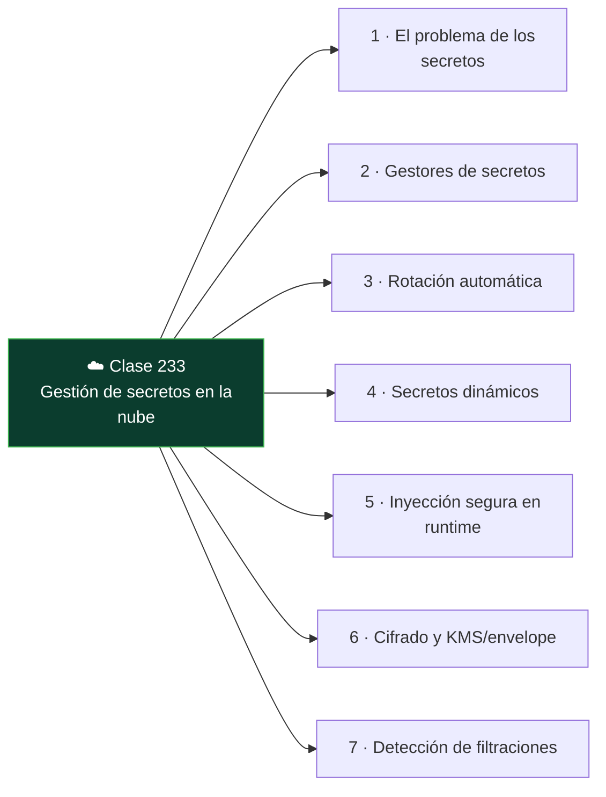

# Clase 233 — Gestión de secretos en la nube

<!-- cabecera:inicio -->

<div align="center">

[](../README.md)
[](../../README.md)
[](../../README.md)
[](../../README.md)

</div>

> 🗂️ Parte: **10 — Seguridad en la nube y contenedores** · 📖 Fuente: *Documentación de HashiCorp Vault, AWS Secrets Manager y OWASP Secrets Management Cheat Sheet*
> ⏱️ Duración estimada: **120 min** · 🎚️ Nivel: **Intermedio**

<!-- cabecera:fin -->

---

## 🎯 Objetivo

Diseñar una gestión de secretos robusta en la nube: almacenamiento cifrado, acceso por identidad y no
por credencial compartida, rotación automática, secretos dinámicos y detección de filtraciones. El
alumno usará un gestor de secretos (Vault o el nativo del proveedor) e integrará el patrón de
inyección segura en aplicaciones y contenedores.

## 📚 Resultados de aprendizaje

Al finalizar, el alumno podrá:

1. **Explicar** por qué los secretos no deben vivir en código, imágenes ni variables en claro.
2. **Almacenar** y recuperar secretos con un gestor (Vault / Secrets Manager / Key Vault / Secret Manager).
3. **Configurar** rotación automática y secretos dinámicos de corta vida.
4. **Inyectar** secretos en apps y contenedores con acceso por identidad.
5. **Detectar** secretos filtrados en repositorios con escáneres.

## 🗺️ Temas

<!-- mapa:inicio -->



<!-- mapa:fin -->

| # | Tema | Por qué importa |
|---|------|-----------------|
| 1 | El problema de los secretos | Filtraciones en repos, imágenes y logs |
| 2 | Gestores de secretos | Almacén cifrado con control de acceso |
| 3 | Rotación automática | Reduce la ventana de un secreto comprometido |
| 4 | Secretos dinámicos | Credenciales efímeras generadas al vuelo |
| 5 | Inyección segura en runtime | Sin secretos en la imagen ni en el código |
| 6 | Cifrado y KMS/envelope | Protección de la clave que protege los secretos |
| 7 | Detección de filtraciones | git-secrets, gitleaks, trufflehog |

## 📖 Definiciones y características

- **Gestor de secretos:** servicio que almacena secretos cifrados con control de acceso y auditoría. *Clave:* acceso por identidad, no por secreto compartido.
- **Rotación:** cambio periódico y automático del secreto. *Clave:* limita el tiempo útil de un secreto robado.
- **Secreto dinámico:** credencial generada bajo demanda con TTL corto (p. ej. Vault crea un usuario de BD temporal). *Clave:* nada persistente que robar.
- **Envelope encryption:** cifrar datos con una clave de datos, y esa clave con una clave maestra (KMS). *Clave:* base del cifrado escalable.
- **Inyección en runtime:** el secreto llega a la app en ejecución, nunca en la imagen. *Clave:* montaje de secreto o llamada al gestor con identidad.
- **Sidecar de secretos (Vault Agent):** proceso que obtiene y renueva secretos junto a la app. *Clave:* mantiene el secreto fuera del código.
- **Escáner de secretos:** herramienta que busca secretos en el código/historial. *Clave:* prevención en el pipeline.

## 🧰 Herramientas y preparación

- **HashiCorp Vault** (modo dev para laboratorio) o el gestor nativo del proveedor.
- **gitleaks** / **trufflehog** para detección de secretos en repos.
- KMS del proveedor para envelope encryption.

```bash
# Guardar y leer un secreto en Vault (modo laboratorio)
vault kv put secret/miapp db_password=Sup3r
vault kv get secret/miapp
# Escanear un repositorio en busca de secretos filtrados
gitleaks detect --source . --report-format json --report-path leaks.json
```

## 🧪 Laboratorio guiado

1. Arranca **Vault** en modo dev (solo laboratorio) y habilita el motor KV; guarda un secreto y recupéralo con `vault kv get`.
2. Configura una **política** de Vault que permita a una identidad leer solo `secret/miapp` y verifica que no puede leer otros paths.
3. Habilita **secretos dinámicos** de base de datos: configura el motor `database` para que Vault cree credenciales temporales con TTL corto; genera unas y observa su expiración.
4. Integra el patrón de **inyección**: una app/contenedor obtiene el secreto en runtime con su identidad (AppRole/Kubernetes auth), sin secretos en la imagen.
5. Configura **rotación automática** de un secreto estático y comprueba que cambia sin intervención.
6. Introduce a propósito un secreto en un commit y detéctalo con **gitleaks**; luego elimínalo del historial y añade el escaneo como hook/paso de CI.
7. Verifica el cifrado en reposo (envelope con KMS) del almacén y revisa el log de auditoría de accesos a secretos.

## ✍️ Ejercicios

1. Escribe una política de Vault con acceso mínimo a un único path de secretos.
2. Configura rotación automática de una credencial de base de datos.
3. Genera credenciales dinámicas y demuestra que expiran solas.
4. Integra la obtención de un secreto en una app sin escribirlo en el código.
5. Añade gitleaks como paso obligatorio de CI y falla el build si detecta un secreto.
6. Explica el flujo de envelope encryption con KMS paso a paso.

## 📝 Reto verificable

Elimina todos los secretos en claro de una app de laboratorio y su repo: muévelos a un gestor,
configura rotación (o secretos dinámicos), inyéctalos en runtime por identidad y añade detección en CI.

**Criterio de aceptación:** `gitleaks detect` no reporta secretos en el repo ni en el historial, la
app obtiene sus credenciales del gestor en runtime (no hay secretos en la imagen ni en variables en
claro), y al menos un secreto rota automáticamente o se emite de forma dinámica con TTL.

## ⚠️ Errores comunes

| Síntoma / mensaje | Causa y cómo arreglar |
|-------------------|-----------------------|
| Secreto sigue en el historial de git tras borrarlo del último commit | Persiste en commits anteriores; reescribe el historial y **rota** el secreto igualmente. |
| App no puede leer el secreto | Política del gestor demasiado restrictiva o identidad mal configurada; ajusta el binding. |
| Secreto en la imagen de contenedor | Se copió en build; muévelo a inyección en runtime y reconstruye. |
| Rotación rompe la app | La app cachea el secreto viejo; implementa recarga o usa el sidecar que renueva. |
| Token de Vault de larga vida | Riesgo si se filtra; usa tokens de corta vida y auth por identidad. |

## ❓ Preguntas frecuentes

**❓ Si borro el secreto del código, ¿ya estoy seguro?**
No basta. Si el secreto estuvo alguna vez en el repositorio, sigue en el historial de git y probablemente ya se copió. Rótalo/revócalo siempre, además de eliminarlo, y reescribe el historial si hace falta.

**❓ ¿Secretos estáticos con rotación o secretos dinámicos?**
Los dinámicos son superiores cuando el sistema los soporta: se crean bajo demanda con TTL corto y no hay nada persistente que robar. Para sistemas que no lo permiten, usa secretos estáticos con rotación automática frecuente.

**❓ ¿Vault o el gestor nativo del proveedor?**
Ambos válidos. El nativo (Secrets Manager, Key Vault, Secret Manager) se integra sin desplegar nada y con IAM del proveedor. Vault brilla en multi-cloud, secretos dinámicos avanzados y control fino, a cambio de operarlo tú.

## 🔗 Referencias

- HashiCorp Vault docs. <https://developer.hashicorp.com/vault/docs>
- AWS Secrets Manager. <https://docs.aws.amazon.com/secretsmanager/>
- OWASP Secrets Management Cheat Sheet. <https://cheatsheetseries.owasp.org/cheatsheets/Secrets_Management_Cheat_Sheet.html>
- gitleaks. <https://github.com/gitleaks/gitleaks>
- Google Cloud Secret Manager. <https://cloud.google.com/secret-manager/docs>

## 📥 Material descargable

- 📄 [Guía en PDF](./clase-233-guia.pdf) — versión imprimible de esta clase.
- 🎞️ [Presentación (PPTX)](./clase-233-presentacion.pptx) — deck para proyectar en clase.

## ⬅️ Clase anterior

[Clase 232 — Seguridad serverless](../232-seguridad-serverless/README.md)

## ➡️ Siguiente clase

[Clase 234 — Logging y detección en la nube](../234-logging-y-deteccion-en-la-nube/README.md)
