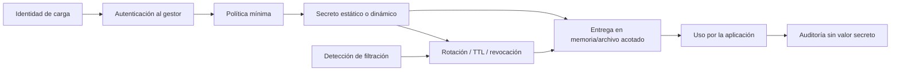

# Clase 233 — Gestión de secretos en la nube

> Parte: **10 — Seguridad en la nube y contenedores** · Fuente: *Documentación de HashiCorp Vault, AWS Secrets Manager y OWASP Secrets Management Cheat Sheet*
> ⏱️ Duración estimada: **120 min** · Nivel: **Intermedio**

---

## 🎯 Objetivo

Diseñar una gestión de secretos robusta en la nube: almacenamiento cifrado, acceso por identidad y no
por credencial compartida, rotación automática, secretos dinámicos y detección de filtraciones. El
alumno usará un gestor de secretos (Vault o el nativo del proveedor) e integrará el patrón de
inyección segura en aplicaciones y contenedores.

## 📚 Resultados de aprendizaje

Al finalizar, el alumno podrá:

1. **Explicar** por qué los secretos no deben vivir en código, imágenes ni variables en claro.
2. **Almacenar** y recuperar secretos con un gestor (Vault / Secrets Manager / Key Vault / Secret Manager).
3. **Configurar** rotación automática y secretos dinámicos de corta vida.
4. **Inyectar** secretos en apps y contenedores con acceso por identidad.
5. **Detectar** secretos filtrados en repositorios con escáneres.

## 🗺️ Temas

| # | Tema | Por qué importa |
|---|------|-----------------|
| 1 | El problema de los secretos | Filtraciones en repos, imágenes y logs |
| 2 | Gestores de secretos | Almacén cifrado con control de acceso |
| 3 | Rotación automática | Reduce la ventana de un secreto comprometido |
| 4 | Secretos dinámicos | Credenciales efímeras generadas al vuelo |
| 5 | Entrega en runtime | Reducir persistencia en código, imagen, variables y logs |
| 6 | Cifrado y KMS/envelope | Protección de la clave que protege los secretos |
| 7 | Detección de filtraciones | git-secrets, gitleaks, trufflehog |

## 🧠 Explicación en profundidad

Un secreto es información cuya posesión permite autenticar o autorizar: contraseña, token, clave API o material privado. No todo dato sensible es un secreto y no toda clave criptográfica se gestiona igual. La seguridad se diseña como ciclo: creación, almacenamiento, distribución, uso, rotación, revocación, auditoría y destrucción.



El objetivo del diagrama no es «guardar todo en Vault», sino evitar que la aplicación necesite una credencial raíz para pedir otra credencial. La identidad inicial debe venir de la plataforma cuando sea posible —workload identity, managed identity, IAM role— y su política solo permite la ruta requerida.

### Estático, rotado y dinámico

Un secreto estático puede rotarse periódicamente o ante compromiso. La rotación necesita coordinación entre emisor, gestor y consumidores; durante una ventana pueden coexistir versiones. Un secreto dinámico se crea bajo demanda con TTL y revocación, como una credencial temporal de base de datos. Reduce vida útil, pero exige disponibilidad del gestor, renovación y manejo de expiración.

Rotar cada 90 días no es una ley universal. Frecuencia depende de capacidad de revocación, exposición, privilegio, automatización y requisitos. Una credencial corta que se imprime en logs sigue siendo un incidente; una credencial larga protegida no debe quedar sin plan de emergencia.

### Entrega y memoria residual

Inyectar en runtime evita capas de imagen y repositorio, pero el secreto puede aparecer en variables, `/proc`, crash dumps, comandos, telemetría o archivos temporales. Un volumen en memoria con permisos mínimos puede reducir ciertas fugas; una llamada directa al gestor reduce persistencia local, pero necesita cache y tolerancia a fallos. Se modela qué procesos y operadores pueden leerlo.

Envelope encryption usa una data key para el contenido y una key-encryption key administrada por KMS; facilita escalabilidad y separación, pero la aplicación que descifra necesita autorización. El cifrado no corrige una política que entrega el secreto a demasiadas identidades.

### Detección y respuesta

Un escáner usa patrones, entropía y validación opcional. Puede omitir formatos propios y señalar datos falsos. Los escaneos pre-commit, CI e historial se complementan. Al hallar un secreto, borrarlo del último commit no basta: se revoca o rota primero, se determina alcance y uso, se sanea historial cuando corresponda y se buscan copias en forks, artefactos y logs.

## 📖 Definiciones y características

- **Gestor de secretos:** servicio que almacena secretos cifrados con control de acceso y auditoría. *Clave:* acceso por identidad, no por secreto compartido.
- **Rotación:** emisión de una versión nueva y retiro coordinado de la anterior. *Clave:* reduce ventana solo si consumidores migran y la versión expuesta se revoca.
- **Secreto dinámico:** credencial generada bajo demanda con TTL corto (p. ej. Vault crea un usuario de BD temporal). *Clave:* nada persistente que robar.
- **Envelope encryption:** cifrar datos con una clave de datos, y esa clave con una clave maestra (KMS). *Clave:* base del cifrado escalable.
- **Entrega en runtime:** el secreto se obtiene durante la ejecución. *Clave:* evita incorporarlo al build, pero debe controlar variables, archivos, memoria, logs y caché.

## 🔍 Caso razonado — secreto eliminado de Git pero todavía válido

Un token aparece en un commit y luego se borra. El equipo lo revoca inmediatamente, consulta logs del proveedor desde la primera exposición, emite un reemplazo con alcance menor y migra el pipeline a OIDC. Después reescribe historial según coordinación, pero no presenta esa limpieza como revocación.

Gitleaks se configura con una regla para el formato interno y una prueba sintética. La aplicación recibe el nuevo secreto desde el gestor mediante identidad de carga y no lo registra. El criterio de cierre incluye uso no autorizado evaluado, todas las copias conocidas tratadas y alerta para intentos con el token antiguo.

## ✅ Criterio de dominio

Dominas la clase cuando modelas el ciclo completo, eliges secreto estático/dinámico con justificación, demuestras entrega sin código o imagen, pruebas rotación sin caída y ejecutas una respuesta a filtración que revoca antes de limpiar rastros.
- **Sidecar de secretos (Vault Agent):** proceso que obtiene y renueva secretos junto a la app. *Clave:* mantiene el secreto fuera del código.
- **Escáner de secretos:** herramienta que busca secretos en el código/historial. *Clave:* prevención en el pipeline.

## 🧰 Herramientas y preparación

- **HashiCorp Vault** (modo dev para laboratorio) o el gestor nativo del proveedor.
- **gitleaks** / **trufflehog** para detección de secretos en repos.
- KMS del proveedor para envelope encryption.

```bash
# Guardar y leer un secreto en Vault (modo laboratorio)
vault kv put secret/miapp db_password=Sup3r
vault kv get secret/miapp
# Escanear un repositorio en busca de secretos filtrados
gitleaks detect --source . --report-format json --report-path leaks.json
```

## 🧪 Laboratorio guiado

1. Arranca **Vault** en modo dev (solo laboratorio) y habilita el motor KV; guarda un secreto y recupéralo con `vault kv get`.
2. Configura una **política** de Vault que permita a una identidad leer solo `secret/miapp` y verifica que no puede leer otros paths.
3. Habilita **secretos dinámicos** de base de datos: configura el motor `database` para que Vault cree credenciales temporales con TTL corto; genera unas y observa su expiración.
4. Integra el patrón de **inyección**: una app/contenedor obtiene el secreto en runtime con su identidad (AppRole/Kubernetes auth), sin secretos en la imagen.
5. Configura **rotación automática** de un secreto estático y comprueba que cambia sin intervención.
6. Introduce a propósito un secreto en un commit y detéctalo con **gitleaks**; luego elimínalo del historial y añade el escaneo como hook/paso de CI.
7. Verifica el cifrado en reposo (envelope con KMS) del almacén y revisa el log de auditoría de accesos a secretos.

## ✍️ Ejercicios

1. Escribe una política de Vault con acceso mínimo a un único path de secretos.
2. Configura rotación automática de una credencial de base de datos.
3. Genera credenciales dinámicas y demuestra que expiran solas.
4. Integra la obtención de un secreto en una app sin escribirlo en el código.
5. Añade gitleaks como paso obligatorio de CI y falla el build si detecta un secreto.
6. Explica el flujo de envelope encryption con KMS paso a paso.

## 📝 Reto verificable

Elimina todos los secretos en claro de una app de laboratorio y su repo: muévelos a un gestor,
configura rotación (o secretos dinámicos), inyéctalos en runtime por identidad y añade detección en CI.

**Criterio de aceptación:** `gitleaks detect` no reporta secretos en el repo ni en el historial, la
app obtiene sus credenciales del gestor en runtime (no hay secretos en la imagen ni en variables en
claro), y al menos un secreto rota automáticamente o se emite de forma dinámica con TTL.

## ⚠️ Errores comunes

| Síntoma / mensaje | Causa y cómo arreglar |
|-------------------|-----------------------|
| Secreto sigue en el historial de git tras borrarlo del último commit | Persiste en commits anteriores; reescribe el historial y **rota** el secreto igualmente. |
| App no puede leer el secreto | Política del gestor demasiado restrictiva o identidad mal configurada; ajusta el binding. |
| Secreto en la imagen de contenedor | Se copió en build; muévelo a inyección en runtime y reconstruye. |
| Rotación rompe la app | La app cachea el secreto viejo; implementa recarga o usa el sidecar que renueva. |
| Token de Vault de larga vida | Riesgo si se filtra; usa tokens de corta vida y auth por identidad. |

## ❓ Preguntas frecuentes

**❓ Si borro el secreto del código, ¿ya estoy seguro?**
No basta. Si el secreto estuvo alguna vez en el repositorio, sigue en el historial de git y probablemente ya se copió. Rótalo/revócalo siempre, además de eliminarlo, y reescribe el historial si hace falta.

**❓ ¿Secretos estáticos con rotación o secretos dinámicos?**
Los dinámicos son superiores cuando el sistema los soporta: se crean bajo demanda con TTL corto y no hay nada persistente que robar. Para sistemas que no lo permiten, usa secretos estáticos con rotación automática frecuente.

**❓ ¿Vault o el gestor nativo del proveedor?**
Ambos válidos. El nativo (Secrets Manager, Key Vault, Secret Manager) se integra sin desplegar nada y con IAM del proveedor. Vault brilla en multi-cloud, secretos dinámicos avanzados y control fino, a cambio de operarlo tú.

## 🔗 Referencias verificables y alcance

- HashiCorp Vault. <https://developer.hashicorp.com/vault/docs> — motores, auth, policies, leases y auditoría oficiales.
- Vault programmatic best practices. <https://developer.hashicorp.com/vault/docs/configuration/programmatic-best-practices> — advierte sobre secretos de Vault que persisten en state Terraform.
- AWS Secrets Manager. <https://docs.aws.amazon.com/secretsmanager/> y Google Secret Manager. <https://cloud.google.com/secret-manager/docs> — capacidades oficiales; revisar rotadores, replicación y permisos por servicio.
- OWASP Secrets Management Cheat Sheet. <https://cheatsheetseries.owasp.org/cheatsheets/Secrets_Management_Cheat_Sheet.html> — guía de ciclo de vida y patrones complementarios.
- Gitleaks. <https://github.com/gitleaks/gitleaks> — proyecto primario; documentar reglas, versión y validación de hallazgos.

## 📥 Material descargable

- 📄 [Guía en PDF](./clase-233-guia.pdf) — versión imprimible de esta clase.
- 🎞️ [Presentación (PPTX)](./clase-233-presentacion.pptx) — deck para proyectar en clase.

## ⬅️ Clase anterior

[Clase 232 — Seguridad serverless](../232-seguridad-serverless/README.md)

## ➡️ Siguiente clase

[Clase 234 — Logging y detección en la nube](../234-logging-y-deteccion-en-la-nube/README.md)
