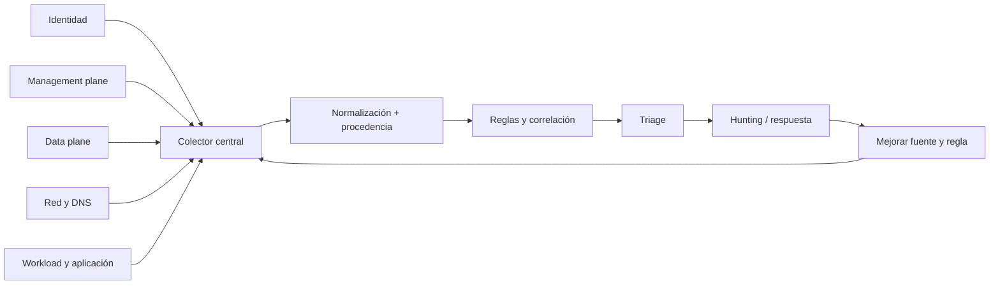

# Clase 234 — Logging y detección en la nube

> Parte: **10 — Seguridad en la nube y contenedores** · Fuente: *AWS CloudTrail / Azure Monitor / Google Cloud Logging docs y MITRE ATT&CK for Cloud*
> ⏱️ Duración estimada: **120 min** · Nivel: **Intermedio**

---

## 🎯 Objetivo

Construir la capa de visibilidad que hace posible detectar y, más tarde, responder a incidentes en la
nube. El alumno aprenderá qué logs existen (plano de gestión, red, datos), cómo centralizarlos de
forma inmutable, y cómo escribir detecciones basadas en amenazas reales mapeadas a MITRE ATT&CK for
Cloud (creación anómala de claves, deshabilitar logging, exfiltración, etc.).

## 📚 Resultados de aprendizaje

Al finalizar, el alumno podrá:

1. **Identificar** las fuentes de log clave en cada nube y qué registran.
2. **Centralizar** logs de forma inmutable y con retención adecuada.
3. **Escribir** reglas de detección para técnicas de MITRE ATT&CK for Cloud.
4. **Integrar** los logs con un SIEM (Sentinel, Security Lake, Chronicle).
5. **Evitar** puntos ciegos (logging deshabilitado, regiones sin cobertura).

## 🗺️ Temas

| # | Tema | Por qué importa |
|---|------|-----------------|
| 1 | Tipos de log: gestión, red, datos | Cada uno cubre una capa distinta |
| 2 | CloudTrail / Activity Log / Cloud Audit Logs | El "quién hizo qué" de la API |
| 3 | Flow logs y logs de DNS | Movimiento lateral y C2 |
| 4 | Centralización y protección de retención | Reducir manipulación y pérdida dentro del dominio comprometido |
| 5 | Detecciones y reglas | Convertir logs en alertas útiles |
| 6 | SIEM en la nube | Correlación y respuesta |
| 7 | Puntos ciegos comunes | Logging desactivado o incompleto |

## 🧠 Explicación en profundidad

Una estrategia de logging parte de preguntas: quién cambió configuración, quién accedió a datos, qué identidad obtuvo sesión, qué cargas se comunicaron y qué ocurrió dentro de la aplicación. Cada pregunta requiere una fuente con generación, cobertura, latencia, retención, integridad y costo conocidos.



El diagrama evita diseñar desde la herramienta SIEM. Primero se seleccionan fuentes y se conserva procedencia; luego se normaliza y detecta. Si el log de data plane no estaba habilitado, una regla perfecta no recupera el evento. Si el principal controla la misma cuenta de logging, centralizar sin separación puede no mejorar resiliencia.

### Semántica por proveedor

CloudTrail, Azure Activity Log y Cloud Audit Logs registran planos y categorías diferentes. Activity Log se centra en control plane de recursos; Entra aporta identidad; resource logs deben habilitarse. En Google, Admin Activity y System Event tienen tratamiento distinto de Data Access. En AWS, management y data events se configuran según trail o event data store. «Quién hizo qué» requiere interpretar principal, sesión asumida, recurso, región y campos proporcionados por cliente.

Flow logs resumen tráfico observado en interfaces o redes y pueden omitir contenido, paquetes o campos según configuración. DNS logs muestran consultas en puntos concretos. Ninguno identifica automáticamente proceso o usuario; se correlaciona con endpoint, identidad y topología.

### Protección, tiempo y costo

El destino usa cuenta/proyecto/suscripción de logging separada, acceso mínimo, retención y mecanismos de bloqueo disponibles. Inmutabilidad es una propiedad configurada con duración y autoridad; no una etiqueta genérica. Se documentan retrasos, zona temporal, duplicados y pérdida. Los data events pueden ser costosos, por lo que se seleccionan recursos críticos y se mide volumen antes de recortar cobertura.

### De evento a detección

Una regla contiene hipótesis, fuentes requeridas, lógica, severidad, entidades, excepciones, respuesta y prueba. Crear access keys, deshabilitar logging o cambiar una policy pueden ser administración legítima. La detección gana precisión al añadir identidad privilegiada, horario, dispositivo, cuenta, secuencia y rareza, sin convertir rareza en malicia.

## 📖 Definiciones y características

- **Log del plano de gestión:** registra actividades administrativas cubiertas por el proveedor. *Clave:* es esencial para cambios API, pero se complementa con identidad, datos, red y carga.
- **Flow logs:** metadatos de conexiones de red. *Clave:* detectan movimiento lateral y exfiltración.
- **Data events:** acceso a datos (p. ej. GetObject de S3). *Clave:* costosos pero clave para detectar exfiltración de datos.
- **Log protegido por retención:** almacenamiento con controles de escritura, borrado y tiempo. *Clave:* su resistencia depende de configuración, autoridad y separación del dominio comprometido.
- **Detección:** regla que convierte patrones de log en alerta. *Clave:* debe mapearse a técnicas de ATT&CK.
- **SIEM:** plataforma de correlación y alerta (Sentinel, Security Lake+OpenSearch, Chronicle). *Clave:* une múltiples fuentes.
- **Punto ciego:** actividad no observable por generación, cobertura, retención o acceso. *Clave:* se registra como limitación y se prioriza según riesgo.

## 🔍 Caso razonado — creación legítima o persistencia IAM

Una regla alerta por `CreateAccessKey`. El evento pertenece a un administrador durante una ventana aprobada, pero la clave fue creada para otro usuario y se usó minutos después desde una región no habitual. La detección no se cierra solo por la ventana: correlaciona ticket, principal creador, identidad destino, primera utilización y cambios posteriores.

La prueba sintética crea una clave de laboratorio, confirma alerta, entidades y latencia, y la revoca. También ejecuta un caso autorizado esperado para comprobar que la excepción no oculta usos fuera de cuenta, horario o principal definidos.

## ✅ Criterio de dominio

Dominas la clase cuando construyes una matriz pregunta–fuente–cobertura–retención–costo, diferencias planos por proveedor, diseñas almacenamiento fuera del dominio de ataque y pruebas una detección con evento positivo, benigno y datos faltantes.

## 🧰 Herramientas y preparación

- Logging del proveedor activado: **CloudTrail** (multi-región), **VPC Flow Logs**, **Azure Monitor/Activity Log**, **Google Cloud Audit Logs**.
- Un destino centralizado (bucket dedicado + SIEM); **Sigma** para escribir reglas portables.
- Opcional: **Athena**/**Log Analytics**/**BigQuery** para consultar logs.

```bash
# Buscar en CloudTrail eventos de creación de claves de acceso IAM
aws cloudtrail lookup-events \
  --lookup-attributes AttributeKey=EventName,AttributeValue=CreateAccessKey
# Consultar Google Cloud Audit Logs por acciones de un principal
gcloud logging read 'protoPayload.authenticationInfo.principalEmail="user@dom.com"' --limit 20
```

## 🧪 Laboratorio guiado

1. Verifica que el logging del plano de gestión está activo **multi-región** y que su bucket/almacén es inmutable (object lock / retención).
2. Genera actividad en tu cuenta de laboratorio (crea una clave de acceso, abre un security group, sube un objeto) para producir eventos.
3. Escribe consultas para detectar: (a) creación de claves de acceso IAM, (b) intento de **deshabilitar CloudTrail/logging**, (c) `PutBucketPolicy` que abre un bucket.
4. Traduce esas detecciones a **reglas Sigma** y mapéalas a técnicas de MITRE ATT&CK for Cloud (Defense Evasion: *Impair Defenses*; Persistence: *Create Account/Access Key*).
5. Integra los logs en un SIEM (Sentinel/Security Lake/Chronicle) y crea una alerta que dispare al deshabilitar el logging.
6. Simula un **punto ciego**: crea un recurso en una región sin logging y comprueba que no aparece; corrige activando cobertura global.
7. Documenta la latencia entre la acción y la alerta, y ajusta la retención según requisitos de cumplimiento.

## ✍️ Ejercicios

1. Escribe una regla que alerte cuando se deshabilita el logging del plano de gestión.
2. Detecta un pico anómalo de `GetObject` (posible exfiltración) usando data events.
3. Crea una regla Sigma para el uso de credenciales desde una geolocalización inusual.
4. Diseña un esquema de centralización de logs multi-cuenta inmutable.
5. Consulta Flow Logs para identificar una conexión saliente sospechosa.
6. Define la política de retención de logs para un requisito de 1 año.

## 📝 Reto verificable

Configura la capa de visibilidad de una cuenta de laboratorio y demuestra una detección de extremo a
extremo: una acción maliciosa simulada genera un evento que dispara una alerta en el SIEM.

**Criterio de aceptación:** el logging del plano de gestión está activo multi-región y en almacén
inmutable; al ejecutar la acción simulada (p. ej. crear una clave de acceso o intentar deshabilitar el
logging) se genera una alerta trazable en el SIEM, con la técnica ATT&CK asociada documentada.

## ⚠️ Errores comunes

| Síntoma / mensaje | Causa y cómo arreglar |
|-------------------|-----------------------|
| No hay logs de una región | CloudTrail no multi-región; actívalo globalmente. |
| Atacante borró los logs | Bucket sin inmutabilidad; aplica object lock y cuenta de logging separada. |
| Alertas por todo (ruido) | Reglas sin afinar; ajusta umbrales y usa listas de excepción justificadas. |
| No se registran accesos a datos | Data events desactivados por coste; actívalos en buckets críticos. |
| Alertas llegan tarde | Latencia de entrega/consulta; usa entrega casi en tiempo real y consultas eficientes. |

## ❓ Preguntas frecuentes

**❓ ¿Qué log activo primero si solo puedo activar uno?**
El del plano de gestión (CloudTrail / Activity Log / Cloud Audit Logs). Registra el "quién hizo qué" a nivel de API y es la fuente más valiosa tanto para detección como para forense.

**❓ ¿Por qué guardar los logs en una cuenta separada e inmutable?**
Porque un atacante con acceso a la cuenta intentará borrar los rastros. Enviar los logs a una cuenta de logging aparte, append-only y con retención, preserva la evidencia aunque la cuenta original se comprometa.

**❓ ¿Los data events valen la pena si cuestan más?**
En recursos críticos suelen ser necesarios para observar operaciones por objeto, pero se complementan con identidad, red, aplicación y destino. Actívalos selectivamente según riesgo, volumen, costo y requisitos de investigación.

## 🔗 Referencias verificables y alcance

- AWS CloudTrail. <https://docs.aws.amazon.com/awscloudtrail/latest/userguide/> — categorías, trails y event data stores oficiales.
- Azure Activity Log. <https://learn.microsoft.com/en-us/azure/azure-monitor/platform/activity-log> — alcance oficial del control plane y exportación.
- Google Cloud Audit Logs. <https://docs.cloud.google.com/logging/docs/audit/understanding-audit-logs> — categorías, identidades y configuración oficial.
- MITRE ATT&CK Cloud Matrix. <https://attack.mitre.org/matrices/enterprise/cloud/> — cobertura conductual para hipótesis; no reemplaza semántica del proveedor.
- Sigma. <https://github.com/SigmaHQ/sigma> — formato abierto para lógica portable; cada backend y fuente requiere validación.

## 📥 Material descargable

- 📄 [Guía en PDF](./clase-234-guia.pdf) — versión imprimible de esta clase.
- 🎞️ [Presentación (PPTX)](./clase-234-presentacion.pptx) — deck para proyectar en clase.

## ⬅️ Clase anterior

[Clase 233 — Gestión de secretos en la nube](../233-gestion-de-secretos-en-la-nube/README.md)

## ➡️ Siguiente clase

[Clase 235 — Respuesta a incidentes en la nube](../235-respuesta-a-incidentes-en-la-nube/README.md)
