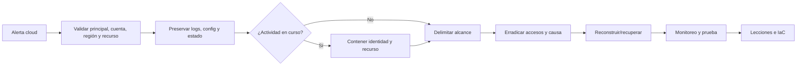

# Clase 235 — Respuesta a incidentes en la nube

> Parte: **10 — Seguridad en la nube y contenedores** · Fuente: *NIST SP 800-61 Computer Security Incident Handling Guide y AWS Security Incident Response Guide*
> ⏱️ Duración estimada: **130 min** · Nivel: **Avanzado**

---

## 🎯 Objetivo

Aplicar el ciclo de respuesta a incidentes (NIST SP 800-61) al contexto de la nube, donde la
elasticidad, las APIs y la efimeridad cambian la práctica: contención por IAM y aislamiento de red,
adquisición de evidencia mediante snapshots, y erradicación/recuperación aprovechando IaC. El alumno
ejecutará un playbook completo sobre una credencial comprometida y una instancia comprometida.

## 📚 Resultados de aprendizaje

Al finalizar, el alumno podrá:

1. **Aplicar** las fases de NIST (preparación, detección/análisis, contención, erradicación, recuperación, lecciones) a la nube.
2. **Contener** una credencial comprometida y una instancia comprometida sin destruir evidencia.
3. **Adquirir** evidencia con snapshots, aislamiento y volcado de metadatos/logs.
4. **Erradicar y recuperar** usando IaC para reconstruir de forma limpia.
5. **Documentar** un playbook reutilizable y las lecciones aprendidas.

## 🗺️ Temas

| # | Tema | Por qué importa |
|---|------|-----------------|
| 1 | NIST SP 800-61 Rev. 3 aplicado a la nube | Integrar respuesta con gestión de riesgo y operación cloud |
| 2 | Preparación: roles, permisos, runbooks | La respuesta se gana antes del incidente |
| 3 | Contención de identidad | Revocar/rotar credenciales y sesiones |
| 4 | Aislamiento de recursos | Cuarentena sin apagar la evidencia |
| 5 | Adquisición de evidencia | Snapshots, memoria, logs preservados |
| 6 | Erradicación y recuperación con IaC | Reconstruir limpio y reproducible |
| 7 | Post-incidente y lecciones | Cerrar el ciclo y mejorar |

## 🧠 Explicación en profundidad

La respuesta cloud investiga un sistema que cambia mediante API y donde identidad puede tener más continuidad que una instancia. Preparación crea roles de emergencia, destinos de evidencia separados, logging por organización, inventario, contactos del proveedor y automatización ensayada. Durante el incidente, cada acción operativa se registra porque también genera evidencia y puede alterar el alcance.



El diagrama no apaga una instancia de inmediato. Primero identifica qué evidencia es volátil y qué daño continúa. Si hay cifrado o exfiltración activos, contener puede preceder a una adquisición extensa. Si la instancia tiene memoria única y el riesgo está controlado, se preserva antes. La bitácora explica la decisión con información disponible.

### Contener identidad y recursos como problemas separados

Deshabilitar una access key no revoca necesariamente sesiones ya emitidas, roles asumidos, tokens de federación, aplicaciones OAuth u otras credenciales creadas. Se reconstruye la cadena de identidad y se ordena revocación/rotación para que el atacante no capture reemplazos. También se preservan policies y trust relationships antes de corregirlas.

Aislar una VM mediante SG de cuarentena reduce red, pero puede no detener acciones por instance role hacia APIs, tráfico por rutas no consideradas o servicios administrados. La cuarentena se prueba en ambas direcciones y se controla el acceso del equipo forense.

### Evidencia cloud y consistencia

Snapshots son copias administradas del volumen, no imágenes físicas ni memoria. Se conservan identificador, cuenta, región, hora, tags, comando/API, request ID, permisos y hash de exportaciones cuando existe. Para contenedores y serverless se preservan manifiestos, digest, logs, variables, identidad, eventos y plano de orquestación antes de que el ciclo de vida reemplace la carga.

Los logs pueden tener latencia, categorías deshabilitadas o vivir en otra cuenta. Se exportan respuestas originales con paginación y consultas. NISTIR 8006 ayuda a describir desafíos de acceso y dependencia del proveedor; no entrega un procedimiento único para AWS, Azure o Google.

### Erradicar, recuperar y demostrar

Erradicación incluye claves, sesiones, roles, trust policies, reglas, funciones, imágenes, pipeline y vector inicial. Recuperar con IaC reduce improvisación solo si el código, módulos, state, credenciales e imagen base fueron corregidos y revisados. Un `apply` reproducible puede reproducir también la vulnerabilidad.

La validación comprueba acceso denegado para credenciales antiguas, servicio saludable, logging activo, detecciones nuevas y ausencia de comportamientos conocidos durante una ventana justificada. El informe declara puntos ciegos y riesgo residual.

## 📖 Definiciones y características

- **Playbook/runbook:** procedimiento paso a paso para un tipo de incidente. *Clave:* reduce el tiempo de respuesta y errores bajo presión.
- **Contención:** limitar el alcance del incidente. *Clave:* en la nube suele empezar por IAM (revocar sesiones, deshabilitar claves).
- **Aislamiento (cuarentena):** apartar un recurso sin destruirlo. *Clave:* cambia security group a "sin tráfico" en vez de apagar, para conservar memoria.
- **Snapshot de investigación:** copia puntual administrada por el proveedor. *Clave:* preserva el estado accesible del volumen, con consistencia y mutabilidad dependientes del servicio y controles.
- **Rotación de credenciales:** invalidar y reemplazar secretos comprometidos. *Clave:* corta el acceso del atacante.
- **Erradicación:** eliminar accesos, persistencia y condiciones explotadas dentro del alcance conocido. *Clave:* abarca identidad, recursos, automatización y dependencias.
- **Recuperación con IaC:** reconstruir desde código revisado y state controlado. *Clave:* mejora trazabilidad, pero necesita validación de código, módulos, imágenes, secretos y estado efectivo.

## 🔍 Caso razonado — clave AWS rotada, sesión aún activa

CloudTrail alerta por enumeración de secretos con una access key filtrada. El equipo desactiva la clave, pero descubre eventos posteriores de una sesión de rol que esa identidad asumió antes. Preserva eventos, políticas y trust policy; aplica una denegación temporal autorizada al principal/sesiones según mecanismo disponible y busca recursos creados en todas las regiones relevantes.

Una instancia usada para persistencia se pone en SG de cuarentena, se crea snapshot y se conserva su configuración. La recuperación despliega desde Terraform corregido con un rol nuevo y data events habilitados. La prueba confirma que la clave y sesión antiguas fallan, el servicio funciona y una simulación benigna activa la nueva detección.

## ✅ Criterio de dominio

Dominas la clase cuando coordinas contención de identidad y recurso, preservas evidencia con límites del proveedor, amplías erradicación a IaC y automatización, y cierras mediante pruebas de credenciales antiguas, servicio, logging y riesgo residual documentado.

## 🧰 Herramientas y preparación

- Cuenta de laboratorio con logging ya configurado (clase 234) y CLIs del proveedor.
- Herramientas de forense cloud como **AWS IR** playbooks, snapshots de EBS/discos y **Cloud Custodian** para automatizar contención.
- Un repositorio Terraform (clase 230) para reconstrucción.

```bash
# Contención de credencial: deshabilitar una clave de acceso comprometida (AWS)
aws iam update-access-key --access-key-id AKIA... --status Inactive
# Adquisición: crear un snapshot forense del volumen de una instancia comprometida
aws ec2 create-snapshot --volume-id vol-0abc --description "IR-forense-caso-42"
```

## 🧪 Laboratorio guiado

> Ejecuta el playbook en tu **cuenta de laboratorio**, sobre recursos que controlas.

1. **Preparación:** define un rol de "responder" con permisos mínimos para aislar y adquirir; crea el runbook y una cuenta/bucket de evidencia.
2. **Detección/análisis:** parte de una alerta de la clase 234 (p. ej. creación anómala de clave de acceso). Reconstruye el "quién/qué/cuándo" con los logs del plano de gestión.
3. **Contención de identidad:** deshabilita la clave comprometida, revoca las sesiones activas (invalidar tokens) y aplica una policy de deny explícito al principal afectado. **No lo borres aún** (evidencia).
4. **Aislamiento del recurso:** para una instancia comprometida, cambia su security group a uno sin reglas (cuarentena) en lugar de apagarla, para preservar la memoria y las conexiones.
5. **Adquisición:** crea un **snapshot** del volumen, exporta los logs relevantes y guarda metadatos (etiquetas, IAM, red) en el bucket de evidencia inmutable.
6. **Erradicación:** identifica y elimina persistencia (usuarios/roles nuevos, claves, reglas, funciones backdoor). Verifica con los logs que no queda actividad del atacante.
7. **Recuperación:** reconstruye desde Terraform revisado, valida estado efectivo y rota o revoca credenciales cuya exposición esté respaldada por el alcance y las dependencias.
8. **Post-incidente:** redacta el informe y las lecciones aprendidas; convierte los hallazgos en detecciones nuevas y en mejoras del hardening.

## ✍️ Ejercicios

1. Escribe el runbook de "credencial IAM comprometida" con pasos y comandos.
2. Diseña el procedimiento de cuarentena de una instancia sin destruir evidencia.
3. Automatiza con Cloud Custodian el aislamiento de un recurso etiquetado como comprometido.
4. Redacta el procedimiento de adquisición de snapshots y cadena de custodia.
5. Reconstruye un recurso desde IaC y verifica el estado limpio.
6. Convierte una lección aprendida en una regla de detección nueva.

## 📝 Reto verificable

Ejecuta un playbook completo end-to-end para una credencial comprometida que lanzó una instancia
maliciosa: detección, contención, aislamiento, adquisición, erradicación y recuperación con IaC.

**Criterio de aceptación:** al final, la clave comprometida está deshabilitada y sus sesiones
revocadas, existe un snapshot forense y evidencia preservada en almacén inmutable, no queda
persistencia del atacante (verificado en logs), y el recurso afectado está reconstruido desde
Terraform con secretos rotados. Todo queda documentado en un informe con línea de tiempo.

## ⚠️ Errores comunes

| Síntoma / mensaje | Causa y cómo arreglar |
|-------------------|-----------------------|
| Se apagó la instancia y se perdió la memoria | Contención destructiva prematura; aísla por red antes de apagar. |
| El atacante volvió tras rotar una clave | Quedó persistencia (otro usuario/rol/función); erradica antes de recuperar. |
| Evidencia sin trazabilidad suficiente | Faltan exportación original, identificadores, permisos o bitácora. Preserva respuestas, snapshots y cadena de custodia según el contexto. |
| Rotación incompleta de credenciales | Solo se trató la credencial inicial. Reconstruye sesiones, roles y secretos accesibles y documenta el alcance usado para rotar o revocar. |
| Reconstrucción trae de vuelta el problema | Se reconstruyó desde IaC vulnerable; corrige el código antes de aplicar. |

## ❓ Preguntas frecuentes

**❓ ¿Por qué aislar por red en vez de apagar una instancia comprometida?**
Apagarla destruye la memoria volátil y las conexiones activas, evidencia valiosa. Aislarla (security group sin tráfico) la neutraliza conservando el estado para el análisis forense.

**❓ ¿Qué se contiene primero en la nube, la identidad o el recurso?**
Normalmente la identidad: deshabilitar la credencial comprometida y revocar sesiones corta el acceso del atacante de inmediato, incluso a recursos que aún no sabes que tocó. Luego se aísla el recurso concreto.

**❓ ¿Por qué reconstruir con IaC en lugar de "limpiar" el recurso?**
Porque una limpieza manual puede dejar condiciones desconocidas. Reconstruir desde código e imágenes revisados reduce incertidumbre y mejora reproducibilidad, pero no garantiza limpieza si IaC, módulos, state, secretos o datos conservan la causa.

## 🔗 Referencias verificables y alcance

- NIST SP 800-61 Rev. 3. <https://doi.org/10.6028/NIST.SP.800-61r3> — marco vigente de respuesta integrado con CSF 2.0; reemplaza Rev. 2.
- NISTIR 8006. <https://doi.org/10.6028/NIST.IR.8006> — desafíos forenses propios de servicios cloud y dependencia del proveedor.
- AWS Security Incident Response Guide. <https://docs.aws.amazon.com/security-ir/latest/userguide/welcome.html> — procedimientos y capacidades oficiales AWS; adaptar a arquitectura y permisos.
- Microsoft Incident Response. <https://learn.microsoft.com/security/operations/incident-response-overview> — orientación oficial Microsoft para preparación y operación.
- MITRE ATT&CK Cloud Matrix. <https://attack.mitre.org/matrices/enterprise/cloud/> — vocabulario para alcance y hunting, no procedimiento de contención.
- Cloud Custodian. <https://cloudcustodian.io/> — automatización policy-as-code; toda remediación debe probarse y autorizarse.

## 📥 Material descargable

- 📄 [Guía en PDF](./clase-235-guia.pdf) — versión imprimible de esta clase.
- 🎞️ [Presentación (PPTX)](./clase-235-presentacion.pptx) — deck para proyectar en clase.

## ⬅️ Clase anterior

[Clase 234 — Logging y detección en la nube](../234-logging-y-deteccion-en-la-nube/README.md)

## ➡️ Siguiente clase

[Clase 236 — Secure SDLC y filosofía shift-left](../../parte-11-devsecops-y-seguridad-del-sdlc/236-secure-sdlc-y-filosofia-shift-left/README.md)
