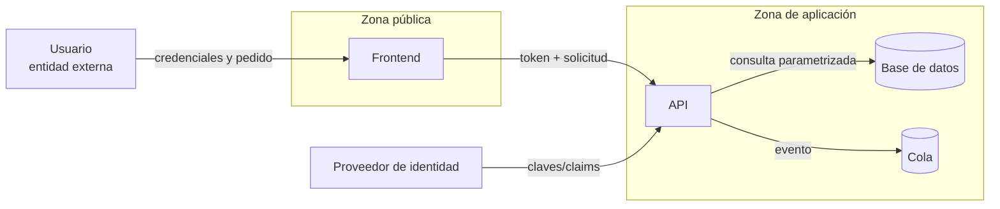

# Clase 237 — Modelado de amenazas: STRIDE y DREAD

> Parte: **11 — DevSecOps y seguridad del SDLC** · Fuente: *Threat Modeling: Designing for Security* (Adam Shostack) y OWASP Threat Modeling Cheat Sheet
> ⏱️ Duración estimada: **120 min** · Nivel: **Intermedio**

---

## 🎯 Objetivo

Aprender a modelar amenazas de forma sistemática antes de escribir código: descomponer un
sistema en un diagrama de flujo de datos (DFD), identificar amenazas con STRIDE, priorizarlas
con un método de riesgo (DREAD u otro), y traducirlas en requisitos y controles concretos.
El modelado de amenazas es la práctica shift-left de mayor retorno: previene defectos de
diseño que ninguna herramienta automática detecta.

## 📚 Resultados de aprendizaje

Al finalizar, el alumno podrá:

1. **Construir** un diagrama de flujo de datos (DFD) con límites de confianza (trust boundaries).
2. **Aplicar** STRIDE a cada elemento del DFD para enumerar amenazas.
3. **Priorizar** amenazas con DREAD y reconocer sus limitaciones frente a alternativas (CVSS, ábaco de riesgo).
4. **Derivar** contramedidas y requisitos de seguridad a partir de las amenazas.
5. **Documentar** el modelo de forma reutilizable y versionable junto al código.

## 🗺️ Temas

| # | Tema | Por qué importa |
|---|------|-----------------|
| 1 | Las 4 preguntas de Shostack | Marco simple: qué construimos, qué puede salir mal, qué hacemos, revisamos |
| 2 | Diagramas de flujo de datos (DFD) | Modelo visual sobre el que razonar amenazas |
| 3 | Trust boundaries | Donde cambia el nivel de confianza es donde acechan las amenazas |
| 4 | STRIDE | Taxonomía mnemotécnica de 6 categorías de amenaza |
| 5 | DREAD y sus críticas | Método de scoring subjetivo; conocer sus límites |
| 6 | Threat modeling as code | Versionar el modelo (pytm, Threat Dragon) |
| 7 | De amenaza a contramedida | El objetivo real: requisitos accionables |

## 🧠 Explicación en profundidad

### Modelar es hacer explícitas las hipótesis del diseño

Un modelo de amenazas es una explicación estructurada de **qué se protege, de quién, por dónde podría fallar y qué se hará al respecto**. No intenta predecir todos los ataques ni reemplaza las pruebas. Su valor aparece cuando obliga al equipo a descubrir una frontera de confianza, un flujo de datos o un privilegio que estaba implícito. Por eso se realiza temprano y se actualiza cuando cambian arquitectura, datos, actores o dependencias.

El punto de partida no es STRIDE sino el sistema: activos, objetivos de seguridad, actores, componentes, almacenes, flujos y límites de confianza. En un diagrama de flujo de datos, un límite indica que cambia el nivel de control —por ejemplo, del navegador del usuario a la API o de una cuenta cloud a otra—. Cada cruce exige preguntar cómo se autentica, autoriza, protege, registra y valida la información.



Al leer el diagrama se observa que el token cruza desde una zona menos confiable hacia la API; que la API concentra decisiones de autorización; y que la cola crea un flujo asíncrono con identidad propia. STRIDE funciona entonces como lista de preguntas: suplantación sobre identidades, manipulación sobre datos, repudio sobre evidencia, divulgación sobre confidencialidad, denegación sobre disponibilidad y elevación sobre privilegios. No existe una correspondencia mecánica «una letra, un producto». Una amenaza útil describe precondición, acción, activo afectado e impacto.

### Priorizar sin convertir una cifra en falsa precisión

DREAD popularizó puntuar daño, reproducibilidad, explotabilidad, usuarios afectados y descubribilidad. Puede facilitar una conversación, pero sumar escalas ordinales no convierte el resultado en probabilidad científica; además, «descubribilidad» puede castigar amenazas obvias aunque sean graves. Microsoft dejó de recomendar DREAD como método universal. En esta clase se conserva como ejercicio histórico y se contrasta con una valoración explícita de impacto, exposición, viabilidad y controles existentes. Cuando hay datos, CVSS, EPSS o análisis cuantitativo responden preguntas distintas; ninguno reemplaza el contexto del activo.

Una amenaza se cierra de cuatro maneras documentadas: mitigar, evitar, transferir o aceptar. «Usamos TLS» no cierra una amenaza de suplantación si el atacante puede robar una sesión; «hay logs» no resuelve repudio si el mismo administrador puede alterarlos. La mitigación debe vincularse con un requisito y una prueba verificable.

### Caso razonado: enlace de restablecimiento

El equipo modela un flujo de recuperación de contraseña. Identifica suplantación si el token es predecible, divulgación si aparece en logs o cabeceras de referencia, manipulación si el usuario objetivo se toma del cuerpo de la segunda petición y denegación si no hay límite de solicitudes. Decide generar tokens aleatorios de un solo uso, almacenar solo un verificador, asociarlos a usuario y expiración, filtrar telemetría y limitar solicitudes. Cada decisión produce una prueba negativa. El modelo no «demostró seguridad»: hizo auditables las hipótesis.

## 📔 Glosario operativo

| Término | Definición útil |
|---|---|
| Activo | Información, capacidad o servicio cuyo daño importa al negocio o usuario. |
| Frontera de confianza | Punto donde cambia quién controla o valida una interacción. |
| DFD | Representación de entidades, procesos, almacenes y flujos de datos. |
| Escenario de amenaza | Cadena concreta de precondición, acción, activo e impacto. |
| Mitigación | Cambio que reduce probabilidad o impacto y puede verificarse. |

## ✅ Criterio de dominio

El alumno domina la técnica cuando puede justificar el alcance de un DFD, encontrar amenazas específicas en sus cruces, evitar duplicados vagos, priorizar sin falsa precisión y convertir cada tratamiento en requisito, propietario y prueba.

## 📖 Definiciones y características

- **Modelo de amenazas**: representación estructurada de qué puede atacar a un sistema y cómo mitigarlo. *Característica*: se hace en fase de diseño, es barato y preventivo.
- **DFD**: diagrama con procesos, almacenes de datos, flujos y entidades externas. *Característica*: los cruces de trust boundary son los puntos calientes.
- **STRIDE**: Spoofing, Tampering, Repudiation, Information disclosure, Denial of service, Elevation of privilege. *Característica*: cada categoría se opone a una propiedad de seguridad (autenticación, integridad, no repudio, confidencialidad, disponibilidad, autorización).
- **DREAD**: Damage, Reproducibility, Exploitability, Affected users, Discoverability. *Característica*: scoring 1–10 por eje; útil pero subjetivo, Microsoft lo abandonó por inconsistencia.
- **Trust boundary**: frontera donde datos o control pasan entre niveles de confianza distintos. *Característica*: internet↔DMZ, usuario↔proceso, contenedor↔host.
- **Contramedida (mitigación)**: control que reduce la probabilidad o el impacto de una amenaza. *Característica*: se traduce en requisito verificable.

## 🧰 Herramientas y preparación

- **OWASP Threat Dragon** (app de escritorio/web) para dibujar DFD y anotar amenazas STRIDE.
- **pytm** (Python) para modelar amenazas como código y generar el DFD e informe.
- **Microsoft Threat Modeling Tool** (Windows) como alternativa gráfica.
- Plantilla de tabla de amenazas (elemento | STRIDE | descripción | riesgo | mitigación).

Instalación de pytm:

```bash
pip install pytm
# Requiere Graphviz para renderizar el DFD:
#   Debian/Ubuntu: sudo apt install graphviz
#   macOS: brew install graphviz
```

## 🧪 Laboratorio guiado

Modelaremos una app web de ejemplo: navegador → API → base de datos, con login.

1. **Define el alcance**. Sistema: API REST de una tienda con autenticación por JWT, base de datos PostgreSQL y un servicio de pagos externo.
2. **Dibuja el DFD**. Entidades externas (usuario, pasarela de pago), procesos (API, servicio de auth), almacén (DB), flujos entre ellos. Marca trust boundaries: internet↔API, API↔DB, API↔pasarela.
3. **Aplica STRIDE por elemento**. Para el flujo "usuario → API login": Spoofing (¿se puede suplantar al usuario?), Tampering (¿se puede alterar el request?), etc. Rellena la tabla.
4. **Modela como código con pytm**. Ejemplo mínimo:

```python
from pytm import TM, Server, Datastore, Dataflow, Boundary, Actor

tm = TM("Tienda API")
inet = Boundary("Internet")
dmz = Boundary("DMZ")

user = Actor("Usuario"); user.inBoundary = inet
api = Server("API REST"); api.inBoundary = dmz
db = Datastore("PostgreSQL"); db.inBoundary = dmz

login = Dataflow(user, api, "POST /login (credenciales)")
login.protocol = "HTTPS"; login.isEncrypted = True
query = Dataflow(api, db, "SELECT usuario")

tm.process()   # genera hallazgos STRIDE automáticos
```

Ejecuta `python tm.py --report` y `--dfd | dot -Tpng -o dfd.png`.
5. **Prioriza**. Para las 5 amenazas más relevantes, documenta impacto, exposición, viabilidad y controles existentes. Calcula DREAD en paralelo solo para observar cuánto cambia al variar los supuestos.
6. **Deriva contramedidas**. Para cada amenaza top, escribe un requisito verificable (p. ej. "todo flujo de login usa TLS 1.2+ y rate-limiting de 5 intentos/min").
7. **Versiona el modelo**. Guarda `tm.py` y `dfd.png` en el repo junto al código; el modelo evoluciona con el sistema.

> Nota ética: el modelado de amenazas es una actividad defensiva de diseño. No requiere atacar sistemas; se practica sobre tus propios diseños.

## ✍️ Ejercicios

1. Dibuja el DFD de un formulario de contacto con almacenamiento en base de datos.
2. Aplica STRIDE al flujo "API → servicio de pagos externo" y lista 6 amenazas.
3. Puntúa dos amenazas con DREAD y argumenta por qué el scoring es discutible.
4. Convierte tres amenazas en requisitos de seguridad verificables.
5. Modela con pytm un sistema con dos trust boundaries y genera el informe.
6. Propón una alternativa a DREAD y justifica cuándo la usarías.

## 📝 Reto verificable

Entrega un modelo de amenazas completo de un sistema con al menos dos trust boundaries.

**Criterio de aceptación**: incluye (a) un DFD con procesos, almacenes, flujos y límites de
confianza; (b) una tabla STRIDE con mínimo 8 amenazas categorizadas; (c) priorización
justificada de al menos 5; y (d) una contramedida/requisito verificable por cada amenaza
priorizada. El modelo debe ser versionable (Threat Dragon JSON o pytm).

## ⚠️ Errores comunes

| Síntoma / mensaje | Causa y cómo arreglar |
|-------------------|-----------------------|
| El DFD tiene 200 elementos y nadie lo entiende | Nivel de detalle excesivo. Modela al nivel de arquitectura, no de función. |
| Se listan amenazas pero no mitigaciones | El modelo no aporta valor sin contramedidas accionables. Cierra el ciclo. |
| DREAD da puntuaciones incoherentes entre personas | Sus escalas dependen del juicio. Conserva los supuestos y prioriza mediante impacto, exposición, viabilidad y controles; CVSS responde a vulnerabilidades, no a todo escenario de amenaza. |
| El modelo se hace una vez y se olvida | Debe vivir con el código. Revísalo en cada cambio de arquitectura. |
| Se ignora la categoría Repudiation | Falta pensar en logging/no repudio. Añade trazabilidad como requisito. |

## ❓ Preguntas frecuentes

**❓ ¿Cuándo hago threat modeling: al inicio o continuamente?**
Al inicio del diseño y luego incrementalmente en cada cambio arquitectónico significativo. Es un documento vivo, no un entregable único.

**❓ ¿STRIDE cubre todas las amenazas posibles?**
No, pero da una cobertura sistemática de las categorías más comunes. Complementa con árboles de ataque o MITRE ATT&CK para escenarios específicos.

**❓ ¿Vale la pena DREAD si Microsoft lo abandonó?**
Sirve para observar los problemas de un puntaje subjetivo. En un modelo real conviene documentar impacto, exposición, viabilidad y controles con escalas calibradas para la organización. CVSS puede aportar contexto cuando el escenario depende de una vulnerabilidad concreta, pero no sustituye la valoración del escenario.

**❓ ¿Puedo automatizar el modelado de amenazas?**
Parcialmente. Herramientas como pytm generan amenazas candidatas a partir del modelo, pero el juicio experto sobre contexto y priorización sigue siendo humano.

## 🔗 Referencias

- Adam Shostack, *Threat Modeling: Designing for Security*, Wiley 2014.
- OWASP Threat Modeling Cheat Sheet — <https://cheatsheetseries.owasp.org/cheatsheets/Threat_Modeling_Cheat_Sheet.html>
- OWASP Threat Dragon — <https://owasp.org/www-project-threat-dragon/>
- pytm — <https://github.com/OWASP/pytm>
- Microsoft STRIDE — <https://learn.microsoft.com/en-us/azure/security/develop/threat-modeling-tool-threats>

## 📥 Material descargable

- 📄 [Guía en PDF](./clase-237-guia.pdf) — versión imprimible de esta clase.
- 🎞️ [Presentación (PPTX)](./clase-237-presentacion.pptx) — deck para proyectar en clase.

## ⬅️ Clase anterior

[Clase 236 — Secure SDLC y filosofía shift-left](../236-secure-sdlc-y-filosofia-shift-left/README.md)

## ➡️ Siguiente clase

[Clase 238 — SAST: análisis estático de código](../238-sast-analisis-estatico-de-codigo/README.md)
