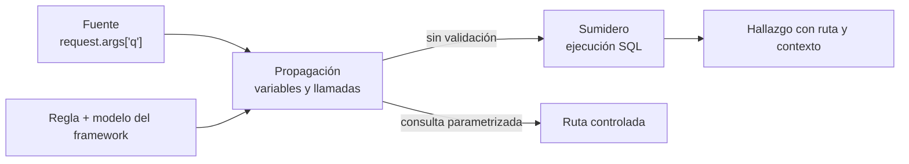

# Clase 238 — SAST: análisis estático de código

> Parte: **11 — DevSecOps y seguridad del SDLC** · Fuente: *Securing DevOps* (Julien Vehent) y OWASP Source Code Analysis Tools
> ⏱️ Duración estimada: **120 min** · Nivel: **Intermedio**

---

## 🎯 Objetivo

Dominar el análisis estático de seguridad (SAST): analizar el código fuente sin ejecutarlo
para encontrar vulnerabilidades (inyección, XSS, secretos, uso inseguro de criptografía),
integrarlo en el pipeline, y —lo más importante— gestionar sus falsos positivos para que el
equipo lo adopte en vez de ignorarlo. Usaremos **Semgrep** como herramienta principal por su
velocidad, reglas legibles y facilidad de personalización.

## 📚 Resultados de aprendizaje

Al finalizar, el alumno podrá:

1. **Explicar** cómo funciona el SAST (AST, data-flow, taint analysis) y sus límites.
2. **Ejecutar** Semgrep con rulesets de la comunidad sobre un repositorio.
3. **Escribir** una regla Semgrep personalizada para un patrón inseguro propio.
4. **Integrar** SAST en CI con umbrales de severidad que rompen o avisan.
5. **Triage** de hallazgos: distinguir verdadero positivo, falso positivo y aceptado con justificación.

## 🗺️ Temas

| # | Tema | Por qué importa |
|---|------|-----------------|
| 1 | Qué detecta y qué no el SAST | Fija expectativas: ve el código, no el runtime |
| 2 | AST, data-flow y taint tracking | Base técnica de la detección |
| 3 | Semgrep: sintaxis de reglas | Reglas legibles como el código que analizan |
| 4 | Rulesets y registry | Reutilizar reglas OWASP/CWE de la comunidad |
| 5 | Falsos positivos y falsos negativos | El talón de Aquiles de la adopción |
| 6 | Integración en CI | Dónde y cómo bloquear |
| 7 | Baseline y diff-aware scanning | Escanear solo lo nuevo para no ahogarse en deuda |

## 🧠 Explicación en profundidad

### Qué observa un analizador estático

SAST examina una representación del programa sin necesitar que la aplicación esté atendiendo peticiones. Una regla textual busca patrones locales; un analizador sintáctico entiende el árbol del lenguaje; uno semántico resuelve tipos y llamadas; y un motor de flujo sigue cómo un dato controlado por el usuario puede llegar desde una **fuente** hasta un **sumidero** peligroso sin atravesar un sanitizador válido. Cuanto más contexto necesita el análisis, mayor puede ser su coste y también su capacidad de distinguir usos seguros de peligrosos.



El diagrama muestra por qué buscar la palabra `execute` no basta. El mismo método puede recibir una consulta parametrizada o una cadena concatenada. El motor necesita comprender el flujo y las convenciones del framework; de lo contrario produce falsos positivos o, peor, falsos negativos silenciosos. SAST encuentra especialmente bien familias que dejan huella en el código —inyecciones, criptografía débil, APIs inseguras, secretos—, pero no puede decidir por sí solo si un usuario está autorizado a leer un objeto de negocio o si una configuración desplegada contradice el repositorio.

### Del hallazgo a una decisión de ingeniería

Un resultado útil identifica regla, ubicación, flujo, CWE relacionada, confianza y forma de remediación. La severidad genérica es solo el inicio. El equipo debe preguntar si la ruta se compila y despliega, si la fuente es realmente controlable, qué privilegio alcanza, si existen mitigaciones y si hay una prueba que reproduzca el comportamiento. Marcar «falso positivo» sin razón pierde conocimiento; una supresión responsable tiene alcance mínimo, justificación, responsable y revisión.

En integración continua conviene diferenciar deuda existente de cambios nuevos. Una línea base permite informar lo heredado y bloquear regresiones en el *diff*. Las reglas de alta confianza pueden impedir el merge; las experimentales deben observarse primero. También hay que fijar versiones de reglas: actualizar un *ruleset* puede cambiar cientos de resultados aunque el código no cambie, y esa variación debe tratarse como un cambio de control.

### Diseñar una regla, no coleccionar coincidencias

Para crear una regla se parte de una propiedad: «ninguna entrada HTTP llega a `subprocess` con `shell=True`». Después se construyen casos positivos y negativos, se contempla propagación entre funciones y se valida contra el código real. Una regla estrecha que detecta un patrón importante con alta señal suele producir más valor que cien coincidencias ruidosas. La revisión humana sigue siendo necesaria para lógica de negocio, condiciones de carrera, diseño de autorización y combinaciones que el modelo no representa.

### Caso razonado: SQL que parece vulnerable

Semgrep marca una llamada a `cursor.execute(query, params)`. Al inspeccionar el flujo, `query` es una constante y los datos externos viajan en `params`; el driver realiza parametrización. No se suprime toda la regla: se documenta este sitio como seguro. En otra ruta, un nombre de columna se concatena porque los parámetros no sustituyen identificadores. Allí la solución es una lista permitida de nombres, no «escapar» a ciegas. El caso demuestra que el mismo sumidero exige comprender qué parte de la consulta controla el atacante.

## 📔 Glosario operativo

| Término | Definición útil |
|---|---|
| AST | Árbol que representa la estructura sintáctica del código. |
| Fuente | Origen potencial de datos no confiables. |
| Sumidero | Operación sensible que puede convertir esos datos en impacto. |
| Sanitizador | Transformación válida para un contexto específico; no es universal. |
| Taint analysis | Seguimiento de datos desde fuentes hasta sumideros. |
| Línea base | Conjunto heredado que se gestiona sin permitir nuevos hallazgos equivalentes. |

## ✅ Criterio de dominio

Existe dominio cuando el alumno puede explicar la ruta de un hallazgo, reproducirlo o descartarlo con evidencia, escoger una corrección contextual, escribir pruebas positivas y negativas para una regla y definir un gate que no confunda severidad con certeza.

## 📖 Definiciones y características

- **SAST**: análisis del código sin ejecutarlo. *Característica*: cobertura de todo el código, incluidas rutas no ejecutadas; ciego a configuración y runtime.
- **AST (árbol de sintaxis abstracta)**: representación estructural del código. *Característica*: permite buscar patrones sintácticos con precisión.
- **Taint analysis**: seguimiento de datos no confiables (source) hasta operaciones peligrosas (sink). *Característica*: detecta inyecciones al ver que input llega a un sink sin sanitización.
- **Falso positivo**: hallazgo reportado que no es explotable. *Característica*: erosiona la confianza; hay que triarlo y suprimirlo con justificación.
- **Ruleset**: conjunto de reglas (p. ej. `p/owasp-top-ten`). *Característica*: reutilizable y versionable.
- **Baseline / diff-aware**: escanear solo el código cambiado. *Característica*: evita frenar por deuda histórica; enfoca en lo nuevo.

## 🧰 Herramientas y preparación

- **Semgrep** (open source) — motor principal.
- **Bandit** (Python) y **gosec** (Go) como SAST específicos de lenguaje.
- Un repositorio vulnerable de práctica: **OWASP Juice Shop** o **NodeGoat** o el intencionadamente inseguro **DVWA**.

Instalación:

```bash
pip install semgrep        # o brew install semgrep
semgrep --version
# escaneo rápido con reglas por defecto:
semgrep --config auto ./mi-repo
```

> Nota ética: los repositorios "vulnerables por diseño" (Juice Shop, DVWA) están hechos para practicar. No apliques estas técnicas contra código o sistemas de terceros sin autorización.

## 🧪 Laboratorio guiado

> 🧪 **Laboratorio ejecutable del programa:** [`devsecops-pipeline`](../../../labs/devsecops-pipeline/README.md) — el SAST es allí **una capa de seis**; comprueba qué se le escapa y qué otra capa lo cubre.

1. **Clona un repo vulnerable de práctica** (p. ej. NodeGoat) en tu entorno local.
2. **Escanea con reglas de la comunidad**:

```bash
semgrep --config p/owasp-top-ten --config p/secrets ./NodeGoat --json -o hallazgos.json
semgrep --config p/owasp-top-ten ./NodeGoat   # salida legible en consola
```

3. **Interpreta un hallazgo**. Elige una inyección SQL o un XSS reportado, abre el archivo/línea y confirma si el flujo source→sink es real.
4. **Escribe una regla propia**. Detecta uso de `md5` para contraseñas:

```yaml
rules:
  - id: hash-inseguro-password
    languages: [python]
    severity: ERROR
    message: "MD5/SHA1 no debe usarse para contraseñas; usa bcrypt/argon2."
    patterns:
      - pattern-either:
          - pattern: hashlib.md5(...)
          - pattern: hashlib.sha1(...)
```

Ejecuta `semgrep --config mi-regla.yml ./codigo`.
5. **Configura diff-aware**. En CI, escanea solo el cambio contra la rama base:

```bash
semgrep ci   # detecta automáticamente el diff en PRs
```

6. **Triage**. Clasifica 5 hallazgos como verdadero positivo, falso positivo o riesgo aceptado. Suprime un falso positivo con un comentario `# nosemgrep: <id>` justificado.
7. **Define el gate**. Decide qué severidad rompe el build (p. ej. ERROR bloquea, WARNING avisa) y documenta la política.

## ✍️ Ejercicios

1. Ejecuta Semgrep con dos rulesets distintos y compara los hallazgos.
2. Escribe una regla que detecte `eval()` sobre input de usuario en JavaScript.
3. Identifica un falso positivo real y justifica su supresión.
4. Configura Semgrep para escanear solo el diff de un PR.
5. Compara la cobertura de Bandit vs Semgrep sobre el mismo código Python.
6. Define una política de severidades (qué rompe, qué avisa) y documéntala.

## 📝 Reto verificable

Integra SAST en un repositorio con una regla personalizada y un gate de CI funcional.

**Criterio de aceptación**: (a) Semgrep corre en CI en cada PR en modo diff-aware; (b) existe
al menos una regla personalizada propia que detecta un patrón real; (c) los hallazgos de
severidad ERROR rompen el build y los WARNING solo avisan; (d) hay al menos un falso positivo
triado y suprimido con justificación documentada.

## ⚠️ Errores comunes

| Síntoma / mensaje | Causa y cómo arreglar |
|-------------------|-----------------------|
| El equipo ignora los reportes de SAST | Demasiados falsos positivos. Afina reglas, usa diff-aware y calibra severidades. |
| El escaneo tarda 40 minutos | Analizas todo el monorepo cada vez. Usa `semgrep ci` diff-aware y excluye vendor/. |
| `semgrep` no detecta una inyección obvia | El flujo cruza archivos o frameworks no soportados. Añade una regla con taint o usa una herramienta con más profundidad. |
| Reglas propias no matchean nada | Metavariables o sintaxis del pattern incorrectas. Prueba en semgrep.dev/playground. |
| Se rompe el build por deuda histórica | No usaste baseline. Establece un baseline y bloquea solo lo nuevo. |

## ❓ Preguntas frecuentes

**❓ ¿SAST reemplaza la revisión de código humana?**
No. Automatiza la detección de patrones conocidos, pero el juicio sobre lógica de negocio, autorización y diseño sigue necesitando ojos humanos.

**❓ ¿Por qué Semgrep y no un SAST comercial?**
Semgrep es rápido, sus reglas son legibles y personalizables, y su versión OSS cubre la mayoría de casos. Los comerciales aportan más profundidad interprocedural pero a mayor coste y ruido.

**❓ ¿Cómo evito que SAST frene los despliegues?**
Escanea en modo diff-aware, rompe solo por severidad alta, y trata la deuda histórica con baseline en vez de bloquear todo.

**❓ ¿SAST detecta secretos en el código?**
Parcialmente. Hay reglas de secretos, pero para eso es mejor una herramienta dedicada como gitleaks (clase 241).

## 🔗 Referencias

- Semgrep docs — <https://semgrep.dev/docs/>
- OWASP Source Code Analysis Tools — <https://owasp.org/www-community/Source_Code_Analysis_Tools>
- Bandit (Python) — <https://bandit.readthedocs.io/>
- CWE list — <https://cwe.mitre.org/>
- Julien Vehent, *Securing DevOps*, Manning 2018 (cap. de test de seguridad).

## 📥 Material descargable

- 📄 [Guía en PDF](./clase-238-guia.pdf) — versión imprimible de esta clase.
- 🎞️ [Presentación (PPTX)](./clase-238-presentacion.pptx) — deck para proyectar en clase.

## ⬅️ Clase anterior

[Clase 237 — Modelado de amenazas: STRIDE y DREAD](../237-modelado-de-amenazas-stride-y-dread/README.md)

## ➡️ Siguiente clase

[Clase 239 — DAST: análisis dinámico de aplicaciones](../239-dast-analisis-dinamico-de-aplicaciones/README.md)
