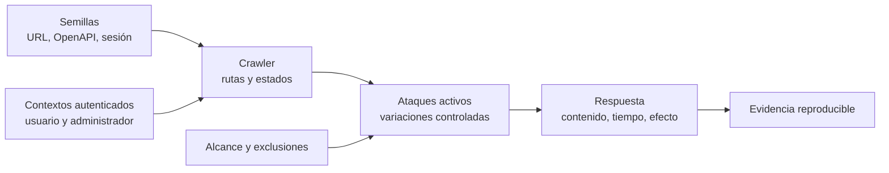

# Clase 239 — DAST: análisis dinámico de aplicaciones

> Parte: **11 — DevSecOps y seguridad del SDLC** · Fuente: *Securing DevOps* (Julien Vehent) y OWASP Web Security Testing Guide (WSTG)
> ⏱️ Duración estimada: **120 min** · Nivel: **Intermedio**

---

## 🎯 Objetivo

Aprender el análisis dinámico de seguridad (DAST): probar la aplicación **en ejecución**, como
lo haría un atacante externo, para encontrar vulnerabilidades que el análisis estático no ve
(errores de configuración, fallos de autenticación en runtime, cabeceras inseguras, inyecciones
observables). Integraremos **OWASP ZAP** en el pipeline con escaneos automatizados y aprenderemos
a diferenciar cuándo usar DAST frente a SAST.

## 📚 Resultados de aprendizaje

Al finalizar, el alumno podrá:

1. **Diferenciar** SAST, DAST e IAST y elegir cuándo aplicar cada uno.
2. **Ejecutar** un escaneo baseline y un escaneo activo con OWASP ZAP.
3. **Automatizar** DAST en CI/CD contra un entorno efímero de staging.
4. **Configurar** autenticación para escanear zonas protegidas de la app.
5. **Interpretar** el informe, filtrar falsos positivos y definir umbrales de fallo.

## 🗺️ Temas

| # | Tema | Por qué importa |
|---|------|-----------------|
| 1 | DAST vs SAST vs IAST | Cada uno ve cosas distintas; son complementarios |
| 2 | ZAP: proxy, spider, active scan | El flujo de trabajo del escaneo dinámico |
| 3 | Passive vs active scanning | Pasivo no ataca; activo envía payloads |
| 4 | Autenticación en el escaneo | Sin login solo se prueba la superficie pública |
| 5 | DAST en CI contra staging | Entorno efímero desplegado para el escaneo |
| 6 | Falsos positivos y tuning | Ajustar reglas y umbrales |
| 7 | Límites del DAST | No ve el código; cobertura depende del crawling |

## 🧠 Explicación en profundidad

### DAST ve el comportamiento expuesto, no el código que lo produjo

Un analizador dinámico interactúa con una aplicación en ejecución como lo haría un cliente: descubre rutas, envía variaciones, observa códigos, cabeceras, cuerpos, tiempos y efectos. Esa perspectiva permite detectar configuraciones y comportamientos que solo existen al desplegar —cabeceras ausentes, cookies débiles, errores detallados, inyecciones alcanzables—, con independencia del lenguaje del backend. Su límite es simétrico: si no alcanza una ruta, un estado o un rol, no puede evaluarlo; y una respuesta anómala no siempre revela la línea de código responsable.



El diagrama separa cobertura de ataque. Primero se ofrecen semillas y contextos; después el *crawler* construye un mapa; solo entonces el escáner activo prueba parámetros. Un informe con cero alertas y tres rutas visitadas no equivale a una aplicación segura. Por eso la primera métrica es la cobertura: endpoints esperados versus observados, métodos, roles, estados y tipos de contenido.

### Baseline, escaneo activo y seguridad del entorno

El *baseline scan* de ZAP es principalmente pasivo: inspecciona el tráfico generado al recorrer el sitio y es apropiado para una comprobación frecuente. El escaneo activo envía cargas que pueden crear datos, consumir recursos o alterar estados. Debe ejecutarse únicamente sobre un laboratorio o entorno autorizado, con cuentas y datos desechables, límites de velocidad y exclusiones explícitas. «Solo es un escáner» no elimina el riesgo operacional.

La autenticación debe modelarse como parte del experimento. Una sesión expirada puede convertir todas las respuestas en la página de login y producir una falsa sensación de cobertura. Para probar autorización se requieren al menos dos identidades y oráculos claros: que el usuario A reciba denegación al solicitar el objeto de B, no simplemente que la respuesta tenga `200` o `403`. Los flujos modernos también exigen importar contratos OpenAPI, controlar tokens y, cuando corresponde, instrumentar navegación con navegador.

### Triar por evidencia y complementar técnicas

Un hallazgo dinámico se conserva con petición, respuesta mínima, precondiciones, efecto y pasos de repetición. Las diferencias temporales deben repetirse y compararse con controles; reflejar una cadena no demuestra XSS ejecutable; un error `500` no prueba inyección. DAST complementa SAST: el primero confirma exposición en una instancia, el segundo ayuda a localizar la causa y puede cubrir rutas aún no desplegadas. Ninguno reemplaza pruebas manuales de lógica de negocio.

### Caso razonado: escaneo verde detrás del login

Un pipeline informa cero alertas. El mapa de sitios contiene `/login` y recursos estáticos, pero ninguna ruta `/api/orders`. La cookie de prueba expiró y el proxy siguió una redirección silenciosa. El equipo corrige el contexto de autenticación, importa OpenAPI, añade dos usuarios de prueba y comprueba la cobertura antes de interpretar vulnerabilidades. Aparece un acceso indebido entre usuarios. El fallo inicial no era del detector: era un experimento sin condición de validez.

## 📔 Glosario operativo

| Término | Definición útil |
|---|---|
| Crawler | Componente que descubre rutas y transiciones accesibles. |
| Escaneo pasivo | Análisis del tráfico observado sin enviar cargas de ataque. |
| Escaneo activo | Pruebas que modifican deliberadamente entradas y pueden alterar el objetivo. |
| Contexto | Alcance, autenticación y reglas usadas para explorar una aplicación. |
| Oráculo | Condición observable que permite decidir si una prueba pasó o falló. |

## ✅ Criterio de dominio

El alumno demuestra dominio cuando puede configurar un objetivo autorizado, medir cobertura antes de interpretar resultados, conservar una sesión válida, reproducir una alerta con evidencia y explicar qué vulnerabilidades quedan fuera del alcance de DAST.

## 📖 Definiciones y características

- **DAST**: prueba de seguridad sobre la app en ejecución sin acceso al código. *Característica*: encuentra fallos de runtime/config; ciego a código no alcanzado por el crawler.
- **Baseline scan**: escaneo pasivo rápido que solo observa el tráfico. *Característica*: seguro para CI, no envía ataques.
- **Active scan**: envía payloads para provocar vulnerabilidades. *Característica*: puede modificar datos; se corre contra staging, nunca producción sin permiso.
- **Spider/crawler**: recorre la app descubriendo URLs y formularios. *Característica*: la cobertura del escaneo depende de qué descubra.
- **IAST**: instrumenta la app para observar desde dentro durante las pruebas. *Característica*: combina visibilidad de SAST con ejecución de DAST.
- **Contexto de autenticación**: configuración para que ZAP mantenga sesión. *Característica*: imprescindible para probar áreas protegidas.

## 🧰 Herramientas y preparación

- **OWASP ZAP** (Zed Attack Proxy) — DAST open source de referencia.
- **Nikto** para chequeos rápidos de servidor web (complementario).
- Una app de práctica **propia** desplegada en local/staging: OWASP Juice Shop es ideal.

Levantar el objetivo de práctica y ZAP con Docker:

```bash
# App vulnerable de práctica (tuya, en local):
docker run --rm -p 3000:3000 bkimminich/juice-shop

# Escaneo baseline con ZAP:
docker run --rm -t ghcr.io/zaproxy/zaproxy:stable \
  zap-baseline.py -t http://host.docker.internal:3000 -r reporte.html
```

> Nota ética: DAST envía tráfico de ataque real. Ejecútalo únicamente contra sistemas de tu
> propiedad o con autorización explícita por escrito. Nunca escanees sitios de terceros.

## 🧪 Laboratorio guiado

1. **Despliega tu objetivo**. Levanta Juice Shop en `localhost:3000` (es una app diseñada para practicar).
2. **Escaneo baseline (pasivo)**:

```bash
docker run --rm -t ghcr.io/zaproxy/zaproxy:stable \
  zap-baseline.py -t http://host.docker.internal:3000 -r baseline.html -I
```

Revisa el informe: cabeceras faltantes (CSP, HSTS), cookies inseguras.
3. **Escaneo full/activo** contra staging (nunca producción):

```bash
docker run --rm -t ghcr.io/zaproxy/zaproxy:stable \
  zap-full-scan.py -t http://host.docker.internal:3000 -r full.html
```

4. **Configura autenticación**. En la GUI de ZAP define un contexto, un usuario y el método de login para que el spider acceda a zonas protegidas; reejecuta el active scan autenticado.
5. **Integra en CI**. Añade un job que (a) despliegue la app en un contenedor efímero, (b) corra `zap-baseline.py`, (c) publique el informe y (d) falle si hay hallazgos por encima del umbral. Usa la GitHub Action `zaproxy/action-baseline`.
6. **Tuning**. Marca falsos positivos en un fichero de reglas (`-c reglas.conf`) para bajarlos a WARN/IGNORE y reejecuta.
7. **Compara con SAST**. Toma un hallazgo que DAST detectó y SAST no (p. ej. cabecera insegura) y otro al revés (p. ej. secreto en código). Explica por qué.

## ✍️ Ejercicios

1. Ejecuta un baseline scan y lista las cabeceras de seguridad ausentes.
2. Configura ZAP para escanear una zona autenticada de la app.
3. Integra `zap-baseline` en un pipeline y haz que falle con hallazgos High.
4. Crea un fichero de reglas que suprima dos falsos positivos.
5. Compara el tiempo y la cobertura entre baseline y full scan.
6. Diseña un escenario donde IAST sería mejor que DAST puro.

## 📝 Reto verificable

Automatiza un escaneo DAST autenticado en CI contra un entorno de staging efímero.

**Criterio de aceptación**: (a) el pipeline despliega la app en un contenedor temporal; (b)
ZAP escanea con sesión autenticada válida; (c) el job publica el informe HTML como artefacto;
(d) el build falla si hay vulnerabilidades por encima de un umbral definido; y (e) existe un
fichero de reglas que suprime al menos un falso positivo justificado.

## ⚠️ Errores comunes

| Síntoma / mensaje | Causa y cómo arreglar |
|-------------------|-----------------------|
| ZAP no encuentra vulnerabilidades en zonas privadas | Falta contexto de autenticación. Configura usuario y sesión en ZAP. |
| El active scan corrompe datos de staging | Es esperado: envía ataques reales. Usa datos desechables y snapshots. |
| Cobertura baja del escaneo | El spider no descubre rutas SPA/JS. Usa el AJAX Spider o alimenta URLs manualmente. |
| El pipeline falla siempre con las mismas alertas | Falsos positivos no suprimidos. Añade un fichero de reglas con IGNORE. |
| Se intenta escanear producción | Riesgo legal y de disponibilidad. DAST activo solo en entornos propios/autorizados. |

## ❓ Preguntas frecuentes

**❓ ¿Puedo correr DAST en cada PR?**
El baseline (pasivo) sí, es rápido y seguro. El active scan es más lento; suele correrse en nightly o antes de release contra staging.

**❓ ¿DAST reemplaza al pentest manual?**
No. Automatiza la detección de fallos comunes, pero un pentester encuentra lógica de negocio, cadenas de explotación y bypass de autorización que ninguna herramienta detecta.

**❓ ¿Por qué DAST no ve una inyección que SAST sí?**
Si el crawler no llega a esa ruta o no genera el input adecuado, no la ejercita. La cobertura de DAST depende del descubrimiento; por eso SAST y DAST son complementarios.

**❓ ¿Es seguro correr ZAP contra mi app?**
El baseline sí. El active scan envía payloads que pueden crear/borrar datos: úsalo solo en entornos desechables tuyos.

## 🔗 Referencias

- OWASP ZAP — <https://www.zaproxy.org/>
- OWASP Web Security Testing Guide — <https://owasp.org/www-project-web-security-testing-guide/>
- ZAP GitHub Actions — <https://www.zaproxy.org/docs/docker/about/>
- OWASP Juice Shop — <https://owasp.org/www-project-juice-shop/>
- Julien Vehent, *Securing DevOps*, Manning 2018.

## 📥 Material descargable

- 📄 [Guía en PDF](./clase-239-guia.pdf) — versión imprimible de esta clase.
- 🎞️ [Presentación (PPTX)](./clase-239-presentacion.pptx) — deck para proyectar en clase.

## ⬅️ Clase anterior

[Clase 238 — SAST: análisis estático de código](../238-sast-analisis-estatico-de-codigo/README.md)

## ➡️ Siguiente clase

[Clase 240 — SCA: dependencias y riesgo de terceros](../240-sca-dependencias-y-riesgo-de-terceros/README.md)
