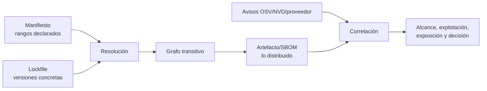

# Clase 240 — SCA: dependencias y riesgo de terceros

> Parte: **11 — DevSecOps y seguridad del SDLC** · Fuente: *Securing DevOps* (Julien Vehent) y OWASP Top 10 A06:2021 (Vulnerable and Outdated Components)
> ⏱️ Duración estimada: **100 min** · Nivel: **Intermedio**

---

## 🎯 Objetivo

Aprender Software Composition Analysis (SCA): identificar todas las dependencias de terceros de
un proyecto, detectar cuáles tienen vulnerabilidades conocidas (CVE), evaluar el riesgo real de
licencias y componentes, y automatizar todo en el pipeline. El 70–90% del código de una app
moderna es de terceros; ese es tu verdadero perímetro de ataque. Usaremos **OWASP Dependency-Check**
y **Trivy**.

## 📚 Resultados de aprendizaje

Al finalizar, el alumno podrá:

1. **Enumerar** las dependencias directas y transitivas de un proyecto y su árbol.
2. **Escanear** dependencias contra bases de CVE (NVD, GitHub Advisory, OSV).
3. **Priorizar** hallazgos por explotabilidad real, no solo por CVSS.
4. **Automatizar** SCA en CI y configurar gates y actualizaciones (Dependabot/Renovate).
5. **Detectar** riesgos de licencias y componentes maliciosos (typosquatting).

## 🗺️ Temas

| # | Tema | Por qué importa |
|---|------|-----------------|
| 1 | Dependencias directas vs transitivas | El riesgo suele esconderse en las transitivas |
| 2 | CVE, CVSS, EPSS y KEV | Priorizar por explotabilidad, no solo por severidad |
| 3 | Bases de datos: NVD, GHSA, OSV | De dónde vienen los avisos |
| 4 | Dependency-Check vs Trivy | Herramientas y sus fortalezas |
| 5 | Lockfiles y reproducibilidad | Escanear lo que realmente se instala |
| 6 | Actualización automatizada | Dependabot/Renovate para no acumular deuda |
| 7 | Riesgos de licencia y typosquatting | No todo riesgo es un CVE |

## 🧠 Explicación en profundidad

### Una vulnerabilidad publicada no equivale automáticamente a riesgo explotable

SCA construye un inventario de componentes y versiones y los correlaciona con avisos de vulnerabilidad. Parece una comparación simple, pero intervienen identidad del paquete, ecosistema, versión resuelta y dependencias transitivas. El manifiesto expresa intención (`package.json`, `pom.xml`); el archivo de bloqueo registra una resolución concreta; y el artefacto construido puede contener algo distinto. Analizar solo uno de ellos deja puntos ciegos.



El diagrama muestra dos problemas diferentes: saber **qué hay** y decidir **qué importa**. Una coincidencia puede ser incorrecta por un identificador ambiguo; puede afectar una función nunca incluida; o puede ser crítica y explotada activamente. La decisión combina severidad técnica, exposición del servicio, alcance del código vulnerable, privilegios, controles compensatorios y evidencia de explotación. CISA KEV confirma vulnerabilidades explotadas en el mundo real dentro del alcance de su catálogo; EPSS estima probabilidad de explotación observada en un horizonte definido. Ninguna señal, por separado, representa impacto empresarial.

### Remediar el grafo, no solo editar una versión

La dependencia vulnerable puede ser directa o llegar a través de otra biblioteca. Antes de actualizar hay que identificar qué paquete la introduce, si existe una versión compatible, qué cambios semánticos trae y qué pruebas protegen la migración. A veces se puede actualizar la dependencia padre; otras, aplicar una restricción temporal o retirar la funcionalidad. Una excepción debe registrar componente, versión, rutas afectadas, análisis de alcance, mitigación, propietario y vencimiento.

Los *gates* deben evitar tanto el abandono como el bloqueo indiscriminado. Un patrón práctico es impedir componentes nuevos con vulnerabilidades por encima de la política, tratar KEV con prioridad especial y mantener el legado en un backlog con SLA basado en riesgo. El resultado del escáner debe ser reproducible: versión de la base de avisos, herramienta, lockfile y hash del artefacto.

### Licencias, procedencia y mantenimiento

El riesgo de terceros no termina en CVE. Incluye licencias incompatibles, paquetes abandonados, nombres confundibles, mantenedores comprometidos y scripts de instalación. SCA aporta inventario, pero la admisión de un componente también requiere procedencia, salud del proyecto, necesidad funcional y capacidad de sustituirlo. Reducir dependencias innecesarias disminuye superficie y trabajo de actualización.

### Caso razonado: CVSS crítico en una utilidad de desarrollo

El escáner encuentra un CVSS crítico en una biblioteca presente solo en el generador de documentación, fuera de la imagen final. El equipo verifica el SBOM del artefacto y confirma que no se distribuye; documenta «no afectado» con evidencia. En el mismo análisis aparece una vulnerabilidad de severidad menor en un parser expuesto a archivos de clientes y listada en KEV. Esa segunda recibe prioridad. El caso enseña por qué ordenar exclusivamente por CVSS desperdicia capacidad.

## 📔 Glosario operativo

| Término | Definición útil |
|---|---|
| Dependencia transitiva | Componente incorporado por otra dependencia, no declarado directamente. |
| Lockfile | Registro reproducible de versiones e integridad resueltas. |
| Reachability | Evidencia de que el código vulnerable puede alcanzarse desde el producto. |
| KEV | Catálogo de CISA de vulnerabilidades conocidas como explotadas. |
| EPSS | Estimación probabilística de explotación; no mide impacto propio. |
| VEX | Declaración del estado de afectación de un producto respecto de vulnerabilidades. |

## ✅ Criterio de dominio

Hay dominio cuando el alumno reconstruye la ruta de una dependencia hasta el artefacto, valida la coincidencia, diferencia severidad de riesgo, propone una actualización comprobable y documenta una excepción temporal sin ocultar deuda.

## 📖 Definiciones y características

- **SCA**: análisis de componentes de terceros para detectar vulnerabilidades y riesgos. *Característica*: se basa en identificar versiones y cruzarlas con bases de avisos.
- **Dependencia transitiva**: dependencia de tus dependencias. *Característica*: no la declaraste tú, pero corre en tu app; suele ser el mayor riesgo.
- **CVE / CVSS**: identificador y puntuación de severidad de una vulnerabilidad. *Característica*: CVSS mide severidad teórica, no probabilidad de explotación.
- **EPSS**: probabilidad de que un CVE sea explotado en 30 días. *Característica*: prioriza mejor que CVSS solo.
- **KEV (CISA)**: catálogo de vulnerabilidades explotadas activamente. *Característica*: si está en KEV, es prioridad máxima.
- **Typosquatting**: paquete malicioso con nombre parecido a uno legítimo. *Característica*: ataque a la cadena de suministro por confusión de nombre.

## 🧰 Herramientas y preparación

- **OWASP Dependency-Check** — SCA para Java, .NET, JS, Python y más; cruza con NVD.
- **Trivy** — escáner todo-en-uno (dependencias, imágenes, IaC, secretos).
- **osv-scanner** (Google) — usa la base OSV, muy buena para lenguajes modernos.
- **Dependabot** / **Renovate** — PRs automáticos de actualización.

Instalación y uso básico:

```bash
# Trivy (filesystem/dependencias):
trivy fs --scanners vuln ./mi-proyecto

# OWASP Dependency-Check (CLI):
dependency-check --project miapp --scan ./ --format HTML --out reporte/

# osv-scanner sobre un lockfile:
osv-scanner --lockfile package-lock.json
```

## 🧪 Laboratorio guiado

> 🧪 **Laboratorio ejecutable del programa:** [`devsecops-pipeline`](../../../labs/devsecops-pipeline/README.md) — es la **capa 1** del lab, con el ejercicio de cobertura: dos dependencias sin versión fijada que el escáner no puede resolver.

1. **Inspecciona el árbol de dependencias** de un proyecto real (p. ej. `npm ls --all` o `pip list` + `pipdeptree`). Observa cuántas son transitivas.
2. **Escanea con Trivy**:

```bash
trivy fs --scanners vuln --severity HIGH,CRITICAL ./mi-proyecto
```

3. **Escanea con Dependency-Check** y compara resultados; nota que cada herramienta usa fuentes distintas y puede diferir.
4. **Prioriza con EPSS y KEV**. Toma los 5 CVE reportados, busca su EPSS (api.first.org/data/v1/epss) y comprueba si están en el catálogo CISA KEV. Reordena por riesgo real, no por CVSS.
5. **Configura un gate en CI**:

```bash
# Falla el build solo con CRITICAL explotables:
trivy fs --exit-code 1 --severity CRITICAL --scanners vuln ./
```

6. **Automatiza actualizaciones**. Añade un `dependabot.yml` que abra PRs semanales para el ecosistema del proyecto:

```yaml
version: 2
updates:
  - package-ecosystem: "npm"
    directory: "/"
    schedule: { interval: "weekly" }
    open-pull-requests-limit: 5
```

7. **Detecta riesgo de licencia**. Ejecuta `trivy fs --scanners license ./` y localiza dependencias con licencias copyleft incompatibles con tu producto.

## ✍️ Ejercicios

1. Genera el árbol de dependencias de un proyecto y cuenta directas vs transitivas.
2. Escanea el mismo repo con Trivy y Dependency-Check y explica las diferencias.
3. Prioriza 5 CVE combinando CVSS, EPSS y KEV.
4. Configura un gate que solo falle con CRITICAL explotable.
5. Crea la configuración de Dependabot o Renovate para tu ecosistema.
6. Detecta una dependencia con licencia problemática y propón alternativa.

## 📝 Reto verificable

Implementa un flujo de SCA en un repositorio con gate de CI y actualización automatizada.

**Criterio de aceptación**: (a) el pipeline escanea dependencias (Trivy o Dependency-Check) en
cada PR; (b) el gate falla solo por vulnerabilidades priorizadas por riesgo (no todo CVSS alto);
(c) existe configuración de Dependabot/Renovate activa; y (d) se entrega un breve informe que
prioriza los 5 hallazgos principales usando CVSS + EPSS + KEV con justificación.

## ⚠️ Errores comunes

| Síntoma / mensaje | Causa y cómo arreglar |
|-------------------|-----------------------|
| Cientos de CVE y el equipo se paraliza | Priorizas por CVSS crudo. Filtra por EPSS/KEV y explotabilidad, empieza por lo alcanzable. |
| Un CVE reportado no aplica a tu uso | La función vulnerable no se usa. Documenta como no explotable (VEX) y suprime. |
| El escaneo no ve transitivas | Escaneas manifests, no el lockfile resuelto. Escanea el lockfile (`package-lock.json`, `poetry.lock`). |
| Dependabot abre 50 PRs y nadie los revisa | Sin límite ni agrupación. Usa `open-pull-requests-limit` y grouping. |
| Actualización rompe la app | Cambio breaking. Ten tests en CI que corran antes de mergear el PR de update. |

## ❓ Preguntas frecuentes

**❓ ¿SCA y SBOM son lo mismo?**
No. SCA es el proceso de analizar componentes por vulnerabilidades; el SBOM (clase 246) es el inventario resultante de componentes. SCA suele producir o consumir un SBOM.

**❓ ¿Debo actualizar toda dependencia con CVE inmediatamente?**
No ciegamente. Prioriza por explotabilidad (KEV/EPSS), exposición y si tu código usa la parte vulnerable. Un CVE crítico en una función que no llamas puede esperar.

**❓ ¿Por qué dos escáneres dan resultados distintos?**
Usan bases de datos y heurísticas de matching diferentes (NVD, GHSA, OSV) y distinta cobertura por ecosistema. Combinar dos mejora la cobertura.

**❓ ¿Cómo me protejo de typosquatting?**
Fija versiones con lockfile y hashes, revisa nombres de paquetes nuevos, usa registries internos con allowlist y herramientas que detecten paquetes recién publicados o de baja reputación.

## 🔗 Referencias

- OWASP Dependency-Check — <https://owasp.org/www-project-dependency-check/>
- Trivy — <https://trivy.dev/>
- OSV — <https://osv.dev/>
- CISA KEV Catalog — <https://www.cisa.gov/known-exploited-vulnerabilities-catalog>
- EPSS (FIRST) — <https://www.first.org/epss/>

## 📥 Material descargable

- 📄 [Guía en PDF](./clase-240-guia.pdf) — versión imprimible de esta clase.
- 🎞️ [Presentación (PPTX)](./clase-240-presentacion.pptx) — deck para proyectar en clase.

## ⬅️ Clase anterior

[Clase 239 — DAST: análisis dinámico de aplicaciones](../239-dast-analisis-dinamico-de-aplicaciones/README.md)

## ➡️ Siguiente clase

[Clase 241 — Secretos en el código y pre-commit hooks](../241-secretos-en-el-codigo-y-pre-commit-hooks/README.md)
