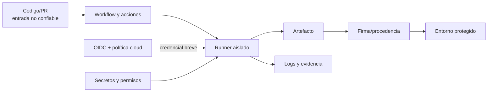

# Clase 242 — Seguridad en pipelines CI/CD

> Parte: **11 — DevSecOps y seguridad del SDLC** · Fuente: *Securing DevOps* (Julien Vehent) y OWASP Top 10 CI/CD Security Risks
> ⏱️ Duración estimada: **120 min** · Nivel: **Avanzado**

---

## 🎯 Objetivo

Endurecer el pipeline de CI/CD, que se ha convertido en un objetivo de primer nivel: quien
controla el pipeline controla lo que llega a producción. Estudiaremos los riesgos del OWASP
Top 10 CI/CD, aplicaremos mínimo privilegio a los tokens, fijaremos (pinning) acciones y
dependencias, aislaremos los runners, y protegeremos secretos y aprobaciones. Usaremos
**GitHub Actions** como ejemplo con la herramienta de análisis **zizmor**.

## 📚 Resultados de aprendizaje

Al finalizar, el alumno podrá:

1. **Identificar** los riesgos del OWASP Top 10 CI/CD en un pipeline real.
2. **Aplicar** mínimo privilegio a `GITHUB_TOKEN` y a los secretos por job.
3. **Fijar** (pin) acciones a un SHA y prevenir la ejecución de código no confiable.
4. **Aislar** builds de PRs de forks para evitar exfiltración de secretos.
5. **Auditar** workflows con zizmor y remediar los hallazgos.

## 🗺️ Temas

| # | Tema | Por qué importa |
|---|------|-----------------|
| 1 | El pipeline como objetivo | SolarWinds, Codecov: comprometer el build compromete todo |
| 2 | OWASP Top 10 CI/CD | Taxonomía de riesgos específicos del pipeline |
| 3 | `pull_request_target` y forks | Vector clásico de robo de secretos |
| 4 | Mínimo privilegio de tokens | `permissions:` restrictivo por defecto |
| 5 | Pinning de acciones a SHA | Evita que un tag mutable inyecte código |
| 6 | Aislamiento de runners | Efímeros, sin credenciales persistentes |
| 7 | OIDC en vez de secretos long-lived | Credenciales cortas federadas a la nube |

## 🧠 Explicación en profundidad

### El pipeline es un sistema de producción privilegiado

CI/CD lee código no confiable, descarga herramientas, ejecuta scripts y publica artefactos. A menudo posee tokens capaces de escribir en el repositorio, registrar paquetes o desplegar infraestructura. Por eso comprometer el pipeline puede ser más valioso que atacar una aplicación: permite modificar muchas entregas desde un punto central. El archivo YAML es código con privilegios y debe revisarse con la misma disciplina que el producto.



El límite crítico se encuentra entre la contribución y el runner. En eventos como `pull_request_target`, el workflow puede ejecutarse con contexto privilegiado del repositorio base; combinarlo con *checkout* de código del PR puede dar secretos a código controlado por un colaborador externo. La defensa exige separar trabajos no confiables de publicación, usar permisos mínimos y transferir solo artefactos verificados entre etapas.

### Dependencias, permisos e identidad

Una acción de terceros también es una dependencia ejecutable. GitHub documenta que fijarla a un SHA completo es la forma de obtener una referencia inmutable; el comentario puede conservar la versión legible. Antes de actualizar se verifica que el SHA pertenece al repositorio original. Para paquetes y herramientas se conservan lockfiles, hashes o imágenes por digest.

El `GITHUB_TOKEN` debe declarar permisos por workflow o tarea; omitirlos deja decisiones a valores predeterminados que pueden cambiar por configuración. Publicar o desplegar requiere un job separado, entorno protegido y aprobación cuando el riesgo lo justifique. OIDC evita una clave cloud permanente, pero no es permiso mágico: el proveedor debe validar emisor, audiencia y atributos como repositorio, rama o entorno.

Los runners efímeros reducen persistencia entre trabajos. Un runner autohospedado añade responsabilidad: parches, aislamiento, red de salida, limpieza y protección frente a PR no confiables. Un contenedor de job no garantiza aislamiento fuerte frente al host si expone sockets o privilegios.

### Caso razonado: acción útil con tag mutable

Un workflow usa `vendor/deploy@v2` con permiso de escritura y secreto cloud. Aunque la acción sea legítima hoy, el tag puede moverse o el repositorio comprometerse. El equipo revisa su procedencia, fija un SHA, limita permisos, mueve despliegue a un entorno protegido y sustituye la clave por OIDC con política de rama. También registra digest del artefacto para que el job de despliegue no reconstruya una salida distinta.

## 📔 Glosario operativo

| Término | Definición útil |
|---|---|
| Runner | Entorno que ejecuta los pasos del workflow. |
| Evento privilegiado | Disparador cuyo token o secretos tienen más autoridad que la entrada evaluada. |
| Pinning | Fijación de una dependencia a una identidad inmutable, como SHA o digest. |
| OIDC federation | Intercambio de identidad verificable por credenciales breves del proveedor. |
| Procedencia | Evidencia de qué proceso e insumos produjeron un artefacto. |

## ✅ Criterio de dominio

Hay dominio cuando el alumno rastrea datos y privilegios desde el evento hasta el despliegue, reconoce ejecución de entrada no confiable, reduce permisos, fija dependencias, separa build de release y puede explicar qué amenaza mitiga cada control.

## 📖 Definiciones y características

- **Poisoned Pipeline Execution (PPE)**: inyectar código malicioso que el pipeline ejecuta con sus privilegios. *Característica*: ocurre cuando el pipeline corre código no confiable de PRs.
- **`GITHUB_TOKEN`**: token efímero del workflow. *Característica*: por defecto puede tener permisos amplios; restríngelo a `read` y sube solo lo necesario.
- **Pinning a SHA**: referenciar una acción por su hash inmutable en vez de un tag. *Característica*: un tag como `@v3` es mutable y puede ser reescrito por un atacante que controle el repo de la acción.
- **`pull_request_target`**: evento que corre con secretos del repo base sobre código del PR. *Característica*: peligroso con forks; puede exfiltrar secretos.
- **Runner efímero**: máquina de CI de un solo uso. *Característica*: sin estado ni credenciales persistentes entre jobs.
- **OIDC federation**: obtener credenciales cloud cortas mediante identidad del workflow. *Característica*: elimina secretos de larga vida en el CI.

## 🧰 Herramientas y preparación

- **GitHub Actions** (o GitLab CI / Jenkins) como plataforma de ejemplo.
- **zizmor** — analizador estático de seguridad para workflows de GitHub Actions.
- **actionlint** — linter de sintaxis y buenas prácticas de workflows.
- **StepSecurity Harden-Runner** — monitoriza y restringe el tráfico de red del runner.

Instalación de zizmor:

```bash
pip install zizmor
zizmor .github/workflows/
```

## 🧪 Laboratorio guiado

> 🧪 **Laboratorio ejecutable del programa:** [`devsecops-pipeline`](../../../labs/devsecops-pipeline/README.md) — es la **capa 6** del lab, sobre un workflow con `pull_request_target`, inyección de expresiones y permisos totales.

1. **Audita tus workflows** con zizmor y actionlint:

```bash
zizmor .github/workflows/ci.yml
actionlint
```

Anota hallazgos: permisos amplios, acciones sin pin, uso de `pull_request_target`.
2. **Restringe permisos**. Aplica mínimo privilegio a nivel de workflow y sube por job solo lo necesario:

```yaml
permissions:
  contents: read     # por defecto de solo lectura para todo
jobs:
  build:
    permissions:
      contents: read
      packages: write   # solo este job puede publicar
```

3. **Fija acciones a SHA**:

```yaml
# Mal:  uses: actions/checkout@v4   (tag mutable)
# Bien: uses: actions/checkout@8f4b7f84864484a7bf31766abe9204da3cbe65b3  # v4.1.1
```

4. **Protege builds de forks**. Evita `pull_request_target` con checkout del código del PR; si lo necesitas, no expongas secretos y separa el job que corre código no confiable del que usa credenciales.
5. **Adopta OIDC**. Configura el despliegue a la nube con federación de identidad en vez de guardar claves de acceso long-lived como secretos.
6. **Endurece el runner**. Añade `step-security/harden-runner` para bloquear egress no esperado y detectar exfiltración.
7. **Protege ramas y aprobaciones**. Exige revisión de código, checks obligatorios y required reviewers para entornos de producción.

> Nota ética: practica el hardening sobre repositorios y organizaciones propios. Explotar
> pipelines ajenos (aunque sea "para demostrar") requiere autorización explícita por escrito.

## ✍️ Ejercicios

1. Audita un workflow con zizmor y clasifica los hallazgos por severidad.
2. Reescribe un workflow para aplicar mínimo privilegio de permisos.
3. Convierte todas las acciones de un workflow a pinning por SHA.
4. Explica cómo `pull_request_target` puede filtrar secretos y cómo evitarlo.
5. Configura OIDC para desplegar a AWS/GCP sin secretos de larga vida.
6. Añade harden-runner y provoca/detecta un egress no esperado.

## 📝 Reto verificable

Endurece un pipeline de CI/CD real aplicando los controles clave y demuéstralo con una auditoría.

**Criterio de aceptación**: (a) todos los workflows tienen `permissions` de mínimo privilegio;
(b) todas las acciones de terceros están pinneadas a SHA; (c) no hay uso inseguro de
`pull_request_target` con secretos expuestos a código de forks; (d) el despliegue usa OIDC o,
si no es posible, secretos con scope mínimo; y (e) zizmor no reporta hallazgos de severidad alta.

## ⚠️ Errores comunes

| Síntoma / mensaje | Causa y cómo arreglar |
|-------------------|-----------------------|
| Un PR de fork robó un secreto | `pull_request_target` con checkout del PR. Separa el código no confiable de los jobs con secretos. |
| Una acción "de confianza" inyectó código | Estaba pinneada a un tag mutable reescrito. Pin a SHA siempre. |
| `GITHUB_TOKEN` con permisos de escritura por defecto | No se restringió. Define `permissions: contents: read` a nivel global. |
| Secretos long-lived rotados a mano cada 90 días | Deuda operativa. Migra a OIDC con credenciales efímeras. |
| El runner descarga y ejecuta scripts de internet | Egress sin control. Usa harden-runner para restringir red. |

## ❓ Preguntas frecuentes

**❓ ¿Por qué pinnear a SHA si confío en `actions/checkout`?**
Confías en el código actual, no en cualquier código futuro que un tag mutable pueda apuntar si la cuenta de la acción se compromete. El SHA es inmutable.

**❓ ¿Cuál es la diferencia entre `pull_request` y `pull_request_target`?**
`pull_request` corre sin secretos del repo base (seguro para forks); `pull_request_target` corre con ellos y en el contexto del base, por eso es peligroso combinarlo con checkout del código del PR.

**❓ ¿OIDC elimina todos los secretos?**
Elimina los de larga vida hacia proveedores que soportan federación (nube, registries). Puede quedar algún secreto, pero reduces drásticamente la superficie.

**❓ ¿Basta con auditar una vez?**
No. Los workflows cambian y aparecen nuevas técnicas. Corre zizmor/actionlint en CI como gate continuo.

## 🔗 Referencias

- OWASP Top 10 CI/CD Security Risks — <https://owasp.org/www-project-top-10-ci-cd-security-risks/>
- zizmor — <https://github.com/woodruffw/zizmor>
- GitHub Actions Security Hardening — <https://docs.github.com/en/actions/security-guides/security-hardening-for-github-actions>
- StepSecurity Harden-Runner — <https://github.com/step-security/harden-runner>
- Julien Vehent, *Securing DevOps*, Manning 2018.

## 📥 Material descargable

- 📄 [Guía en PDF](./clase-242-guia.pdf) — versión imprimible de esta clase.
- 🎞️ [Presentación (PPTX)](./clase-242-presentacion.pptx) — deck para proyectar en clase.

## ⬅️ Clase anterior

[Clase 241 — Secretos en el código y pre-commit hooks](../241-secretos-en-el-codigo-y-pre-commit-hooks/README.md)

## ➡️ Siguiente clase

[Clase 243 — Imágenes y contenedores seguros en el pipeline](../243-imagenes-y-contenedores-seguros-en-el-pipeline/README.md)
