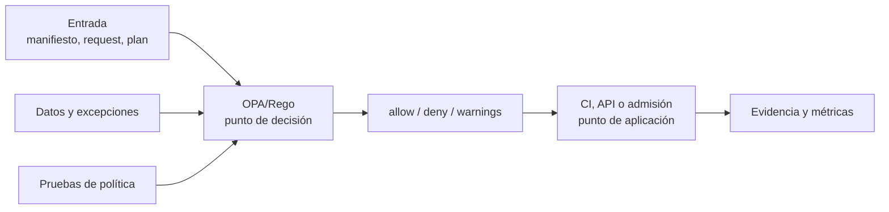

# Clase 244 — Políticas como código con OPA

> Parte: **11 — DevSecOps y seguridad del SDLC** · Fuente: Documentación de Open Policy Agent (OPA) y *Agile Application Security* (gobierno de seguridad automatizado)
> ⏱️ Duración estimada: **110 min** · Nivel: **Avanzado**

---

## 🎯 Objetivo

Expresar las reglas de seguridad y cumplimiento como **código versionable, testeable y
auditable** en vez de como documentos o revisiones manuales. Con Open Policy Agent (OPA) y su
lenguaje Rego escribiremos políticas que validan configuración de infraestructura (Terraform,
Kubernetes), Dockerfiles y pipelines, y las integraremos como gate en CI con **Conftest**.
"Policy as Code" hace que el cumplimiento sea automático, consistente y no dependa de que
alguien recuerde revisarlo.

## 📚 Resultados de aprendizaje

Al finalizar, el alumno podrá:

1. **Explicar** qué es policy as code y por qué desacopla decisión de aplicación (PDP/PEP).
2. **Escribir** políticas en Rego con reglas `deny`/`allow` y mensajes claros.
3. **Evaluar** manifiestos (Kubernetes, Terraform plan, Dockerfile) con Conftest.
4. **Testear** las políticas con casos positivos y negativos.
5. **Integrar** las políticas como gate obligatorio en el pipeline.

## 🗺️ Temas

| # | Tema | Por qué importa |
|---|------|-----------------|
| 1 | Policy as Code: motivación | Cumplimiento automático, consistente y auditable |
| 2 | OPA y el modelo PDP/PEP | Separar quién decide de quién aplica |
| 3 | Rego básico | Lenguaje declarativo de las políticas |
| 4 | Conftest | Aplicar OPA a archivos de configuración en CI |
| 5 | Casos: K8s, Terraform, Docker | Dónde aporta valor |
| 6 | Testear políticas | Las políticas también necesitan tests |
| 7 | Gatekeeper (admisión K8s) | OPA en el clúster en runtime |

## 🧠 Explicación en profundidad

### Separar la decisión de la aplicación de la política

Política como código expresa decisiones en un lenguaje versionable y comprobable. OPA recibe **entrada estructurada** y datos, evalúa reglas Rego y devuelve una decisión; no ejecuta por sí mismo el bloqueo. Conftest convierte archivos como Terraform o Kubernetes en entrada durante CI; Gatekeeper integra evaluación en admisión de Kubernetes. La misma idea adopta puntos de aplicación diferentes, con consecuencias distintas.



El diagrama distingue el **PDP** que decide del **PEP** que aplica. Si CI informa una denegación pero permite continuar, la política no está siendo impuesta. Si admisión bloquea sin mecanismo de emergencia, un error puede impedir una recuperación. Diseñar la política incluye ubicación, modo de fallo, disponibilidad, mensaje, excepción y registro.

### Escribir reglas que enseñen y puedan mantenerse

Una regla debe describir una propiedad observable, no una intención vaga. «Los contenedores no deben ser privilegiados» puede evaluarse; «la carga debe ser segura» no. El resultado debería incluir recurso, regla, motivo y remediación. Las reglas se agrupan por dominio y exponen decisiones estables aunque cambie su implementación interna.

Las pruebas cubren casos permitidos, denegados, datos ausentes y excepciones. Un cambio de política se revisa como código porque puede ampliar o restringir acceso en cientos de recursos. Conviene desplegar primero en auditoría, observar impacto, corregir inventario y finalmente bloquear. La excepción es un dato explícito con propietario y caducidad, no un comentario permanente.

### Límites y contexto

OPA decide solo con la información recibida. Un manifiesto puede declarar `runAsNonRoot`, pero no demostrar que la imagen funciona de esa manera; una política de región no sabe si el dato tiene una clasificación especial salvo que esa clasificación llegue como dato confiable. El esquema y procedencia de la entrada forman parte del control.

### Caso razonado: regla demasiado amplia

Una organización bloquea cualquier `LoadBalancer`, afectando servicios internos de una plataforma administrada. La intención era impedir exposición pública. Se redefine la propiedad usando clase, anotaciones aprobadas, red y propietario; se añaden fixtures de casos internos y públicos, y una excepción temporal con vencimiento. La política mejora porque modela el riesgo real en vez de prohibir una palabra.

## 📔 Glosario operativo

| Término | Definición útil |
|---|---|
| PDP | Componente que calcula una decisión de política. |
| PEP | Componente que hace cumplir esa decisión. |
| Rego | Lenguaje declarativo usado por OPA. |
| Input | Documento evaluado en una consulta concreta. |
| Data | Información auxiliar confiable usada por las reglas. |
| Audit mode | Evaluación y registro sin bloqueo, útil para adopción gradual. |

## ✅ Criterio de dominio

Existe dominio cuando el alumno formula una propiedad evaluable, implementa reglas y pruebas positivas/negativas, explica dónde se aplica la decisión, diseña excepciones temporales y reconoce qué hechos no están presentes en la entrada.

## 📖 Definiciones y características

- **Policy as Code**: expresar reglas como código versionado y probado. *Característica*: revisable en PRs, con historial y tests, no en un PDF.
- **OPA**: motor de políticas de propósito general. *Característica*: recibe input JSON y una consulta, devuelve una decisión.
- **Rego**: lenguaje declarativo de OPA. *Característica*: se centra en describir qué es válido/denegado, no en el cómo.
- **PDP/PEP**: Policy Decision Point (decide) y Policy Enforcement Point (aplica). *Característica*: OPA es el PDP; el pipeline o el clúster es el PEP.
- **Conftest**: herramienta que usa OPA para validar archivos de configuración. *Característica*: ideal como gate de CI sobre YAML/JSON/HCL/Dockerfile.
- **Gatekeeper**: controlador de admisión de Kubernetes basado en OPA. *Característica*: aplica políticas en runtime al crear recursos.

## 🧰 Herramientas y preparación

- **OPA** (binario `opa`) para evaluar y testear Rego.
- **Conftest** para validar configuración en el pipeline.
- **OPA Gatekeeper** (opcional) para admisión en Kubernetes.

```bash
# Instalar (ejemplos):
brew install opa conftest      # macOS
# o descarga los binarios de releases

opa version && conftest --version
```

## 🧪 Laboratorio guiado

1. **Escribe una política que prohíba contenedores privilegiados** en Kubernetes. Crea `policy/security.rego`:

```rego
package main

deny[msg] {
    input.kind == "Deployment"
    c := input.spec.template.spec.containers[_]
    c.securityContext.privileged == true
    msg := sprintf("El contenedor '%s' no puede ser privileged", [c.name])
}

deny[msg] {
    input.kind == "Deployment"
    c := input.spec.template.spec.containers[_]
    not c.resources.limits
    msg := sprintf("El contenedor '%s' debe declarar resource limits", [c.name])
}
```

2. **Evalúa un manifiesto** con Conftest:

```bash
conftest test deployment.yaml -p policy/
```

Debe fallar si el deployment es privilegiado o carece de limits.
3. **Testea la política**. Crea `policy/security_test.rego` con un input que debe pasar y otro que debe denegar; ejecútalos:

```bash
opa test policy/ -v
```

4. **Política para Dockerfile**. Escribe una regla que deniegue `USER root` o la ausencia de instrucción `USER` y valídala con Conftest sobre el Dockerfile parseado.
5. **Política para Terraform**. Ejecuta `terraform plan -out tfplan && terraform show -json tfplan > plan.json` y escribe una política que deniegue buckets S3 públicos; valida con Conftest.
6. **Integra el gate en CI**. Añade un job que corra `conftest test` sobre los manifiestos y falle el build ante cualquier `deny`.
7. **(Opcional) Gatekeeper**. Despliega una ConstraintTemplate equivalente en un clúster de práctica para aplicar la política en runtime.

## ✍️ Ejercicios

1. Escribe una política que exija que todo Deployment corra como no-root.
2. Añade una regla que prohíba imágenes con tag `:latest`.
3. Crea tests positivos y negativos para tus políticas con `opa test`.
4. Valida un `terraform plan` en JSON con una política de red.
5. Integra Conftest como gate obligatorio en un pipeline.
6. Traduce una de tus políticas a una Constraint de Gatekeeper.

## 📝 Reto verificable

Implementa un conjunto de políticas como código con tests y gate en CI.

**Criterio de aceptación**: (a) existen al menos tres políticas Rego que validan configuración
real (K8s/Terraform/Dockerfile); (b) cada política tiene tests positivos y negativos que pasan
con `opa test`; (c) Conftest corre como gate en CI y rompe el build ante violaciones; y (d) los
mensajes de `deny` son claros y accionables para quien los recibe.

## ⚠️ Errores comunes

| Síntoma / mensaje | Causa y cómo arreglar |
|-------------------|-----------------------|
| La política no deniega nada | El `input` no tiene la forma esperada. Inspecciona con `conftest parse` o `opa eval`. |
| Rego lanza "multiple assignments" | Reusaste una variable con `=`. Usa `:=` para asignación y nombres únicos. |
| Falsos denies en recursos válidos | Regla demasiado amplia. Acota con condiciones de `kind`/campos y añade tests. |
| Nadie entiende por qué falló el gate | Mensajes de `deny` genéricos. Usa `sprintf` con nombre del recurso y razón. |
| La política pasa en local pero no en CI | Distinto path de políticas o formato de input. Alinea el comando `conftest` y el parseo. |

## ❓ Preguntas frecuentes

**❓ ¿Conftest y Gatekeeper hacen lo mismo?**
Comparten OPA/Rego, pero Conftest valida archivos en el pipeline (shift-left) y Gatekeeper aplica políticas en el clúster en runtime (admisión). Se complementan: defensa en profundidad.

**❓ ¿Rego es difícil de aprender?**
Tiene una curva por ser declarativo, pero para políticas de seguridad el patrón `deny[msg] { condiciones }` cubre la mayoría de casos. Empieza copiando ejemplos de la librería de la comunidad.

**❓ ¿Debo escribir todas las políticas desde cero?**
No. Existen librerías como las de Conftest y las de Gatekeeper con políticas comunes (CIS, buenas prácticas) que puedes adaptar.

**❓ ¿Policy as code reemplaza al equipo de seguridad?**
No: codifica sus decisiones para aplicarlas de forma consistente y automática. Seguridad define la política; el código la aplica en cada cambio.

## 🔗 Referencias

- Open Policy Agent — <https://www.openpolicyagent.org/docs/latest/>
- Conftest — <https://www.conftest.dev/>
- OPA Gatekeeper — <https://open-policy-agent.github.io/gatekeeper/>
- Rego Playground — <https://play.openpolicyagent.org/>
- CNCF Policy as Code — <https://www.cncf.io/blog/2021/09/policy-as-code/>

## 📥 Material descargable

- 📄 [Guía en PDF](./clase-244-guia.pdf) — versión imprimible de esta clase.
- 🎞️ [Presentación (PPTX)](./clase-244-presentacion.pptx) — deck para proyectar en clase.

## ⬅️ Clase anterior

[Clase 243 — Imágenes y contenedores seguros en el pipeline](../243-imagenes-y-contenedores-seguros-en-el-pipeline/README.md)

## ➡️ Siguiente clase

[Clase 245 — Gestión de vulnerabilidades a escala](../245-gestion-de-vulnerabilidades-a-escala/README.md)
