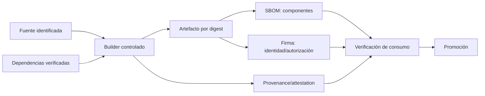

# Clase 246 — Supply chain security: SBOM y SLSA

> Parte: **11 — DevSecOps y seguridad del SDLC** · Fuente: SLSA Framework, NTIA "Minimum Elements for a SBOM" y NIST SP 800-218 (SSDF)
> ⏱️ Duración estimada: **120 min** · Nivel: **Avanzado**

---

## 🎯 Objetivo

Proteger la cadena de suministro de software: saber exactamente qué contienen tus artefactos
(SBOM), garantizar la integridad y procedencia de cómo se construyeron (SLSA, atestaciones,
firmas), y establecer confianza verificable de extremo a extremo. Tras ataques como SolarWinds,
Codecov y las campañas de typosquatting en npm/PyPI, la cadena de suministro es una prioridad
regulada (Orden Ejecutiva 14028 de EE. UU.). Usaremos **Syft**, **Trivy** y **cosign**.

## 📚 Resultados de aprendizaje

Al finalizar, el alumno podrá:

1. **Explicar** qué es un SBOM, sus formatos (CycloneDX, SPDX) y sus elementos mínimos.
2. **Generar** un SBOM de código y de imágenes con Syft/Trivy.
3. **Consumir** un SBOM para acelerar la investigación de afectación, conservando la verificación de alcance.
4. **Describir** los niveles del Build Track de SLSA v1.2 y qué garantiza cada uno.
5. **Crear y verificar** atestaciones de procedencia firmadas con cosign.

## 🗺️ Temas

| # | Tema | Por qué importa |
|---|------|-----------------|
| 1 | Ataques a la cadena de suministro | SolarWinds, Codecov, typosquatting: el nuevo frente |
| 2 | SBOM: qué es y para qué | Inventario verificable de componentes |
| 3 | CycloneDX vs SPDX | Los dos formatos estándar |
| 4 | Generar y consumir SBOM | Inventario + respuesta rápida a CVE |
| 5 | SLSA v1.2: Build L1–L3 | Garantías crecientes de procedencia y protección del build |
| 6 | Procedencia y atestaciones | Cómo se construyó, firmado y verificable |
| 7 | Firma y verificación (cosign) | Confianza criptográfica del artefacto |

## 🧠 Explicación en profundidad

### Inventario, identidad y procedencia responden preguntas distintas

La cadena de suministro abarca código fuente, dependencias, herramientas, builders, repositorios, registros y canales de actualización. Un atacante no necesita vulnerar la lógica del producto si puede sustituir un paquete, robar una cuenta de publicación o modificar el artefacto después del build. Defenderla requiere poder responder: **qué contiene**, **de dónde proviene**, **cómo se construyó** y **qué política autorizó su consumo**.



Una **SBOM** enumera componentes y relaciones bajo un formato como SPDX o CycloneDX. No garantiza que estén libres de vulnerabilidades, que el archivo sea completo ni que el build sea legítimo. Una **firma** vincula una identidad con bytes; no describe necesariamente el proceso. La **procedencia** registra builder, materiales y parámetros. Estas evidencias se complementan y deben vincularse al mismo digest para evitar que documentos correctos acompañen a otro artefacto.

### SLSA actual: tracks y garantías incrementales

SLSA 1.2 organiza requisitos en *tracks*. En el Build Track, L1 exige procedencia; L2 añade procedencia autenticada generada por una plataforma alojada; L3 exige una plataforma endurecida con protección fuerte e aislamiento frente a manipulación durante el build. No corresponde enseñar los antiguos cuatro niveles de SLSA 0.1 como si siguieran vigentes. Además, un nivel de un artefacto no se hereda transitivamente a todas sus dependencias.

Adoptar SLSA significa seleccionar una amenaza y una garantía, no colocar una insignia. Si el productor genera su propia procedencia desde un paso que puede modificarla, el documento describe pero ofrece poca resistencia. La verificación en el consumidor —identidad esperada, builder permitido, fuente, parámetros y digest— es tan importante como producir la attestation.

### Calidad y ciclo de vida de una SBOM

La SBOM debe generarse desde el artefacto final cuando sea posible, conservar versiones y relaciones, y publicarse con una política de acceso apropiada. Se valida sintaxis, completitud razonable y correspondencia con el digest. Cuando aparece una vulnerabilidad, VEX puede expresar si el producto está afectado, no afectado, en investigación o corregido, junto con justificación. No es un mecanismo para borrar alertas sin evidencia.

### Caso razonado: SBOM correcta para el archivo equivocado

El pipeline construye dos veces: una para escanear y otra para publicar. La primera genera una SBOM limpia; la segunda descarga una dependencia más reciente por no usar lockfile. El registro almacena artefacto y SBOM, pero sus digests no coinciden. La solución es construir una sola vez, promover el mismo digest y adjuntar SBOM, firma y procedencia a esa identidad. La trazabilidad corrige el proceso, no solo el documento.

## 📔 Glosario operativo

| Término | Definición útil |
|---|---|
| SBOM | Inventario estructurado de componentes y relaciones de un artefacto. |
| Attestation | Declaración firmable sobre una propiedad o proceso. |
| Provenance | Evidencia de materiales, builder y pasos que produjeron un artefacto. |
| SLSA track | Conjunto de garantías y niveles para un aspecto de la cadena. |
| VEX | Estado razonado de afectación frente a una vulnerabilidad. |

## ✅ Criterio de dominio

Existe dominio cuando el alumno puede vincular artefacto, SBOM, firma y procedencia por digest, explicar qué garantiza cada evidencia, describir correctamente SLSA Build v1.2 y diseñar verificación en el punto de consumo.

## 📖 Definiciones y características

- **SBOM (Software Bill of Materials)**: inventario formal de componentes de un artefacto. *Característica*: acelera la investigación cuando aparece una vulnerabilidad, pero requiere validar completitud y alcance.
- **CycloneDX / SPDX**: formatos estándar de SBOM. *Característica*: CycloneDX nació orientado al análisis de componentes; SPDX es ISO/IEC 5962:2021 y cubre también licencias y procedencia.
- **Procedencia (provenance)**: metadatos verificables de cómo, dónde y con qué se construyó un artefacto. *Característica*: base de SLSA; responde "¿este binario salió realmente de este código y pipeline?".
- **SLSA**: Supply-chain Levels for Software Artifacts, especificación organizada en tracks. *Característica*: el Build Track v1.2 eleva garantías desde procedencia existente hasta builds endurecidos.
- **Atestación**: afirmación firmada sobre un artefacto (SBOM, provenance, resultados de escaneo). *Característica*: verificable criptográficamente y almacenable junto a la imagen.
- **Orden Ejecutiva 14028**: orden federal estadounidense que instruyó requisitos y guías de seguridad para software adquirido por agencias; impulsó, entre otras medidas, el uso de SBOM. Su aplicación concreta depende del proceso de contratación y de las guías posteriores.

## 🧰 Herramientas y preparación

- **Syft** (Anchore) — genera SBOM de código e imágenes.
- **Grype** / **Trivy** — consumen SBOM para detectar CVE.
- **cosign** — firma imágenes y adjunta atestaciones (SBOM, provenance).
- **SLSA GitHub Generator** — genera provenance SLSA en Actions.

```bash
# Generar SBOM de una imagen en CycloneDX:
syft miapp:1.0 -o cyclonedx-json > sbom.cdx.json

# Escanear consumiendo el SBOM:
grype sbom:sbom.cdx.json
```

## 🧪 Laboratorio guiado

> 🧪 **Laboratorio ejecutable del programa:** [`devsecops-pipeline`](../../../labs/devsecops-pipeline/README.md) — practica los tres huecos típicos de la cadena: dependencias sin fijar, ausencia de *lockfile* con hashes y acciones de CI sin fijar por SHA.

1. **Genera el SBOM** de un proyecto y de su imagen:

```bash
syft dir:./mi-proyecto -o spdx-json > sbom.spdx.json
syft miapp:1.0 -o cyclonedx-json > sbom.cdx.json
```

Inspecciona: componentes, versiones, licencias, hashes.
2. **Consume el SBOM para responder a un CVE**. Simula que sale un CVE en una librería: busca en el SBOM si está y en qué versión. Luego escanea con Grype/Trivy usando el SBOM como entrada.
3. **Adjunta el SBOM como atestación firmada** a la imagen:

```bash
cosign attest --predicate sbom.cdx.json --type cyclonedx \
  miregistry/miapp@sha256:<digest>
cosign verify-attestation --type cyclonedx miregistry/miapp@sha256:<digest> \
  --certificate-identity-regexp '.*' --certificate-oidc-issuer-regexp '.*'
```

4. **Genera provenance SLSA en el pipeline**. Configura el `slsa-github-generator` para que el workflow emita una atestación de procedencia del artefacto build.
5. **Verifica la procedencia**. Comprueba que el artefacto fue construido por tu pipeline y a partir del commit esperado (`cosign verify-attestation --type slsaprovenance`).
6. **Autoevalúa tu nivel SLSA Build v1.2**. Contrasta tu pipeline con L1–L3: procedencia, autenticidad emitida por plataforma alojada y protección/aislamiento del builder. Determina el nivel realmente demostrado y el siguiente objetivo.
7. **Publica el SBOM**. Adjúntalo al release para que tus consumidores puedan auditarlo.

> Nota ética: la seguridad de la cadena de suministro es defensiva. No publiques SBOM con datos
> internos sensibles sin revisarlos; contienen el mapa de tus componentes.

## ✍️ Ejercicios

1. Genera SBOM del mismo artefacto en CycloneDX y SPDX y compara su estructura.
2. Usa un SBOM para determinar en 1 minuto si estás afectado por un CVE dado.
3. Firma y verifica un SBOM como atestación con cosign.
4. Configura la generación de provenance SLSA en un pipeline.
5. Verifica que un artefacto proviene del commit y pipeline esperados.
6. Autoevalúa el nivel SLSA de tu pipeline y define un plan para subir uno.

## 📝 Reto verificable

Entrega un artefacto con SBOM y procedencia verificables de extremo a extremo.

**Criterio de aceptación**: (a) el pipeline genera un SBOM (CycloneDX o SPDX) del artefacto y
lo publica; (b) el SBOM se adjunta como atestación firmada con cosign y la firma verifica; (c)
se genera provenance SLSA verificable que ata el artefacto a su código fuente y build; y (d) se
documenta el nivel SLSA alcanzado con evidencia.

## ⚠️ Errores comunes

| Síntoma / mensaje | Causa y cómo arreglar |
|-------------------|-----------------------|
| El SBOM no lista dependencias transitivas | Se generó de manifests, no del artefacto construido. Genera el SBOM de la imagen/binario final. |
| "Tengo SBOM pero no me sirve" | No lo consumes. Intégralo con Grype/Trivy y en el proceso de respuesta a CVE. |
| `cosign verify-attestation` falla | Tipo o identidad incorrectos. Ajusta `--type` y los filtros de certificado. |
| Provenance dice que lo construyó una máquina desconocida | Build no aislado o token comprometido. Endurece el pipeline (clase 242) y usa runners efímeros. |
| SBOM desactualizado respecto al artefacto | Se generó fuera del build. Genera SBOM y firma en el mismo job que produce el artefacto. |

## ❓ Preguntas frecuentes

**❓ ¿SBOM y SLSA compiten?**
No. El SBOM describe *qué* contiene el artefacto; SLSA establece requisitos sobre procedencia y garantías del proceso. Ninguno demuestra por sí solo que el software sea seguro.

**❓ ¿CycloneDX o SPDX?**
CycloneDX está más orientado a seguridad (integra VEX, se usa mucho con herramientas de escaneo); SPDX es estándar ISO y fuerte en cumplimiento de licencias. Muchos generan ambos.

**❓ ¿Qué nivel de SLSA necesito?**
Empieza por generar y verificar procedencia (Build L1) y adopta una plataforma alojada o endurecida cuando el riesgo justifique L2 o L3. El nivel debe declararse con la versión de la especificación y con evidencia, no por semejanza informal.

**❓ ¿El SBOM me protege de un ataque de supply chain?**
No lo previene por sí solo. Reduce el tiempo de inventario y ayuda a investigar «¿contenemos X?», pero la afectación exige analizar versión, configuración y alcance; la procedencia se verifica mediante evidencia adicional vinculada al artefacto.

## 🔗 Referencias

- SLSA Specification v1.2 — <https://slsa.dev/spec/v1.2/>
- NTIA Minimum Elements for a SBOM — <https://www.ntia.gov/report/2021/minimum-elements-software-bill-materials-sbom>
- CycloneDX — <https://cyclonedx.org/>
- SPDX — <https://spdx.dev/>
- Syft & Grype (Anchore) — <https://github.com/anchore/syft>

## 📥 Material descargable

- 📄 [Guía en PDF](./clase-246-guia.pdf) — versión imprimible de esta clase.
- 🎞️ [Presentación (PPTX)](./clase-246-presentacion.pptx) — deck para proyectar en clase.

## ⬅️ Clase anterior

[Clase 245 — Gestión de vulnerabilidades a escala](../245-gestion-de-vulnerabilidades-a-escala/README.md)

## ➡️ Siguiente clase

[Clase 247 — Seguridad de APIs en el ciclo de desarrollo](../247-seguridad-de-apis-en-el-ciclo-de-desarrollo/README.md)
