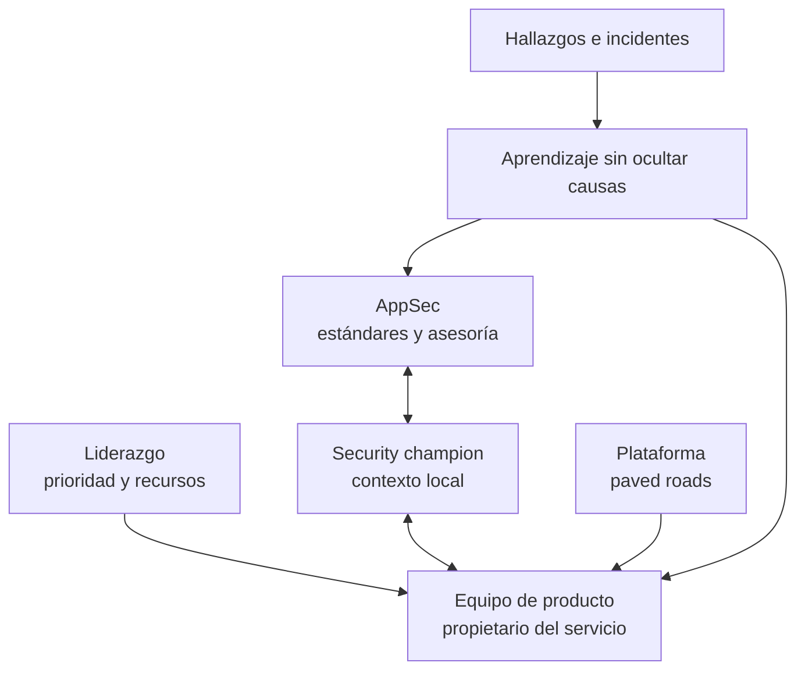

# Clase 248 — Cultura DevSecOps y security champions

> Parte: **11 — DevSecOps y seguridad del SDLC** · Fuente: *Agile Application Security* (Bell, Brunton-Spall, Smith, Bird) y OWASP Security Champions Guide / SAMM
> ⏱️ Duración estimada: **90 min** · Nivel: **Intermedio**

---

## 🎯 Objetivo

Entender que DevSecOps es, ante todo, un cambio cultural: la mejor herramienta fracasa sin un
equipo que se apropie de la seguridad. Aprenderás a construir un programa de **security
champions**, a escalar el conocimiento de AppSec sin ser cuello de botella, a medir la madurez
del programa y a alinear incentivos para que la seguridad sea un habilitador, no un freno.
Esta clase cierra la parte conectando lo técnico con lo organizativo.

## 📚 Resultados de aprendizaje

Al finalizar, el alumno podrá:

1. **Explicar** por qué la cultura determina el éxito de DevSecOps más que las herramientas.
2. **Diseñar** un programa de security champions (selección, rol, tiempo, reconocimiento).
3. **Escalar** AppSec con un modelo hub-and-spoke sin convertirse en cuello de botella.
4. **Medir** la madurez cultural y del programa con métricas y modelos (SAMM).
5. **Gestionar** el aspecto humano: blameless post-mortems, gamificación, formación continua.

## 🗺️ Temas

| # | Tema | Por qué importa |
|---|------|-----------------|
| 1 | Cultura sobre herramientas | Ninguna herramienta compensa una cultura que ignora la seguridad |
| 2 | Programa de security champions | Escala AppSec hacia los equipos |
| 3 | Modelo hub-and-spoke | AppSec central + champions en cada equipo |
| 4 | Incentivos y reconocimiento | Sin incentivos, el programa se apaga |
| 5 | Blameless culture | Aprender de incidentes sin culpar |
| 6 | Formación y gamificación | Mantener el conocimiento vivo |
| 7 | Métricas del programa | Demostrar valor y ajustar |

## 🧠 Explicación en profundidad

### La cultura se observa en decisiones repetidas

Decir que «la seguridad es responsabilidad de todos» puede diluirla si nadie tiene autoridad, tiempo o apoyo. Un modelo operativo sano asigna al equipo de producto la seguridad cotidiana de su servicio; AppSec define capacidades, patrones, asesoría y riesgo transversal; plataforma ofrece caminos seguros; y liderazgo asigna recursos y acepta el riesgo residual. El *security champion* conecta estos grupos, pero no reemplaza a un especialista ni se convierte en aprobador único.

El diagrama muestra que el champion es un enlace bidireccional. Traduce riesgos al contexto del producto, recoge fricción de los controles, facilita modelado y ayuda a encontrar al experto adecuado. Necesita tiempo explícito, formación, comunidad y una descripción de éxito. Nombrar a la persona más entusiasta sin reducir otra carga conduce a agotamiento.

### Paved roads y autonomía con límites

Un *paved road* es una ruta mantenida que hace fácil la opción segura: plantilla de servicio con autenticación, logs, pipeline fijado, SBOM y despliegue protegido. No debe ser una cárcel; los equipos pueden desviarse mediante un proceso claro de riesgo. La plataforma mide adopción y fricción, y mejora el camino cuando las excepciones revelan una necesidad legítima.

La formación efectiva se conecta con trabajo real: sesiones breves sobre cambios actuales, laboratorios seguros, revisión de incidentes y acompañamiento. Completar cursos es una entrada, no un resultado. Se observan tiempo de retroalimentación, recurrencia de defectos, adopción de patrones, antigüedad del riesgo y satisfacción del desarrollador. Comparar equipos por número bruto de hallazgos incentiva ocultarlos.

### Seguridad psicológica y responsabilidad

Una revisión sin culpa no significa ausencia de responsabilidad. Se separa el error humano del diseño del sistema, se reconstruyen incentivos y barreras y se asignan acciones verificables. Si reportar un secreto provoca castigo automático, la próxima exposición puede ocultarse; si nunca se corrige una conducta deliberadamente riesgosa, tampoco hay control. La cultura madura permite escalar pronto y toma decisiones explícitas.

### Caso razonado: champion convertido en cuello de botella

Un equipo exige que su champion apruebe cada pull request. Al ausentarse, las entregas se detienen y los demás dejan de aprender. Se redefine el rol: las reglas repetibles pasan a plantillas y CI; cambios de alto riesgo reciben modelado con AppSec; los desarrolladores mantienen revisión normal; el champion dedica tiempo a enseñar y mejorar patrones. La seguridad se distribuye sin eliminar responsables.

## 📔 Glosario operativo

| Término | Definición útil |
|---|---|
| Security champion | Miembro del equipo que facilita prácticas y conexión con especialistas. |
| Paved road | Camino de desarrollo mantenido con controles seguros por defecto. |
| Ownership | Autoridad y obligación explícitas sobre decisiones y resultados. |
| Seguridad psicológica | Posibilidad de informar problemas temprano sin represalia improductiva. |
| Métrica de resultado | Señal del cambio de riesgo o comportamiento, no mera actividad. |

## ✅ Criterio de dominio

Existe dominio cuando el alumno diseña un programa con mandato, tiempo, formación, comunidad, escalamiento y métricas; delimita responsabilidades; y evita convertir al champion en policía, especialista universal o aprobador obligatorio.

## 📖 Definiciones y características

- **Security champion**: desarrollador de un equipo que actúa como enlace y referente de seguridad. *Característica*: no es experto full-time; es un multiplicador dentro de su equipo.
- **Modelo hub-and-spoke**: equipo central de AppSec (hub) conectado a champions distribuidos (spokes). *Característica*: escala el conocimiento sin centralizar la ejecución.
- **Blameless post-mortem**: análisis de incidentes centrado en el sistema, no en culpables. *Característica*: fomenta reportar en vez de ocultar.
- **Cuello de botella de AppSec**: el equipo de seguridad como único ejecutor y aprobador. *Característica*: frena entregas; se resuelve delegando y automatizando.
- **Gamificación**: usar mecánicas de juego (puntos, retos, ligas) para formar. *Característica*: sostiene el interés en la práctica de seguridad.
- **Madurez cultural**: grado en que la seguridad es responsabilidad compartida y natural. *Característica*: medible con SAMM y encuestas.

## 🧰 Herramientas y preparación

Clase organizativa; el "laboratorio" es de diseño de programa. Recursos útiles:

- **OWASP Security Champions Guide** y **OWASP SAMM** (práctica "Education & Guidance").
- Plataformas de formación práctica: **OWASP Juice Shop** para CTF internos, **Secure Code Warrior** o katas de seguridad.
- Una plantilla de charter de programa (objetivos, roles, tiempo asignado, métricas).
- Herramienta de encuesta para medir percepción de seguridad en los equipos.

## 🧪 Laboratorio guiado

> 🧪 **Laboratorio ejecutable del programa:** [`devsecops-pipeline`](../../../labs/devsecops-pipeline/README.md) — su informe está pensado para que **desarrollo lo lea**: clasificar los hallazgos en vez de marcarlo todo como crítico.

Diseño de un programa real (ejercicio aplicado, no ofensivo):

1. **Diagnostica la cultura actual**. Haz una mini-encuesta a un equipo: ¿saben a quién acudir con dudas de seguridad? ¿la seguridad les frena o les ayuda? Anota el punto de partida.
2. **Define el charter del programa de champions**. Documenta objetivo, criterios de selección (voluntariedad + interés, no imposición), tiempo asignado (p. ej. 10–20%), y responsabilidades (revisar threat models, difundir prácticas, ser enlace con AppSec).
3. **Diseña el modelo hub-and-spoke**. Dibuja cómo el equipo central de AppSec habilita a los champions y estos multiplican en sus equipos. Define ritmos: reunión mensual de champions, canal de comunicación, office hours de AppSec.
4. **Plan de formación**. Programa un CTF interno con Juice Shop, katas de código seguro y una rotación de temas de esta parte (SAST, threat modeling, secretos).
5. **Incentivos y reconocimiento**. Define cómo se reconoce a los champions (visibilidad, tiempo protegido, badges, impacto en carrera). Sin esto el programa se apaga.
6. **Blameless post-mortem**. Redacta la plantilla y las reglas de un post-mortem sin culpa para incidentes de seguridad.
7. **Métricas**. Define 4–5 métricas: cobertura de champions por equipo, participación en formación, tiempo de remediación por equipo, nivel SAMM de "Education & Guidance", tendencia de hallazgos.

## ✍️ Ejercicios

1. Redacta el charter de un programa de security champions de una página.
2. Define criterios de selección de champions que eviten la imposición.
3. Diseña la agenda de la primera reunión mensual de champions.
4. Crea un plan de formación de 3 meses con temas de esta parte.
5. Escribe la plantilla de un blameless post-mortem.
6. Propón 5 métricas para demostrar el valor del programa a dirección.

## 📝 Reto verificable

Diseña un programa de security champions completo listo para presentar a dirección.

**Criterio de aceptación**: el programa incluye (a) charter con objetivo, selección voluntaria
y tiempo asignado; (b) modelo hub-and-spoke con ritmos de comunicación definidos; (c) plan de
formación con actividad práctica (CTF/katas); (d) esquema de incentivos y reconocimiento
concreto; y (e) un cuadro de 4–5 métricas para medir madurez y valor, alineadas con OWASP SAMM.

## ⚠️ Errores comunes

| Síntoma / mensaje | Causa y cómo arreglar |
|-------------------|-----------------------|
| El programa de champions se apaga en meses | Sin tiempo protegido ni reconocimiento. Asigna % de tiempo formal e incentiva. |
| Se nombran champions a dedo y no participan | Imposición en vez de voluntariedad. Selecciona por interés y motiva. |
| AppSec sigue siendo el único que "hace" seguridad | No se delegó ownership. Usa hub-and-spoke y automatiza para habilitar, no ejecutar. |
| Los incidentes se ocultan | Cultura de culpa. Adopta post-mortems blameless para que se reporte. |
| "No podemos demostrar el valor del programa" | Falta de métricas. Mide cobertura, MTTR por equipo y madurez SAMM. |

## ❓ Preguntas frecuentes

**❓ ¿Cuántos champions necesito?**
Una referencia común es al menos uno por equipo/squad. Lo importante es cobertura y actividad real, no el número absoluto.

**❓ ¿Un champion debe ser experto en seguridad?**
No. Es un desarrollador con interés que hace de enlace y multiplicador; el equipo central de AppSec le da soporte y formación. La curiosidad importa más que la experticia inicial.

**❓ ¿Cómo evito que DevSecOps se perciba como un freno?**
Automatizando controles en el pipeline, dando feedback rápido y accionable, y posicionando a seguridad como habilitador (guardrails) en vez de guardián que dice "no".

**❓ ¿Cómo mido la cultura, que es intangible?**
Con proxies medibles: participación en formación, tiempo de remediación por equipo, número de threat models hechos por los propios equipos, encuestas de percepción y nivel SAMM.

## 🔗 Referencias

- OWASP Security Champions Guide — <https://owasp.org/www-project-security-champions-guidebook/>
- OWASP SAMM (Education & Guidance) — <https://owaspsamm.org/>
- Bell, Brunton-Spall, Smith, Bird, *Agile Application Security*, O'Reilly 2017.
- *The DevOps Handbook* (Kim, Humble, Debois, Willis) — cultura y aprendizaje.
- OWASP Juice Shop (CTF interno) — <https://owasp.org/www-project-juice-shop/>

## 📥 Material descargable

- 📄 [Guía en PDF](./clase-248-guia.pdf) — versión imprimible de esta clase.
- 🎞️ [Presentación (PPTX)](./clase-248-presentacion.pptx) — deck para proyectar en clase.

## ⬅️ Clase anterior

[Clase 247 — Seguridad de APIs en el ciclo de desarrollo](../247-seguridad-de-apis-en-el-ciclo-de-desarrollo/README.md)

## ➡️ Siguiente clase

[Clase 249 — Fundamentos de OSINT](../../parte-12-osint-e-ingenieria-social/249-fundamentos-de-osint/README.md)
