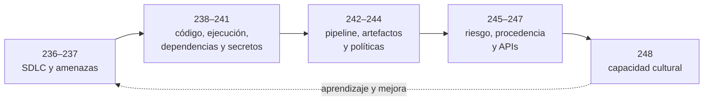

# Parte 11 — DevSecOps y seguridad del SDLC

> [⬅️ Volver al programa](../../README.md) · [📚 Índice completo](../README.md) · [⏭️ Parte siguiente](../parte-12-osint-e-ingenieria-social/README.md)

**13 clases** · rango 236–248 · Shift-left, threat modeling, SAST/DAST/SCA y supply chain

**Fuentes de referencia de esta parte:**

- Julien Vehent — *Securing DevOps: Security in the Cloud* (Manning, 2018).
- Laura Bell, Michael Brunton-Spall, Rich Smith, Jim Bird — *Agile Application Security* (O'Reilly, 2017).
- Jim Bird — *DevOpsSec* (O'Reilly, 2016).
- OWASP SAMM v2 (Software Assurance Maturity Model).
- OWASP Application Security Verification Standard (ASVS) v4.
- NIST SP 800-218 — *Secure Software Development Framework (SSDF)*.

---

## 🎯 ¿De qué trata esta parte?

DevSecOps no es una herramienta ni un producto: es la práctica de integrar la seguridad
en cada fase del ciclo de vida del software (SDLC), de forma automatizada y con el mismo
ritmo con el que los equipos hoy construyen, prueban y despliegan. En lugar de dejar la
seguridad como una auditoría al final —cuando un defecto puede exigir migraciones,
coordinación y recuperación—, la movemos hacia la izquierda del ciclo —**shift-left**—
para obtener retroalimentación mientras el cambio conserva contexto y alternativas.

Esta parte recorre el arsenal completo del ingeniero DevSecOps: modelar amenazas antes de
escribir código (STRIDE, DREAD), analizar el código propio (SAST), la aplicación en
ejecución (DAST), las dependencias de terceros (SCA), y la cadena de suministro entera
(SBOM, SLSA, firmas). Veremos cómo blindar el pipeline de CI/CD —que se ha vuelto un
objetivo de primer nivel tras incidentes como SolarWinds y Codecov—, cómo construir
imágenes de contenedor mínimas y firmadas, y cómo expresar políticas de seguridad como
código auditable con OPA.

Está pensada para desarrolladores que quieren dueño de la seguridad de lo que construyen,
para ingenieros de plataforma/SRE que operan pipelines, y para AppSec que necesitan
escalar sin ser cuello de botella. El hilo conductor es la **automatización**, integrada
con decisiones de diseño, revisión humana y observación en producción.

## 🧩 Problemas que resuelve

- Vulnerabilidades detectadas en producción cuando arreglarlas es carísimo y arriesgado.
- Equipos de AppSec convertidos en cuello de botella que frena las entregas.
- Dependencias de terceros con CVEs conocidos que entran sin control al producto.
- Secretos (API keys, tokens, contraseñas) filtrados en repositorios de código.
- Pipelines de CI/CD con permisos excesivos y sin control de integridad, usados como vector de ataque.
- Imágenes de contenedor infladas, con paquetes vulnerables y ejecutando como root.
- Ausencia de trazabilidad: nadie sabe qué componentes contiene realmente un artefacto (falta de SBOM).
- Backlog de vulnerabilidades sin priorización basada en riesgo real (explotabilidad, exposición).

## 🎓 Resultados de aprendizaje

Al terminar la parte, el alumno podrá:

- Diseñar un SDLC seguro con controles automatizados por fase y justificar shift-left mediante una estimación cuyos supuestos sean explícitos.
- Construir un modelo de amenazas de un sistema real usando STRIDE y priorizar con impacto, exposición y viabilidad; usar DREAD para estudiar sus límites históricos.
- Integrar SAST (Semgrep), DAST (OWASP ZAP) y SCA (Dependency-Check, Trivy) en un pipeline y gestionar sus falsos positivos.
- Detectar y prevenir secretos en código con gitleaks y hooks de pre-commit.
- Endurecer un pipeline de CI/CD (GitHub Actions) aplicando mínimo privilegio, pinning y aislamiento.
- Producir imágenes de contenedor mínimas, escaneadas y firmadas (cosign).
- Escribir políticas como código con OPA/Rego y validarlas con Conftest en el pipeline.
- Generar un SBOM (CycloneDX/SPDX) y explicar los niveles de SLSA para la cadena de suministro.
- Operar un programa de gestión de vulnerabilidades a escala con métricas de SLA y priorización por riesgo.

## 🧱 Prerrequisitos

- **Partes 1–2** (redes y criptografía) para entender TLS, hashes y firmas del pipeline.
- **Parte 4** (seguridad de aplicaciones web / OWASP) para SAST, DAST y seguridad de APIs.
- **Parte 10** (seguridad en la nube y contenedores) para imágenes, registries y OPA.
- Manejo práctico de Git, línea de comandos, Docker y al menos un lenguaje (Python/JS/Go).
- Nociones de CI/CD (GitHub Actions, GitLab CI o similar).

## 🗺️ Estructura temática

| Bloque | Clases | Foco |
|--------|--------|------|
| **Fundamentos y diseño** | 236, 237 | Secure SDLC, shift-left y modelado de amenazas |
| **Análisis del código y la app** | 238, 239 | SAST y DAST |
| **Terceros y secretos** | 240, 241 | SCA/dependencias y secretos en el código |
| **Pipeline y artefactos** | 242, 243 | CI/CD seguro e imágenes de contenedor |
| **Gobierno y cadena de suministro** | 244, 245, 246 | Políticas como código, gestión de vulnerabilidades, SBOM/SLSA |
| **APIs y cultura** | 247, 248 | Seguridad de APIs y cultura DevSecOps / champions |

## 🧭 Recorrido pedagógico clase a clase

La unidad está ordenada como se construye un sistema de entrega confiable: primero se decide **qué propiedades se desean**, después se producen señales sobre código y ejecución, luego se protege la fábrica de software y finalmente se crea una capacidad organizacional sostenible. Cada clase entrega una evidencia que la siguiente reutiliza.

El gráfico representa una progresión de evidencias: las propiedades del diseño alimentan los analizadores; sus resultados se gobiernan en el pipeline; el artefacto adquiere identidad y procedencia; y la organización aprende de la operación para revisar el ciclo.

1. **Clase 236 — Secure SDLC y shift-left.** Convierte el ciclo de desarrollo en un bucle de decisiones y evidencia. El alumno dibuja su flujo real, asigna controles proporcionales y distingue prevención temprana de observación en producción. Este mapa evita introducir herramientas sin saber qué decisión apoyan.
2. **Clase 237 — Modelado de amenazas.** Usa el diseño anterior para identificar activos, flujos y fronteras de confianza. STRIDE estructura preguntas; la priorización conserva supuestos explícitos y evita que DREAD se presente como cálculo científico. La evidencia es un DFD con amenazas, responsables y pruebas.
3. **Clase 238 — SAST.** Desciende del diseño al código. Explica fuentes, propagación, sumideros, confianza y supresiones trazables. El alumno no se limita a ejecutar Semgrep: reproduce un hallazgo y construye una regla con casos positivos y negativos.
4. **Clase 239 — DAST.** Observa el sistema desplegado y enseña que cobertura precede a conclusiones. El alumno configura contexto y autenticación, diferencia análisis pasivo de activo y conserva peticiones y respuestas reproducibles en un entorno autorizado.
5. **Clase 240 — SCA.** Amplía el análisis al grafo de dependencias. Relaciona manifiesto, lockfile, artefacto y avisos, y prioriza con alcance, exposición, KEV y EPSS sin confundir ninguna señal con riesgo completo.
6. **Clase 241 — Secretos.** Protege credenciales antes y después del commit. Integra hooks y CI, pero enfatiza que una filtración exige revocación, auditoría y rotación; limpiar Git no revierte una exposición.
7. **Clase 242 — Pipelines CI/CD.** Trata la automatización como infraestructura privilegiada. El alumno rastrea entradas no confiables, tokens, acciones, runners y despliegues, fija dependencias y usa identidad efímera con políticas de alcance.
8. **Clase 243 — Imágenes seguras.** Sigue el artefacto desde base y build hasta admisión y runtime. Distingue tamaño, vulnerabilidad, firma, procedencia e aislamiento y produce una imagen identificada por digest con controles justificables.
9. **Clase 244 — Política como código.** Convierte requisitos repetibles en decisiones evaluables. Separa el punto que decide del que hace cumplir, prueba reglas y diseña auditoría y excepciones temporales antes de bloquear.
10. **Clase 245 — Gestión de vulnerabilidades.** Integra las señales anteriores en una operación: normalizar, deduplicar, priorizar, asignar, tratar y verificar. La evidencia ya no es un informe de escáner, sino una cola de riesgo trazable y métricas que no premian ocultar hallazgos.
11. **Clase 246 — SBOM y SLSA.** Asegura identidad y procedencia de la entrega. El alumno vincula por digest SBOM, firma y attestation y aplica los niveles vigentes del Build Track de SLSA, comprendiendo sus garantías y límites.
12. **Clase 247 — APIs en el SDLC.** Reúne requisitos, contrato, código, pruebas y operación en una superficie concreta. La evidencia incluye pruebas negativas entre usuarios y roles, límites de recursos y telemetría sin secretos.
13. **Clase 248 — Cultura y champions.** Cierra la unidad convirtiendo controles en capacidad sostenible. Define responsabilidades, caminos seguros, comunidad, tiempo y métricas para que AppSec escale sin crear un nuevo cuello de botella.

El proyecto integrador de la parte consiste en tomar un servicio pequeño y entregar, de manera vinculada, su modelo de amenazas, pipeline endurecido, resultados triageados, artefacto por digest, SBOM/procedencia, política verificable y una propuesta operativa de ownership. La calidad se evalúa por la coherencia entre decisiones, no por la cantidad de herramientas ejecutadas.

## 🔗 Referencias de la parte

- OWASP SAMM v2 — <https://owaspsamm.org/>
- OWASP ASVS — <https://owasp.org/www-project-application-security-verification-standard/>
- OWASP DevSecOps Guideline — <https://owasp.org/www-project-devsecops-guideline/>
- NIST SP 800-218 SSDF — <https://csrc.nist.gov/pubs/sp/800/218/final>
- SLSA Framework — <https://slsa.dev/>
- Julien Vehent, *Securing DevOps*, Manning 2018.
- Bell, Brunton-Spall, Smith, Bird, *Agile Application Security*, O'Reilly 2017.

## ▶️ Empezar

[Clase 236 — Secure SDLC y filosofía shift-left](236-secure-sdlc-y-filosofia-shift-left/README.md)
