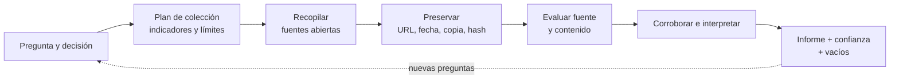

# Clase 249 — Fundamentos de OSINT

> Parte: **12 — OSINT e ingeniería social** · Fuente: *Open Source Intelligence Techniques* (M. Bazzell) · MITRE ATT&CK Reconnaissance
> ⏱️ Duración estimada: **90 min** · Nivel: **Fundamentos**

---

## 🎯 Objetivo

Comprender qué es la inteligencia de fuentes abiertas, cómo se estructura el ciclo de inteligencia y
cuáles son los límites éticos y legales que gobiernan toda recolección. Al terminar, el alumno sabrá
plantear una operación OSINT metódica, trazable y defendible, distinguiendo entre "buscar en Google"
y producir inteligencia útil a partir de datos públicos.

## 📚 Resultados de aprendizaje

Al finalizar, el alumno podrá:

1. **Definir** OSINT y diferenciarlo de HUMINT, SIGINT y otras disciplinas de inteligencia.
2. **Aplicar** el ciclo de inteligencia de cinco fases a un objetivo autorizado.
3. **Distinguir** OSINT pasivo de activo y sus implicaciones de detección y legalidad.
4. **Preparar** un entorno de investigación aislado con cuentas "sock puppet" y máquina desechable.
5. **Documentar** hallazgos con procedencia, transformaciones y control de sesgos; reconocer cuándo un proceso formal exige cadena de custodia adicional.

## 🗺️ Temas

| # | Tema | Por qué importa |
|---|------|-----------------|
| 1 | Definición y disciplinas de inteligencia | Ubica OSINT en el mapa profesional |
| 2 | Ciclo de inteligencia (5 fases) | Convierte datos en inteligencia accionable |
| 3 | Pasivo vs. activo | Determina huella y riesgo legal |
| 4 | Fuentes abiertas: taxonomía | Saber dónde mirar antes de buscar |
| 5 | Entorno de investigación seguro | Evita contaminar y ser detectado |
| 6 | Sock puppets (identidades ficticias) | Separan al investigador del objetivo |
| 7 | Ética, legalidad y sesgos | Mantiene la operación lícita y objetiva |
| 8 | Documentación y trazabilidad | Hace el hallazgo verificable y reutilizable |

## 🧠 Explicación en profundidad

### OSINT es un proceso de inteligencia, no una búsqueda grande

Una fuente abierta es información obtenible legalmente sin acceso clandestino; eso no significa que carezca de restricciones, riesgo o datos personales. **OSINT** aparece cuando esa información se selecciona, evalúa, relaciona y comunica para responder una pregunta concreta. Guardar cien enlaces es recopilación. Explicar con confianza calibrada qué hipótesis sostienen y cuáles no, preservando procedencia, es un producto de inteligencia.

El gráfico comienza por la decisión que el análisis debe apoyar. Sin ella, el investigador acumula datos interesantes pero irrelevantes. El plan define indicadores buscables, fuentes probables, restricciones legales, fecha de corte y condición para detenerse. Durante la recopilación se registra cómo se llegó a cada elemento; después se separa la evaluación de la **fuente** —quién la controla, cercanía al hecho, historial— de la evaluación del **contenido** —consistencia, fecha, posibilidad de manipulación—.

### Hecho, inferencia e hipótesis

«El certificado observado contiene este dominio» es una observación. «El dominio pertenece a la misma organización» es una inferencia que necesita contexto; puede tratarse de un proveedor o activo abandonado. «Se prepara una campaña» es una hipótesis todavía más amplia. Un informe profesional etiqueta estas capas, presenta alternativas y asigna confianza alta, media o baja con una justificación, no con porcentajes inventados.

La corroboración debe buscar independencia. Diez sitios que copian la misma publicación constituyen una sola raíz informativa. Una fuente primaria puede ser directa pero interesada; una secundaria puede aportar contraste. La ausencia de resultados tampoco demuestra ausencia del fenómeno: buscadores indexan de forma parcial, el contenido cambia y las plataformas personalizan resultados.

### Preservación, minimización y seguridad

El Berkeley Protocol ofrece un referente metodológico para recopilar, analizar y preservar información digital de manera profesional, además de considerar seguridad física, digital y psicosocial. Su ámbito original son investigaciones de derechos humanos, por lo que no convierte automáticamente cualquier captura en evidencia judicial ni sustituye la legislación local. En este curso se adoptan sus principios de trazabilidad: URL, fecha/hora, contexto, método, copia original y hash cuando corresponda.

Recopilar solo lo necesario reduce daño y sesgo. Datos públicos pueden seguir siendo sensibles. No se contacta a personas, no se eluden controles, no se publica información identificable y no se amplía el objetivo sin autorización.

### Caso razonado: cinco noticias, una sola fuente

Cinco artículos afirman que una empresa cerrará una planta. Todos enlazan un mismo mensaje anónimo. El investigador no cuenta cinco corroboraciones; registra una raíz con cinco republicaciones, busca comunicaciones regulatorias, declaraciones, ofertas laborales y cambios operacionales, y mantiene dos hipótesis. El informe concluye «evidencia insuficiente» en vez de rellenar el vacío con certeza.

## 📔 Glosario operativo

| Término | Definición útil |
|---|---|
| Requisito de inteligencia | Pregunta ligada a una decisión y a un alcance. |
| Fuente primaria | Material cercano al hecho; no garantiza neutralidad ni autenticidad. |
| Corroboración | Apoyo mediante evidencia con origen suficientemente independiente. |
| Procedencia | Registro del origen y transformaciones de un elemento. |
| Confianza analítica | Juicio explicado sobre la solidez de una conclusión. |

## ✅ Criterio de dominio

El alumno domina la clase cuando convierte una necesidad en pregunta y plan, preserva procedencia, distingue observación de inferencia, detecta fuentes dependientes y redacta una conclusión con alternativas, vacíos y confianza justificada.

## 📖 Definiciones y características

- **OSINT (Open Source Intelligence):** inteligencia derivada de información **pública y de acceso
  legal**. Característica clave: la fuente es abierta, pero el valor está en la correlación, no en el dato aislado.
- **Ciclo de inteligencia:** proceso iterativo de *dirección → recolección → procesamiento → análisis → difusión*. Característica: es cíclico; el análisis genera nuevas preguntas.
- **OSINT pasivo:** recolección que no interactúa directamente con la infraestructura del objetivo (cachés, buscadores, archivos). Característica: reduce contacto directo, pero proveedores y fuentes aún pueden registrar consultas.
- **OSINT activo:** implica tocar sistemas del objetivo (visitar su web, resolver su DNS). Característica: deja rastros en logs.
- **Identidad de investigación:** perfil separado que algunas investigaciones autorizadas usan para reducir exposición. Característica: su creación y uso requieren aprobación, necesidad y reglas de plataforma.
- **Procedencia:** registro de cómo, cuándo y de dónde se obtuvo información y qué transformaciones recibió. Característica: permite auditar el análisis; una cadena de custodia formal añade requisitos según el contexto jurídico.
- **Sesgo de confirmación:** tendencia a interpretar datos para confirmar una hipótesis previa. Característica: el principal enemigo del analista.

## 🧰 Herramientas y preparación

- **Máquina de investigación aislada:** VM (VirtualBox/VMware) con snapshot limpio, o la *Trace Labs OSINT VM* / Kali, cuando el modelo de amenaza justifique separar el entorno de las cuentas cotidianas.
- **Navegador endurecido:** Firefox con contenedores (Multi-Account Containers), sin sesión personal; opcionalmente detrás de VPN/Tor según el alcance.
- **Gestor de casos:** herramienta para notas y capturas: Obsidian, CherryTree o una plantilla Markdown; captura con Hunchly si es un engagement formal.
- **OSINT Framework** (osintframework.com) como índice de fuentes por categoría.
- **Recordatorio:** todo se hace en entorno propio/aislado y sobre objetivos autorizados o públicos legítimos.

## 🧪 Laboratorio guiado

Ejercicio aplicado y **autorizado**: OSINT sobre ti mismo (autoevaluación de huella).

1. Crea un snapshot limpio de tu VM de investigación y anota fecha/hora de inicio del caso.
2. Define la **dirección**: escribe la pregunta de inteligencia (ej.: "¿qué datos míos son públicos y podrían usarse en un pretexto contra mí?").
3. **Recolección pasiva:** busca tu nombre entre comillas en varios buscadores (Google, Bing, DuckDuckGo) y en `https://www.google.com/search?q="Tu Nombre"`. Registra cada URL y captura.
4. Consulta motores especializados: `https://haveibeenpwned.com/` para brechas asociadas a tu correo.
5. Revisa metadatos de una foto tuya pública con `exiftool foto.jpg` y anota qué revela.
6. **Procesamiento:** vuelca los datos en una tabla (dato, fuente, fecha, confianza alta/media/baja).
7. **Análisis:** correlaciona; ¿qué combinación de datos permitiría suplantarte o adivinar respuestas de seguridad?
8. **Difusión:** redacta un mini-informe de 1 página con hallazgos y recomendaciones de reducción de huella.
9. Cierra el caso: exporta notas, restaura el snapshot y documenta lecciones aprendidas.

## ✍️ Ejercicios

1. Clasifica 10 fuentes de datos como pasivas o activas y justifica cada una.
2. Dibuja el ciclo de inteligencia y describe qué ocurre si se salta la fase de "dirección".
3. Diseña en papel una política para identidades de investigación: aprobación, propósito, plataformas permitidas, prohibición de suplantar personas reales, retención y cierre. No crees ni uses una cuenta.
4. Redacta una hipótesis y luego lista 3 datos que la **refutarían**, para combatir el sesgo de confirmación.
5. Diseña la plantilla de tabla de hallazgos con columnas de confianza y verificación cruzada.
6. Investiga la diferencia entre OSINT y "doxing" y explica dónde está la frontera legal/ética.

## 📝 Reto verificable

Produce un **informe OSINT de tu propia huella** (máx. 2 páginas) que incluya: pregunta de
inteligencia, al menos 8 hallazgos con fuente y nivel de confianza, un diagrama de correlación y 5
recomendaciones concretas de reducción de exposición.
**Criterio de aceptación:** cada hallazgo es reproducible por un tercero siguiendo la fuente citada,
y el informe distingue explícitamente hechos verificados de inferencias.

## ⚠️ Errores comunes

| Síntoma / mensaje | Causa y cómo arreglar |
|-------------------|------------------------|
| El objetivo detecta la investigación | Se hizo interacción directa sin contemplarla. Revisa alcance, fuentes y entorno; no crees identidades encubiertas sin aprobación. |
| Hallazgos que no se pueden reproducir | Faltó procedencia. Registra URL, fecha, contexto y copia permitida de cada dato. |
| Conclusiones sesgadas | Se buscó confirmar una hipótesis. Formula hipótesis rivales y busca refutarlas. |
| Cuenta personal filtrada al objetivo | Se usó el navegador/sesión propios. Investiga siempre desde la VM aislada. |
| Datos "públicos" pero de origen ilegal | Un leak robado no es fuente lícita. Verifica la legalidad de la fuente. |

## ❓ Preguntas frecuentes

**❓ ¿OSINT es legal?**
Recolectar información genuinamente pública suele serlo, pero el uso, el almacenamiento de datos
personales y la interacción con el objetivo tienen límites (GDPR, leyes locales). El contexto y el
propósito determinan la legalidad.

**❓ ¿Necesito Tor o VPN siempre?**
No existe una respuesta universal. Depende del adversario, la legislación, las reglas de la organización y las fuentes consultadas. Tor o una VPN cambian qué partes observan el tráfico, pero también introducen límites y confianza; primero diseña el modelo de amenaza.

**❓ ¿Un sock puppet es engañar?**
Es una identidad de investigación, no una suplantación de una persona real. No lo uses para acceder a
sistemas privados ni para manipular a personas fuera de un engagement autorizado.

## 🔗 Referencias

- Bazzell, M. *Open Source Intelligence Techniques*. <https://inteltechniques.com/book1.html>
- MITRE ATT&CK — Reconnaissance (TA0043). <https://attack.mitre.org/tactics/TA0043/>
- OSINT Framework. <https://osintframework.com/>
- Trace Labs OSINT VM. <https://www.tracelabs.org/initiatives/osint-vm>
- Have I Been Pwned. <https://haveibeenpwned.com/>
- OHCHR y UC Berkeley — *Berkeley Protocol on Digital Open Source Investigations*. <https://www.ohchr.org/sites/default/files/2022-04/OHCHR_BerkeleyProtocol.pdf>

## 📥 Material descargable

- 📄 [Guía en PDF](./clase-249-guia.pdf) — versión imprimible de esta clase.
- 🎞️ [Presentación (PPTX)](./clase-249-presentacion.pptx) — deck para proyectar en clase.

## ⬅️ Clase anterior

[Clase 248 — Cultura DevSecOps y security champions](../../parte-11-devsecops-y-seguridad-del-sdlc/248-cultura-devsecops-y-security-champions/README.md)

## ➡️ Siguiente clase

[Clase 250 — OSINT de personas](../250-osint-de-personas/README.md)
