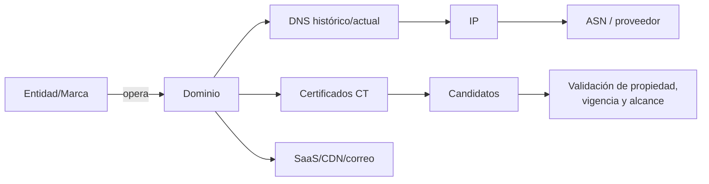

# Clase 251 — OSINT de empresas y dominios

> Parte: **12 — OSINT e ingeniería social** · Fuente: *Open Source Intelligence Techniques* (M. Bazzell) · OWASP WSTG (Information Gathering)
> ⏱️ Duración estimada: **110 min** · Nivel: **Intermedio**

---

## 🎯 Objetivo

Mapear la superficie pública de una organización a partir de su dominio: WHOIS, DNS, subdominios,
certificados, correos corporativos, tecnologías y filtraciones en repositorios. El alumno terminará
capaz de producir un inventario de exposición que alimente tanto un pentest autorizado como un plan
de reducción de huella corporativa.

## ⚖️ Nota ética

Realiza estas técnicas contra **dominios propios, de laboratorio (p. ej. `example.com`,
`scanme.nmap.org`) o de un cliente con autorización escrita**. La resolución DNS pasiva y los
registros públicos son de bajo riesgo, pero el escaneo activo del dominio requiere permiso.

## 📚 Resultados de aprendizaje

Al finalizar, el alumno podrá:

1. **Consultar** WHOIS y registros DNS para reconstruir la infraestructura de un dominio.
2. **Enumerar** subdominios de forma pasiva mediante Certificate Transparency y fuentes públicas.
3. **Descubrir** correos y patrones de nomenclatura corporativa.
4. **Identificar** tecnologías y servicios expuestos.
5. **Detectar** filtraciones en repositorios y buscar secretos expuestos.

## 🗺️ Temas

| # | Tema | Por qué importa |
|---|------|-----------------|
| 1 | WHOIS y registrantes | Revela titularidad y contactos |
| 2 | Registros DNS (A, MX, TXT, NS) | Mapa de servidores y correo |
| 3 | Certificate Transparency | Subdominios sin tocar el objetivo |
| 4 | Enumeración de subdominios | Amplía la superficie de ataque |
| 5 | Correos y nomenclatura | Base para phishing autorizado |
| 6 | Fingerprinting tecnológico | Prioriza vectores conocidos |
| 7 | Filtraciones en repos/buckets | Secretos y código expuesto |

## 🧠 Explicación en profundidad

### Una organización no coincide exactamente con su dominio

El objetivo técnico es reconstruir relaciones entre entidades legales, marcas, dominios, certificados, rangos, proveedores y servicios. Cada relación necesita un tipo y una fecha. Un subdominio observado hace tres años puede estar retirado; una IP puede pertenecer a un CDN compartido; un certificado puede incluir nombres de un proveedor. Confundir relación con propiedad conduce a atribuciones y alcances incorrectos.

Los registros DNS describen enrutamiento y delegación, no siempre propiedad. `MX` muestra quién recibe correo; `NS`, la autoridad DNS; `TXT` puede contener verificaciones y políticas. Certificate Transparency permite descubrir nombres incluidos en certificados públicos, pero una entrada no demuestra que el host siga activo ni autorizado para pruebas. RDAP reemplaza buena parte del uso de WHOIS con datos estructurados, aunque la privacidad limita registrantes.

### Del inventario a la hipótesis de riesgo

Una adquisición, rebranding o proveedor deja huellas temporales. El analista combina fuentes corporativas, registros oficiales, DNS, certificados y repositorios públicos, manteniendo fechas. Para cada activo candidato asigna estado: confirmado, probable, tercero relacionado, histórico o descartado. El resultado defensivo sirve para inventario y superficie de ataque; no concede permiso para escanear o acceder.

La tecnología detectada mediante cabeceras, archivos públicos o repositorios es una hipótesis de versión. Los banners pueden estar ocultos o ser engañosos. Una dependencia mencionada en una vacante no prueba que un sistema de producción use esa versión. Se evita convertir señales comerciales en vulnerabilidades confirmadas.

### Caso razonado: subdominio de un proveedor

Certificate Transparency revela `support.empresa.example`, que resuelve a una plataforma SaaS. El dominio está bajo la marca, pero la infraestructura y la operación pertenecen al proveedor. Para un inventario se registra la relación y el contrato; para una evaluación técnica se verifica si el proveedor está dentro del alcance. Atacar el host porque contiene el nombre de la empresa sería una inferencia operativa inválida.

## 📔 Glosario operativo

| Término | Definición útil |
|---|---|
| RDAP | Protocolo estructurado para consultar datos de registro de recursos de Internet. |
| Certificate Transparency | Registros públicos auditables de certificados emitidos. |
| ASN | Identificador de un sistema autónomo que anuncia prefijos, no sinónimo de empresa. |
| Activo candidato | Recurso relacionado que aún requiere validar propiedad y vigencia. |
| Dependencia externa | Servicio de un tercero que soporta una función de la organización. |

## ✅ Criterio de dominio

El alumno domina la clase si entrega un mapa temporal con relaciones tipadas, separa propiedad de alojamiento, valida activos con fuentes independientes y marca de forma explícita qué recursos no están autorizados para interacción técnica.

## 📖 Definiciones y características

- **WHOIS:** base de datos de registro de dominios/IP. Característica: cada vez más ofuscada por privacidad, pero útil por fechas y NS.
- **Certificate Transparency (CT):** logs públicos de certificados TLS emitidos. Característica: revela subdominios sin consultar al objetivo.
- **Enumeración pasiva de subdominios:** descubrir nombres mediante índices y fuentes de terceros sin consultar directamente cada host. Característica: reduce interacción directa, pero las fuentes consultadas conservan sus propios registros y cobertura parcial.
- **Registro TXT/SPF/DMARC:** políticas de correo publicadas en DNS. Característica: indican si el dominio es fácil de suplantar.
- **Fingerprinting:** identificar tecnologías (CMS, servidor, framework). Característica: guía la explotación posterior.
- **Secreto expuesto:** clave/API filtrada en un repo o bucket. Característica: hallazgo de alto impacto y crítico de reportar.

## 🧰 Herramientas y preparación

- **DNS/WHOIS:** `whois`, `dig`, `host`, `dnsrecon`.
- **Subdominios pasivos:** `subfinder`, `amass enum -passive`, `crt.sh` (`https://crt.sh/?q=%25.example.com`).
- **Correos y tecnologías:** `theHarvester`, Wappalyzer, `httpx`, BuiltWith.
- **Filtraciones:** GitHub dorks, `trufflehog`, `gitleaks`, buscadores de buckets S3.
- **Recordatorio:** favorece fuentes pasivas; el escaneo activo solo con autorización del alcance.

## 🧪 Laboratorio guiado

Objetivo autorizado: usa `example.com` y un dominio propio.

1. WHOIS y fechas: `whois example.com` — anota registrador, fechas y NS.
2. Registros DNS: `dig example.com ANY +noall +answer` y `dig MX example.com`.
3. Política de correo: `dig TXT example.com` — busca SPF y `dig TXT _dmarc.example.com` para DMARC.
4. Subdominios por CT: abre `https://crt.sh/?q=%25.tudominio.com` y exporta la lista.
5. Enumeración pasiva: `subfinder -d tudominio.com -silent` y `amass enum -passive -d tudominio.com`.
6. Hosts vivos: `subfinder -d tudominio.com -silent | httpx -title -tech-detect`.
7. Correos y perfiles: `theHarvester -d tudominio.com -b bing,crtsh`.
8. Filtraciones: busca en GitHub `"tudominio.com" password` y ejecuta `trufflehog git <repo-propio>`.
9. Consolida todo en un inventario de exposición con severidad y recomendación.

## ✍️ Ejercicios

1. Compara los subdominios que devuelven `crt.sh`, `subfinder` y `amass`; explica las diferencias.
2. Evalúa el SPF/DMARC de un dominio y decide si es suplantable.
3. Clasifica 5 subdominios por riesgo (panel de login, dev, staging, etc.).
4. Ejecuta `httpx -tech-detect` y prioriza 3 tecnologías por CVE conocido.
5. Deriva el patrón de correo corporativo (`nombre.apellido@`) a partir de ejemplos públicos.
6. Documenta un secreto ficticio "encontrado" y redacta la sección de reporte responsable.

## 📝 Reto verificable

Produce un **inventario de exposición** de un dominio autorizado con: subdominios vivos, tecnologías,
política de correo (SPF/DMARC) y al menos 3 recomendaciones priorizadas.
**Criterio de aceptación:** todos los subdominios se obtuvieron con métodos pasivos reproducibles y
el inventario indica, por cada ítem, la fuente y la acción de remediación sugerida.

## ⚠️ Errores comunes

| Síntoma / mensaje | Causa y cómo arreglar |
|-------------------|------------------------|
| WHOIS "redacted for privacy" | Ofuscación WHOIS. Pivota vía CT, DNS histórico y NS. |
| Pocos subdominios encontrados | Solo se usó una fuente. Combina crt.sh + subfinder + amass. |
| `httpx` marca todo como vivo | Comodines DNS. Filtra por código/título y valida manualmente. |
| Falsos secretos en trufflehog | Entropía alta pero no es clave. Verifica el contexto antes de reportar. |
| Escaneo bloqueado | Se hizo activo sin permiso o el WAF bloqueó. Mantente en pasivo salvo autorización. |

## ❓ Preguntas frecuentes

**❓ ¿crt.sh es OSINT pasivo?**
Sí: consulta logs públicos de certificados, no toca la infraestructura del objetivo, por lo que no
genera tráfico hacia él.

**❓ ¿Encontré una clave en GitHub, qué hago?**
Repórtalo por canal responsable al dueño, no la uses. En un engagement, documéntalo como hallazgo
crítico dentro del alcance acordado.

**❓ ¿SPF/DMARC importan para OSINT?**
Mucho: un dominio sin DMARC en `p=reject` es candidato a suplantación en una campaña de phishing
autorizada.

## 🔗 Referencias

- Bazzell, M. *Open Source Intelligence Techniques*. <https://inteltechniques.com/book1.html>
- OWASP WSTG — Information Gathering. <https://owasp.org/www-project-web-security-testing-guide/>
- crt.sh (Certificate Transparency). <https://crt.sh/>
- Subfinder. <https://github.com/projectdiscovery/subfinder>
- theHarvester. <https://github.com/laramies/theHarvester>

## 📥 Material descargable

- 📄 [Guía en PDF](./clase-251-guia.pdf) — versión imprimible de esta clase.
- 🎞️ [Presentación (PPTX)](./clase-251-presentacion.pptx) — deck para proyectar en clase.

## ⬅️ Clase anterior

[Clase 250 — OSINT de personas](../250-osint-de-personas/README.md)

## ➡️ Siguiente clase

[Clase 252 — OSINT en redes sociales](../252-osint-en-redes-sociales/README.md)
