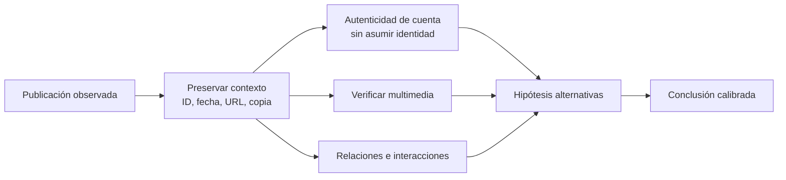

# Clase 252 — OSINT en redes sociales

> Parte: **12 — OSINT e ingeniería social** · Fuente: *Open Source Intelligence Techniques* (M. Bazzell)
> ⏱️ Duración estimada: **100 min** · Nivel: **Intermedio**

---

## 🎯 Objetivo

Aplicar técnicas de SOCMINT (social media intelligence) para analizar perfiles y actividad pública en
redes sociales, respetando términos de servicio y privacidad. El alumno terminará capaz de extraer
señales útiles —relaciones, ubicaciones, rutinas, tecnologías mencionadas— que informan una
evaluación de riesgo, sin cruzar a la vigilancia intrusiva o ilegal.

## ⚖️ Nota ética

SOCMINT solo sobre **contenido público**, tus propias cuentas o un objetivo autorizado. No accedas a
contenido privado, no crees perfiles falsos para "hacerte amigo" del objetivo fuera de un engagement
autorizado, y respeta los ToS de cada plataforma. Compilar perfiles de personas sin base legal puede
violar la protección de datos.

## 📚 Resultados de aprendizaje

Al finalizar, el alumno podrá:

1. **Identificar** las señales OSINT presentes en un perfil público (bio, geotags, red, horarios).
2. **Correlacionar** cuentas de una persona entre plataformas.
3. **Extraer** metadatos e indicios de ubicación de publicaciones públicas.
4. **Reconocer** riesgos de exposición corporativa por empleados (fotos de badges, pantallas, etc.).
5. **Documentar** hallazgos evitando sesgos y respetando la privacidad.

## 🗺️ Temas

| # | Tema | Por qué importa |
|---|------|-----------------|
| 1 | SOCMINT: qué es y sus límites | Marca el terreno legal y ético |
| 2 | Anatomía de un perfil | Cada campo es una señal |
| 3 | Correlación entre plataformas | Une la identidad dispersa |
| 4 | Geotags y ubicación | Revela rutinas y lugares |
| 5 | Análisis de red (conexiones) | Muestra relaciones y jerarquías |
| 6 | Fugas corporativas | Empleados exponen a la empresa |
| 7 | ToS y privacidad | Evita ilegalidad y baneos |

## 🧠 Explicación en profundidad

### Una plataforma muestra una versión parcial y mediada de la realidad

Las redes sociales ordenan, recomiendan y eliminan contenido mediante reglas que el investigador no controla. Una captura representa una interfaz en un momento, no todo el historial. Cuentas, métricas y publicaciones pueden ser editadas, coordinadas o automatizadas. El análisis comienza preservando el objeto original y su contexto: URL o identificador, autor declarado, fecha visible, fecha de captura, conversación, multimedia y método de acceso permitido.

Una insignia o nombre visible es una señal de la cuenta, no prueba absoluta de quién operó una publicación concreta. Se examinan historia, enlaces desde canales oficiales, coherencia temporal y posibles compromisos. La búsqueda inversa y la geolocalización ayudan con multimedia, mientras que la conversación completa evita citar fuera de contexto.

### Redes, coordinación y límites de inferencia

Un grafo representa nodos y relaciones observadas: seguir, mencionar, responder, compartir. Una arista no equivale a amistad, mando ni coordinación. Para sostener coordinación se buscan patrones temporales, contenido inusualmente similar, secuencias y comportamiento repetido, y se consideran explicaciones como noticias populares o automatización legítima. Las métricas de centralidad describen el grafo recolectado, condicionado por la API y la muestra; no revelan automáticamente al «líder» real.

Las APIs, términos de servicio y normas de privacidad delimitan la recopilación. Automatizar navegación o crear identidades encubiertas puede infringir reglas y aumentar riesgo; esta clase trabaja con datos propios, cuentas de laboratorio o conjuntos publicados para investigación. No se contacta, persuade ni perfila a individuos reales.

### Caso razonado: publicación viral fuera de fecha

Un video se comparte como prueba de un incidente actual. La búsqueda inversa encuentra copias de dos años antes y los edificios no coinciden con el lugar afirmado. El analista conserva la publicación actual, enlaza el material anterior y concluye que el video está descontextualizado; no concluye quién lo publicó primero ni la intención de cada usuario. La verificación responde una pregunta concreta sin inventar motivaciones.

## 📔 Glosario operativo

| Término | Definición útil |
|---|---|
| Contexto conversacional | Publicaciones y respuestas necesarias para interpretar un mensaje. |
| Grafo observado | Red limitada por la muestra y las relaciones disponibles. |
| Coordinación | Comportamiento conjunto que requiere más evidencia que contenido parecido. |
| Descontextualización | Uso de material auténtico con fecha, lugar o significado incorrecto. |
| Identificador de publicación | Clave estable de plataforma preferible a una captura aislada. |

## ✅ Criterio de dominio

Existe dominio cuando el alumno preserva una publicación con contexto, evalúa cuenta, tiempo, multimedia y red por separado, formula alternativas y explica cómo la plataforma y el método de colección limitan su conclusión.

## 📖 Definiciones y características

- **SOCMINT:** inteligencia derivada de redes sociales. Característica: alta densidad de datos personales, alto riesgo ético.
- **Geotag:** metadato o etiqueta de ubicación en una publicación. Característica: permite reconstruir movimientos.
- **Análisis de red social:** estudio de conexiones entre cuentas. Característica: revela círculos y personas clave.
- **Pattern of life:** patrón de vida (rutinas, horarios) deducido de la actividad. Característica: base para pretextos y también para riesgo físico.
- **Scraping:** extracción automatizada de contenido. Característica: útil pero frecuentemente contra ToS; usar con cautela.
- **Exposición corporativa:** datos de la empresa filtrados por empleados. Característica: vector real (fotos de oficinas, insignias, software).

## 🧰 Herramientas y preparación

- **Sock puppets** por plataforma, sin vínculo a tu identidad; navegador con contenedores.
- **Búsqueda y agregación:** operadores de búsqueda avanzados, `whatsmyname`, agregadores públicos.
- **Análisis:** capturas con marca de tiempo, hojas de correlación; para grafos, Maltego (Clase 255).
- **Verificación de imágenes:** búsqueda inversa (Google Lens, Yandex) — enlaza con la Clase 253.
- **Recordatorio:** solo contenido público; nada de solicitar amistad al objetivo fuera de un engagement.

## 🧪 Laboratorio guiado

Objetivo: **tus propias cuentas** o una cuenta pública de prueba/consentida.

1. Inventaria tus perfiles públicos y captura cada bio, foto y enlace con fecha.
2. Extrae señales: ubicación declarada, empleador, intereses, cuentas enlazadas.
3. Correlaciona un alias entre plataformas con `whatsmyname` y verifica manualmente.
4. Busca geotags: revisa publicaciones públicas con ubicación y traza un mapa de lugares frecuentes.
5. Deriva un **pattern of life** aproximado (horarios de publicación, días activos).
6. Simula la perspectiva de un atacante: ¿qué pretexto construirías con estos datos?
7. Identifica una posible fuga corporativa (foto con pantalla, credencial, software visible).
8. Redacta recomendaciones de reducción de exposición para ti y para tu empresa.

## ✍️ Ejercicios

1. Analiza un perfil propio y lista 10 señales OSINT ordenadas por sensibilidad.
2. Explica por qué el "pattern of life" es peligroso incluso sin datos "secretos".
3. Correlaciona dos cuentas por estilo, foto o enlaces y asigna un nivel de confianza.
4. Encuentra una publicación con geotag y descríbela sin exponer datos de terceros.
5. Redacta una política de 5 puntos para que empleados no filtren datos corporativos.
6. Investiga qué prohíben los ToS de una red sobre scraping y automatización.

## 📝 Reto verificable

Entrega un **informe SOCMINT de auto-exposición** con al menos 8 señales, una correlación entre
plataformas y un mapa de "pattern of life", más un plan de mitigación.
**Criterio de aceptación:** el informe solo usa contenido público, cita la fuente de cada señal y
propone al menos 5 acciones concretas de reducción de huella.

## ⚠️ Errores comunes

| Síntoma / mensaje | Causa y cómo arreglar |
|-------------------|------------------------|
| Cuenta baneada/limitada | Scraping agresivo o sock puppet inconsistente. Reduce ritmo, mejora la coherencia del perfil. |
| Correlación equivocada | Estilo similar no es prueba. Exige múltiples indicios convergentes. |
| Filtración de tu identidad | Diste "like" o seguiste con tu cuenta real. Usa siempre el sock puppet. |
| Datos privados en el informe | Se incluyó contenido no público. Elimínalo; solo va lo público. |
| Geotag mal interpretado | Ubicación de la foto ≠ ubicación de residencia. Corrobora con más datos. |

## ❓ Preguntas frecuentes

**❓ ¿Puedo pedir amistad al objetivo para ver su contenido?**
Solo dentro de un engagement autorizado con reglas claras. Fuera de eso es manipulación y puede ser
ilegal o violar ToS.

**❓ ¿El scraping es legal?**
Depende de la jurisdicción y los ToS. El contenido público tiene menos protección, pero automatizar
extracciones suele violar términos y puede tener consecuencias legales.

**❓ ¿Qué es lo más peligroso que expone la gente?**
El pattern of life y las fotos con metadatos/entorno visible (badges, matrículas, pantallas), más
útiles para un atacante que un dato aislado.

## 🔗 Referencias

- Bazzell, M. *Open Source Intelligence Techniques*. <https://inteltechniques.com/book1.html>
- Bellingcat — Online Investigation Toolkit. <https://www.bellingcat.com/>
- WhatsMyName. <https://github.com/WebBreacher/WhatsMyName>
- OSINT Framework — Social Networks. <https://osintframework.com/>

## 📥 Material descargable

- 📄 [Guía en PDF](./clase-252-guia.pdf) — versión imprimible de esta clase.
- 🎞️ [Presentación (PPTX)](./clase-252-presentacion.pptx) — deck para proyectar en clase.

## ⬅️ Clase anterior

[Clase 251 — OSINT de empresas y dominios](../251-osint-de-empresas-y-dominios/README.md)

## ➡️ Siguiente clase

[Clase 253 — Geolocalización y análisis de imágenes](../253-geolocalizacion-y-analisis-de-imagenes/README.md)
