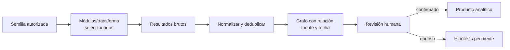

# Clase 255 — Automatización de OSINT: SpiderFoot y Maltego

> Parte: **12 — OSINT e ingeniería social** · Fuente: Documentación de SpiderFoot y Maltego · *Open Source Intelligence Techniques* (M. Bazzell)
> ⏱️ Duración estimada: **120 min** · Nivel: **Avanzado**

---

## 🎯 Objetivo

Escalar el OSINT manual mediante herramientas de automatización y correlación gráfica: SpiderFoot
para recolección masiva por módulos y Maltego para análisis de enlaces (link analysis). El alumno
terminará capaz de orquestar escaneos, gestionar claves de API y transformar datos dispersos en
grafos de relaciones interpretables, sin perder el control ético del alcance.

## ⚖️ Nota ética

Ejecuta estas herramientas sobre **objetivos autorizados o propios**. La automatización puede pasar
fácilmente de pasiva a activa (resolución DNS, peticiones a la web del objetivo): revisa los módulos y
respeta el alcance. Un escaneo masivo no autorizado puede ser detectado y ser ilegal.

## 📚 Resultados de aprendizaje

Al finalizar, el alumno podrá:

1. **Configurar** SpiderFoot, sus módulos y claves de API.
2. **Distinguir** módulos pasivos de activos y limitar el alcance del escaneo.
3. **Interpretar** correlaciones y grafos de resultados.
4. **Modelar** entidades y ejecutar transforms en Maltego.
5. **Consolidar** la salida automatizada en inteligencia depurada y verificada.

## 🗺️ Temas

| # | Tema | Por qué importa |
|---|------|-----------------|
| 1 | Automatización vs. OSINT manual | Escala pero exige control |
| 2 | SpiderFoot: módulos y scans | Recolección multi-fuente |
| 3 | Gestión de API keys | Amplía la cobertura |
| 4 | Pasivo vs. activo en módulos | Evita tocar al objetivo sin permiso |
| 5 | Maltego: entidades y transforms | Link analysis visual |
| 6 | Grafos y correlación | Ver relaciones ocultas |
| 7 | Depuración de resultados | Falsos positivos y verificación |

## 🧠 Explicación en profundidad

### Automatizar amplía cobertura y también errores

SpiderFoot y Maltego convierten semillas en consultas y relaciones. Son útiles para repetir tareas, conservar caminos y encontrar candidatos, pero no validan automáticamente identidad, propiedad ni actualidad. Un error temprano —dos homónimos fusionados o un dominio compartido— se propaga por todo el grafo y produce una historia visual convincente pero falsa.

El diagrama coloca la revisión después del grafo, no porque solo se revise al final, sino para recordar que una arista generada es una afirmación que necesita procedencia. Cada nodo debería conservar tipo y normalización; cada relación, transform, fuente, hora y confianza. Deduplicar por texto puede unir entidades distintas, mientras no deduplicar puede inflar centralidad.

### Diseñar un flujo reproducible

Se parte de una pregunta y módulos necesarios, no de «ejecutar todo». Los módulos pueden consultar servicios externos, consumir cuotas, transmitir la semilla o realizar actividad directa; se revisan sus comportamientos y términos. Se limita concurrencia, se aíslan credenciales y se evita cargar datos personales en servicios no aprobados.

Una ejecución reproducible conserva versión de herramienta, configuración, semillas, fecha y exportación original. Los resultados cambian porque Internet cambia; repetir no significa obtener lo mismo, sino poder explicar el procedimiento. Para análisis a largo plazo se comparan snapshots en vez de sobrescribirlos.

### Grafos que apoyan, no sustituyen, el razonamiento

El color y el tamaño de un nodo pueden representar confianza, tipo o centralidad, pero la leyenda debe decirlo. Un nodo central en la muestra puede ser un CDN o servicio compartido. Los caminos relevantes se inspeccionan contra sus fuentes y se exporta un informe textual con hechos e inferencias; la captura del grafo por sí sola no es una conclusión.

### Caso razonado: dominio compartido que une dos empresas

Un transform relaciona dos organizaciones mediante la misma IP. La visualización sugiere infraestructura común, pero la IP pertenece a un hosting masivo. El analista cambia la relación a «alojado por», añade el proveedor y evita fusionar las organizaciones. Después busca certificados y registros oficiales para evaluar vínculos reales. La automatización encontró una coincidencia; la revisión determinó su significado.

## 📔 Glosario operativo

| Término | Definición útil |
|---|---|
| Semilla | Entidad inicial autorizada desde la que comienza la expansión. |
| Transform/módulo | Operación que consulta o deriva relaciones. |
| Normalización | Conversión a formas comparables sin asumir identidad. |
| Arista | Relación tipada entre nodos, con fuente y tiempo. |
| Propagación de error | Ampliación de una asociación incorrecta a resultados posteriores. |

## ✅ Criterio de dominio

El alumno domina la automatización cuando selecciona módulos por pregunta y riesgo, conserva configuración y procedencia, revisa relaciones críticas y entrega un grafo cuya leyenda, fuentes y límites permiten auditarlo.

## 📖 Definiciones y características

- **SpiderFoot:** framework de recolección OSINT por módulos. Característica: automatiza cientos de fuentes y correlaciona.
- **Módulo:** plugin que consulta una fuente concreta. Característica: unos son pasivos, otros hacen peticiones activas.
- **Maltego:** herramienta de link analysis basada en entidades y transforms. Característica: convierte datos en grafos navegables.
- **Transform:** operación que, dada una entidad, devuelve entidades relacionadas. Característica: el motor del pivoteo en Maltego.
- **Entidad:** nodo del grafo (dominio, correo, persona, IP). Característica: unidad básica del análisis.
- **Correlación:** regla que agrupa hallazgos relevantes. Característica: reduce ruido y prioriza.

## 🧰 Herramientas y preparación

- **SpiderFoot:** `pip install spiderfoot` o vía Docker; arranca la UI con `python3 sf.py -l 127.0.0.1:5001`.
- **API keys:** registra claves gratuitas (Shodan, HIBP, VirusTotal, etc.) en Settings para enriquecer.
- **Maltego:** edición Community (CE) gratuita; registra una cuenta y añade transform hubs.
- **Entorno aislado** y sock puppets ya listos; documenta el alcance antes de escanear.
- **Recordatorio:** define el objetivo autorizado y desactiva módulos activos si el alcance es solo pasivo.

## 🧪 Laboratorio guiado

Objetivo: **un dominio propio** o `example.com`.

1. Arranca SpiderFoot y crea un scan nuevo con el dominio como objetivo.
2. Selecciona el modo **"Passive"** para no tocar al objetivo; revisa qué módulos se activan.
3. Añade una API key (p. ej. Shodan) en Settings y repite un scan para comparar la cobertura.
4. Explora los resultados por tipo de dato (correos, subdominios, IPs) y abre la vista de correlaciones.
5. Exporta los hallazgos a CSV/GEXF para análisis externo.
6. En Maltego CE, crea un grafo, arrastra una entidad *Domain* con tu dominio.
7. Ejecuta transforms (DNS, MX, To Website, To Email) y observa cómo crece el grafo.
8. Depura: elimina falsos positivos, agrupa entidades y anota niveles de confianza.
9. Redacta un informe que combine la salida de ambas herramientas con verificación manual.

## ✍️ Ejercicios

1. Compara un scan pasivo vs. uno con módulos activos y explica las diferencias de huella.
2. Documenta cómo una API key cambia el volumen y calidad de resultados.
3. Construye un grafo Maltego de al menos 15 entidades a partir de un dominio.
4. Identifica 3 correlaciones útiles de SpiderFoot y verifícalas a mano.
5. Explica un caso en que la automatización generó un falso positivo y cómo lo detectaste.
6. Diseña un flujo que combine SpiderFoot (recolección) y Maltego (visualización).

## 📝 Reto verificable

Entrega un **informe OSINT automatizado** de un objetivo autorizado que incluya: configuración del
scan (modo y módulos), grafo de relaciones exportado y una tabla de hallazgos verificados
manualmente con nivel de confianza.
**Criterio de aceptación:** el informe demuestra que el escaneo respetó el alcance (pasivo si así se
definió) y cada hallazgo relevante fue verificado fuera de la herramienta.

## ⚠️ Errores comunes

| Síntoma / mensaje | Causa y cómo arreglar |
|-------------------|------------------------|
| Escaneo genera mucho tráfico al objetivo | Se activaron módulos activos. Cambia a modo pasivo o limita módulos. |
| Pocos resultados | Faltan API keys. Configúralas en Settings. |
| Grafo Maltego saturado e ilegible | Demasiadas entidades. Filtra, agrupa y usa layouts. |
| Transforms fallan | Cuota agotada o transform hub no instalado. Revisa límites y reintenta. |
| Resultados contradictorios | Fuentes desactualizadas. Verifica manualmente antes de concluir. |

## ❓ Preguntas frecuentes

**❓ ¿SpiderFoot es siempre pasivo?**
No. Tiene módulos activos que consultan al objetivo (DNS, HTTP). Usa el modo pasivo si tu alcance lo
exige.

**❓ ¿Maltego CE sirve profesionalmente?**
Para aprender y grafos pequeños sí. Tiene límites de entidades por transform; la edición comercial
levanta esos límites.

**❓ ¿La automatización reemplaza al analista?**
No. Recolecta a escala, pero el juicio, la verificación y la interpretación siguen siendo humanos.

## 🔗 Referencias

- SpiderFoot — Docs. <https://github.com/smicallef/spiderfoot>
- Maltego — Learn. <https://www.maltego.com/>
- Bazzell, M. *Open Source Intelligence Techniques*. <https://inteltechniques.com/book1.html>
- OSINT Framework. <https://osintframework.com/>

## 📥 Material descargable

- 📄 [Guía en PDF](./clase-255-guia.pdf) — versión imprimible de esta clase.
- 🎞️ [Presentación (PPTX)](./clase-255-presentacion.pptx) — deck para proyectar en clase.

## ⬅️ Clase anterior

[Clase 254 — OSINT técnico: Shodan y Censys](../254-osint-tecnico-shodan-y-censys/README.md)

## ➡️ Siguiente clase

[Clase 256 — Fundamentos de ingeniería social](../256-fundamentos-de-ingenieria-social/README.md)
