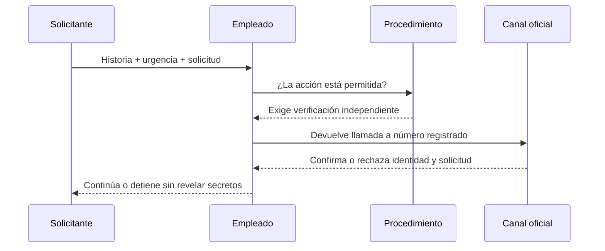

# Clase 257 — Pretexting y vishing

> Parte: **12 — OSINT e ingeniería social** · Fuente: *Social Engineering: The Science of Human Hacking* (C. Hadnagy)
> ⏱️ Duración estimada: **100 min** · Nivel: **Avanzado**

---

## 🎯 Objetivo

Aprender a construir pretextos verosímiles y a ejecutar vishing (voice phishing) dentro de un
engagement autorizado, así como a documentar y medir estos vectores. El alumno terminará capaz de
diseñar un guion, preparar identidades de apoyo y realizar una llamada de prueba controlada, siempre
con permiso escrito y con foco en la mejora de la defensa.

## ⚖️ Nota ética y legal

El pretexting y el vishing implican **engañar a personas reales**, por lo que requieren **autorización
explícita y por escrito** de la organización objetivo, respeto a la legislación (grabación de
llamadas, suplantación, protección de datos) y un plan de cuidado de las personas. Nunca llames a
alguien sin que su organización lo haya autorizado. Practica los guiones **entre compañeros que
consientan**, no contra terceros.

## 📚 Resultados de aprendizaje

Al finalizar, el alumno podrá:

1. **Construir** un pretexto coherente a partir del OSINT previo.
2. **Redactar** un guion de vishing con objetivos y ramas de conversación.
3. **Aplicar** técnicas de elicitación y manejo de objeciones de forma ética.
4. **Preparar** el soporte de identidad (número, contexto, spoofing legalmente permitido).
5. **Documentar** la llamada y extraer métricas defensivas.

## 🗺️ Temas

| # | Tema | Por qué importa |
|---|------|-----------------|
| 1 | Anatomía de un pretexto | Credibilidad = éxito o fracaso |
| 2 | Del OSINT al guion | Los datos dan verosimilitud |
| 3 | Elicitación conversacional | Obtener sin preguntar directo |
| 4 | Manejo de objeciones | Superar la desconfianza sin coerción |
| 5 | Vishing: preparación técnica | Números, spoofing, entorno |
| 6 | Grabación y legalidad | Consentimiento y jurisdicción |
| 7 | Debrief y métricas | Convertir el ejercicio en aprendizaje |

## 🧠 Explicación en profundidad

### El pretexto crea una razón para saltarse un control

En *pretexting*, la historia conecta identidad, contexto y solicitud: «soy soporte, hay una incidencia y necesito verificar tu código». En *vishing*, la voz añade sincronía, presión y dificultad para consultar. La señal más importante no es si la historia suena profesional, sino si pide una acción que el proceso normal no debería permitir: revelar un secreto, instalar software, transferir fondos o aprobar una notificación inesperada.

El diagrama reemplaza la intuición por un procedimiento. La identificación de llamada, la voz y datos personales pueden falsificarse u obtenerse de fuentes abiertas. La devolución se hace a un directorio confiable, no al número dictado por quien llama. Soporte legítimo no necesita pedir contraseña ni código OTP; una aprobación MFA inesperada se rechaza y reporta.

### Diseñar protocolos para momentos de presión

Los guiones defensivos deben ser breves: «No puedo validar esta solicitud en una llamada entrante; abriré un ticket y devolveré el contacto por el directorio oficial». También se requiere una ruta para excepciones reales: emergencias, personal remoto o accesibilidad. Si verificar toma veinte minutos y el trabajo exige rapidez, las personas buscarán atajos. El control debe ser usable.

Las señales de audio sintético o número alterado pueden ayudar, pero no constituyen una prueba confiable para el usuario. La defensa robusta autentica la transacción: número registrado, ticket existente, doble aprobación y límites de rol. Incluso una voz auténtica puede pertenecer a una cuenta comprometida o a una persona coaccionada.

### Simulación autorizada

Una práctica de vishing usa actores informados, números controlados, guion aprobado y datos ficticios. No graba sin base legal, no busca secretos reales y detiene el ejercicio si surge una situación sensible. Se evalúa si se usó el canal de verificación y si el reporte llegó con información accionable, no la capacidad teatral del evaluador.

### Caso razonado: técnico que conoce el inventario

Una llamada menciona el modelo exacto del portátil y un ticket real visto en una filtración de correo. El empleado no discute esos datos; abre el portal oficial, comprueba que el ticket no solicita instalación y llama a soporte desde el directorio. Reporta número, hora y pretexto. La conclusión no depende de detectar una voz falsa, sino de mantener la frontera del proceso.

## 📔 Glosario operativo

| Término | Definición útil |
|---|---|
| Pretexting | Uso de una historia para legitimar identidad y solicitud. |
| Vishing | Ingeniería social mediante voz o telefonía. |
| Callback | Devolución por un número obtenido de una fuente confiable. |
| MFA fatigue | Presión mediante solicitudes repetidas de aprobación. |
| Autenticación de transacción | Verificación específica de la acción, no solo de la persona. |

## ✅ Criterio de dominio

El alumno domina la clase cuando reconoce la acción sensible bajo un pretexto convincente, ejecuta verificación independiente, conserva datos útiles para respuesta y diseña un ejercicio seguro centrado en el proceso.

## 📖 Definiciones y características

- **Pretexting:** crear un escenario/identidad falsa para justificar una petición. Característica: se sostiene en detalles obtenidos por OSINT.
- **Vishing:** phishing por voz/teléfono. Característica: la voz añade presión y autoridad en tiempo real.
- **Elicitación:** extraer información con conversación natural. Característica: la persona no percibe que está siendo interrogada.
- **Caller ID spoofing:** falsificar el número que aparece al receptor. Característica: legal solo en contextos autorizados y según jurisdicción.
- **Objeción:** resistencia del objetivo ("no puedo darte eso"). Característica: se maneja con empatía, no con presión abusiva.
- **Debrief:** reunión posterior para explicar el ejercicio. Característica: protege a las personas y consolida el aprendizaje.

## 🧰 Herramientas y preparación

- **Guion y árbol de decisión:** documento con objetivo, apertura, ramas y salida.
- **Telefonía de prueba:** VoIP (p. ej. un softphone) con número dedicado del engagement; spoofing solo si el contrato y la ley lo permiten.
- **Grabación:** con consentimiento y cumplimiento legal; almacenamiento seguro de la evidencia.
- **Entorno de ensayo:** compañeros que consientan para practicar el guion sin objetivos reales.
- **Recordatorio:** sin autorización escrita de la organización objetivo, no hay llamada real.

## 🧪 Laboratorio guiado (autorizado / entre compañeros)

1. Toma el dossier OSINT de un objetivo **de laboratorio** (empresa ficticia) y extrae datos útiles.
2. Define el **objetivo de la llamada** (ej.: verificar si el helpdesk resetea contraseñas sin validar identidad).
3. Redacta el pretexto: identidad, motivo creíble, urgencia moderada, coherencia con el OSINT.
4. Escribe el guion con apertura, 3 ramas de conversación y una salida limpia.
5. Ensaya con un compañero que hace de "objetivo"; graba solo con su consentimiento.
6. Practica la elicitación: obtén un dato objetivo sin preguntarlo de forma directa.
7. Maneja una objeción ("no doy esa información") con empatía y sin coacción.
8. Haz el **debrief**: explica el ejercicio, agradece y anota qué controles fallaron.
9. Registra métricas: ¿se validó la identidad?, ¿se reportó la llamada sospechosa?

## ✍️ Ejercicios

1. Escribe dos pretextos para el mismo objetivo y compara su verosimilitud.
2. Convierte 5 datos OSINT en frases que refuercen la credibilidad del guion.
3. Redacta 3 técnicas de elicitación y ensáyalas con un compañero.
4. Diseña respuestas éticas a 4 objeciones comunes.
5. Investiga la legalidad de grabar llamadas y del spoofing en tu país.
6. Propón un control de helpdesk que frustre tu propio pretexto.

## 📝 Reto verificable

Diseña y ensaya (entre compañeros que consientan) una **llamada de vishing de laboratorio** con
guion, pretexto sustentado en OSINT, manejo de una objeción y un debrief documentado.
**Criterio de aceptación:** el ejercicio no involucra a terceros no consintientes, respeta la ley de
grabación y produce al menos dos recomendaciones defensivas concretas para el helpdesk.

## ⚠️ Errores comunes

| Síntoma / mensaje | Causa y cómo arreglar |
|-------------------|------------------------|
| El objetivo desconfía de inmediato | Pretexto incoherente con el OSINT. Refuerza detalles y naturalidad. |
| Presión excesiva sobre la persona | Cruzaste a la coacción. Usa empatía; el objetivo es probar controles, no doblegar personas. |
| Problema legal por grabar | No hubo consentimiento/aviso. Verifica la ley antes de grabar. |
| Sin datos útiles tras la llamada | Faltó objetivo claro. Define qué información/acción concreta buscas. |
| Persona molesta tras el ejercicio | No hubo debrief. Explica siempre y cuida a las personas. |

## ❓ Preguntas frecuentes

**❓ ¿Puedo falsificar el número (spoofing)?**
Solo si el contrato lo autoriza y la ley de tu jurisdicción lo permite. En muchos lugares el spoofing
fuera de pruebas autorizadas es delito.

**❓ ¿Qué hago si logro comprometer algo real?**
Detente, documenta y escala según las Rules of Engagement. No profundices más allá del alcance.

**❓ ¿El vishing sigue funcionando?**
Sí, es de los vectores más efectivos: la voz añade autoridad y urgencia que el correo no transmite.

## 🔗 Referencias

- Hadnagy, C. *Social Engineering: The Science of Human Hacking*. Wiley.
- Social-Engineer — Vishing resources. <https://www.social-engineer.org/>
- MITRE ATT&CK — Phishing: Voice (T1566.004). <https://attack.mitre.org/techniques/T1566/004/>
- Cialdini, R. *Influence: The Psychology of Persuasion*.

## 📥 Material descargable

- 📄 [Guía en PDF](./clase-257-guia.pdf) — versión imprimible de esta clase.
- 🎞️ [Presentación (PPTX)](./clase-257-presentacion.pptx) — deck para proyectar en clase.

## ⬅️ Clase anterior

[Clase 256 — Fundamentos de ingeniería social](../256-fundamentos-de-ingenieria-social/README.md)

## ➡️ Siguiente clase

[Clase 258 — Campañas de phishing con GoPhish](../258-campanas-de-phishing-con-gophish/README.md)
