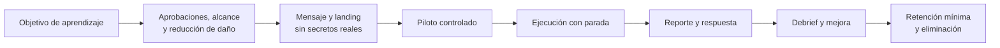

# Clase 258 — Campañas de phishing con GoPhish

> Parte: **12 — OSINT e ingeniería social** · Fuente: Documentación de GoPhish · *Social Engineering* (C. Hadnagy)
> ⏱️ Duración estimada: **120 min** · Nivel: **Avanzado**

---

## 🎯 Objetivo

Montar y operar una campaña de phishing controlada con GoPhish para medir la resiliencia de una
organización autorizada. El alumno terminará capaz de desplegar la plataforma, crear plantillas y
landing pages, lanzar la campaña contra un grupo consentido y analizar métricas para reforzar la
concienciación, sin robar credenciales reales ni causar daño.

## ⚖️ Nota ética y legal

Las simulaciones de phishing solo se ejecutan sobre **destinatarios de tu organización con
autorización escrita de la dirección**, o en un **laboratorio propio con cuentas de prueba**. No
lances campañas contra terceros. No captures ni almacenes contraseñas reales: usa páginas que solo
registren el evento, no la credencial. Informa y forma tras la campaña (no castigues).

## 📚 Resultados de aprendizaje

Al finalizar, el alumno podrá:

1. **Desplegar** GoPhish en un entorno aislado y configurarlo con TLS.
2. **Crear** sending profile, plantilla de correo, landing page y grupos objetivo.
3. **Lanzar** una campaña y monitorizar aperturas, clics y envíos de formulario.
4. **Interpretar** métricas y traducirlas en acciones de formación.
5. **Redactar** un informe ejecutivo orientado a mejorar la defensa.

## 🗺️ Temas

| # | Tema | Por qué importa |
|---|------|-----------------|
| 1 | Arquitectura de GoPhish | Cómo encajan sus piezas |
| 2 | Sending profile (SMTP) | Canal de envío controlado |
| 3 | Plantillas de correo | El gancho y sus palancas |
| 4 | Landing pages | Captura de evento sin robar credenciales |
| 5 | Grupos y segmentación | A quién y cómo se prueba |
| 6 | Métricas y tracking | Medir resiliencia real |
| 7 | Informe y formación | Cerrar el ciclo educativo |

## 🧠 Explicación en profundidad

### Una simulación es una intervención educativa con riesgo propio

GoPhish facilita plantillas, envío, páginas y eventos, pero la herramienta no convierte una campaña en ética ni útil. Antes se define la pregunta: ¿el canal de reporte funciona?, ¿un proceso financiero resiste una solicitud falsa?, ¿la autenticación técnica impide reutilizar credenciales? La población, el mensaje y la métrica se eligen para esa pregunta y reciben aprobación de seguridad, legal, RR. HH. y responsables del servicio según el contexto.

El diagrama incluye piloto, parada, *debrief* y eliminación porque enviar mensajes es solo una fase. Se excluyen temas que puedan causar daño —despidos, salud, emergencias familiares—, poblaciones especialmente sensibles y periodos críticos. La página de práctica nunca valida ni almacena contraseñas reales. Si se necesita medir intento de ingreso, basta registrar el evento local y mostrar educación inmediata; los campos contienen valores ficticios o se descartan antes de persistir.

### Métricas que apoyan decisiones

La apertura es poco fiable por bloqueos de imágenes y escáneres automáticos. El clic también puede provenir de un sandbox. El reporte mediante el canal esperado, el tiempo hasta que SOC recibe una señal útil, la contención y la repetición de fallos de proceso ofrecen más contexto. Las métricas se agregan; el seguimiento individual solo se usa si fue aprobado, necesario y comunicado. Comparar tasas entre campañas con dificultades distintas induce conclusiones falsas.

### Infraestructura y coordinación defensiva

El dominio, DKIM/SPF/DMARC, listas y horarios se configuran sobre infraestructura autorizada. SOC conoce el ejercicio mediante un mecanismo que permita evaluar el playbook sin provocar una respuesta externa innecesaria. Existe contacto de emergencia para detener envíos, retirar la página y atender dudas. Los mensajes se explican en el *debrief*, conforme a la política aprobada.

### Caso razonado: 0 % de clics, defensa no demostrada

Una campaña produce cero clics. El equipo celebra, pero el gateway bloqueó todos los correos y nadie evaluó reporte, autenticación ni proceso. La conclusión correcta es que el control de correo funcionó para ese patrón; no que las personas sean inmunes. El siguiente ejercicio autorizado prueba una solicitud ficticia de cambio financiero sin enlace y mide callback y doble aprobación.

## 📔 Glosario operativo

| Término | Definición útil |
|---|---|
| Landing de simulación | Página controlada que educa y no captura secretos reales. |
| Parada de emergencia | Procedimiento para detener envíos y retirar infraestructura. |
| Debrief | Explicación posterior que conecta señales, proceso y aprendizaje. |
| Métrica agregada | Resultado grupal que reduce exposición individual. |
| Escáner automático | Sistema que puede abrir enlaces y contaminar métricas. |

## ✅ Criterio de dominio

Existe dominio cuando el alumno diseña una campaña aprobada desde una pregunta defensiva, minimiza datos y daño, distingue eventos humanos de automatizados, prepara respuesta y traduce resultados en mejoras de controles y procesos.

## 📖 Definiciones y características

- **GoPhish:** framework open source para simulacros de phishing. Característica: gestiona campañas y métricas de principio a fin.
- **Sending profile:** configuración SMTP de envío. Característica: define remitente y servidor de la campaña.
- **Landing page:** página a la que llega la víctima al hacer clic. Característica: en un simulacro ético, registra el evento, no la contraseña.
- **Tracking pixel:** imagen que detecta la apertura del correo. Característica: mide aperturas sin interacción.
- **Grupo objetivo:** lista de destinatarios autorizados. Característica: define el alcance del simulacro.
- **Tasa de reporte:** porcentaje que reporta el correo como sospechoso. Característica: la métrica defensiva más valiosa.

## 🧰 Herramientas y preparación

- **GoPhish:** descarga el binario de `getgophish.com`, ejecútalo en una VM aislada; primer login con la contraseña que muestra el log.
- **Servidor de correo de laboratorio:** MailHog/Postfix propio o un SMTP de pruebas; **nunca** un dominio ajeno.
- **Dominio y TLS de prueba:** para landing pages; certificado Let's Encrypt en el lab.
- **Grupo de prueba:** cuentas propias o compañeros consintientes.
- **Recordatorio:** este ejercicio se hace contra tu propio entorno o con autorización escrita; las landing pages no almacenan credenciales reales.

## 🧪 Laboratorio guiado (entorno propio / autorizado)

1. Arranca GoPhish en la VM y accede al panel `https://127.0.0.1:3333`; cambia la contraseña inicial.
2. Crea un **Sending Profile** apuntando a tu SMTP de laboratorio (MailHog/Postfix).
3. Diseña una **Email Template** con un pretexto realista (ej.: "actualiza tu acceso") y añade el tracking.
4. Crea una **Landing Page** que muestre un mensaje educativo tras el clic; **desactiva** la captura de contraseñas.
5. Define un **Users & Groups** con cuentas de prueba propias.
6. Lanza la **Campaign** enlazando profile, template, page y grupo; envía a las cuentas de laboratorio.
7. Observa el dashboard en tiempo real: enviados, abiertos, clicados, formularios.
8. Simula que un usuario **reporta** el correo y registra ese comportamiento como positivo.
9. Exporta resultados y redacta un informe con tasa de clic, de reporte y recomendaciones formativas.

## ✍️ Ejercicios

1. Crea dos plantillas con distinto nivel de urgencia y compara (hipotéticamente) su impacto.
2. Configura una landing page que solo eduque, sin capturar credenciales, y explica por qué.
3. Interpreta un dashboard de campaña y prioriza acciones.
4. Diseña la comunicación posterior que forma sin culpabilizar.
5. Explica cómo evitar que la campaña afecte a personas fuera del alcance.
6. Investiga los requisitos legales de un simulacro de phishing corporativo en tu región.

## 📝 Reto verificable

Ejecuta una **campaña de phishing de laboratorio** de extremo a extremo contra tus cuentas de prueba
y entrega un informe con métricas (envíos, aperturas, clics, reportes) y un plan de formación.
**Criterio de aceptación:** ninguna credencial real fue capturada, todos los destinatarios eran
propios/autorizados, y el informe incluye tasa de reporte y al menos tres acciones de mejora.

## ⚠️ Errores comunes

| Síntoma / mensaje | Causa y cómo arreglar |
|-------------------|------------------------|
| Correos marcados como spam | Falta SPF/DKIM en el lab o dominio con mala reputación. Configura autenticación de correo. |
| No se registran aperturas | Cliente o gateway bloquea imágenes; además, los escáneres pueden abrirlas. Trata apertura y clic como señales imperfectas y prioriza reporte, respuesta y cumplimiento del proceso. |
| Landing page captura contraseñas | Configuración por defecto peligrosa. Desactiva la captura en un simulacro ético. |
| Campaña llega a no autorizados | Grupo mal filtrado. Verifica la lista antes de lanzar. |
| Empleados molestos/desconfiados | Faltó comunicación y enfoque educativo. Forma, no castigues. |

## ❓ Preguntas frecuentes

**❓ ¿GoPhish roba contraseñas?**
Puede capturar lo enviado en un formulario, pero en un simulacro ético se **desactiva** esa captura:
solo se registra el evento del clic para medir, no la credencial.

**❓ ¿Aviso a los empleados de que habrá simulacros?**
Se comunica la política general (que pueden ocurrir simulacros) sin anunciar cada campaña. La
transparencia del programa y el enfoque formativo son clave.

**❓ ¿Qué métrica importa más?**
No existe una sola métrica suficiente. El reporte aporta una señal defensiva útil, pero debe combinarse con tiempo de triage, contención, cobertura técnica y cumplimiento del proceso que el ejercicio pretendía evaluar.

## 🔗 Referencias

- GoPhish — Documentation. <https://docs.getgophish.com/>
- Hadnagy, C. *Social Engineering: The Science of Human Hacking*. Wiley.
- MITRE ATT&CK — Phishing (T1566). <https://attack.mitre.org/techniques/T1566/>
- NIST SP 800-50 — Building a Security Awareness Program. <https://csrc.nist.gov/pubs/sp/800/50/final>

## 📥 Material descargable

- 📄 [Guía en PDF](./clase-258-guia.pdf) — versión imprimible de esta clase.
- 🎞️ [Presentación (PPTX)](./clase-258-presentacion.pptx) — deck para proyectar en clase.

## ⬅️ Clase anterior

[Clase 257 — Pretexting y vishing](../257-pretexting-y-vishing/README.md)

## ➡️ Siguiente clase

[Clase 259 — Defensa contra la ingeniería social](../259-defensa-contra-la-ingenieria-social/README.md)
