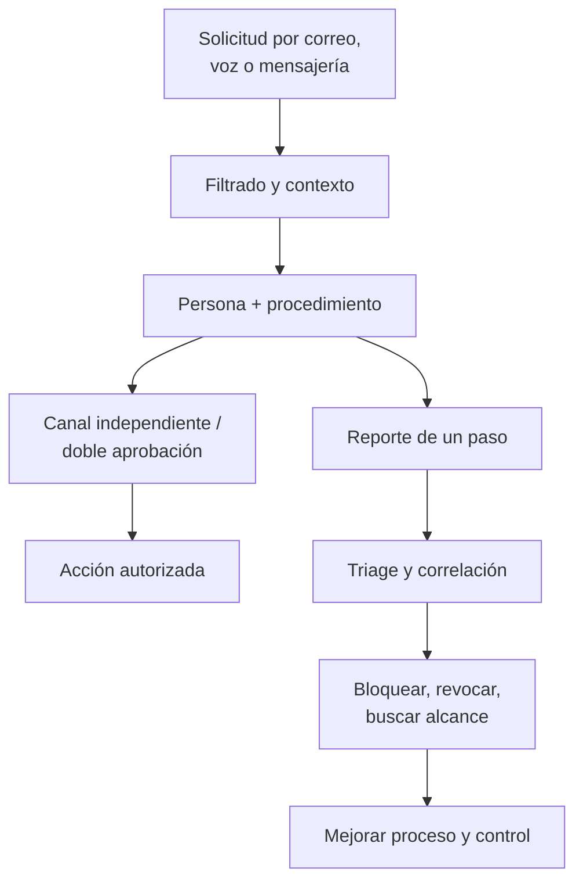

# Clase 259 — Defensa contra la ingeniería social

> Parte: **12 — OSINT e ingeniería social** · Fuente: NIST SP 800-50 · *Social Engineering* (C. Hadnagy) · ENISA
> ⏱️ Duración estimada: **90 min** · Nivel: **Intermedio**

---

## 🎯 Objetivo

Diseñar un programa de defensa contra la ingeniería social que combine controles técnicos, procesos
y cultura. El alumno terminará capaz de proponer medidas anti-phishing (SPF/DKIM/DMARC, MFA
resistente, filtros), procedimientos de verificación de identidad y un programa de concienciación
medible, cerrando el ciclo iniciado con el ataque autorizado.

## 📚 Resultados de aprendizaje

Al finalizar, el alumno podrá:

1. **Implementar** autenticación de correo (SPF, DKIM, DMARC) para reducir la suplantación.
2. **Seleccionar** controles técnicos anti-phishing y MFA resistente a phishing.
3. **Diseñar** procedimientos de verificación de identidad para helpdesk y pagos.
4. **Construir** un programa de concienciación con métricas de resiliencia.
5. **Definir** un flujo de reporte y respuesta ante incidentes de ingeniería social.

## 🗺️ Temas

| # | Tema | Por qué importa |
|---|------|-----------------|
| 1 | Autenticación de correo | Frena la suplantación de dominio |
| 2 | MFA resistente a phishing | Neutraliza el robo de credenciales |
| 3 | Filtros y sandboxing | Bloquea el gancho antes del clic |
| 4 | Verificación de identidad | Corta pretexting y vishing |
| 5 | Concienciación medible | Cambia el comportamiento |
| 6 | Botón de reporte | Convierte usuarios en sensores |
| 7 | Respuesta a incidentes SE | Contiene el daño rápido |

## 🧠 Explicación en profundidad

### Defender significa que una sola decisión humana no produzca un desastre

La concienciación ayuda, pero ninguna persona mantiene atención perfecta. La arquitectura debe asumir mensajes convincentes, cuentas comprometidas y momentos de presión. Se combinan controles preventivos, resistentes, detectivos y de recuperación: autenticación ligada al dominio, verificación de transacciones, filtrado, privilegios mínimos, reporte sencillo, revocación de sesiones y respuesta coordinada.

Autenticación y autorización de negocio no son lo mismo. Passkeys/WebAuthn bien configuradas resisten el phishing mediante vinculación al verificador, como describe NIST SP 800-63B-4; SMS y OTP introducidos manualmente no ofrecen esa propiedad frente a un intermediario. Aun con autenticación resistente, un usuario puede autorizar voluntariamente una transferencia falsa. Los procesos de alto impacto necesitan confirmación de datos, doble control y límites.

### Reportar debe ser más fácil que ignorar

Un botón de reporte conserva encabezados y mensaje original, informa al usuario y alimenta automatización. SOC deduplica campañas, busca destinatarios, bloquea indicadores y evalúa cuentas. El canal debe aceptar dudas: penalizar falsos reportes reduce la detección temprana. Las métricas incluyen tiempo desde recepción hasta primer reporte y desde reporte hasta contención, además de cobertura de autenticación resistente y cumplimiento de callback.

### Responder por escenario

Si alguien hizo clic, se determina qué se ejecutó y qué datos se entregaron. Si ingresó una contraseña, se restablece, revocan sesiones y tokens, se revisan reglas de correo y actividad posterior; cambiar la contraseña sin revocar sesiones puede ser insuficiente. Si aprobó una transacción, se activa fraude y recuperación. Si solo recibió el mensaje, todavía aporta inteligencia para proteger a otros.

### Caso razonado: MFA que no detuvo el ataque

Una víctima entrega contraseña y OTP a un proxy en tiempo real. El atacante obtiene sesión. La organización no concluye que «MFA no sirve»; identifica que ese autenticador no era resistente al phishing, revoca sesiones y migra accesos críticos a WebAuthn, manteniendo detección y recuperación. También revisa por qué la página falsa llegó y cómo se reportó.

## 📔 Glosario operativo

| Término | Definición útil |
|---|---|
| Phishing resistance | Propiedad protocolaria que evita entregar una salida válida a un verificador impostor. |
| Session revocation | Invalidación de sesiones y tokens ya emitidos. |
| Callback | Verificación por un canal conocido e independiente. |
| Doble control | Participación de dos autorizadores en una acción crítica. |
| Triage | Clasificación inicial que determina alcance, urgencia y respuesta. |

## ✅ Criterio de dominio

El alumno domina la defensa cuando puede mapear una solicitud a controles técnicos y de proceso, diferenciar tipos de MFA, diseñar reporte y respuesta, y medir reducción de riesgo sin responsabilizar únicamente al usuario.

## 📖 Definiciones y características

- **SPF/DKIM/DMARC:** mecanismos DNS que autentican el correo. Característica: con DMARC en `p=reject` el dominio es difícil de suplantar.
- **MFA resistente a phishing:** factores no interceptables (FIDO2/passkeys). Característica: derrotan páginas falsas y proxies AiTM.
- **Sandboxing de adjuntos/URL:** detonación en entorno aislado. Característica: detecta payloads antes del usuario.
- **Verificación fuera de banda:** confirmar por un canal distinto al de la petición. Característica: frustra pretextos urgentes.
- **Tasa de reporte:** proporción de usuarios que reportan un correo sospechoso. Característica: indicador clave de cultura.
- **Playbook de respuesta:** guía de acciones ante un incidente. Característica: reduce el tiempo de contención.

## 🧰 Herramientas y preparación

- **Correo:** registros DNS SPF/DKIM/DMARC; analizadores como MXToolbox o `dig`.
- **MFA:** llaves FIDO2/passkeys; políticas de acceso condicional.
- **Filtrado:** pasarela de correo con sandboxing y reescritura de URL.
- **Reporte:** botón "Reportar phishing" integrado en el cliente de correo.
- **Formación:** plataforma de awareness con simulacros (enlaza con GoPhish, Clase 258).

## 🧪 Laboratorio guiado (ejercicio aplicado)

1. Publica y valida SPF de un dominio de laboratorio: `dig TXT tudominio.com` y revisa el registro.
2. Configura DMARC en modo monitor: crea `_dmarc` con `v=DMARC1; p=none; rua=mailto:...` y observa los reportes.
3. Endurece a `p=quarantine` y luego `p=reject` tras validar que el correo legítimo pasa.
4. Diseña un procedimiento de **verificación fuera de banda** para el helpdesk (reseteos de contraseña).
5. Redacta un procedimiento antifraude para pagos: doble aprobación y verificación por canal conocido.
6. Define el flujo del **botón de reporte**: destino, triage y retroalimentación al usuario.
7. Construye un plan de concienciación trimestral con simulacros y métricas.
8. Escribe un mini-playbook de respuesta ante una campaña de phishing detectada.

## ✍️ Ejercicios

1. Explica cómo DMARC `p=reject` frustra un ataque de suplantación de dominio.
2. Compara MFA por SMS vs. FIDO2 frente a un ataque AiTM.
3. Diseña 5 preguntas de verificación de identidad robustas para el helpdesk.
4. Propón métricas de un programa de awareness más allá de la tasa de clic.
5. Redacta el mensaje de retroalimentación positiva a quien reporta un phishing.
6. Elabora un playbook de contención para credenciales comprometidas.

## 📝 Reto verificable

Entrega un **plan de defensa contra ingeniería social** que cubra: autenticación de correo, MFA
resistente, verificación de identidad, programa de concienciación con métricas y playbook de
respuesta.
**Criterio de aceptación:** el plan incluye configuración DMARC verificable, al menos un control por
cada vector (phishing, vishing, pretexting) y métricas que midan resiliencia, no solo víctimas.

## ⚠️ Errores comunes

| Síntoma / mensaje | Causa y cómo arreglar |
|-------------------|------------------------|
| DMARC rompe correo legítimo | Se pasó a `reject` sin monitorizar. Empieza en `p=none`, analiza y sube gradualmente. |
| MFA por SMS eludido | Vulnerable a AiTM/SIM swap. Migra a FIDO2/passkeys. |
| Usuarios no reportan | No hay botón o hay miedo a represalias. Facilita el reporte y refuerza positivamente. |
| Awareness sin efecto | Formación anual aburrida. Usa simulacros frecuentes y feedback inmediato. |
| Helpdesk resetea sin validar | Falta verificación fuera de banda. Implanta preguntas y canal alternativo. |

## ❓ Preguntas frecuentes

**❓ ¿DMARC elimina el phishing?**
Reduce la suplantación de **tu** dominio, no los correos de dominios parecidos (typosquatting). Es una
capa, no la solución completa.

**❓ ¿Basta con formar a la gente?**
No. La concienciación es una capa junto a controles técnicos. Culpar solo al usuario es un antipatrón;
diseña sistemas que fallen de forma segura.

**❓ ¿Qué MFA resiste el phishing?**
FIDO2/WebAuthn y passkeys, porque la autenticación está ligada al origen y no puede reproducirse en
una página falsa.

## 🔗 Referencias

- NIST SP 800-50 — Awareness and Training. <https://csrc.nist.gov/pubs/sp/800/50/final>
- DMARC.org. <https://dmarc.org/>
- FIDO Alliance — Passkeys. <https://fidoalliance.org/passkeys/>
- CISA — Avoiding Social Engineering and Phishing. <https://www.cisa.gov/>
- ENISA — Cybersecurity awareness. <https://www.enisa.europa.eu/>
- NIST SP 800-63B-4 — Authenticator and Verifier Requirements. <https://pages.nist.gov/800-63-4/sp800-63b/authenticators/>

## 📥 Material descargable

- 📄 [Guía en PDF](./clase-259-guia.pdf) — versión imprimible de esta clase.
- 🎞️ [Presentación (PPTX)](./clase-259-presentacion.pptx) — deck para proyectar en clase.

## ⬅️ Clase anterior

[Clase 258 — Campañas de phishing con GoPhish](../258-campanas-de-phishing-con-gophish/README.md)

## ➡️ Siguiente clase

[Clase 260 — OPSEC personal y anonimato](../260-opsec-personal-y-anonimato/README.md)
