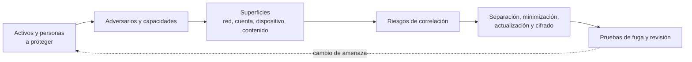

# Clase 260 — OPSEC personal y anonimato

> Parte: **12 — OSINT e ingeniería social** · Fuente: *Extreme Privacy* (M. Bazzell) · Tor Project docs
> ⏱️ Duración estimada: **110 min** · Nivel: **Avanzado**

---

## 🎯 Objetivo

Aplicar seguridad operacional (OPSEC) para reducir la propia huella digital y operar con anonimato
defendible cuando el trabajo lo exige (investigación, red team, periodismo). El alumno terminará
capaz de modelar su amenaza, compartimentar identidades, endurecer dispositivos y usar herramientas
de anonimato entendiendo sus límites, cerrando la parte con la contracara defensiva del OSINT.

## ⚖️ Nota ética

El anonimato es un derecho y una herramienta profesional legítima. No lo uses para cometer delitos ni
para evadir responsabilidad por daños. Esta clase busca proteger a investigadores, sus fuentes y su
privacidad, no facilitar actividad ilícita.

## 📚 Resultados de aprendizaje

Al finalizar, el alumno podrá:

1. **Construir** un modelo de amenaza personal (activos, adversarios, capacidades).
2. **Compartimentar** identidades y datos para limitar la correlación.
3. **Reducir** su huella digital mediante solicitudes de eliminación y minimización.
4. **Usar** Tor, VPN y sistemas amnésicos entendiendo sus límites y errores de OPSEC.
5. **Endurecer** dispositivos y cuentas contra el rastreo y la deanonimización.

## 🗺️ Temas

| # | Tema | Por qué importa |
|---|------|-----------------|
| 1 | Modelado de amenaza | Define contra quién te proteges |
| 2 | Compartimentación | Evita que un dato revele todo |
| 3 | Reducción de huella | Menos superficie para OSINT |
| 4 | Tor y VPN | Anonimato de red y sus límites |
| 5 | Sistemas amnésicos (Tails) | No dejar rastros locales |
| 6 | Metadatos y hábitos | La OPSEC se rompe por descuidos |
| 7 | Cuentas e identidades | Correos y alias segregados |

## 🧠 Explicación en profundidad

### OPSEC protege relaciones entre actividades, identidades y consecuencias

OPSEC comienza con un modelo de amenaza: qué información dañaría al investigador o a terceros, qué adversario podría obtenerla, con qué capacidades y durante cuánto tiempo. **Privacidad**, **seudonimato** y **anonimato** no son equivalentes. Un seudónimo estable oculta el nombre pero permite correlacionar actividad; Tor reduce ciertas observaciones de red, pero no corrige un login personal, un documento con autor o un patrón horario único.

El diagrama destaca la correlación. Dirección IP, cookies, huella de navegador, correo de recuperación, estilo, zona horaria, pagos y contactos pueden unir compartimentos. La separación debe ser coherente a través de cuenta, navegador o perfil, dispositivo cuando el riesgo lo exige, archivos y comportamiento. No existe una herramienta que garantice anonimato frente a todos los adversarios.

### Controles por capa

En dispositivo se actualiza, cifra y limita software; en cuentas se usan credenciales únicas, recuperación protegida y autenticación resistente al phishing; en navegación se separan perfiles y se reducen extensiones; en contenido se revisan metadatos y detalles identificables; en comunicaciones se escoge un canal según metadatos y amenaza, no solo por cifrado del contenido. Las copias y exportaciones también forman parte del ciclo.

Tor Browser está diseñado para reducir diferencias entre usuarios y enrutar tráfico mediante Tor. Instalar extensiones, cambiar configuraciones arbitrariamente o abrir documentos externos puede aumentar correlación o revelar red. Una VPN mueve confianza al proveedor y no equivale a anonimato. Estas herramientas se usan conforme a legislación y políticas; no para eludir una investigación legítima ni ocultar daño.

### Bienestar y riesgo de terceros

La investigación puede exponer al analista a contenido traumático, acoso y doxxing. Se definen horarios, revisión por pares, apoyo y procedimiento ante amenaza. Publicar una captura puede revelar a una fuente mediante nombre, notificaciones o detalles del entorno; la sanitización se verifica sobre una copia y se conserva el original protegido cuando existe razón legítima.

### Caso razonado: seudónimo unido por recuperación

Una cuenta de investigación usa un alias distinto y Tor, pero registra el correo personal como recuperación y sube un PDF con nombre de autor. Dos capas de aplicación derrotan la separación de red. El analista crea una matriz de vínculos, elimina metadatos en copias, separa recuperación según el modelo y verifica desde un entorno limpio. No declara anonimato absoluto; documenta el adversario frente al que redujo correlación.

## 📔 Glosario operativo

| Término | Definición útil |
|---|---|
| Modelo de amenaza | Relación entre activos, adversarios, capacidades y consecuencias. |
| Seudonimato | Uso de identidad alternativa que puede mantener continuidad. |
| Anonimato | Dificultad de vincular una acción con una identidad dentro de un conjunto. |
| Compartimentación | Separación consistente para limitar correlación e impacto. |
| Metadato | Información sobre creación, comunicación o contexto, distinta del contenido principal. |

## ✅ Criterio de dominio

Existe dominio cuando el alumno diseña OPSEC para un adversario concreto, identifica enlaces entre capas, prueba fugas, explica límites de Tor y VPN y protege tanto al investigador como a terceros sin prometer anonimato absoluto.

## 📖 Definiciones y características

- **OPSEC:** proceso de proteger información sensible identificando qué revelas y a quién. Característica: es disciplina continua, no una herramienta.
- **Modelo de amenaza:** análisis de qué proteges, de quién y con qué esfuerzo. Característica: sin él, la OPSEC es aleatoria.
- **Compartimentación:** separar identidades/actividades en silos. Característica: limita el daño de una filtración.
- **Tor:** red de anonimato por enrutamiento en capas. Característica: oculta la IP, pero no protege de errores de OPSEC del usuario.
- **VPN:** túnel cifrado hacia un proveedor. Característica: cambia la confianza, no elimina la atribución; el proveedor te ve.
- **Tails:** sistema live amnésico que enruta por Tor. Característica: no deja rastros en el equipo.
- **Huella digital:** conjunto de datos tuyos accesibles. Característica: se reduce, rara vez se elimina del todo.

## 🧰 Herramientas y preparación

- **Tor Browser** y, para trabajo sensible, **Tails** (USB amnésico).
- **VPN de confianza** con política de no-logs auditada (complemento, no sustituto de Tor).
- **Gestor de identidades:** correos segregados (alias/relays), gestor de contraseñas, números virtuales.
- **Limpieza de metadatos:** `exiftool`, `mat2`.
- **Recordatorio:** herramienta ≠ anonimato; la OPSEC se rompe por comportamiento (reutilizar alias, mezclar cuentas).

## 🧪 Laboratorio guiado (sobre ti mismo)

1. Redacta tu **modelo de amenaza**: qué activos proteges, posibles adversarios y su capacidad.
2. Diseña un esquema de **compartimentación**: identidad personal, profesional y de investigación separadas.
3. Audita tu huella (reutiliza la Clase 249) y crea una lista de **solicitudes de eliminación** a servicios/brokers.
4. Crea correos segregados con relays/alias y contraseñas únicas por identidad.
5. Instala Tor Browser y comprueba tu IP en un servicio de "what is my IP" antes y después.
6. Prepara un USB de **Tails** y arráncalo en una VM/equipo de prueba; verifica que no deja rastros.
7. Limpia metadatos de un documento con `mat2 archivo.pdf` y compara antes/después.
8. Define reglas de higiene OPSEC (no mezclar cuentas, no reutilizar alias, cuidar patrones horarios).
9. Documenta un plan de mejora continua con revisión trimestral de tu huella.

## ✍️ Ejercicios

1. Escribe tu modelo de amenaza en una página, con adversarios y esfuerzo estimado.
2. Explica un error típico que anula el anonimato de Tor (p. ej. loguearte en tu cuenta real).
3. Compara Tor vs. VPN vs. Tor sobre VPN y cuándo usar cada uno.
4. Diseña un esquema de tres identidades compartimentadas con reglas de no-cruce.
5. Redacta 5 solicitudes de eliminación a data brokers de tu región.
6. Enumera 5 hábitos que rompen la OPSEC aunque uses buenas herramientas.

## 📝 Reto verificable

Entrega un **plan de OPSEC personal** con: modelo de amenaza, esquema de compartimentación, lista de
acciones de reducción de huella ejecutadas y una evaluación honesta de límites y riesgos residuales.
**Criterio de aceptación:** el plan demuestra al menos tres acciones reales completadas (correos
segregados, eliminación de una exposición, uso verificado de Tor/Tails) y reconoce explícitamente qué
no puede garantizar el anonimato.

## ⚠️ Errores comunes

| Síntoma / mensaje | Causa y cómo arreglar |
|-------------------|------------------------|
| Deanonimizado pese a usar Tor | Te logueaste en una cuenta personal. Nunca mezcles identidad real y anónima. |
| VPN "no-logs" que sí registraba | Confianza mal puesta. Elige proveedores auditados; recuerda que la VPN te ve. |
| Alias reutilizado enlaza identidades | Falta de compartimentación. Un alias por identidad, sin cruces. |
| Metadatos delatan al autor | No se limpiaron. Usa `mat2`/`exiftool` antes de publicar. |
| Patrón horario revela zona/rutina | Hábitos predecibles. Varía y minimiza señales de "pattern of life". |

## ❓ Preguntas frecuentes

**❓ ¿Tor me hace 100% anónimo?**
No. Tor puede impedir que el destino vea directamente la dirección de origen y distribuye el circuito, pero el anonimato depende también del adversario, endpoint, navegador, cuentas, contenido y posibilidad de correlación de tráfico.

**❓ ¿VPN o Tor?**
Responden a modelos distintos. Una VPN traslada observación y confianza al proveedor; Tor distribuye el circuito y Tor Browser reduce algunas formas de enlace. Ninguna opción garantiza «anonimato fuerte» en abstracto: se selecciona y configura según adversario, dispositivo, actividad y consecuencias.

**❓ ¿Puedo borrar mi huella por completo?**
Casi nunca del todo. Puedes reducirla mucho con minimización, eliminación en brokers y buena OPSEC,
pero asume un residuo y protégete en consecuencia.

## 🔗 Referencias

- Bazzell, M. *Extreme Privacy: What It Takes to Disappear*. <https://inteltechniques.com/book7.html>
- Tor Project. <https://www.torproject.org/>
- Tails. <https://tails.net/>
- mat2 (Metadata Anonymisation Toolkit). <https://0xacab.org/jvoisin/mat2>
- EFF — Surveillance Self-Defense. <https://ssd.eff.org/>

## 📥 Material descargable

- 📄 [Guía en PDF](./clase-260-guia.pdf) — versión imprimible de esta clase.
- 🎞️ [Presentación (PPTX)](./clase-260-presentacion.pptx) — deck para proyectar en clase.

## ⬅️ Clase anterior

[Clase 259 — Defensa contra la ingeniería social](../259-defensa-contra-la-ingenieria-social/README.md)

## ➡️ Siguiente clase

[Clase 261 — Seguridad de Android: arquitectura](../../parte-13-seguridad-movil-iot-e-inalambrica/261-seguridad-de-android-arquitectura/README.md)
