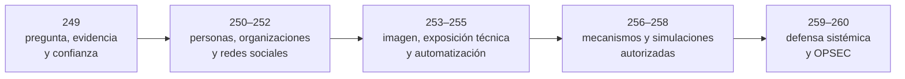

# Parte 12 — OSINT e ingeniería social

> [⬅️ Volver al programa](../../README.md) · [📚 Índice completo](../README.md) · [⏭️ Parte siguiente](../parte-13-seguridad-movil-iot-e-inalambrica/README.md)

**12 clases** · rango 249–260 · Inteligencia de fuentes abiertas, phishing y OPSEC personal

**Fuentes de referencia de esta parte:**

- Michael Bazzell — *Open Source Intelligence Techniques* (11.ª ed.).
- Michael Bazzell — *Extreme Privacy: What It Takes to Disappear*.
- Christopher Hadnagy — *Social Engineering: The Science of Human Hacking* (2.ª ed.).
- Robert Cialdini — *Influence: The Psychology of Persuasion*.
- MITRE ATT&CK — Táctica *Reconnaissance* (TA0043) y *Resource Development* (TA0042).
- OSINT Framework (osintframework.com) y Trace Labs OSINT VM.

---

## 🎯 ¿De qué trata esta parte?

La inteligencia de fuentes abiertas (OSINT) es el proceso de recolectar, correlacionar y analizar
información **públicamente disponible** para construir un panorama sobre una persona, una empresa,
un dominio o una infraestructura. Apoya investigación, inteligencia, inventario y evaluaciones
autorizadas, y permite comprender cuánto expone una organización para reducir esa superficie. Una
fuente accesible no convierte cualquier uso en legítimo: el propósito, la minimización y la
protección de terceros forman parte del método. Esta parte cubre desde los fundamentos hasta la automatización con
SpiderFoot y Maltego, pasando por Shodan, Censys y la geolocalización de imágenes.

La segunda mitad aborda la **ingeniería social** como abuso de un contexto de confianza y de procesos
que permiten acciones sensibles sin verificación independiente. Estudiaremos principios de
influencia, pretexting, vishing y campañas
de phishing controladas con GoPhish, siempre desde la óptica de la simulación autorizada y la
concienciación defensiva.

Esta parte sirve a analistas de threat intelligence, red teamers, investigadores, periodistas,
equipos de concienciación (security awareness) y a cualquier profesional que quiera entender —y
reducir— su propia huella digital. La OPSEC personal cierra el círculo: proteger tu identidad es la
mejor forma de comprender cómo se vulnera la de otros.

## 🧩 Problemas que resuelve

- Mapear la superficie de exposición pública de una organización antes de un pentest.
- Verificar identidades, detectar suplantaciones y validar fuentes en investigaciones.
- Descubrir subdominios, correos y tecnologías filtradas que amplían el vector de ataque.
- Localizar dispositivos expuestos en Internet (Shodan/Censys) y priorizar su remediación.
- Medir la resiliencia humana de una empresa mediante simulacros de phishing éticos y medibles.
- Formar a los empleados para reconocer pretextos, vishing y correos maliciosos.
- Reducir la huella digital personal y operar con anonimato defendible cuando el trabajo lo exige.

## 🎓 Resultados de aprendizaje

Al terminar la parte, el alumno podrá:

- Aplicar un ciclo de inteligencia (dirección, recolección, procesamiento, análisis, difusión) sobre un objetivo autorizado.
- Realizar OSINT de personas, empresas, dominios y redes sociales documentando procedencia y transformaciones; aplicar cadena de custodia solo cuando el contexto probatorio lo requiera.
- Geolocalizar imágenes y verificar contenido combinando metadatos y análisis visual.
- Consultar Shodan y Censys con dorks precisos para inventariar exposición técnica.
- Automatizar la recolección y correlación con SpiderFoot y Maltego.
- Diseñar y ejecutar una campaña de phishing controlada con GoPhish, con métricas y reporte.
- Explicar los principios de influencia y evaluar pretextos ficticios para diseñar controles verificables.
- Implementar controles de defensa contra ingeniería social y un plan de OPSEC personal.

## 🧱 Prerrequisitos

- Parte 0 (fundamentos, ética y legalidad de la ciberseguridad).
- Parte 1 (redes, DNS y protocolos) para entender OSINT de dominios e infraestructura.
- Manejo básico de Linux, la terminal y máquinas virtuales aisladas.
- Nociones de la Parte 11 (DevSecOps) ayudan a contextualizar filtraciones en repositorios.

## 🗺️ Estructura temática

| Bloque | Clases | Enfoque |
|--------|--------|---------|
| Metodología OSINT | 249 | Ciclo de inteligencia, ética y legalidad |
| OSINT por objetivo | 250–252 | Personas, empresas/dominios, redes sociales |
| OSINT visual y técnico | 253–254 | Geolocalización de imágenes, Shodan/Censys |
| Automatización | 255 | SpiderFoot y Maltego |
| Ingeniería social | 256–258 | Fundamentos, pretexting/vishing, phishing con GoPhish |
| Defensa y anonimato | 259–260 | Controles anti-SE y OPSEC personal |

## 🧭 Recorrido pedagógico clase a clase

La parte se organiza en dos movimientos conectados. Primero enseña a producir inteligencia abierta trazable sin convertir coincidencias en hechos. Después usa esa comprensión de la exposición humana para analizar y defender procesos de ingeniería social. La transición es deliberada: conocer qué información está disponible permite reducirla y diseñar controles, no autoriza manipular personas.

1. **Clase 249 — Fundamentos de OSINT.** Distingue una búsqueda de un ciclo de inteligencia. El alumno formula una pregunta, preserva procedencia y separa observación, inferencia e hipótesis con confianza calibrada.
2. **Clase 250 — OSINT de personas.** Introduce resolución de entidades y minimización. La evidencia esperada no es un dossier intrusivo, sino una matriz sobre una identidad propia o ficticia con coincidencias, contradicciones y límites.
3. **Clase 251 — Empresas y dominios.** Extiende la atribución a relaciones entre entidades, DNS, certificados, ASN y proveedores. El alumno separa propiedad, alojamiento, vigencia y alcance autorizado.
4. **Clase 252 — Redes sociales.** Enseña a preservar publicaciones con contexto y a evaluar cuenta, multimedia, tiempo y relaciones sin inferir intención o liderazgo desde una arista.
5. **Clase 253 — Geolocalización e imágenes.** Convierte detalles visuales y metadatos en candidatos refutables. El producto declara la granularidad realmente demostrada y protege ubicaciones sensibles.
6. **Clase 254 — Shodan y Censys.** Analiza índices de medición como observaciones temporales. El alumno valida activos propios y diferencia banner, exposición y vulnerabilidad sin realizar interacción fuera de alcance.
7. **Clase 255 — Automatización.** Usa SpiderFoot y Maltego para ampliar una pregunta definida. Cada relación conserva fuente y fecha, y la revisión humana detiene la propagación de asociaciones falsas.
8. **Clase 256 — Fundamentos de ingeniería social.** Cambia del inventario a los mecanismos de decisión. El alumno diseña controles que no dependen de atención perfecta ni culpan a la víctima.
9. **Clase 257 — Pretexting y vishing.** Practica protocolos de verificación independiente mediante escenarios ficticios y aprobados. La habilidad es proteger una acción sensible bajo presión, no construir un engaño real.
10. **Clase 258 — Simulaciones con GoPhish.** Diseña una intervención educativa completa: aprobaciones, minimización, piloto, parada, métricas, debrief y eliminación. Nunca se capturan secretos reales.
11. **Clase 259 — Defensa contra ingeniería social.** Integra autenticación resistente al phishing, procesos de negocio, reporte y respuesta. El alumno diferencia recibir, hacer clic, entregar credenciales y autorizar una transacción.
12. **Clase 260 — OPSEC personal.** Cierra protegiendo cuentas, dispositivos, red, contenido y bienestar bajo un modelo de amenaza. Explica por qué seudónimo, VPN o Tor no ofrecen anonimato universal.

El proyecto integrador utiliza una organización y personas ficticias: produce un informe OSINT con fuentes y confianza, modela qué exposición habilitaría un pretexto, propone una simulación de mínimo daño y diseña controles técnicos, de proceso y OPSEC. Toda interacción queda dentro del laboratorio y el resultado evita datos personales reales.

## ⚖️ Nota ética y legal (léela antes de empezar)

Todo el contenido de esta parte se enseña con fines **defensivos, de concienciación y de pruebas
autorizadas**. OSINT se practica **únicamente sobre información genuinamente pública** y sobre
objetivos para los que tienes autorización o que son de acceso legítimo (tú mismo, tu organización,
un cliente con contrato). La ingeniería social —pretexting, vishing, phishing— solo es lícita con
**permiso explícito y por escrito** (alcance, ventana temporal, "reglas de enfrentamiento" y
contacto de escalado firmados). Recolectar datos personales sin base legal, suplantar identidades
fuera de un engagement autorizado o acosar puede constituir delito (GDPR/leyes de protección de
datos, fraude, usurpación de identidad). Ante la duda, no lo hagas: pide autorización.

## 🔗 Referencias de la parte

- Bazzell, M. *Open Source Intelligence Techniques*. <https://inteltechniques.com/book1.html>
- Bazzell, M. *Extreme Privacy*. <https://inteltechniques.com/book7.html>
- Hadnagy, C. *Social Engineering: The Science of Human Hacking*. Wiley.
- Cialdini, R. *Influence: The Psychology of Persuasion*.
- MITRE ATT&CK — Reconnaissance (TA0043). <https://attack.mitre.org/tactics/TA0043/>
- OSINT Framework. <https://osintframework.com/>
- OHCHR y UC Berkeley — *Berkeley Protocol on Digital Open Source Investigations*. <https://www.ohchr.org/sites/default/files/2022-04/OHCHR_BerkeleyProtocol.pdf>
- NIST SP 800-63B-4 — *Authentication and Authenticator Management*. <https://pages.nist.gov/800-63-4/sp800-63b/authenticators/>

## ▶️ Empezar

[Clase 249 — Fundamentos de OSINT](249-fundamentos-de-osint/README.md)
