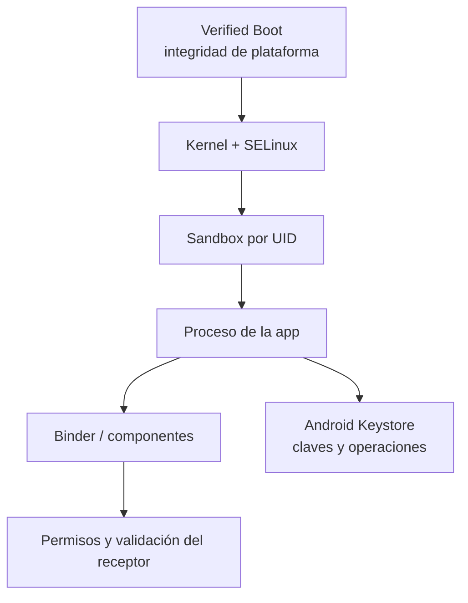

# Clase 261 — Seguridad de Android: arquitectura

> Parte: **13 — Seguridad móvil, IoT e inalámbrica** · Fuente: *The Mobile Application Hacker's Handbook* (Chell et al.) y OWASP MASTG
> ⏱️ Duración estimada: **90 min** · Nivel: **Intermedio**

---

## 🎯 Objetivo

Comprender el modelo de seguridad de Android de extremo a extremo —desde el kernel Linux y SELinux hasta el sandbox de aplicaciones, el modelo de permisos y el almacenamiento de claves— para poder razonar sobre qué protege el sistema, dónde están sus límites y qué asunciones rompe un dispositivo rooteado. Esta clase es la base conceptual sin la cual el pentest de la siguiente clase sería mera repetición de comandos.

## 📚 Resultados de aprendizaje

Al finalizar, el alumno podrá:

1. **Explicar** las capas de la pila Android (kernel, HAL, ART, framework, apps) y su rol de seguridad.
2. **Describir** cómo el sandbox por UID y SELinux aíslan aplicaciones entre sí.
3. **Analizar** el modelo de permisos (install-time, runtime, permisos peligrosos) y sus abusos.
4. **Identificar** dónde y cómo Android almacena secretos (Keystore, `SharedPreferences`, cifrado de disco).
5. **Enumerar** los componentes de una app (Activities, Services, Broadcast Receivers, Content Providers) y su exposición.
6. **Evaluar** el impacto de rootear un dispositivo sobre las garantías del modelo.

## 🗺️ Temas

| # | Tema | Por qué importa |
|---|------|-----------------|
| 1 | Pila Android y arranque verificado | Define la cadena de confianza desde el bootloader |
| 2 | Sandbox por UID y SELinux | Es el aislamiento primario entre apps |
| 3 | Modelo de permisos | Controla acceso a datos y hardware sensibles |
| 4 | Componentes de aplicación e IPC (Intents) | Superficie de ataque expuesta por el desarrollador |
| 5 | Android Keystore y almacenamiento | Dónde viven las claves y por qué a veces se filtran |
| 6 | Firma de APK y actualización | Garantiza integridad y origen del código |
| 7 | Root y su impacto en el modelo | Rompe casi todas las asunciones defensivas |

## 🧠 Explicación en profundidad

### La aplicación vive dentro de varias fronteras

Android asigna normalmente un UID Linux distinto a cada aplicación. El kernel separa procesos y archivos; SELinux añade control obligatorio; el framework media permisos e IPC; y Verified Boot protege la integridad de las particiones verificadas durante el arranque. Estas capas reducen el impacto de una aplicación, pero no corrigen una app que exporta datos deliberadamente ni una autorización de negocio defectuosa.



Una *Activity*, *Service*, *BroadcastReceiver* o *ContentProvider* puede abrir una frontera mediante Binder. Declarar un permiso no basta si el componente queda exportado sin necesidad o confía en datos del llamador. Los permisos de ejecución controlan capacidades del sistema y datos sensibles; no deben usarse como sustituto de autorización entre usuarios dentro de la app.

Keystore permite crear claves no exportables y, según dispositivo y configuración, respaldadas por hardware. Esto no significa que todo dato cifrado quede seguro: el proceso autorizado puede pedir operaciones mientras está comprometido, la autenticación de usuario puede no ser requerida y los metadatos o copias pueden quedar fuera. Se documentan propósito, autenticación, rotación y comportamiento ante cambio de dispositivo.

### Caso razonado: sandbox intacto, datos expuestos

Una app guarda informes en su directorio privado, pero exporta un `ContentProvider` que acepta cualquier identificador. El sandbox funciona exactamente como fue diseñado: otra app no lee archivos directamente, sino que usa una interfaz autorizada en exceso. La corrección restringe exportación, valida identidad y autorización por objeto y añade pruebas de IPC.

## 📔 Glosario operativo

| Término | Definición útil |
|---|---|
| UID de aplicación | Identidad Linux usada para aislar procesos y archivos. |
| Binder | Mecanismo principal de IPC en Android. |
| Componente exportado | Punto de entrada accesible desde otras aplicaciones según manifiesto y permisos. |
| Verified Boot | Cadena de verificación de integridad de componentes de arranque. |
| Keystore | Servicio para claves y operaciones criptográficas con opciones de respaldo hardware. |

## ✅ Criterio de dominio

El alumno domina la arquitectura cuando sigue una solicitud desde otra app hasta el recurso, identifica qué capa decide, explica los límites de sandbox y Keystore y propone una prueba verificable para un componente exportado.

## 📖 Definiciones y características

- **Sandbox de aplicación:** cada app corre con un UID Linux único; el kernel impide que una acceda a los ficheros de otra. Característica clave: aislamiento por proceso, no por confianza en el código.
- **SELinux (enforcing):** control de acceso obligatorio (MAC) que confina incluso a `root` mediante políticas. Característica: reduce el impacto de una escalada.
- **Permiso peligroso (dangerous):** permiso que da acceso a datos privados (contactos, ubicación, cámara) y requiere consentimiento del usuario en runtime desde Android 6. Característica: revocable por el usuario.
- **Android Keystore:** servicio para crear y usar claves con restricciones; algunas pueden estar respaldadas por TEE o StrongBox. Característica: el material configurado como no exportable se usa mediante operaciones, aunque la app autorizada y la plataforma siguen dentro del modelo de amenaza.
- **Content Provider:** componente que expone datos estructurados vía URI `content://`. Característica: si está `exported` sin permisos, otras apps leen sus datos.
- **APK signing (v2/v3):** firma del paquete que garantiza que no fue alterado desde su publicación. Característica: la clave del desarrollador ancla la identidad de la app.

## 🧰 Herramientas y preparación

- **Android Studio + AVD** (emulador) o un dispositivo físico de pruebas **de tu propiedad**.
- **`adb`** (Android Debug Bridge), incluido en platform-tools.
- Emulador con imagen *Google APIs* (no *Play Store*) para obtener acceso root fácilmente.
- Opcional: dispositivo con **Magisk** para root en hardware real, solo en equipo propio.

```bash
# Verificar conexión y explorar el sistema
adb devices
adb shell getprop ro.build.version.sdk       # nivel de API
adb shell getenforce                          # estado de SELinux (Enforcing/Permissive)
adb shell id                                  # UID/contexto del shell
```

> ⚠️ Trabaja únicamente sobre emuladores o dispositivos propios dedicados a laboratorio.

## 🧪 Laboratorio guiado

1. **Levanta un AVD** con API 30+ e imagen *Google APIs*. Arráncalo desde Android Studio o con `emulator -avd <nombre> -writable-system`.
2. **Inspecciona el sandbox:** instala una app de prueba y localiza su UID: `adb shell pm list packages -U | grep <paquete>`. Observa que su directorio `/data/data/<paquete>` no es legible por otras apps.
3. **Revisa SELinux:** ejecuta `adb shell getenforce`. Consulta el contexto de un proceso con `adb shell ps -Z`.
4. **Enumera permisos** de una app instalada: `adb shell dumpsys package <paquete> | sed -n '/requested permissions/,/install permissions/p'`.
5. **Examina componentes exportados:** extrae el APK (`adb shell pm path <paquete>` + `adb pull`) y ábrelo con `aapt dump xmltree base.apk AndroidManifest.xml` buscando `android:exported="true"`.
6. **Explora el Keystore:** con una app de ejemplo que genere una clave, observa que el material no aparece en el sistema de ficheros de la app.
7. **Rootea el emulador:** `adb root` (en imágenes de ingeniería) y comprueba cómo ahora `adb shell` accede a `/data/data/*` de cualquier app: constata que el root anula el sandbox.

## ✍️ Ejercicios

1. Dibuja un diagrama de la pila Android indicando en qué capa vive cada control de seguridad.
2. Lista cinco permisos "peligrosos" y explica qué dato o hardware protege cada uno.
3. Compara `SharedPreferences` en claro vs. `EncryptedSharedPreferences` y di cuándo usar cada uno.
4. Identifica en un APK real (propio) todos los componentes `exported` y clasifica su riesgo.
5. Explica con tus palabras por qué SELinux mitiga una vulnerabilidad de escalada a root.
6. Investiga la diferencia entre TEE y StrongBox para el respaldo del Keystore.

## 📝 Reto verificable

Toma una app de prueba (por ejemplo, una que tú compiles) y produce un **inventario de superficie de ataque local**: tabla con todos sus componentes, su estado `exported`, permisos requeridos y dónde guarda datos. **Criterio de aceptación:** el inventario identifica al menos un Content Provider o Activity exportada y justifica si representa o no un riesgo, citando la evidencia extraída del manifiesto.

## ⚠️ Errores comunes

| Síntoma / mensaje | Causa y cómo arreglar |
|-------------------|-----------------------|
| `adb: no devices/emulators found` | El servidor adb no ve el AVD; reinícialo con `adb kill-server && adb start-server` |
| `adbd cannot run as root in production builds` | Imagen *Play Store*; usa una imagen *Google APIs* o de ingeniería |
| `Permission denied` al leer `/data/data` | El sandbox lo impide sin root; usa un AVD rooteable |
| `getenforce` devuelve `Permissive` | Imagen de desarrollo; en producción SELinux está en `Enforcing` |
| Manifiesto ilegible tras `apktool` | Falta reconstruir recursos; usa `aapt dump xmltree` sobre el APK original |

## ❓ Preguntas frecuentes

**❓ ¿El sandbox de Android me protege aunque instale una app maliciosa?**
Limita su acceso a otras apps y al sistema, pero la app maliciosa sigue pudiendo abusar de los permisos que le concedas y de componentes mal expuestos por otras apps.

**❓ ¿Rootear cambia el modelo de seguridad?**
Sí. Introduce autoridad y software que pueden eludir controles y puede alterar garantías de arranque, según método y dispositivo. En laboratorio facilita observación, pero las conclusiones deben declarar ese entorno; no significa que toda app obtenga root automáticamente.

**❓ ¿Dónde deberían guardarse las claves criptográficas de una app?**
En Android Keystore con las restricciones apropiadas y respaldo hardware cuando el dispositivo lo ofrezca. `SharedPreferences` puede almacenar configuración no secreta, pero no material de clave en claro; tampoco se incrustan secretos compartidos en el código.

## 🔗 Referencias

- OWASP MASTG — Android Platform Overview: <https://mas.owasp.org/MASTG/0x05a-Platform-Overview/>
- Android Security Model (documentación oficial): <https://source.android.com/docs/security>
- Android Keystore System: <https://developer.android.com/training/articles/keystore>
- *The Mobile Application Hacker's Handbook*, cap. Android — Chell, Erasmus, Colley, Whitehouse.

## 📥 Material descargable

- 📄 [Guía en PDF](./clase-261-guia.pdf) — versión imprimible de esta clase.
- 🎞️ [Presentación (PPTX)](./clase-261-presentacion.pptx) — deck para proyectar en clase.

## ⬅️ Clase anterior

[Clase 260 — OPSEC personal y anonimato](../../parte-12-osint-e-ingenieria-social/260-opsec-personal-y-anonimato/README.md)

## ➡️ Siguiente clase

[Clase 262 — Pentest de aplicaciones Android](../262-pentest-de-aplicaciones-android/README.md)
