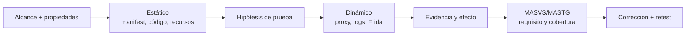

# Clase 262 — Pentest de aplicaciones Android

> Parte: **13 — Seguridad móvil, IoT e inalámbrica** · Fuente: OWASP MASTG y *The Mobile Application Hacker's Handbook* (Chell et al.)
> ⏱️ Duración estimada: **120 min** · Nivel: **Avanzado**

---

## 🎯 Objetivo

Ejecutar una evaluación de seguridad completa de una aplicación Android combinando análisis estático (SAST), dinámico (DAST) e instrumentación en tiempo de ejecución. El alumno montará el entorno, interceptará el tráfico HTTPS de la app, evadirá certificate pinning y detección de root en laboratorio, y buscará las vulnerabilidades del top de OWASP MASVS: almacenamiento inseguro, comunicación débil y lógica del lado del cliente evadible.

> ⚠️ **Nota ética:** todo el pentest se realiza sobre apps propias, apps deliberadamente vulnerables (DIVA, InsecureBankv2, MASTG apps) o con autorización escrita del titular. Interceptar o modificar apps de terceros sin permiso es ilegal.

## 📚 Resultados de aprendizaje

Al finalizar, el alumno podrá:

1. **Configurar** un laboratorio de pentest móvil con emulador rooteado y proxy interceptor.
2. **Realizar** análisis estático de un APK con MobSF y apktool.
3. **Interceptar** tráfico TLS instalando un CA propio y evadiendo pinning con Frida.
4. **Instrumentar** la app en runtime con Frida para saltar controles del cliente.
5. **Detectar** almacenamiento inseguro en `SharedPreferences`, SQLite y ficheros.
6. **Documentar** hallazgos mapeados a OWASP MASVS con evidencia reproducible.

## 🗺️ Temas

| # | Tema | Por qué importa |
|---|------|-----------------|
| 1 | Montaje del laboratorio y proxy | Sin interceptación no hay DAST móvil |
| 2 | Análisis estático con MobSF | Detecta secretos y malas prácticas rápido |
| 3 | Interceptación TLS y CA de usuario | El pinning bloquea Burp por defecto |
| 4 | Evasión de pinning con Frida | Habilita ver el tráfico real de la app |
| 5 | Almacenamiento inseguro | Es la vulnerabilidad móvil más frecuente |
| 6 | Controles del lado del cliente | Root/jailbreak detection y su bypass |
| 7 | Reporte según MASVS/MASTG | Traduce hallazgos a un estándar reconocido |

## 🧠 Explicación en profundidad

### Evaluar una app es contrastar propiedades, no ejecutar una lista de herramientas

MASVS expresa grupos de requisitos; MASTG aporta técnicas de prueba. El trabajo comienza con alcance, versión, backend, cuentas, datos y propiedades: «un usuario no lee el objeto de otro», «una clave privada no sale del Keystore», «un deep link no ejecuta una acción sin confirmación». El análisis estático propone hipótesis y el dinámico observa una ejecución; ambos deben converger en evidencia.



El manifiesto revela componentes, permisos, backup, depuración y configuración de red. JADX aproxima Java/Kotlin desde DEX, pero el código reconstruido puede perder nombres o semántica. MobSF automatiza señales; no valida lógica de negocio. En ejecución, el proxy observa tráfico que la app decide enviar. Saltar *pinning* en un laboratorio autorizado permite inspeccionar la app, pero no demuestra por sí mismo una vulnerabilidad: el hallazgo debe describir qué secreto o decisión queda expuesto bajo el modelo de amenaza.

Frida modifica comportamiento en memoria y sirve para validar hipótesis sobre almacenamiento, criptografía o controles locales. Un control antirroot puede elevar coste, pero no debe proteger una autorización del servidor. La evaluación separa el dispositivo comprometido, la aplicación maliciosa sin root y el atacante de red: cada uno posee capacidades distintas.

### Caso razonado: flag premium local

JADX muestra `isPremium` en preferencias y Frida permite cambiarlo. Si el servidor vuelve a autorizar cada operación, el cambio solo altera interfaz; si entrega contenido basándose en el flag enviado, existe impacto. El informe conserva petición y respuesta y corrige la decisión en servidor, no «endurece» el booleano.

## 📔 Glosario operativo

| Término | Definición útil |
|---|---|
| MASVS | Estándar de verificación para controles de aplicaciones móviles. |
| MASTG | Guía de técnicas y casos de prueba móviles. |
| Instrumentación dinámica | Observación o modificación controlada del proceso en ejecución. |
| Certificate pinning | Restricción adicional de confianza TLS; no sustituye autorización. |
| Deep link | URI que puede activar una ruta o componente de la aplicación. |

## ✅ Criterio de dominio

Hay dominio cuando el alumno vincula una propiedad con evidencia estática y dinámica, distingue señal automatizada de impacto, limita la prueba al laboratorio y entrega corrección más retest alineados con MASVS.

## 📖 Definiciones y características

- **MobSF (Mobile Security Framework):** plataforma de análisis estático y dinámico de APK/IPA. Característica: informe automatizado con hallazgos y evidencias.
- **Certificate pinning:** la app solo confía en un certificado/clave concreto, ignorando el almacén del sistema. Característica: rompe la interceptación con proxy salvo que se evada.
- **Frida:** toolkit de instrumentación dinámica que inyecta JavaScript en el proceso de la app. Característica: modifica métodos en runtime sin recompilar.
- **objection:** framework sobre Frida con comandos listos (bypass pinning, root detection, volcado de Keystore). Característica: acelera tareas comunes.
- **OWASP MASVS:** estándar de requisitos de seguridad para apps móviles. Característica: define niveles L1/L2 y controles verificables.
- **Smali:** representación legible del bytecode Dalvik tras desensamblar con apktool. Característica: permite parchear y recompilar la app.

## 🧰 Herramientas y preparación

```bash
# Emulador rooteado + Frida server
adb root
adb push frida-server /data/local/tmp/ && adb shell "chmod 755 /data/local/tmp/frida-server"
adb shell "/data/local/tmp/frida-server &"
pip install frida-tools objection

# Análisis estático con MobSF (Docker)
docker run -it --rm -p 8000:8000 opensecurity/mobile-security-framework-mobsf:latest
```

- **Burp Suite** o **mitmproxy** como proxy; instala su CA en el almacén del sistema del AVD.
- **apktool**, **jadx** y **jd-gui** para desensamblar/decompilar.

## 🧪 Laboratorio guiado

1. **Prepara la app objetivo:** instala una app vulnerable propia (p. ej. InsecureBankv2) con `adb install app.apk`.
2. **Análisis estático:** sube el APK a MobSF. Anota secretos hardcodeados, permisos peligrosos y componentes exportados que reporte.
3. **Desensambla:** `apktool d app.apk -o app_src` y `jadx app.apk`. Busca cadenas sospechosas: `grep -ri "http://\|password\|api_key" app_src`.
4. **Configura el proxy:** define el proxy del AVD hacia Burp e instala el CA de Burp como certificado del **sistema** (con root: remonta `/system` y copia el `.0`).
5. **Evade el pinning:** lanza `objection -g <paquete> explore` y ejecuta `android sslpinning disable`, o usa un script Frida de bypass. Verifica que el tráfico HTTPS aparece en Burp.
6. **Revisa almacenamiento:** navega la app y luego inspecciona `/data/data/<paquete>/`: `shared_prefs/*.xml`, bases `databases/*.db` (ábrelas con `sqlite3`), y ficheros en claro.
7. **Salta root detection:** si la app se cierra al detectar root, usa `objection`/Frida (`android root disable`) y documenta el bypass.
8. **Reporta:** por cada hallazgo, registra requisito MASVS afectado, evidencia (captura/volcado) y recomendación.

## ✍️ Ejercicios

1. Extrae y decompila un APK propio y localiza una URL o clave hardcodeada.
2. Instala el CA de Burp como certificado de sistema y demuestra interceptación de una petición.
3. Escribe (o adapta) un script Frida que registre los argumentos de una función de login.
4. Vuelca una base SQLite de la app y extrae datos almacenados sin cifrar.
5. Compara los hallazgos automáticos de MobSF con los que encontraste manualmente y explica las diferencias.
6. Mapea cinco hallazgos a los controles MASVS-STORAGE, MASVS-NETWORK y MASVS-RESILIENCE.

## 📝 Reto verificable

Realiza un pentest completo de una app deliberadamente vulnerable y entrega un mini-informe con **al menos tres hallazgos** de categorías distintas (almacenamiento, comunicación, resiliencia), cada uno con evidencia reproducible. **Criterio de aceptación:** para el hallazgo de comunicación, incluyes una captura del tráfico HTTPS interceptado tras evadir el pinning, demostrando que el bypass funcionó.

## ⚠️ Errores comunes

| Síntoma / mensaje | Causa y cómo arreglar |
|-------------------|-----------------------|
| Burp no ve tráfico HTTPS | El CA no está en el almacén de sistema o hay pinning; instala CA de sistema y evade pinning |
| `Failed to spawn: unable to find process` (Frida) | frida-server no corre o versión distinta; empareja versiones cliente/servidor |
| App se cierra al abrir | Root/emulador/pinning detection; usa objection para desactivarlos |
| `apktool` falla al recompilar | Recursos corruptos; usa `-r` o trabaja con smali sin recompilar |
| CA instalado como "usuario" ignorado | Desde Android 7 las apps ignoran CA de usuario; instálalo como sistema |

## ❓ Preguntas frecuentes

**❓ ¿Por qué Burp no intercepta aunque instalé el certificado?**
Desde Android 7, las apps por defecto no confían en CA de usuario. Debes instalarlo como CA de sistema (requiere root) y, si hay pinning, evadirlo con Frida/objection.

**❓ ¿Necesito el código fuente para hacer el pentest?**
No. Con el APK basta: se desensambla a smali y se decompila a Java aproximado con jadx; Frida instrumenta el binario en runtime.

**❓ ¿Es suficiente MobSF para un informe profesional?**
No. MobSF acelera el triage, pero genera falsos positivos y no valida explotabilidad. El análisis manual y dinámico es indispensable.

## 🔗 Referencias

- OWASP MASTG — Android testing: <https://mas.owasp.org/MASTG/>
- OWASP MASVS: <https://mas.owasp.org/MASVS/>
- Frida — <https://frida.re/docs/android/> · objection — <https://github.com/sensepost/objection>
- *The Mobile Application Hacker's Handbook*, caps. de análisis Android.

## 📥 Material descargable

- 📄 [Guía en PDF](./clase-262-guia.pdf) — versión imprimible de esta clase.
- 🎞️ [Presentación (PPTX)](./clase-262-presentacion.pptx) — deck para proyectar en clase.

## ⬅️ Clase anterior

[Clase 261 — Seguridad de Android: arquitectura](../261-seguridad-de-android-arquitectura/README.md)

## ➡️ Siguiente clase

[Clase 263 — Seguridad de iOS: arquitectura](../263-seguridad-de-ios-arquitectura/README.md)
