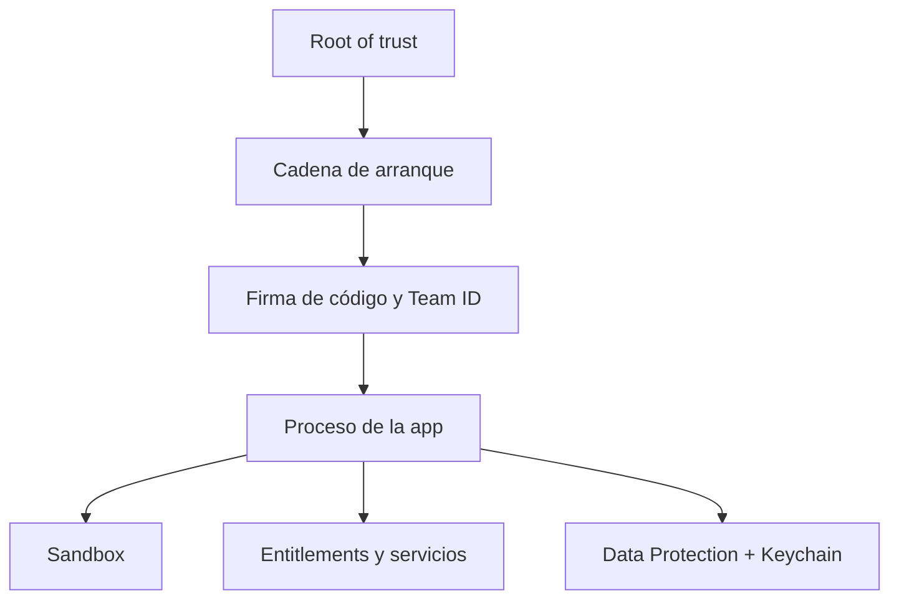

# Clase 263 — Seguridad de iOS: arquitectura

> Parte: **13 — Seguridad móvil, IoT e inalámbrica** · Fuente: *Apple Platform Security Guide* y *The Mobile Application Hacker's Handbook* (Chell et al.)
> ⏱️ Duración estimada: **90 min** · Nivel: **Intermedio**

---

## 🎯 Objetivo

Entender la arquitectura de seguridad de iOS —una de las más cerradas y robustas del mercado— para razonar sobre qué defiende y por qué el pentest de iOS difiere tanto del de Android. Cubriremos la cadena de arranque seguro, el Secure Enclave, la protección de datos por clases, el sandbox de apps, el cifrado de código y el modelo de jailbreak, dejando el terreno preparado para el pentest práctico de la siguiente clase.

## 📚 Resultados de aprendizaje

Al finalizar, el alumno podrá:

1. **Describir** la cadena de arranque seguro (Boot ROM → iBoot → kernel) y su rol de confianza.
2. **Explicar** la función del Secure Enclave (SEP) y del coprocesador criptográfico.
3. **Analizar** el modelo de Data Protection por clases y su relación con el passcode.
4. **Comparar** el Keychain de iOS con el almacenamiento de una app.
5. **Justificar** por qué el pentest de iOS suele requerir un dispositivo con jailbreak.
6. **Identificar** las mitigaciones de explotación (ASLR, PAC, code signing) del sistema.

## 🗺️ Temas

| # | Tema | Por qué importa |
|---|------|-----------------|
| 1 | Cadena de arranque seguro | Ancla la confianza en hardware |
| 2 | Secure Enclave (SEP) | Aísla claves y biometría |
| 3 | Data Protection por clases | Cifra datos ligados al passcode |
| 4 | Sandbox y entitlements | Aísla apps y restringe capacidades |
| 5 | Code signing y FairPlay | Solo corre código firmado por Apple |
| 6 | Keychain | Almacén de secretos del sistema |
| 7 | Jailbreak | Qué habilita y qué rompe |

## 🧠 Explicación en profundidad

### Confianza de arranque, firma y ejecución son capas relacionadas

iOS verifica una cadena de componentes al iniciar y exige firma para el código ejecutable. En runtime, la sandbox restringe archivos y servicios; los *entitlements* conceden capacidades específicas; ASLR y protecciones de memoria elevan el coste de explotación. Apple documenta estas capas como controles separados: una app firmada tiene procedencia aceptada para ejecución, no una garantía de ausencia de defectos.



Data Protection asocia clases de archivo con el estado de bloqueo y las claves del dispositivo. Keychain almacena elementos con políticas de accesibilidad y, cuando corresponde, control de acceso. Elegir una clase demasiado disponible puede exponer información tras reinicio o bloqueo; elegir una demasiado restrictiva puede romper tareas en segundo plano. La decisión depende de cuándo necesita el dato y qué consecuencia tendría su acceso.

Los grupos de acceso, extensiones y esquemas URL crean comunicación intencional entre componentes. Universal links incorporan asociación con dominios; un esquema personalizado puede ser reclamado por otra app en ciertos contextos. La app receptora valida origen, estado y autorización, no confía solo en haber sido invocada.

### Caso razonado: token seguro, copia insegura

Un token se guarda en Keychain con una clase apropiada, pero la respuesta completa de login termina en un log y en una copia de preferencias. La fortaleza del Keychain no cubre duplicados. El equipo inventaría todas las representaciones, elimina logging, aplica minimización y prueba comportamiento bloqueado/desbloqueado.

## 📔 Glosario operativo

| Término | Definición útil |
|---|---|
| Entitlement | Capacidad firmada que autoriza acceso a determinados servicios. |
| Sandbox | Restricción del proceso a su contenedor e interfaces permitidas. |
| Data Protection class | Política que liga acceso a archivos con claves y estado del dispositivo. |
| Keychain | Almacén de credenciales con clases de accesibilidad y controles. |
| Team ID | Identidad del equipo firmante usada en controles de plataforma. |

## ✅ Criterio de dominio

El alumno domina la arquitectura si explica qué demuestra cada capa, selecciona una clase de protección según uso, rastrea datos duplicados y analiza una comunicación entre apps sin asumir que firma equivale a seguridad.

## 📖 Definiciones y características

- **Secure Enclave (SEP):** subsistema aislado que protege determinadas claves y operaciones y participa en autenticación y Data Protection. Característica: las claves configuradas para permanecer allí se usan mediante interfaces controladas; no todo secreto de una app reside automáticamente en SEP.
- **Data Protection:** cifrado de archivos por clases (`Complete`, `CompleteUntilFirstUserAuthentication`, `None`). Característica: las claves se derivan del passcode y del UID de hardware.
- **Entitlements:** permisos declarados y firmados que autorizan capacidades (Keychain groups, push, etc.). Característica: no se pueden falsificar sin romper la firma.
- **Code signing:** todo binario ejecutable debe estar firmado por un certificado de confianza de Apple. Característica: impide ejecutar código no firmado sin jailbreak.
- **Keychain:** base de datos cifrada del sistema para credenciales, respaldada por el SEP. Característica: accesible por clases de protección similares a Data Protection.
- **Jailbreak:** explotación que desactiva code signing y el sandbox para ejecutar código arbitrario. Característica: imprescindible para muchos análisis dinámicos.

## 🧰 Herramientas y preparación

- **Dispositivo iOS propio** compatible con jailbreak (para laboratorio) o **corellium**/simulador para análisis limitado.
- **checkra1n**/**palera1n** (jailbreaks basados en el bug de Boot ROM `checkm8`, hardware antiguo) — solo en dispositivo propio.
- **frida**, **objection**, **Cydia/Sileo** con OpenSSH para acceso por SSH.
- **class-dump**, **Hopper/Ghidra** para RE de binarios Mach-O.

```bash
# Con dispositivo jailbroken y SSH habilitado
ssh root@<ip-dispositivo>          # contraseña por defecto 'alpine' — CÁMBIALA
uname -a                            # kernel
ls /var/mobile/Containers/          # contenedores de apps
```

> ⚠️ Usa exclusivamente dispositivos de tu propiedad dedicados a laboratorio.

## 🧪 Laboratorio guiado

1. **Estudia la cadena de arranque:** documenta con el *Apple Platform Security Guide* el flujo Boot ROM → LLB/iBoot → kernel y dónde se verifica cada firma.
2. **Explora Data Protection:** identifica en qué clase caería un fichero típico de una app y cómo el bloqueo del dispositivo afecta su accesibilidad.
3. **Prepara el laboratorio (dispositivo propio):** aplica el jailbreak con palera1n/checkra1n, instala OpenSSH y **cambia la contraseña root** inmediatamente.
4. **Localiza contenedores de apps:** por SSH, explora `/var/containers/Bundle/Application/` y `/var/mobile/Containers/Data/Application/`.
5. **Volca clases de un binario:** copia el ejecutable de una app propia y ejecuta `class-dump` para ver interfaces Objective-C.
6. **Inspecciona el Keychain:** con objection (`ios keychain dump`) observa qué entradas guarda una app propia y su clase de accesibilidad.
7. **Compara con Android:** redacta tres diferencias arquitectónicas clave que impactan el pentest (code signing, jailbreak vs. root, Data Protection vs. FBE).

## ✍️ Ejercicios

1. Explica con un diagrama la cadena de arranque seguro de iOS.
2. Describe cada clase de Data Protection y da un ejemplo de dato apropiado para cada una.
3. Investiga qué es `checkm8` y por qué no puede parchearse por software.
4. Enumera tres entitlements sensibles y qué capacidad conceden.
5. Compara el Keychain de iOS con el Android Keystore.
6. Justifica por qué class-dump funciona mejor en binarios Objective-C que en Swift.

## 📝 Reto verificable

Elabora una **ficha técnica de arquitectura de seguridad iOS** que, para un dato sensible concreto (p. ej. un token de sesión), explique dónde debería almacenarse, con qué clase de Data Protection/Keychain, y qué lo protegería frente a un atacante con acceso físico al dispositivo bloqueado. **Criterio de aceptación:** la ficha distingue correctamente el escenario "dispositivo bloqueado tras primer desbloqueo" del escenario "nunca desbloqueado tras encendido".

## ⚠️ Errores comunes

| Síntoma / mensaje | Causa y cómo arreglar |
|-------------------|-----------------------|
| Jailbreak no soportado | Dispositivo/versión sin exploit público; usa hardware compatible con checkm8 |
| SSH rechaza conexión | OpenSSH no instalado o servicio caído; instálalo desde Sileo |
| Contraseña `alpine` filtrada | Nunca la cambiaste; cámbiala tras el primer acceso |
| class-dump vacío | Binario Swift o cifrado; descífralo primero (frida-ios-dump) |
| App no arranca en jailbroken | Detección de jailbreak; se evade en la clase siguiente |

## ❓ Preguntas frecuentes

**❓ ¿Por qué iOS se considera más difícil de auditar que Android?**
Por el code signing obligatorio y el sandbox estricto: sin jailbreak no puedes ejecutar herramientas ni instrumentar apps, y los jailbreaks son cada vez más escasos.

**❓ ¿El Secure Enclave puede extraerse o volcarse?**
No es una función que una app desactive. Es un subsistema con arranque y memoria protegidos; aun así, la seguridad completa depende de políticas de acceso, código de plataforma, dispositivo y forma en que la app usa las operaciones.

**❓ ¿Puedo hacer algo sin jailbreak?**
Sí: análisis estático del IPA, revisión de Info.plist y entitlements, y pruebas de red con proxy, aunque el pinning y muchos controles requieren instrumentación.

## 🔗 Referencias

- Apple Platform Security Guide: <https://support.apple.com/guide/security/welcome/web>
- OWASP MASTG — iOS Platform Overview: <https://mas.owasp.org/MASTG/0x06a-Platform-Overview/>
- frida-ios-dump: <https://github.com/AloneMonkey/frida-ios-dump>
- *The Mobile Application Hacker's Handbook*, caps. iOS.

## 📥 Material descargable

- 📄 [Guía en PDF](./clase-263-guia.pdf) — versión imprimible de esta clase.
- 🎞️ [Presentación (PPTX)](./clase-263-presentacion.pptx) — deck para proyectar en clase.

## ⬅️ Clase anterior

[Clase 262 — Pentest de aplicaciones Android](../262-pentest-de-aplicaciones-android/README.md)

## ➡️ Siguiente clase

[Clase 264 — Pentest de aplicaciones iOS](../264-pentest-de-aplicaciones-ios/README.md)
