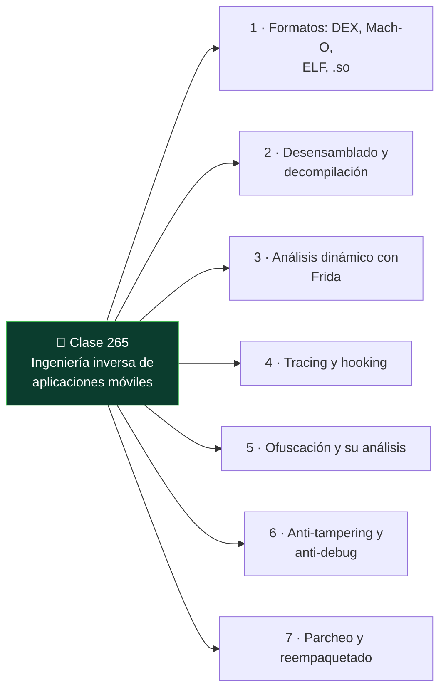

# Clase 265 — Ingeniería inversa de aplicaciones móviles

<!-- cabecera:inicio -->

<div align="center">

[](../README.md)
[](../../README.md)
[](../../README.md)
[](../../README.md)

</div>

> 🗂️ Parte: **13 — Seguridad móvil, IoT e inalámbrica** · 📖 Fuente: *The Mobile Application Hacker's Handbook* (Chell et al.) y documentación de Ghidra/Frida
> ⏱️ Duración estimada: **120 min** · 🎚️ Nivel: **Avanzado**

<!-- cabecera:fin -->

---

## 🎯 Objetivo

Dominar la ingeniería inversa (RE) de aplicaciones móviles combinando análisis estático (desensamblado y decompilación de bytecode/nativo) con análisis dinámico (instrumentación con Frida). El alumno recuperará la lógica de una app, entenderá algoritmos ofuscados, localizará y evadirá controles anti-tampering, y parcheará una app para modificar su comportamiento en laboratorio.

> ⚠️ **Nota ética:** el RE se realiza sobre apps propias, de código abierto o CrackMes/retos diseñados para ello, o con autorización. Modificar o redistribuir software de terceros puede infringir derechos de autor y contratos de licencia.

## 📚 Resultados de aprendizaje

Al finalizar, el alumno podrá:

1. **Decompilar** APK (smali/Java) y binarios nativos Mach-O/ELF (`.so`).
2. **Navegar** código en Ghidra/jadx para reconstruir la lógica de una app.
3. **Instrumentar** funciones en runtime con Frida (hooks, tracing, modificación de retornos).
4. **Identificar** y evadir ofuscación y anti-tampering (checks de integridad, anti-debug).
5. **Parchear** smali o binarios y recompilar/reempaquetar una app propia.
6. **Documentar** el proceso de RE de forma reproducible.

## 🗺️ Temas

<!-- mapa:inicio -->



<!-- mapa:fin -->

| # | Tema | Por qué importa |
|---|------|-----------------|
| 1 | Formatos: DEX, Mach-O, ELF, `.so` | Determinan la herramienta de RE |
| 2 | Desensamblado y decompilación | Recupera lógica legible |
| 3 | Análisis dinámico con Frida | Observa el comportamiento real |
| 4 | Tracing y hooking | Localiza funciones clave rápido |
| 5 | Ofuscación y su análisis | Complica pero no impide el RE |
| 6 | Anti-tampering y anti-debug | Controles que hay que evadir |
| 7 | Parcheo y reempaquetado | Modificar comportamiento en laboratorio |

## 📖 Definiciones y características

- **DEX (Dalvik Executable):** bytecode de Android; se desensambla a smali y se decompila a Java aproximado. Característica: legible con jadx.
- **Ghidra:** suite de RE de la NSA para binarios nativos con decompilador a C. Característica: gratuita y potente para ARM/`.so`/Mach-O.
- **frida-trace:** genera handlers automáticos para funciones y registra sus llamadas. Característica: descubre el flujo sin leer todo el código.
- **Ofuscación:** transformación que dificulta la lectura (renombrado, control-flow flattening, cadenas cifradas). Característica: aumenta el coste, no lo impide.
- **Anti-tampering:** comprobaciones de integridad (firma, checksums) que detectan modificación. Característica: se evaden hookeando el check.
- **Reempaquetado:** recompilar una app modificada y volver a firmarla. Característica: requiere una clave de firma propia.

## 🧰 Herramientas y preparación

```bash
# Estático
apktool d app.apk -o out           # smali + recursos
jadx-gui app.apk                    # decompilación a Java
# Ghidra para binarios nativos .so / Mach-O

# Dinámico
frida-trace -U -i "recv*" -f <paquete>     # traza funciones que empiezan por recv
frida -U -l script.js -f <paquete>         # inyecta un script propio

# Reempaquetado (app propia)
apktool b out -o mod.apk
apksigner sign --ks mykey.jks mod.apk
```

## 🧪 Laboratorio guiado

1. **Elige un objetivo legítimo:** un CrackMe de Android/iOS o una app propia con un "secreto" a recuperar.
2. **Decompila:** ábrela en jadx y localiza la clase/método que valida el secreto o realiza la lógica de interés.
3. **Analiza el nativo:** si la lógica está en un `.so`, cárgalo en Ghidra y estudia la función exportada relevante.
4. **Instrumenta con Frida:** hookea la función de validación, registra sus argumentos y su valor de retorno.
5. **Modifica el retorno:** cambia el resultado de la función (p. ej. forzar `true`) y observa el cambio de comportamiento.
6. **Evalúa anti-tampering:** si la app comprueba su firma, localiza el check y neutralízalo con un hook.
7. **Parchea estáticamente:** edita el smali correspondiente, recompila con apktool, firma con tu clave e instala la app modificada.
8. **Documenta:** deja un registro reproducible (comandos, offsets, script Frida) del proceso.

## ✍️ Ejercicios

1. Resuelve un CrackMe de Android recuperando el secreto solo con análisis estático.
2. Escribe un script Frida que imprima los argumentos de una función de cifrado.
3. Localiza en Ghidra una función nativa y renómbrala/anota según su propósito.
4. Evade un check de detección de debugger con un hook.
5. Parchea una condición en smali y demuestra el nuevo comportamiento.
6. Compara el esfuerzo de resolver el reto por vía estática vs. dinámica.

## 📝 Reto verificable

Toma un CrackMe móvil y recupera su secreto/flag por **dos vías independientes**: una estática (leyendo/parcheando el código) y una dinámica (hook con Frida). **Criterio de aceptación:** documentas ambos métodos con evidencia (captura del flag y el script/parche usado) y explicas cuál fue más eficiente y por qué.

## ⚠️ Errores comunes

| Síntoma / mensaje | Causa y cómo arreglar |
|-------------------|-----------------------|
| jadx muestra `// decompilation failed` | Ofuscación agresiva; recurre a smali o análisis dinámico |
| Frida no engancha la función | Nombre/firma mal escritos o cargada tarde; usa `frida-trace` para descubrir símbolos |
| App reempaquetada no instala | No está firmada o firma inválida; fírmala con apksigner |
| App detecta el parche | Anti-tampering activo; evádelo con un hook antes de parchear |
| Ghidra no reconoce el `.so` | Arquitectura equivocada; selecciona el binario ARM correcto |

## ❓ Preguntas frecuentes

**❓ ¿Estático o dinámico: cuál uso primero?**
Suelen combinarse. El estático da el mapa general; el dinámico confirma comportamiento y sortea ofuscación de cadenas y control de flujo.

**❓ ¿La ofuscación hace imposible el RE?**
No. Aumenta el tiempo y la dificultad, pero el código debe ejecutarse en el dispositivo, así que la instrumentación dinámica siempre observa el comportamiento real.

**❓ ¿Por qué el `.so` requiere Ghidra y el DEX no?**
El DEX es bytecode de alto nivel decompilable casi a Java; el `.so` es código máquina ARM/x86 que necesita un decompilador de binarios nativos como Ghidra.

## 🔗 Referencias

- Ghidra: <https://ghidra-sre.org/>
- jadx: <https://github.com/skylot/jadx> · Frida handbook: <https://frida.re/docs/>
- OWASP MASTG — Reverse Engineering: <https://mas.owasp.org/MASTG/0x04c-Tampering-and-Reverse-Engineering/>
- *The Mobile Application Hacker's Handbook*, caps. de RE.

## 📥 Material descargable

- 📄 [Guía en PDF](./clase-265-guia.pdf) — versión imprimible de esta clase.
- 🎞️ [Presentación (PPTX)](./clase-265-presentacion.pptx) — deck para proyectar en clase.

## ⬅️ Clase anterior

[Clase 264 — Pentest de aplicaciones iOS](../264-pentest-de-aplicaciones-ios/README.md)

## ➡️ Siguiente clase

[Clase 266 — Seguridad de IoT: panorama y superficie de ataque](../266-seguridad-de-iot-panorama-y-superficie-de-ataque/README.md)
