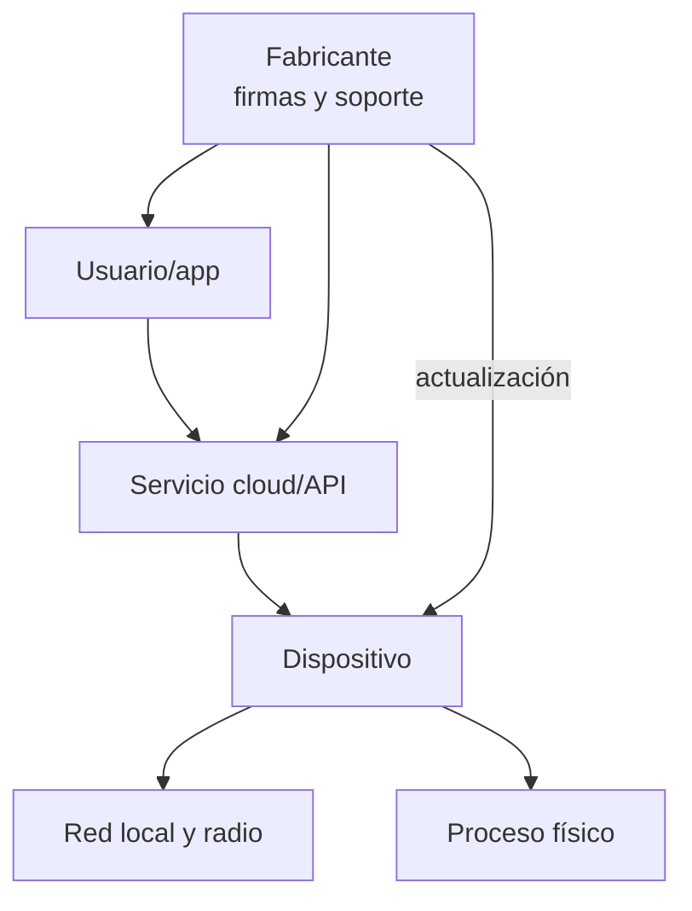

# Clase 266 — Seguridad de IoT: panorama y superficie de ataque

> Parte: **13 — Seguridad móvil, IoT e inalámbrica** · Fuente: *Practical IoT Hacking* (Chantzis et al.) y OWASP IoT Top 10
> ⏱️ Duración estimada: **90 min** · Nivel: **Intermedio**

---

## 🎯 Objetivo

Construir un modelo mental completo de la superficie de ataque de un dispositivo IoT: aplicación móvil, API/nube, comunicaciones de red, firmware y hardware físico. El alumno aprenderá a mapear metódicamente esas capas, a aplicar el OWASP IoT Top 10 y a planificar una evaluación de seguridad de un dispositivo conectado propio, sentando las bases para las clases prácticas de firmware, hardware y radio que siguen.

## 📚 Resultados de aprendizaje

Al finalizar, el alumno podrá:

1. **Modelar** la superficie de ataque IoT en sus cinco capas (móvil, nube/API, red, firmware, hardware).
2. **Aplicar** el OWASP IoT Top 10 a un dispositivo real.
3. **Enumerar** servicios y protocolos de un dispositivo con herramientas de red.
4. **Diseñar** un plan de evaluación (threat model) para un dispositivo propio.
5. **Identificar** las debilidades recurrentes del ecosistema IoT.
6. **Montar** un laboratorio seguro y aislado para pruebas IoT.

## 🗺️ Temas

| # | Tema | Por qué importa |
|---|------|-----------------|
| 1 | Anatomía de un producto IoT | Define todas las capas atacables |
| 2 | OWASP IoT Top 10 | Marco de referencia de riesgos |
| 3 | Enumeración de red y servicios | Punto de partida del ataque remoto |
| 4 | APIs y comunicación con la nube | Suele ser el eslabón más débil |
| 5 | Threat modeling del dispositivo | Prioriza el esfuerzo de pruebas |
| 6 | Laboratorio aislado | Evita impacto en producción/terceros |
| 7 | Credenciales y actualización | Fallos endémicos del sector |

## 🧠 Explicación en profundidad

### El producto IoT es un sistema, no solo una placa

Un producto conectado combina dispositivo, aplicación móvil, servicio cloud, identidad, red local, actualización y soporte. Una cerradura puede proteger bien su radio y exponer cuentas en la API; una cámara puede tener firmware firmado y una contraseña compartida. El modelo sigue datos y comandos entre capas durante instalación, operación, actualización, transferencia y retiro.



NIST IR 8259A define una base de capacidades técnicas: identificación, configuración, protección de datos, control de interfaces, actualización, conocimiento del estado y seguridad del dispositivo. Es un punto de partida que se adapta al riesgo; no una certificación automática. IR 8259B añade capacidades de soporte del fabricante. El ciclo de soporte, divulgación y fin de vida importa tanto como una contraseña inicial.

La amenaza física cambia supuestos: el atacante puede abrir carcasa, cortar energía o leer flash. La respuesta no siempre es hacer todo inviolable, sino proteger claves, detectar manipulación cuando sea viable, limitar privilegios y recuperar de forma segura. Privacidad considera inferencias: un sensor sin audio puede revelar ocupación por horarios.

### Caso razonado: dispositivo actualizado, cloud abandonado

Un sensor recibe firmware firmado, pero su app usa una API sin separación entre hogares. El control de actualización no cubre autorización cloud. El inventario por capas descubre ambos propietarios y produce pruebas distintas. La seguridad del producto se evalúa por el camino completo del comando.

## 📔 Glosario operativo

| Término | Definición útil |
|---|---|
| Producto IoT | Dispositivo y servicios necesarios para su función. |
| Capability baseline | Conjunto adaptable de capacidades, no lista de aprobación. |
| Provisioning | Incorporación inicial de identidad, claves y configuración. |
| Fin de vida | Momento y proceso en que cesa soporte y se gestiona retiro. |
| Efecto físico | Cambio sobre entorno o seguridad causado por el producto. |

## ✅ Criterio de dominio

Existe dominio cuando el alumno dibuja todas las capas y actores, sigue un dato y un comando, adapta la base NIST al impacto y propone soporte, actualización y retiro verificables.

## 📖 Definiciones y características

- **Superficie de ataque IoT:** conjunto de todos los puntos de entrada del sistema (app, API, radio, puertos, interfaces físicas). Característica: es multicapa y a menudo se pivota entre capas.
- **OWASP IoT Top 10:** lista de los diez riesgos más críticos en IoT (credenciales débiles, servicios inseguros, interfaces inseguras, falta de actualización, etc.). Característica: guía de priorización.
- **MQTT/CoAP:** protocolos de mensajería ligeros habituales en IoT. Característica: frecuentemente sin autenticación ni cifrado por defecto.
- **Threat model:** representación estructurada de activos, amenazas y vectores. Característica: dirige el pentest hacia lo que más importa.
- **Hardcoded credentials:** credenciales embebidas en el firmware o la app. Característica: comprometen todos los dispositivos del mismo modelo.
- **OTA (Over-The-Air) update:** mecanismo de actualización remota del firmware. Característica: si no está firmado, permite instalar firmware malicioso.

## 🧰 Herramientas y preparación

- **Dispositivo IoT propio** de bajo costo (cámara, enchufe, bombilla inteligente) para laboratorio.
- **Nmap**, **Wireshark**, **netcat** para enumeración de red.
- **Router/AP de laboratorio aislado** o VLAN dedicada para contener el dispositivo.
- **Burp Suite**/**mitmproxy** para inspeccionar el tráfico app↔nube.

```bash
# Descubrir y enumerar el dispositivo en la red de laboratorio
nmap -sn 192.168.50.0/24                     # host discovery
nmap -sV -p- 192.168.50.23                   # servicios y versiones
tcpdump -i wlan0 host 192.168.50.23 -w iot.pcap
```

> ⚠️ Aísla el dispositivo en una red separada; nunca escanees equipos que no sean tuyos.

## 🧪 Laboratorio guiado

1. **Aísla el dispositivo:** conéctalo a una red/VLAN de laboratorio sin acceso a tu red principal.
2. **Descubre y enumera:** con Nmap identifica IP, puertos abiertos y servicios (Telnet, HTTP, RTSP, UPnP, MQTT).
3. **Captura tráfico:** usa tcpdump/Wireshark durante el emparejamiento y el uso normal; identifica protocolos y destinos en la nube.
4. **Analiza la app móvil:** aplica lo aprendido en las clases 261–264 para revisar cómo la app se comunica con el dispositivo y la nube.
5. **Prueba las APIs:** intercepta con Burp las llamadas a la nube; busca autenticación débil, IDOR o falta de TLS.
6. **Revisa credenciales por defecto:** intenta acceso con usuarios/contraseñas típicos documentados del fabricante.
7. **Construye el threat model:** en una tabla, lista activos, entradas por capa, amenazas y prioridad de prueba.

## ✍️ Ejercicios

1. Dibuja el diagrama de las cinco capas de tu dispositivo IoT y anota un riesgo por capa.
2. Mapea tres hallazgos potenciales al OWASP IoT Top 10.
3. Enumera con Nmap los servicios de un dispositivo propio y clasifícalos por riesgo.
4. Identifica en el tráfico si el dispositivo usa TLS o texto claro para hablar con la nube.
5. Investiga si el modelo tiene credenciales por defecto documentadas públicamente.
6. Redacta un threat model de una página para el dispositivo.

## 📝 Reto verificable

Elabora un **mapa de superficie de ataque** de un dispositivo IoT propio que cubra las cinco capas y un **plan de evaluación priorizado**. **Criterio de aceptación:** el plan identifica al menos un servicio de red expuesto (con evidencia de Nmap) y determina, con captura de tráfico, si la comunicación con la nube va cifrada o en claro.

## ⚠️ Errores comunes

| Síntoma / mensaje | Causa y cómo arreglar |
|-------------------|-----------------------|
| Nmap no encuentra el dispositivo | Aislamiento de red o firewall; verifica la VLAN y usa `-sn` |
| Tráfico a la nube ilegible | Va por TLS; intercéptalo desde la app con proxy y CA propio |
| El dispositivo deja de funcionar | Escaneo agresivo lo bloqueó; reduce la intensidad (`-T2`) |
| No hay puertos abiertos | Solo se comunica saliente a la nube; céntrate en app/API |
| Emparejamiento falla en laboratorio | Requiere Internet; permite salida controlada y monitorízala |

## ❓ Preguntas frecuentes

**❓ ¿Por dónde empiezo a auditar un dispositivo IoT?**
Por el modelado de la superficie: enumera red, revisa la app y las APIs. Suelen ser el camino más rápido antes de abrir el hardware.

**❓ ¿Por qué el IoT es tan inseguro históricamente?**
Costes bajos, ciclos de desarrollo cortos, falta de actualizaciones, credenciales por defecto y reutilización de firmware sin endurecer.

**❓ ¿Necesito abrir el dispositivo desde el principio?**
No siempre. El análisis de red, app y nube da mucho valor sin tocar el hardware; el análisis físico se reserva para profundizar (clases 267–268).

## 🔗 Referencias

- OWASP IoT Top 10: <https://owasp.org/www-project-internet-of-things/>
- OWASP Firmware Security Testing Methodology (FSTM): <https://github.com/scriptingxss/owasp-fstm>
- *Practical IoT Hacking* — Chantzis, Stais, Calderon, Deirmentzoglou, Woods.
- NIST IR 8259 Rev. 1 — Foundational Cybersecurity Activities for IoT Product Manufacturers: <https://csrc.nist.gov/pubs/ir/8259/r1/final>

## 📥 Material descargable

- 📄 [Guía en PDF](./clase-266-guia.pdf) — versión imprimible de esta clase.
- 🎞️ [Presentación (PPTX)](./clase-266-presentacion.pptx) — deck para proyectar en clase.

## ⬅️ Clase anterior

[Clase 265 — Ingeniería inversa de aplicaciones móviles](../265-ingenieria-inversa-de-aplicaciones-moviles/README.md)

## ➡️ Siguiente clase

[Clase 267 — Hacking de firmware](../267-hacking-de-firmware/README.md)
