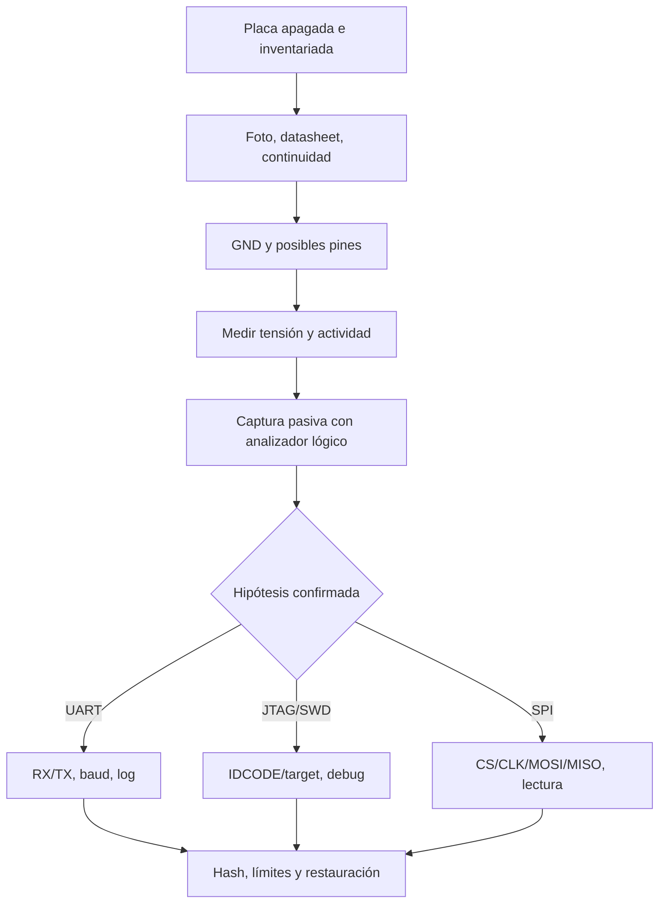

# Clase 268 — Análisis de hardware: UART, JTAG/SWD y SPI

> Parte: **13 — Seguridad móvil, IoT e inalámbrica** · Fuentes principales: documentación de OpenOCD, flashrom, Bus Pirate, sigrok y ChipWhisperer
> ⏱️ Duración estimada: **240 min** · Nivel: **Experto**

---

## 🎯 Objetivo

Investigar de forma no destructiva las interfaces físicas de un dispositivo embebido propio: reconocer la placa, medir niveles, observar UART/SPI, identificar JTAG o SWD, adquirir evidencia repetible y convertir los hallazgos en controles de producto. La clase diferencia instrumento, objetivo y control: el multímetro o analizador lógico mide; el adaptador UART, Bus Pirate o sonda JTAG comunica; la placa es el objetivo; el bloqueo de depuración, la autenticación de consola y el arranque verificado reducen el riesgo.

## 📚 Resultados de aprendizaje

Al finalizar, el alumno podrá:

1. **Preparar** un banco seguro con límite de corriente, tierra común, ESD, documentación y restauración.
2. **Identificar** UART, JTAG/SWD y SPI mediante inspección, datasheet, continuidad y captura pasiva.
3. **Configurar** adaptadores con el nivel lógico, orientación, velocidad y target correctos.
4. **Capturar** un arranque UART y decodificar una transacción SPI sin escribir sobre el dispositivo.
5. **Adquirir** dos lecturas de flash y aceptar la imagen solo si tamaño y hashes son coherentes.
6. **Explicar** qué prueba una consola, un IDCODE, una traza o un volcado y qué permanece incierto.
7. **Administrar** firmware de sondas y respaldos sin mezclar herramientas, evidencia y secretos.
8. **Relacionar** depuración y firmware con controles de producción, respuesta y especialización en canales laterales.

## 🗺️ Temas

| # | Tema | Decisión que habilita |
|---|---|---|
| 1 | Seguridad eléctrica y ESD | Observar sin dañar ni energizar dos veces |
| 2 | Reconocimiento de PCB | Formular hipótesis de pinout trazables |
| 3 | UART | Capturar consola y estado de arranque |
| 4 | Analizador lógico y Bus Pirate | Verificar protocolo antes de conducir líneas |
| 5 | JTAG/SWD y OpenOCD | Comprobar superficie de depuración por target |
| 6 | SPI y flashrom | Adquirir firmware de modo reproducible |
| 7 | Protección de producción | Equilibrar bloqueo, fabricación y recuperación |
| 8 | Canales laterales y fallos | Ubicar ChipWhisperer como especialización, no atajo |

## 🧠 Explicación en profundidad

### Primero electricidad, después protocolo

Una hilera de cuatro pines no «es UART» por su forma. Puede transportar alimentación, I²C, SWD o señales propietarias. El análisis empieza con el dispositivo apagado: fotografía ambas caras, identifica componentes y marcas, busca documentación, localiza tierra por continuidad y dibuja el conector. Luego, con alimentación controlada, mide tensión respecto de GND y usa una sonda de alta impedancia. Nunca conectes `VCC` del adaptador a una placa que ya se alimenta; compartir tierra no significa compartir alimentación.

El nivel lógico es una propiedad eléctrica, no el número «serial» en el sistema operativo. TTL/CMOS de 1,8 V o 3,3 V no es RS-232, que usa tensiones incompatibles. Una línea que parece inactiva puede cambiar durante boot. Por ello la secuencia segura es **inspeccionar → medir → escuchar → comunicar → escribir solo si está autorizado**.



El diagrama no promete que toda rama produzca acceso. Muestra un embudo de reducción de incertidumbre. Solo después de confirmar señales se selecciona un instrumento activo. El resultado válido puede ser «interfaz presente pero bloqueada»; forzarla no es un requisito de aprendizaje.

### UART: ver un log no equivale a obtener una shell

UART es comunicación serie asíncrona: no lleva reloj compartido y depende de velocidad, bits de datos, paridad y parada. En una placa suelen interesar TX del objetivo, RX del objetivo y GND. Escuchar TX durante arranque permite estimar baud y observar bootloader, kernel y servicios. Texto legible prueba que nivel y parámetros son compatibles; un prompt prueba una interfaz interactiva, pero no que acepte entrada ni que otorgue privilegios.

Los logs pueden revelar versiones, particiones, argumentos de kernel, errores y nombres de interfaces. Son evidencia sensible. El control no consiste únicamente en quitar el header: se eliminan secretos de logs, se autentica o deshabilita consola en producción, se protege el bootloader y se verifica que la ruta de recuperación del fabricante siga funcionando.

### JTAG y SWD: depuración depende del chip y su estado

JTAG es un estándar de prueba y depuración con cadena de dispositivos; SWD es una interfaz de depuración de dos señales común en microcontroladores Arm. Un pinout supuesto y un archivo de target equivocado pueden producir errores o escribir registros no deseados. OpenOCD separa la configuración de la sonda (`interface`/`adapter`) de la del target; ambas deben coincidir con hardware y versión.

Leer un IDCODE consistente o conectar al Debug Access Port demuestra que la ruta responde. No demuestra que toda memoria sea legible. Los microcontroladores implementan niveles de protección, autenticación o fusibles con semántica propia; en algunos, cambiar el estado borra la flash. Por eso la práctica básica no programa fusibles ni usa comandos de desbloqueo. La mitigación se diseña con el fabricante: deshabilitar depuración de producción, proteger secretos fuera de flash legible, firmar firmware y conservar recuperación autorizada.

### SPI: una captura es distinta de un volcado

SPI sincroniza un controlador y uno o más periféricos mediante reloj, selección y líneas de datos. En memorias NOR son comunes `CS`, `CLK`, `MOSI` y `MISO`, pero encapsulado y comandos dependen del chip. Un analizador lógico observa transacciones y permite confirmar modo, frecuencia y comandos. Un programador o Bus Pirate puede iniciar transacciones; eso aumenta el riesgo de contención si el SoC sigue conectado o alimentado.

Leer con pinza *in circuit* puede fallar porque otros componentes cargan el bus o porque el programador alimenta parcialmente la placa. Antes de culpar al firmware, se comparan dos o más lecturas completas. Tamaño esperado, ausencia de bytes inestables y hashes iguales son criterios mínimos. El hash no demuestra autenticidad del firmware: solo identidad entre esos archivos. La comparación con una imagen oficial requiere además origen, versión y formato compatibles.

### Elegir instrumento por pregunta

| Equipo | Tipo | Aporta | No sustituye |
|---|---|---|---|
| Multímetro | medición | continuidad y tensión estática | forma temporal o decodificación |
| Analizador lógico + sigrok/PulseView | medición | muestras digitales, temporización y decodificadores | tolerancia eléctrica ni acceso al firmware |
| USB-UART | interfaz | recepción/transmisión serie | análisis de SPI/JTAG |
| Bus Pirate 5/6 | interfaz multiprotocolo | UART, SPI, I²C y captura lógica según modelo/firmware | sonda JTAG de alto rendimiento |
| ST-Link/J-Link/FTDI | sonda de depuración | JTAG/SWD con target compatible | conocimiento automático del pinout |
| CH341A u otro programador | programador | acceso a memorias compatibles | garantía de voltaje o lectura *in circuit* |
| ChipWhisperer | plataforma especializada | captura de potencia y *glitching* sobre targets educativos | fundamentos de electrónica, estadística ni autorización |

Bus Pirate 5 y 6 no deben tratarse como idénticos: la documentación actual destaca en Bus Pirate 6 el búfer adicional para *follow-along logic analyzer*. Siempre registra revisión de hardware y firmware. El modo inicial HiZ, con salidas deshabilitadas, es una salvaguarda útil; cambiar de modo o habilitar fuentes de alimentación es una acción deliberada.

### ChipWhisperer: especialización después de dominar lo observable

Un **canal lateral** usa información no funcional —por ejemplo, variaciones de consumo— correlacionada con una operación. La **inyección de fallos** perturba reloj o alimentación para provocar comportamiento anómalo. ChipWhisperer reúne hardware de captura, targets educativos, firmware y API Python para enseñar esos métodos.

No es «otro programador» ni convierte cualquier equipo en un target. Requiere electrónica, sincronización, estadística, conocimiento criptográfico y una plataforma preparada. Esta clase solo sitúa la competencia: tras obtener capturas repetibles y comprender la implementación de la [Parte 2 — Criptografía aplicada](../../parte-2-criptografia-aplicada/README.md), el alumno puede seguir los notebooks oficiales sobre una placa objetivo del kit. No se practica *glitching* sobre productos desconocidos ni equipos conectados a procesos reales.

### Evidencia, detección y respuesta del fabricante

En un incidente de laboratorio, desconectar inmediatamente puede destruir estado volátil, pero dejar una sonda conectada puede permitir escritura. La decisión depende del riesgo físico y del alcance. Registra fotos, conexiones, LEDs, alimentación, consola y hora; preserva logs y archivos con hashes; etiqueta adaptadores y cables. Nunca conectes una evidencia a una estación productiva «para ver qué hace».

En producto, los indicadores posibles son sellos alterados, soldadura o marcas en test points, cambios de boot, lectura de fusibles, logs de mantenimiento y firmware no firmado. Su ausencia no demuestra que no hubo acceso. La respuesta combina inspección, verificación criptográfica del software, rotación de secretos si pudieron exponerse y revisión del proceso de fabricación/servicio.

## 📖 Definiciones y características

- **UART:** enlace serie asíncrono; una consola puede ser solo salida, interactiva o autenticada.
- **JTAG:** interfaz de prueba/depuración con cadena y señales de reloj/datos/control.
- **SWD:** interfaz de depuración Arm con menos señales que JTAG; las capacidades dependen del target.
- **SPI:** bus serie síncrono controlador-periférico; el chip select delimita el dispositivo activo.
- **HiZ:** alta impedancia; estado que evita conducir activamente una línea.
- **Contención eléctrica:** dos salidas conducen valores incompatibles sobre la misma línea.
- **IDCODE:** identificador leído por ciertas rutas JTAG; orienta la identificación, no autoriza memoria.
- **Canal lateral:** información física correlacionada con cómputo interno.
- **Fault injection:** perturbación controlada para estudiar respuesta ante fallos.

## 📔 Glosario operativo

| Término | Definición útil |
|---|---|
| DUT/target | Dispositivo bajo prueba. |
| GND | Referencia eléctrica común; se identifica antes de conectar señales. |
| Baud | Tasa de símbolos de UART; no siempre equivale a bits útiles por segundo. |
| Pinout | Asignación documentada de función a cada pin. |
| SoC | Sistema en chip que integra procesador y periféricos. |
| NOR flash | Memoria no volátil común en firmware embebido. |
| SOIC clip | Pinza para contactar encapsulados sin desoldar; no elimina contención. |
| OpenOCD | Software de depuración que coordina sonda y target configurados. |
| flashrom | Herramienta para identificar, leer, verificar y escribir flash compatible. |
| ESD | Descarga electrostática capaz de dañar componentes. |

## ✅ Criterio de dominio

Hay dominio cuando el alumno formula y confirma un pinout sin depender de la forma del conector, registra tensión y parámetros, obtiene evidencia pasiva interpretable, acepta un volcado solo por criterios reproducibles y propone controles que no destruyen la capacidad legítima de fabricación y recuperación.

## 🧰 Herramientas y preparación

**Banco recomendado:** placa educativa o router retirado y propio; fuente con límite de corriente; tapete ESD; multímetro; analizador lógico compatible con sigrok; adaptador USB-UART con nivel seleccionable; y, solo para la rama elegida, sonda JTAG/SWD o programador SPI. Consulta datasheet de la placa y del chip antes de energizar.

**Administración del instrumental:** anota modelo, revisión, firmware y controladores; actualiza desde el proyecto/fabricante; respalda configuraciones; no guardes firmware de clientes en almacenamiento interno sin cifrado; restaura el modo HiZ y borra capturas al cerrar el caso.

```bash
# Inventario, no prueba conectividad con el target.
lsusb

# UART: escucha con parámetros conocidos; no conecta VCC.
picocom -b 115200 /dev/ttyUSB0

# OpenOCD: los archivos son ejemplos de estructura, no universales.
openocd -f interface/<sonda>.cfg -f target/<mcu-exacto>.cfg

# Flash: primero identificar; luego dos lecturas. Sustituye el programador real.
flashrom -p <programador> --flash-name
flashrom -p <programador> -r lectura-1.bin
flashrom -p <programador> -r lectura-2.bin
sha256sum lectura-1.bin lectura-2.bin
```

No copies literalmente `<sonda>`, `<mcu-exacto>` ni `<programador>`: son marcadores que obligan a seleccionar configuración documentada. No se usa `-w` en esta práctica.

## 🧪 Laboratorio guiado — Del pin desconocido a una captura defendible

**Objetivo.** Identificar UART y una segunda evidencia pasiva —captura SPI o segundo log— en una placa educativa, sin modificarla.

**Prerrequisitos.** Clases 004, 026, 267 y 025; habilidades básicas de multímetro; autorización del propietario; placa sin conexión a producción.

**Topología.** Placa objetivo alimentada por su fuente → GND común → analizador lógico. El adaptador UART se conecta solo después de confirmar nivel. El portátil de análisis permanece sin conexión a redes sensibles.

**Procedimiento.**

1. Asigna un ID al DUT y registra modelo, revisión, estado, firmware visible y fotos. Descarga datasheets desde fuentes primarias.
2. Con el DUT apagado, localiza GND por continuidad. Marca pines candidatos sin soldar ni raspar pistas.
3. Alimenta con su fuente y mide cada candidato respecto de GND. Detén la práctica ante tensión inesperada, calentamiento u olor.
4. Conecta solo entradas del analizador. Captura desde antes del encendido hasta 30 segundos después. Busca una línea UART por actividad y decodifica varias velocidades plausibles.
5. Cuando el texto sea estable, conecta RX del adaptador a TX del DUT y GND. Captura el arranque con `picocom`; no conectes TX del adaptador todavía.
6. Si hay un chip SPI documentado, observa `CS`, `CLK`, `MOSI` y `MISO` durante boot. Confirma modo y comandos con el datasheet. Esta captura satisface la segunda evidencia sin adquirir la flash.
7. Solo si el instructor ha preparado un chip de práctica separado, ejecuta dos lecturas con `flashrom`, compara tamaño y SHA-256 y conserva ambas como evidencia. Si difieren, no analices contenido: corrige contacto/alimentación y repite.
8. Retira sondas con el equipo apagado, revisa que la placa arranque igual que antes y registra restauración.

**Resultados esperados.** Pinout sustentado por medidas, log UART legible o conclusión negativa documentada, captura SPI decodificada o lecturas idénticas, hashes y registro de no modificación.

**Ruta sin hardware.** El instructor entrega fotos de PCB, datasheet, CSV de tensión, archivo sigrok y dos imágenes de flash —una pareja coincidente y otra inestable—. Se pueden evaluar identificación, protocolo, aceptación del volcado y recomendación. No se evalúan destreza de sonda, ESD, calidad de contacto ni síntomas físicos.

## ✍️ Ejercicios

1. Explica por qué RX/TX cruzados no justifican conectar VCC.
2. Dado un log UART de solo salida, enumera qué evidencia falta para afirmar «shell root».
3. Compara analizador lógico, Bus Pirate y sonda SWD para investigar una EEPROM SPI.
4. Diseña un control de producción que deshabilite debug sin impedir recuperación autorizada.
5. Ante dos volcados diferentes en 37 bytes, plantea un diagnóstico eléctrico antes de interpretar firmware.
6. Define los prerrequisitos que faltan antes de iniciar un laboratorio ChipWhisperer.

## 📝 Reto verificable

Entrega un cuaderno de banco con fotos, hipótesis, medidas, pinout, parámetros, captura anotada, comandos exactos, hashes, límites, controles y restauración.

**Criterio de aceptación:** ninguna conexión se basó solo en apariencia; el alumno demuestra por qué la captura corresponde al protocolo; toda lectura activa es repetible; no se escribe flash ni se cambia protección; y la recomendación considera seguridad, fabricación y recuperación.

## ⚠️ Errores comunes

| Síntoma | Causa probable | Acción segura |
|---|---|---|
| Texto ilegible en UART | baud/formato/nivel incorrecto o ruido | medir nivel y revisar parámetros; no aumentar tensión |
| No hay salida | pin equivocado, consola deshabilitada o ventana perdida | capturar desde antes de encender y conservar resultado negativo |
| OpenOCD no encuentra target | sonda, pinout, reset o archivo incorrectos; protección activa | revisar datasheet y configuración; no ejecutar desbloqueo |
| Hashes SPI difieren | contacto, alimentación o contención | detener análisis y corregir banco |
| El DUT deja de arrancar | alimentación o escritura accidental | cortar energía, preservar estado y seguir plan de recuperación |
| «JTAG presente = memoria extraíble» | confunde interfaz con autorización/capacidad | probar solo operaciones de identificación permitidas |

## ❓ Preguntas frecuentes

**¿Puedo usar un CH341A directamente?** Solo si la revisión, tensión y chip son compatibles. El nombre del programador no garantiza nivel correcto ni seguridad *in circuit*.

**¿Quitar el conector protege JTAG?** Dificulta acceso, pero test points y pistas pueden seguir disponibles. Debe combinarse con protección del silicio y firmware firmado.

**¿Bus Pirate reemplaza todo el banco?** No. Integra muchas funciones de baja velocidad, pero multímetro, analizador dedicado y sonda de depuración responden preguntas distintas.

**¿ChipWhisperer prueba que una implementación es insegura?** Una práctica sobre un target educativo demuestra un fenómeno bajo condiciones concretas. Evaluar un producto exige modelo de amenaza, repetibilidad, parámetros y contramedidas.

## 🔗 Referencias verificables y alcance

- OpenOCD, [User's Guide](https://openocd.org/doc/html/index.html) — separación entre configuración de adaptador, transporte y target.
- flashrom, [documentación oficial](https://flashrom.org/) — identificación, lectura, verificación, programadores y soporte por chip.
- Bus Pirate, [Hardware](https://docs.buspirate.com/docs/overview/hardware/) y [Logic analyzers](https://docs.buspirate.com/docs/logic-analyzer/logicanalyzer/) — protocolos, diferencias de revisión y capacidades de captura.
- sigrok, [proyecto oficial](https://sigrok.org/wiki/Main_Page) — captura y decodificación con hardware compatible.
- Arm, [Debug Interface Architecture Specification](https://developer.arm.com/documentation/ihi0031/latest/) — arquitectura JTAG/SWD; el soporte concreto depende del procesador.
- IEEE, [IEEE 1149.1](https://standards.ieee.org/ieee/1149.1/774/) — estándar de acceso de prueba JTAG.
- NewAE, [ChipWhisperer: Getting Started](https://chipwhisperer.readthedocs.io/en/latest/getting-started.html) — plataforma, componentes, análisis de potencia e inyección de fallos.
- NIST, [IR 8259A](https://csrc.nist.gov/pubs/ir/8259/a/final) — capacidades de ciberseguridad que el fabricante debe considerar en dispositivos IoT.
- Woudenberg y O'Flynn, *The Hardware Hacking Handbook* (ISBN 9781593278755) — método experimental y contexto de ataques físicos; se contrasta con datasheets y documentación del instrumento.
- Grand Idea Studio, [JTAGulator](https://www.grandideastudio.com/portfolio/security/jtagulator/) — ejemplo de instrumento para identificación de pinout; no reemplaza la medición eléctrica previa.

Fuentes consultadas el **6 de octubre de 2026**. Los comandos deben adaptarse al chip, sonda, revisión y documentación de cada banco.

## 📥 Material descargable

- 📄 [Guía en PDF](./clase-268-guia.pdf) — se regenera desde esta clase.
- 🎞️ [Presentación (PPTX)](./clase-268-presentacion.pptx) — material docente complementario.

## ⬅️ Clase anterior

[Clase 267 — Hacking de firmware](../267-hacking-de-firmware/README.md)

## ➡️ Siguiente clase

[Clase 269 — Radio definida por software (SDR) e investigación de interferencias](../269-radio-definida-por-software-sdr/README.md)
