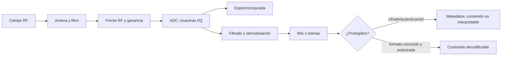

# Clase 269 — Radio definida por software (SDR) e investigación de interferencias

> Parte: **13 — Seguridad móvil, IoT e inalámbrica** · Fuentes principales: documentación de HackRF, GNU Radio, sigMF, SUBTEL y Ley Chile
> ⏱️ Duración estimada: **240 min** · Nivel: **Experto**

---

## 🎯 Objetivo

Comprender cómo un receptor o transceptor SDR convierte una porción del espectro en muestras digitales, cómo configurar y administrar el banco, y cómo interpretar señales sin confundir recepción, decodificación, repetición, suplantación o interferencia. La clase usa HackRF One y RTL-SDR como ejemplos con capacidades distintas, y desarrolla una investigación defensiva de pérdida de disponibilidad mediante grabaciones, simulación y registros. No se construyen, poseen ni operan inhibidores.

## 📚 Resultados de aprendizaje

Al finalizar, el alumno podrá:

1. **Explicar** frecuencia central, ancho de banda, tasa de muestreo, ganancia, I/Q, modulación y demodulación.
2. **Diferenciar** receptor SDR, transceptor, analizador de espectro y equipo calibrado de medición.
3. **Configurar** HackRF One o un receptor compatible para recepción dentro de límites documentados.
4. **Administrar** firmware, host, antenas, atenuación, almacenamiento y restauración del equipo de laboratorio.
5. **Analizar** una grabación SigMF/IQ conocida y justificar frecuencia, tiempo y confianza de la conclusión.
6. **Distinguir** captura, acceso al contenido, transmisión, repetición, suplantación y jamming.
7. **Diagnosticar** degradación por cobertura, congestión, avería o posible interferencia correlacionando varias fuentes.
8. **Diseñar** continuidad y respuesta sin realizar emisiones interferentes.

## 🗺️ Temas

| # | Tema | Pregunta que responde |
|---|---|---|
| 1 | Cadena RF–IQ | ¿Qué representa realmente una captura? |
| 2 | Hardware y accesorios | ¿Qué puede medir este modelo y con qué límites? |
| 3 | Configuración y calibración | ¿Es señal externa o artefacto del receptor? |
| 4 | Recepción y demodulación | ¿Qué información es observable y cuál sigue cifrada? |
| 5 | Transmisión y regulación | ¿Qué autorización técnica y legal falta antes de emitir? |
| 6 | Interferencia y jamming | ¿Cómo afecta disponibilidad y cómo se investiga sin reproducirlo? |
| 7 | Telemetría y atribución | ¿Qué demuestra RSSI, ruido, fallos y una cascada? |
| 8 | Continuidad y respuesta | ¿Cómo contener, preservar y recuperar el servicio? |

## 🧠 Explicación en profundidad

### De la antena a dos secuencias de números

La antena convierte energía electromagnética en una señal eléctrica. El frente RF filtra, amplifica y mezcla una banda alrededor de una **frecuencia central**. El convertidor entrega pares **I/Q**: dos componentes ortogonales que preservan amplitud y fase relativas de la banda muestreada. Con esas muestras, el software dibuja espectro, filtra un canal, identifica una modulación y, cuando el protocolo y la protección lo permiten, recupera símbolos o tramas.

La tasa de muestreo limita el ancho de banda observable y también el volumen de datos. Más ganancia no significa «más alcance» sin costo: amplifica señal y ruido y puede saturar. Una línea en la cascada puede ser una portadora real, fuga interna, armónico, frecuencia imagen o interferencia generada por el propio USB. Mover antena, variar ganancia, usar una carga de 50 Ω y comparar con otro receptor son controles experimentales.



El diagrama impide un salto frecuente: ver energía no equivale a entender un protocolo; capturar tramas no concede claves; conocer claves no autoriza interceptar comunicaciones. Cada transición necesita condiciones adicionales y evidencia propia.

### HackRF One no es «cualquier SDR»

La documentación estable de HackRF One lo define como transceptor **half-duplex** de 1 MHz a 6 GHz, con muestras I/Q de 8 bits y tasas documentadas de 2 a 20 Msps. Half-duplex significa que transmite o recibe, no ambas cosas simultáneamente. La resolución, ruido, filtros, estabilidad del reloj, antena y entorno limitan la medición. No es un analizador de espectro calibrado y su lectura de potencia no debe presentarse como medida reglamentaria en dBm sin cadena calibrada.

Un RTL-SDR típico es receptor y cubre un rango distinto según sintonizador; resulta más barato y reduce el riesgo de transmisión accidental. Un analizador de espectro dedicado puede aportar rango dinámico, filtros y calibración superiores. Un atenuador protege la entrada frente a señales fuertes; un filtro evita saturación fuera de banda; un LNA solo ayuda si se sitúa y dimensiona correctamente. La antena se elige por banda y conector, no por apariencia.

### Administrar el banco: identidad, firmware, reloj y datos

Controlar el dispositivo de laboratorio implica:

1. Registrar modelo, número de serie, revisión, versión de firmware y versión de `hackrf-tools`/GNU Radio.
2. Actualizar desde el proyecto oficial y confirmar compatibilidad host-firmware antes de cambiar el equipo.
3. Etiquetar antenas, filtros, atenuadores y potencia máxima admisible; no energizar la salida de antena salvo necesidad documentada.
4. Usar un directorio por caso con manifiesto: frecuencia central, tasa, ganancia, hora, zona horaria, antena, ubicación de laboratorio y SHA-256.
5. Preferir SigMF para acompañar las muestras con metadatos; separar archivos originales de derivados.
6. Al cerrar, detener captura, desmontar almacenamiento, limpiar configuraciones sensibles y restaurar el perfil de recepción.

Controlar el riesgo que representa requiere, además, una política de **recepción por defecto**. Tener un transceptor no autoriza emitir. Toda transmisión necesita banda, potencia, ancho de banda, carga/antena, autorización del titular del sistema, medidas de contención y cumplimiento regulatorio. Una jaula o carga ficticia solo reduce radiación si su eficacia ha sido medida; no convierte automáticamente una emisión en legal.

### Seis verbos que no son sinónimos

| Acción | Mecanismo | Evidencia mínima | Límite clave |
|---|---|---|---|
| Recibir | muestrear energía presente | archivo I/Q + metadatos | puede incluir señales ajenas; no implica interpretación |
| Demodular/decodificar | convertir muestras en símbolos/tramas | parámetros y tramas consistentes | cifrado puede ocultar contenido |
| Transmitir | generar RF | configuración y medición de salida | está regulado y puede afectar terceros |
| Repetir/retransmitir | volver a emitir una señal observada | captura y emisión correlacionadas | protocolos con contadores/rolling code pueden rechazarla |
| Suplantar | producir señal aceptada como otra identidad | aceptación controlada en sistema propio | exige conocer protocolo/estado; no es simple reproducción |
| Interferir/jammear | degradar relación señal/ruido o acceso al medio | degradación temporal/espectral correlacionada | causa y autor rara vez se deducen de una sola fuente |

### Jammers: contenido defensivo y marco chileno

Un inhibidor transmite energía o tramas con el fin de impedir o degradar comunicaciones. El efecto observable puede parecerse a distancia excesiva, obstáculos, antena dañada, saturación del receptor, congestión, colisión, DFS, error de configuración, avería o interferencia no intencional. Por eso «bajó el WiFi» no prueba jamming.

En Chile, la Ley General de Telecomunicaciones vigente, artículo 36 B letra h), prohíbe —con excepciones institucionales tasadas— la fabricación, comercialización, adquisición, importación, exportación, utilización, tenencia o porte de dispositivos aptos para interferir, interceptar o interrumpir señales de servicios de telecomunicaciones. La misma ley sanciona la interferencia maliciosa en la letra b). El Plan General de Uso del Espectro define interferencia perjudicial por su efecto sobre servicios. La autorización del dueño de un router no reemplaza estas condiciones del espectro.

Por esa razón, este programa no propone adquirir ni fabricar un jammer, tampoco dentro de una jaula. La competencia se evalúa con archivos IQ previamente autorizados, espectrogramas sintéticos, métricas de AP/clientes, logs y ejercicios de mesa. La fecha de consulta legal es **6 de octubre de 2026**; antes de una actuación profesional se debe revisar la versión vigente en SUBTEL/BCN y obtener asesoría competente.

### Diagnóstico diferencial: una hipótesis necesita predicciones

| Hipótesis | Predicción en RF | Predicción en red/equipo | Falsos positivos o negativos |
|---|---|---|---|
| Cobertura/obstáculo | RSSI/SNR cambia con posición, sin elevación general de ruido | pocos clientes o zona concreta | multipath produce variación brusca |
| Congestión legítima | alta ocupación en canales/protocolos reconocibles | retransmisiones y latencia en horas/celdas cargadas | un receptor estrecho puede perder emisores |
| Avería/AP saturado | espectro puede verse normal | reinicios, errores, CPU, temperatura o enlace cableado | ausencia de logs por caída de energía |
| Interferencia no intencional | energía coincidente con ciclo de otro equipo | patrón por horario/uso físico | artefactos del propio SDR |
| Posible interferencia deliberada | energía anómala y degradación simultánea, a veces móvil | múltiples sistemas/bandas o zonas afectadas | no atribuye intención ni emisor por sí sola |

La fuente RF aporta tiempo, frecuencia, ancho de banda y patrón relativo. El AP aporta canal, asociaciones, retransmisiones, ruido reportado y cambios. El cliente aporta RSSI, tasa, pérdida y roaming. El switch y servicio aportan si la caída continúa fuera del enlace inalámbrico. La triangulación o radiogoniometría requiere instrumentos, procedimiento y autoridad; una cascada no entrega ubicación por sí sola.

### Respuesta y continuidad

La prioridad es mantener servicios críticos sin destruir evidencia. Se registra hora común, alcance, servicios afectados, capturas originales y configuración de instrumentos. Se descartan energía, cableado, backhaul y configuración antes de atribuir RF. La contención puede incluir trasladar temporalmente el servicio a medio cableado, canal/banda alternativa permitida, redundancia celular de operador distinto o procedimiento manual. Cambiar canal a ciegas puede ocultar el patrón y contaminar la comparación; se conserva primero una línea base cuando el riesgo operacional lo permite.

Escalar a SUBTEL o autoridades exige datos y no confrontación: ubicación aproximada, ventana, bandas afectadas, impacto, instrumentos, calibración conocida, archivos originales y cadena de custodia. El informe usa «compatible con interferencia» o «indicio de energía anómala» mientras no haya medición y atribución suficiente.

## 📖 Definiciones y características

- **SDR:** radio donde funciones como filtrado/demodulación se implementan en software alrededor de hardware RF.
- **I/Q:** componentes ortogonales de una señal compleja muestreada.
- **Frecuencia central:** punto alrededor del cual el receptor captura una banda.
- **Tasa de muestreo:** muestras por segundo; condiciona banda observable y almacenamiento.
- **Ganancia:** amplificación; demasiado alta satura y crea conclusiones falsas.
- **Cascada:** espectro apilado en el tiempo; permite correlacionar duración y cambios.
- **Half-duplex:** operación alternada de recepción o transmisión.
- **SigMF:** formato de metadatos para describir grabaciones de señal.
- **Interferencia perjudicial:** interferencia que compromete servicios de seguridad o degrada gravemente/interrumpe comunicaciones según normativa.

## 📔 Glosario operativo

| Término | Definición útil |
|---|---|
| FFT | Transformación que aproxima contenido por frecuencia en una ventana. |
| SNR | Relación entre señal y ruido bajo condiciones definidas. |
| Saturación | Entrada excede rango y distorsiona la captura. |
| Frecuencia imagen | Respuesta no deseada que puede parecer señal real. |
| PPM | Error relativo de frecuencia del reloj. |
| LNA | Amplificador de bajo ruido; no corrige saturación previa. |
| Atenuador | Reduce nivel para proteger entrada o evitar saturación. |
| Rolling code | Código que cambia con estado; una grabación antigua suele no ser reutilizable. |
| Radiogoniometría | Estimación de dirección con antenas y método apropiados. |

## ✅ Criterio de dominio

Hay dominio cuando el alumno conserva metadatos y originales, distingue artefacto de señal mediante controles, no extrapola contenido desde energía, construye diagnóstico diferencial y propone continuidad y escalamiento sin realizar transmisión interferente.

## 🧰 Herramientas y preparación

**Ruta con recepción física:** HackRF One o receptor SDR compatible; antena de banda; atenuador/filtro cuando proceda; portátil aislado; `hackrf-tools`, GNU Radio, Universal Radio Hacker o inspectores compatibles; reloj sincronizado. No se usa amplificador de potencia.

```bash
# Inventario y compatibilidad host/dispositivo.
hackrf_info

# Recepción de 10 segundos en un banco autorizado. -x es ganancia VGA RX,
# no potencia de transmisión. Ajusta frecuencia/tasa a la señal propia.
hackrf_transfer -r captura.iq -f 433920000 -s 2000000 -x 16 -n 20000000

# Integridad del original.
sha256sum captura.iq
```

El comando produce muestras crudas de 8 bits intercaladas según `hackrf_transfer`; frecuencia, tasa, ganancia y duración deben quedar en el manifiesto. Una frecuencia de ejemplo no concede permiso para recibir, interpretar o emitir en ella.

**Ruta sin hardware:** dataset SigMF del instructor con tres escenarios: señal propia limpia, artefacto de saturación y periodo de degradación sintética. Se evalúan lectura de espectro, metadatos, hipótesis y respuesta. No se evalúan selección física de antena, protección del puerto, calibración, alcance ni localización.

## 🧪 Laboratorio guiado — Investigación sin emisiones

**Objetivo.** Clasificar un incidente de disponibilidad usando grabaciones y logs, sin transmitir.

**Topología.** Archivos IQ/SigMF → estación offline de análisis; CSV de AP y clientes → cuaderno de tiempo; registro de switch/servicio → línea de base. Todos los datos son sintéticos o de un banco cerrado previamente autorizado.

**Procedimiento.**

1. Copia los archivos como solo lectura, calcula SHA-256 y revisa metadatos: hora UTC, frecuencia, tasa, formato, ganancia y origen.
2. Genera espectro y cascada con los mismos parámetros para línea base e incidente. No normalices cada imagen de forma independiente sin anotarlo, porque esconderías diferencias de nivel.
3. Marca inicio/fin de cada anomalía, ancho de banda aparente y si se mueve o permanece. Busca clipping o simetrías compatibles con artefacto.
4. Une por tiempo con canal, ruido reportado, retransmisiones, desconexiones, CPU/reinicios de AP y estado del enlace cableado.
5. Evalúa las cinco hipótesis de la tabla. Para cada una escribe predicción confirmada, evidencia contradictoria y dato faltante.
6. Selecciona una medida de continuidad reversible y un plan de preservación/escalamiento. No propongas «probar con un jammer».
7. Repite el análisis ocultando la fuente RF y determina si los logs por sí solos habrían detectado el incidente. Esto mide cobertura y falsos negativos.

**Criterio de aceptación:** hashes y metadatos completos; al menos tres fuentes correlacionadas; conclusión con nivel de confianza; descarte explícito de alternativas; control de continuidad verificable; y ninguna afirmación sobre intención, ubicación o marca sin evidencia.

## ✍️ Ejercicios

1. Calcula el caudal aproximado de una captura HackRF a 20 Msps con I/Q de 8 bits por componente y explica el impacto en almacenamiento.
2. Explica por qué ver una portadora fuerte no demuestra jamming.
3. Compara HackRF One, RTL-SDR y analizador de espectro para una investigación de 915 MHz.
4. Diseña tres controles para distinguir saturación del receptor de una señal externa.
5. Separa qué puede inferirse de una captura cifrada y qué requeriría claves/autorización adicional.
6. Redacta un informe de escalamiento para SUBTEL sin atribuir intención.

## 📝 Reto verificable

Analiza el caso integrado de degradación inalámbrica y entrega timeline, espectrogramas comparables, tabla de hipótesis, decisión de continuidad, evidencia preservada y límites.

**Criterio de aceptación:** el alumno distingue recepción/transmisión/repetición/suplantación/interferencia; identifica al menos un artefacto del receptor; no propone adquirir ni operar inhibidores; y demuestra con métricas que la medida de continuidad recupera el servicio de prueba.

## ⚠️ Errores comunes

| Error | Consecuencia | Corrección |
|---|---|---|
| Aumentar ganancia hasta «ver algo» | saturación e imágenes falsas | comenzar bajo y usar carga/atenuación/segundo receptor |
| Llamar analizador calibrado a un SDR | medición de potencia no defendible | declarar cadena, incertidumbre y propósito cualitativo |
| Confundir captura con contenido legible | ignora cifrado y protocolo | documentar cada transición y requisito |
| Ensayar jamming «a baja potencia» | riesgo legal y afectación externa | usar grabaciones, simulación y casos documentados |
| Atribuir intención desde RSSI/ruido | muchas causas producen el mismo síntoma | correlacionar RF, AP, cliente y backhaul |
| Omitir tasa/formato I/Q | archivo difícil o imposible de reproducir | usar manifiesto/SigMF y hash |

## ❓ Preguntas frecuentes

**¿HackRF One puede recibir y transmitir a la vez?** No; la documentación lo especifica como transceptor half-duplex.

**¿Puedo repetir una señal capturada?** Técnicamente depende del protocolo y hardware; legalmente y éticamente requiere autorización y condiciones de espectro. Esta clase no lo practica.

**¿Un Flipper Zero reemplaza HackRF?** No. Su módulo sub-GHz y protocolos integrados cubren casos concretos; HackRF expone muestras de una banda mucho más amplia con otra resolución y flujo. Véase la Clase 270 para la taxonomía multiprotocolo.

**¿Una autorización corporativa permite usar un jammer?** No. El permiso sobre activos no sustituye la ley del espectro ni las prohibiciones específicas.

## 🔗 Referencias verificables y alcance

- Great Scott Gadgets, [HackRF One](https://hackrf.readthedocs.io/en/stable/hackrf_one.html) — rango, half-duplex, tasa, resolución e interfaces del modelo.
- Great Scott Gadgets, [HackRF tools](https://hackrf.readthedocs.io/en/stable/hackrf_tools.html) — sintaxis oficial de inventario y recepción/transmisión.
- GNU Radio, [sitio y documentación oficial](https://www.gnuradio.org/) — procesamiento reproducible de señales.
- SigMF, [Specification](https://github.com/sigmf/SigMF) — metadatos y portabilidad de grabaciones.
- SUBTEL, [Resolución Exenta 1985 y modificaciones](https://www.subtel.gob.cl/wp-content/uploads/2023/05/Resolucion_1985_EXENTA_17_OCT_2017_Actualizada_al_2021.pdf) — equipos de alcance reducido, bandas y condiciones; debe comprobarse la versión vigente antes de emitir.
- Biblioteca del Congreso Nacional, [Ley 18.168, General de Telecomunicaciones](https://www.bcn.cl/leychile/navegar?idNorma=29591) — artículo 36 B, interferencia/interceptación y prohibición de dispositivos; texto vigente a la consulta.
- Biblioteca del Congreso Nacional, [Plan General de Uso del Espectro Radioeléctrico, Decreto 15](https://www.bcn.cl/leychile/navegar?idNorma=122795) — definición de interferencia perjudicial y atribución de bandas.
- Flipper Devices, [Sub-GHz frequencies](https://docs.flipper.net/zero/sub-ghz/frequencies) — ejemplo de restricciones regionales aplicadas por firmware; no reemplaza normativa chilena.
- Universal Radio Hacker, [repositorio oficial](https://github.com/jopohl/urh) — inspección y demodulación de señales del banco; el decodificador debe validarse contra el protocolo.
- [GQRX](https://gqrx.dk/) y [RTL-SDR](https://www.rtl-sdr.com/) — alternativas de recepción; rango y prestaciones dependen del sintonizador y revisión.

Fuentes y normativa consultadas el **6 de octubre de 2026**. Este material educativo no sustituye asesoría jurídica ni una medición regulatoria calibrada.

## 📥 Material descargable

- 📄 [Guía en PDF](./clase-269-guia.pdf) — se regenera desde esta clase.
- 🎞️ [Presentación (PPTX)](./clase-269-presentacion.pptx) — material docente complementario.

## ⬅️ Clase anterior

[Clase 268 — Análisis de hardware: UART, JTAG/SWD y SPI](../268-analisis-de-hardware-uart-jtag-y-spi/README.md)

## ➡️ Siguiente clase

[Clase 270 — Auditoría de RFID, NFC y credenciales de proximidad](../270-ataques-a-rfid-y-nfc/README.md)
