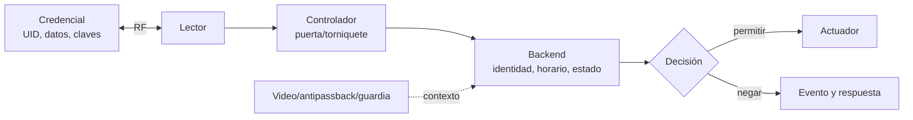

# Clase 270 — Auditoría de RFID, NFC y credenciales de proximidad

> Parte: **13 — Seguridad móvil, IoT e inalámbrica** · Fuentes principales: NFC Forum, NXP, Flipper Zero y RfidResearchGroup/Proxmark3
> ⏱️ Duración estimada: **240 min** · Nivel: **Experto**

---

## 🎯 Objetivo

Auditar un sistema de proximidad propio sin reducirlo a «clonar una tarjeta». El alumno distinguirá tecnología, credencial, lector, controlador y backend; identificará familias LF/HF; observará lectura, memoria y autenticación; comparará Flipper Zero, Proxmark3 y lectores de aplicación; y validará controles del sistema completo con credenciales de prueba.

## 📚 Resultados de aprendizaje

Al finalizar, el alumno podrá:

1. **Distinguir** RFID LF, HF/NFC, UHF y las familias/protocolos relevantes sin inferir seguridad solo por frecuencia o forma.
2. **Separar** identificador, datos, claves, autenticación, emulación y autorización del backend.
3. **Reconocer** credencial, lector, herramienta de análisis y control defensivo por su función.
4. **Configurar y administrar** Flipper Zero, Proxmark3 o lector compatible con firmware, cliente, respaldo y borrado seguros.
5. **Identificar** una credencial de laboratorio sin escribirla ni atacar claves de terceros.
6. **Interpretar** logs del controlador y demostrar si el backend decide por UID, dato autenticado o estado adicional.
7. **Responder** ante una credencial o herramienta encontrada preservando evidencia y revocando con alcance proporcional.
8. **Explicar** límites físicos y funcionales cuando no se dispone del hardware.

## 🗺️ Temas

| # | Tema | Por qué importa |
|---|---|---|
| 1 | LF, HF/NFC y UHF | Frecuencia orienta la capa física, no la seguridad completa |
| 2 | Credencial–lector–controlador–backend | La decisión de abrir no vive necesariamente en la tarjeta |
| 3 | UID, memoria y autenticación | Leer identidad no equivale a leer datos ni demostrar posesión de clave |
| 4 | Lectura, escritura y emulación | Son capacidades distintas por familia y modelo |
| 5 | Proxmark3 y lectores | Instrumentación profunda frente a tareas acotadas |
| 6 | Flipper Zero | Plataforma multiprotocolo con capacidades y límites por interfaz |
| 7 | Detección y mitigación | Correlación de acceso, video, antipassback y ciclo de vida |
| 8 | Respuesta y recuperación | Preservar, revocar y reemitir sin afirmar más de la evidencia |

## 🧠 Explicación en profundidad

### «RFID» nombra una familia, no una vulnerabilidad

RFID abarca sistemas que intercambian identidad o datos por radio. En control de acceso son comunes credenciales LF alrededor de 125 kHz y HF a 13,56 MHz; NFC es un conjunto de tecnologías HF de corto alcance basado en estándares concretos. UHF se usa con frecuencia en inventario y logística, con otra física y distancia. Dos tarjetas del mismo tamaño pueden implementar protocolos, memoria y seguridad totalmente distintos.

La frecuencia ayuda a seleccionar antena e instrumento. No dice por sí sola si una credencial es clonable, si hay criptografía o si el sistema acepta solo un número. «MIFARE» tampoco basta: Classic, Ultralight, DESFire y otras familias tienen arquitecturas diferentes. Deben registrarse fabricante/familia, protocolo, versión, configuración y comportamiento del lector.



El diagrama explica por qué copiar un valor visible no prueba bypass. El lector puede ejecutar autenticación mutua; el controlador puede usar claves diversificadas; el backend puede exigir horario, zona, segundo factor o estado de entrada/salida. También muestra el límite opuesto: una credencial criptográficamente robusta no compensa enrolamiento débil, lectores expuestos o un backend que toma decisiones por UID.

### Cuatro capas que deben nombrarse por separado

1. **Identificación:** reconocer una tarjeta o leer un UID/serial. Ese valor puede ser público y no secreto.
2. **Acceso a datos:** leer bloques o archivos. Puede requerir selección de aplicación, permisos o claves.
3. **Autenticación:** demostrar conocimiento de una clave o ejecutar un protocolo desafío-respuesta.
4. **Autorización:** decisión de negocio sobre una puerta, compra o servicio. Ocurre en lector/controlador/backend según diseño.

La **escritura** modifica memoria compatible; la **emulación** hace que una herramienta responda como cierta credencial o protocolo; ninguna garantiza que el lector acepte la sesión. Algunas herramientas solo pueden emular UID para ciertas familias; otras requieren datos/secretos completos. Un resultado negativo puede deberse a antena, distancia, protocolo no soportado, campos incompletos, autenticación o política del backend.

### Instrumentos y objetivos: no mezclar roles

| Elemento | Rol | Ventaja educativa | Límite |
|---|---|---|---|
| Tarjeta/etiqueta de prueba | credencial/objetivo | reproduce ciclo de enrolamiento y uso | no representa todas las familias |
| Lector USB PC/SC | lector de aplicación | APIs y flujos NFC acotados | no suele cubrir LF ni análisis de baja capa |
| Proxmark3 | instrumento RFID LF/HF | identificación, trazas y emulación según hardware/firmware | requiere cliente/firmware compatibles y conocimiento del protocolo |
| Flipper Zero | herramienta multiprotocolo portátil | LF, NFC, sub-GHz, IR, iButton, GPIO y BadUSB en una interfaz integrada | no sustituye un SDR de banda ancha, Proxmark3 ni analizador calibrado |
| Lector de puerta | componente del sistema | muestra decisión real y cableado/backend | no es herramienta de investigación por sí solo |

Proxmark3 no es una capacidad única e inmutable: existen revisiones y clones; el proyecto RfidResearchGroup mantiene firmware y cliente que deben corresponder. Flipper Zero documenta por separado 125 kHz RFID y NFC a 13,56 MHz; su ficha lista protocolos soportados, pero la lectura/emulación completa depende del tipo y datos disponibles. En sub-GHz aplica restricciones regionales y protocolos dinámicos pueden impedir guardar/repetir; esa función pertenece conceptualmente a la [Clase 269](../269-radio-definida-por-software-sdr/README.md), no demuestra capacidades NFC.

### Administrar una herramienta multiprotocolo

En Flipper Zero, qFlipper o la app oficial permiten actualizar/reparar firmware y gestionar archivos. El modo Debug añade funciones y SWD, pero la propia documentación advierte menor estabilidad; se habilita solo durante la tarea y se revierte. En Proxmark3 se registra revisión, commit/versión del cliente y firmware, y se confirma compatibilidad antes de flashear.

Para ambas herramientas:

- inventariar dispositivo y microSD;
- usar firmware oficial o declarar explícitamente cualquier variante, sin mezclar resultados;
- respaldar solo configuraciones necesarias, no credenciales reales;
- proteger el host de administración y no sincronizar capturas con nubes personales;
- etiquetar archivos con propietario, autorización, fecha, familia y hash;
- borrar credenciales y claves al cerrar el ejercicio, restaurar configuración y verificar el borrado.

«Controlar el equipo» significa hacer todo lo anterior. «Controlar el riesgo» significa diseñar el sistema para que la pérdida o emulación de un identificador no baste para acceder.

### Telemetría: lo que sabe cada componente

Un lector puede registrar tecnología, resultado de autenticación y fallos; un controlador, puerta, zona y decisión; el backend, identidad lógica, horario, permisos y revocación; video/guardia, presencia física; y el sensor de puerta, apertura real. Los campos exactos dependen del producto: el curso no inventa IDs de evento universales.

Una regla útil se expresa primero en lógica independiente del proveedor: «misma credencial aceptada en dos zonas incompatibles dentro de un intervalo menor al tiempo de desplazamiento». Para implementarla hay que mapear campos reales como `credential_id`, `reader_id`, `event_time`, `decision` y `door_state` del sistema disponible. Falsos positivos: relojes desalineados, puertas contiguas, reintentos o credencial compartida indebidamente. Falsos negativos: controlador offline, eventos sobrescritos, acceso por otra credencial o tailgating.

La ausencia de un evento de tarjeta no demuestra ausencia de intrusión física. La presencia de dos UIDs iguales tampoco prueba clonación: puede haber duplicados administrativos, importaciones o error de normalización.

### Controles por mecanismo y validación

| Riesgo | Control | Verificación observable | Límite |
|---|---|---|---|
| UID usado como secreto | credencial con autenticación criptográfica y backend que valide resultado | UID copiado no obtiene `allow` | claves/lectores mal gestionados siguen siendo riesgo |
| Extracción de clave maestra | claves diversificadas, SAM/HSM y mínimo acceso | comprometer una credencial de prueba no abre otra | requiere ciclo de vida y rotación |
| Replay/emulación | desafío-respuesta, contador/estado y rechazo de sesión repetida | reproducción controlada es denegada | errores de sincronización pueden afectar disponibilidad |
| Préstamo/tailgating | segundo factor, antipassback, guardia y sensor de puerta | discrepancia genera evento y revisión | puede elevar fricción y privacidad |
| Pérdida de credencial | reporte rápido, revocación y reemisión | token revocado produce `deny` en todos los controladores | controladores offline pueden retener estado |
| Manipulación de lector | tamper, canal protegido lector-controlador, inspección | apertura/cableado anómalo alerta | no elimina abuso de credencial válida |

### Respuesta a incidente

Ante una tarjeta, lector portátil o Flipper encontrado, no se conecta ni explora de inmediato. Se fotografía ubicación, se registra quién lo halló, hora y condiciones, se embala según procedimiento y se consulta al propietario del sistema. Si hay riesgo de acceso, se revoca la credencial concreta o se eleva el control temporal; invalidar toda una población sin evidencia puede causar un incidente de disponibilidad.

Se preservan logs del lector/controlador/backend y video conforme a plazos y privacidad; se sincronizan relojes y se correlacionan accesos. La conclusión separa: datos legibles, capacidad de emulación demostrada en banco, aceptación por lector de prueba y uso real en producción. Solo la última requiere evidencia del sistema afectado.

## 📖 Definiciones y características

- **RFID LF:** familias de baja frecuencia usadas en proximidad; no todas comparten codificación o formato.
- **NFC:** tecnologías HF a 13,56 MHz con modos y protocolos definidos; proximidad no implica seguridad.
- **UID:** identificador de chip/tarjeta; según familia puede ser fijo, aleatorio o emulable y no debe asumirse secreto.
- **Sector/bloque/archivo:** unidades de organización que dependen de la tecnología.
- **Autenticación mutua:** ambas partes prueban conocimiento/identidad antes de intercambiar datos protegidos.
- **Emulación:** herramienta responde como una credencial compatible bajo condiciones concretas.
- **Diversificación de claves:** derivación de claves por credencial para limitar el impacto de una extracción.
- **Antipassback:** política de estado que detecta secuencias de entrada/salida inconsistentes.

## 📔 Glosario operativo

| Término | Definición útil |
|---|---|
| PICC | Tarjeta/objeto sin contacto en terminología ISO 14443. |
| PCD | Dispositivo lector que genera el campo e inicia comunicación. |
| APDU | Unidad de comando/respuesta usada por aplicaciones de tarjetas inteligentes. |
| ATQA/SAK | Respuestas de selección ISO 14443A que ayudan a caracterizar tarjeta. |
| Crypto-1 | Cifrado histórico asociado a MIFARE Classic; no representa toda MIFARE. |
| DESFire | Familia con aplicaciones y autenticación criptográfica; la seguridad depende de versión/configuración. |
| PC/SC | API común para lectores y tarjetas inteligentes en sistemas operativos. |
| Wiegand/OSDP | Enlaces lector-controlador; OSDP Secure Channel puede proteger comunicación si se configura. |

## ✅ Criterio de dominio

Hay dominio cuando el alumno identifica una familia con evidencia, separa UID/datos/autenticación/autorización, usa solo credenciales de prueba, interpreta la decisión del backend y demuestra que un control reduce el riesgo sin prometer «anti-clonación» absoluta.

## 🧰 Herramientas y preparación

**Banco mínimo:** dos credenciales de prueba de familias conocidas, lector USB PC/SC o NFC de teléfono en modo compatible, aplicación local y registro sintético. **Banco avanzado:** Proxmark3 con firmware/cliente coincidentes o Flipper Zero con firmware oficial actualizado. **Sistema de acceso:** lector/controlador de mesa sin actuador físico o cerradura simulada; nunca una puerta real fuera de alcance.

```text
# Consola Proxmark3: identificación pasiva en una credencial propia.
lf search
hf search
hf 14a info
```

Los comandos consultan tecnologías compatibles y no son una orden universal: revisa `help` de la versión instalada. No se incluyen recuperación de claves, escritura ni clonado porque el objetivo del laboratorio es construir evidencia y validar autorización.

## 🧪 Laboratorio guiado — UID no es autorización

**Objetivo.** Demostrar con dos credenciales de prueba que identificación, lectura y acceso son decisiones diferentes.

**Prerrequisitos.** Clase 025; banco aislado; credenciales adquiridas para docencia; logs exportables; firmware/cliente registrados.

**Topología.** Credencial A/B ↔ herramienta de identificación; credencial A/B ↔ lector de mesa → controlador/backend simulado → evento `allow/deny`. No hay cerradura ni datos personales.

**Procedimiento.**

1. Inventaría cada credencial sin asumir tecnología por color o forma. Registra herramienta, antena, firmware y hora.
2. Ejecuta búsqueda LF y HF por separado. Conserva salida cruda y conclusión: familia probable, frecuencia e información visible.
3. Para la credencial autorizada A, registra qué campos puede leer sin autenticación y cuáles no. No ejecutes ataques de clave.
4. Enrola A en el backend simulado con horario limitado. Presenta A y verifica `allow`; presenta B y verifica `deny` aunque sea de la misma familia.
5. Cambia el backend para demostrar una configuración insegura de laboratorio basada solo en UID; usa un segundo token de prueba con el mismo valor preparado por el instructor. Observa aceptación.
6. Activa la configuración segura del laboratorio —autenticación/clave de aplicación o segundo factor, según kit— y repite. El resultado esperado es `deny` para el sustituto.
7. Revoca A y verifica denegación en todos los controladores simulados, incluso después de reinicio. Registra la latencia de propagación.
8. Borra de la herramienta los datos guardados, restaura el backend y documenta la eliminación.

**Evidencias.** Salidas de identificación, tabla de datos accesibles, eventos reales exportados por el producto, configuración antes/después, decisión y prueba de revocación. Los nombres de campo se toman de la exportación real; no se reemplazan por un esquema inventado.

**Ruta sin hardware.** Se entregan capturas de consola, trazas PCAP/PM3, fichas de tecnología y CSV de eventos sintéticos. Permite evaluar clasificación, inferencia, detección y mitigación. No evalúa acoplamiento, orientación de antena, distancia, timing ni emulación física.

## 🔍 Caso razonado — El UID copiado no abre la puerta

Una herramienta lee un UID y lo emula, pero el lector de prueba deniega. El resultado no «desmiente» la captura: demuestra que el sistema exige algo adicional. El alumno revisa si el lector autenticó una aplicación, si faltan datos, si la emulación soporta esa familia y qué reportó el backend. Si el evento indica autenticación fallida, el control actuó; si no existe evento, puede haber incompatibilidad física. La conclusión cambia según capa.

## ✍️ Ejercicios

1. Clasifica cinco objetos como credencial, lector, instrumento, objetivo o control defensivo.
2. Explica por qué dos tarjetas a 13,56 MHz pueden tener propiedades de seguridad opuestas.
3. Compara lector PC/SC, Proxmark3 y Flipper Zero para identificar una tarjeta desconocida.
4. Diseña una alerta de «viaje imposible» entre lectores usando campos reales de un CSV dado.
5. Propón respuesta ante un lector portátil hallado junto a una puerta sin asumir que fue utilizado.
6. Define qué competencia no puede certificarse con trazas grabadas.

## 📝 Reto verificable

Entrega un informe del sistema de mesa: arquitectura, identificación de credenciales, matriz UID/datos/autenticación/autorización, eventos, prueba del control, revocación, restauración y limitaciones.

**Criterio de aceptación:** toda credencial es propia/de prueba; el alumno no generaliza una debilidad entre familias; demuestra una decisión insegura y su corrección con resultados observables; distingue emulación de acceso real; y conserva/borrar evidencia conforme al plan.

## ⚠️ Errores comunes

| Error | Por qué falla | Corrección |
|---|---|---|
| «13,56 MHz = NFC clonable» | frecuencia no define memoria, claves ni backend | identificar protocolo/familia/configuración |
| «Leí UID, leí la tarjeta» | UID puede ser lo único visible | separar identificación y datos autenticados |
| «Flipper soporta NFC, entonces reemplaza Proxmark3» | profundidad, trazas y soporte difieren | elegir por pregunta y modelo |
| Firmware/cliente Proxmark3 mezclados | comandos/resultados incompatibles | registrar y alinear versiones |
| Probar en una puerta real | riesgo físico y acceso no autorizado | usar lector/controlador de mesa |
| Revocar todo el lote | impacto operacional no proporcional | preservar, acotar y validar propagación |

## ❓ Preguntas frecuentes

**¿Flipper Zero puede clonar cualquier credencial?** No. La documentación diferencia tecnologías y, en algunos casos, solo permite emular UID o datos disponibles. Autenticación, claves, lector y backend determinan el resultado.

**¿Proxmark3 es siempre mejor?** Es más especializado para investigación RFID LF/HF, pero requiere aprendizaje y compatibilidad. Un lector PC/SC puede ser más adecuado para una aplicación NFC concreta.

**¿Una funda bloqueadora resuelve el sistema?** Reduce lectura accidental/remota en ciertas condiciones, pero no corrige enrolamiento, backend, pérdida de credencial o tailgating.

**¿Leer mi propia tarjeta basta para practicar?** Solo si también controlas el sistema y los datos asociados. Propiedad física no siempre concede derecho a extraer secretos de un emisor tercero.

## 🔗 Referencias verificables y alcance

- NFC Forum, [Specifications](https://nfc-forum.org/build/specifications/) — arquitectura y especificaciones NFC; algunas requieren acceso del programa miembro.
- NXP, [MIFARE product portfolio](https://www.nxp.com/products/rfid-nfc/mifare-hf:MC_53422) — diferencia familias; no se atribuye una propiedad a toda la marca.
- RfidResearchGroup, [Proxmark3](https://github.com/RfidResearchGroup/proxmark3) — firmware/cliente, documentación y soporte por comandos.
- Flipper Devices, [documentación de Flipper Zero](https://docs.flipper.net/zero), [especificaciones de hardware](https://docs.flipper.net/zero/development/hardware/tech-specs) y [lectura/emulación NFC](https://docs.flipper.net/zero/nfc/read) — interfaces, familias y límites documentados.
- SIA, [OSDP](https://www.securityindustry.org/industry-standards/open-supervised-device-protocol/) — enlace lector-controlador y Secure Channel.
- NIST, [SP 800-116 Rev. 1](https://csrc.nist.gov/pubs/sp/800/116/r1/final) — uso de credenciales PIV en acceso físico; referencia de arquitectura y niveles, no prescripción universal.
- NIST, [SP 800-53 Rev. 5](https://doi.org/10.6028/NIST.SP.800-53r5) — controles de acceso físico, identidad, auditoría y respuesta.

Fuentes consultadas el **6 de octubre de 2026**. Las capacidades se atribuyen al modelo, firmware, protocolo y configuración observados.

## 📥 Material descargable

- 📄 [Guía en PDF](./clase-270-guia.pdf) — se regenera desde esta clase.
- 🎞️ [Presentación (PPTX)](./clase-270-presentacion.pptx) — material docente complementario.

## ⬅️ Clase anterior

[Clase 269 — Radio definida por software (SDR) e investigación de interferencias](../269-radio-definida-por-software-sdr/README.md)

## ➡️ Siguiente clase

[Clase 271 — Seguridad de Bluetooth, BLE y radio IoT de corto alcance](../271-seguridad-de-bluetooth-y-ble/README.md)
