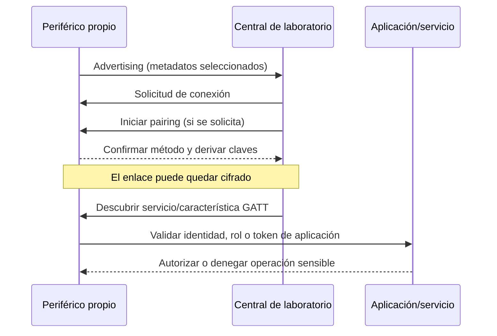

# Clase 271 — Seguridad de Bluetooth, BLE y radio IoT de corto alcance

> Parte: **13 — Seguridad móvil, IoT e inalámbrica** · Fuentes principales: Bluetooth SIG, Nordic Semiconductor, Wireshark, Thread Group y Silicon Labs
> ⏱️ Duración estimada: **210 min** · Nivel: **Avanzado**

---

## 🎯 Objetivo

Auditar un periférico Bluetooth Low Energy propio desde el anuncio hasta la autorización de aplicación, usando un teléfono, BlueZ o una placa de desarrollo como instrumentos controlados. La clase enseña qué puede observar un sniffer, cuándo el cifrado impide interpretar contenido y cómo se diferencia BLE de Bluetooth Classic, Zigbee y Thread. El énfasis está en diseño, captura reproducible, detección y recuperación, no en enumerar herramientas.

## 📚 Resultados de aprendizaje

Al finalizar, el alumno podrá:

1. **Distinguir** Bluetooth Classic y BLE por arquitectura, no solo por nombre comercial.
2. **Explicar** advertising, conexión, pairing, bonding, seguridad de enlace, GATT y autorización de aplicación.
3. **Reconocer y configurar** un adaptador, placa de desarrollo o sniffer compatible, registrando firmware y limitaciones.
4. **Capturar** anuncios y una sesión de un periférico propio con herramientas oficiales.
5. **Interpretar** direcciones públicas/aleatorias, RSSI, servicios, permisos y datos cifrados sin atribución excesiva.
6. **Validar** que una característica sensible rechaza accesos no autenticados/no autorizados.
7. **Relacionar** BLE con Zigbee y Thread como competencias complementarias sobre 2,4 GHz.
8. **Responder** ante un dispositivo IoT desconocido preservando estado, claves y evidencia.

## 🗺️ Temas

| # | Tema | Resultado |
|---|---|---|
| 1 | Classic vs BLE | Seleccionar modelo y herramienta correctos |
| 2 | Advertising y privacidad | Interpretar descubrimiento sin asumir identidad estable |
| 3 | Pairing, bonding y cifrado | Separar intercambio de claves, persistencia y enlace |
| 4 | GATT y autorización | Probar propiedades de características y lógica de aplicación |
| 5 | Instrumentación | Distinguir HCI local, captura aérea y traza del dispositivo |
| 6 | Telemetría y defensa | Construir evidencia con falsos positivos/negativos |
| 7 | Zigbee y Thread | Ubicar placas/analizadores 802.15.4 como complemento |
| 8 | Respuesta | Contener, rotar y recuperar sin destruir contexto |

## 🧠 Explicación en profundidad

### BLE no es «Bluetooth con menos alcance»

Bluetooth Classic y BLE comparten banda y una marca, pero tienen enlaces, perfiles y uso energético distintos. BLE organiza el descubrimiento mediante anuncios, establece conexiones sobre canales de datos y expone el modelo **GATT**: servicios, características y descriptores. Classic usa perfiles y procedimientos diferentes. Una herramienta que enumera GATT no prueba perfiles Classic; una captura HCI del host no equivale a escuchar dos dispositivos externos.

En BLE, el descubrimiento revela lo que el periférico decide anunciar: dirección, nombre opcional, UUIDs, fabricante y RSSI aproximado. La dirección puede ser pública, aleatoria estática o privada y cambiar. RSSI sirve como indicador relativo bajo condiciones comparables, no como distancia exacta: antena, orientación, cuerpo, paredes y potencia cambian el resultado.



El diagrama separa dos controles que suelen mezclarse. El cifrado de enlace protege el transporte; la autorización decide si esa central puede ejecutar una operación. Un dispositivo puede tener enlace cifrado y, aun así, aceptar una escritura sensible de cualquier equipo emparejado. También puede dejar servicios públicos de diagnóstico y proteger solo acciones críticas.

### Pairing, bonding y asociación visual

**Pairing** negocia claves y propiedades de seguridad. **Bonding** guarda material para reconectar más tarde. «Just Works», entrada de passkey, comparación numérica y OOB ofrecen distintas garantías frente a intermediario según capacidades de entrada/salida y versión. Ningún nombre de método debe evaluarse aislado del modelo de amenaza: un sensor sin pantalla no puede confirmar números, pero puede usar puesta en marcha física, NFC/OOB o autorización de servidor.

La seguridad de enlace no corrige una aplicación que envía secretos en advertising, usa comandos sin autorización o acepta firmware no firmado. Tampoco evita que presencia y patrones temporales sean observables. La privacidad requiere direcciones resolubles, rotación adecuada y minimizar datos identificables.

### Tres posiciones de captura, tres verdades distintas

| Posición | Ejemplo | Qué observa | Límite principal |
|---|---|---|---|
| Host/central | BlueZ `btmon`, HCI del teléfono/PC | comandos, eventos y datos que atraviesan el controlador local | no ve conversaciones ajenas; puede mostrar datos ya descifrados por el host |
| Aire | nRF Sniffer + Wireshark | anuncios y paquetes capturados por radio | puede perder conexión/saltos; contenido cifrado requiere claves/contexto |
| Nodo/firmware | RTT/UART, Packet Trace Interface | decisiones internas, claves y estado según instrumentación | altera banco y no representa visibilidad de un atacante remoto |

Nordic documenta nRF Sniffer como complemento externo de Wireshark para placas/dongles compatibles. Puede seguir conexiones y, cuando se aportan claves como LTK/IRK o se captura el intercambio necesario, ayudar a interpretar sesiones cifradas. La propia documentación advierte que puede no captar una solicitud de conexión; ausencia de paquetes no prueba ausencia de actividad.

Un Flipper Zero puede explorar determinadas funciones BLE mediante aplicaciones/firmware, pero no reemplaza automáticamente un sniffer que sigue saltos ni una placa que expone depuración. Se registra función y versión exactas antes de afirmar capacidad.

### Configurar y administrar el banco

Una placa de desarrollo —por ejemplo, nRF52840 DK/Dongle o equivalente— puede ser **objetivo**, **central** o **sniffer** según firmware. La etiqueta física no define el rol. Antes de usarla:

1. registra modelo/revisión, firmware cargado, herramientas y versión;
2. respalda firmware/configuración que sea legal conservar;
3. genera claves y datos solo para el laboratorio;
4. evita habilitar logs con claves en capturas compartidas;
5. separa captura original, archivo con secretos y versión anonimizada;
6. al finalizar, borra bonds, claves y firmware de ejercicio, y restaura la imagen conocida.

El teléfono de prueba también guarda bonds y permisos. «Olvidar dispositivo» es parte de la restauración, al igual que borrar el estado en el periférico; limpiar solo un extremo puede cambiar el comportamiento de la siguiente prueba.

### GATT: descubrir no es autorizar

Cada característica declara propiedades como lectura, escritura, notificación o indicación. Esas propiedades describen operaciones del protocolo, no necesariamente quién está autorizado. La implementación puede exigir cifrado, autenticación de enlace o una condición de aplicación adicional. El laboratorio debe probar una matriz: sin emparejar, emparejado, bond conocido, bond revocado y rol/token inválido.

Una UUID «desconocida» no es evidencia de malicia; puede ser servicio propietario. Una UUID estándar no garantiza implementación correcta. El hallazgo útil nombra característica, operación, estado de enlace, respuesta ATT y efecto observable en el dispositivo.

### Detección: identidad inestable y señales incompletas

| Fuente | Campos esperables | Comportamiento que puede interesar | Límites |
|---|---|---|---|
| Escáner BLE | dirección/tipo, nombre, UUID, RSSI, payload de anuncio, hora | aparición, anuncios excesivos, datos sensibles | direcciones privadas rotan; cobertura y duplicados |
| Captura aérea | canal, access address, tipo PDU, secuencia, CRC, RSSI según sniffer | reconexiones, fallos, retransmisiones, pairing | pérdida de paquetes y cifrado |
| HCI host | comandos/eventos, handle, pairing, desconexión, razón | emparejamientos o conexiones no esperados | solo el host instrumentado |
| App/backend | cuenta, dispositivo lógico, operación, decisión, token | acción sensible o enrolamiento anómalo | depende de instrumentación y reloj |
| Firmware | estado interno, asserts, permisos | causa precisa de rechazo/fallo | telemetría no disponible en producción |

No se atribuye un producto por nombre de advertising: es modificable. Una dirección cambiante puede ser privacidad legítima; una estable puede ser diseño, no compromiso. La detección efectiva combina inventario de activos, ventana de mantenimiento, configuración de commissioning y operaciones del backend.

### Zigbee y Thread: misma banda no significa mismo protocolo

Zigbee y Thread suelen usar IEEE 802.15.4 en 2,4 GHz, pero construyen redes y seguridad diferentes. Thread transporta IPv6 mediante 6LoWPAN y usa un *border router*; Zigbee define su propia pila de red/aplicación. Una placa 802.15.4 compatible puede ejecutar firmware de una u otra, pero un sniffer necesita canal, decodificador y claves adecuados.

Los kits de Silicon Labs con Packet Trace Interface o equipos equivalentes pueden registrar timestamps, RSSI/LQI, CRC y eventos internos sin depender solo de captura aérea. Eso es especialmente valioso para distinguir «el paquete no llegó» de «llegó y fue rechazado». Es una especialización complementaria: esta clase enseña el método de instrumentación; un análisis completo de Zigbee/Thread exige sus procesos de commissioning, roles y claves.

### Prevención, respuesta y recuperación

Los controles se eligen por mecanismo: minimizar advertising, usar métodos de pairing acordes al riesgo, limitar ventana de commissioning, exigir autorización de aplicación, firmar actualizaciones, rotar/revocar bonds y registrar operaciones sensibles. La verificación observa un rechazo concreto y que el caso legítimo siga funcionando.

Ante un dispositivo desconocido, captura primero su contexto si hacerlo no prolonga un riesgo: ubicación, alimentación, identidad anunciada, conexiones del gateway y hora. Contener puede significar cerrar commissioning, revocar un bond o aislar el gateway, no emitir interferencia. Preserva capturas y logs, rota secretos potencialmente expuestos, actualiza firmware desde fuente oficial y confirma recuperación con un enrolamiento nuevo.

## 📖 Definiciones y características

- **Central/periférico:** roles de conexión BLE; no equivalen necesariamente a cliente/servidor GATT.
- **Advertising:** tramas para descubrimiento y datos sin conexión.
- **GATT:** modelo de atributos organizado en servicios y características.
- **ATT:** protocolo de acceso a atributos que GATT utiliza.
- **Pairing:** establecimiento de seguridad/claves; **bonding** conserva claves.
- **LTK/IRK:** claves usadas para cifrado de enlace y resolución de identidad privada.
- **HCI:** interfaz entre host y controlador Bluetooth.
- **Commissioning:** incorporación autorizada de un dispositivo a una red/sistema.
- **LQI:** indicador de calidad de enlace proporcionado por ciertos radios 802.15.4.

## 📔 Glosario operativo

| Término | Definición útil |
|---|---|
| UUID | Identificador de servicio/característica; estándar o propietario. |
| Notification | Actualización GATT sin confirmación ATT. |
| Indication | Actualización GATT que requiere confirmación. |
| RPA | Dirección privada resoluble que rota y puede resolverse con IRK. |
| Access Address | Valor que identifica una conexión BLE en la capa de enlace. |
| Connection interval | Periodicidad negociada de eventos de conexión. |
| 6LoWPAN | Adaptación de IPv6 a redes de baja potencia IEEE 802.15.4. |
| Border router | Enrutador entre Thread y otras redes IP; no es solo un «hub». |

## ✅ Criterio de dominio

Hay dominio cuando el alumno vincula una operación GATT con estado de seguridad y decisión de aplicación, documenta la posición de captura, reconoce paquetes perdidos/cifrados y demuestra que un control bloquea el caso no autorizado sin romper el caso legítimo.

## 🧰 Herramientas y preparación

**Banco mínimo:** periférico BLE educativo o app de ejemplo sobre placa propia; central en Linux/teléfono de prueba; Wireshark; BlueZ. **Captura aérea opcional:** placa compatible con nRF Sniffer y firmware oficial. **Complemento IoT:** dos placas 802.15.4 y analizador del fabricante para Zigbee/Thread.

```bash
# Inventario y estado del adaptador local.
bluetoothctl list
bluetoothctl show

# Captura HCI del host local; no escucha por sí sola equipos terceros.
sudo btmon --write hci-local.btsnoop

# En otra terminal, descubrimiento del banco propio.
bluetoothctl scan on
```

La salida contiene identificadores de terceros que estén al alcance; minimiza, filtra y elimina lo incidental. No publiques direcciones, nombres ni payloads sin necesidad y base legal.

## 🧪 Laboratorio guiado — De anuncio a autorización

**Objetivo.** Verificar que una característica sensible de un periférico de práctica solo acepta escritura tras el estado de seguridad y autorización definidos.

**Prerrequisitos.** Clases 025 y 266; periférico/firmware propios; datos sintéticos; snapshot/configuración de restauración.

**Topología.** Periférico educativo ↔ central Linux/teléfono; nRF Sniffer opcional entre ambos; backend local simulado sin Internet.

**Procedimiento.**

1. Registra firmware, UUIDs esperadas, método de pairing y matriz de acceso. Borra bonds previos en ambos extremos.
2. Captura advertising durante 60 segundos. Anota dirección/tipo, intervalos aproximados, UUIDs y datos visibles. Decide si algo sensible sobra.
3. Intenta descubrir y leer la característica pública sin pairing. Registra respuesta real.
4. Intenta escribir la característica sensible sin pairing. Debe fallar con la condición definida; captura ATT/HCI y efecto físico nulo.
5. Empareja con el método del banco, repite y registra enlace cifrado. Si hay autorización de aplicación, prueba primero token/rol inválido y luego válido.
6. Activa nRF Sniffer antes de reconectar. Si pierde el `CONNECT_IND` o la sesión, repite y documenta la limitación; no declares «no hubo tráfico».
7. Revoca el bond o token, reinicia ambos extremos y prueba de nuevo. Debe fallar; verifica que un enrolamiento legítimo nuevo siga posible.
8. Exporta captura, hashes y logs; elimina claves de la copia compartible; borra bonds y restaura firmware/configuración.

**Ruta sin hardware.** Analiza PCAPNG con anuncios, pairing y GATT, más logs sintéticos de app. Permite evaluar capas, filtros y control. No evalúa RF real, colocación del sniffer, pérdida de salto, coexistencia ni consumo energético.

## ✍️ Ejercicios

1. Explica por qué un enlace cifrado puede seguir permitiendo una acción no autorizada.
2. Compara captura HCI, nRF Sniffer y PTI de una placa.
3. Diseña una matriz de acceso GATT para estado sin pairing, bond nuevo, bond revocado y rol inválido.
4. Identifica falsos positivos de una alerta por direcciones BLE cambiantes.
5. Explica qué añade Thread sobre IEEE 802.15.4 y por qué no equivale a Zigbee.
6. Diseña restauración que elimine bonds en los dos extremos y preserve evidencia separada.

## 📝 Reto verificable

Entrega PCAPNG/HCI, inventario, matriz de estados, evidencia del rechazo y éxito legítimo, análisis de privacidad del advertising, revocación y restauración.

**Criterio de aceptación:** la posición de captura está declarada; los filtros usan campos reales de Wireshark; no se confunde descubrimiento con autorización; el caso revocado queda bloqueado después de reinicio; y se explican pérdidas y cifrado.

## ⚠️ Errores comunes

| Error | Por qué falla | Corrección |
|---|---|---|
| «Descubrí el servicio, tengo acceso» | GATT discovery no concede permisos | probar operación y estado de seguridad |
| «No está en PCAP, no ocurrió» | el sniffer puede perder conexión/saltos | correlacionar HCI, aire y nodo |
| Usar RSSI como metros | depende de entorno/antena/potencia | usarlo de forma relativa y calibrada |
| Compartir PCAP con claves | expone sesiones y privacidad | separar original restringido y copia sanitizada |
| Tratar BLE, Zigbee y Thread como variantes | comparten banda/radio, no pila completa | seleccionar decodificador y modelo correctos |
| Borrar bond en un solo extremo | deja estados inconsistentes | restaurar ambos extremos y verificar enrolamiento |

## ❓ Preguntas frecuentes

**¿Un sniffer puede leer toda conexión BLE cifrada?** No. Debe captar la sesión y disponer del material/contexto compatible; aun así puede perder paquetes.

**¿Flipper Zero es un sniffer BLE completo?** No debe asumirse. Las capacidades dependen de la aplicación y firmware; para captura aérea reproducible se usa una herramienta documentada para seguir conexiones.

**¿Thread reemplaza WiFi?** No. Es una red IPv6 de baja potencia sobre 802.15.4 que se integra mediante border routers y sirve a otros perfiles de uso.

**¿Cerrar commissioning basta?** Reduce altas no autorizadas, pero deben mantenerse autorización, actualización firmada, revocación y monitoreo.

## 🔗 Referencias verificables y alcance

- Bluetooth SIG, [Core Specification](https://www.bluetooth.com/specifications/specs/core-specification/) — arquitectura, enlace, seguridad y GATT/ATT.
- Nordic Semiconductor, [nRF Sniffer for Bluetooth LE](https://docs.nordicsemi.com/r/bundle/nrfutil/page/nrfutil-ble-sniffer/guides/overview.html) — hardware compatible, Wireshark, claves y límites de captura.
- Wireshark, [campos reales `btle`](https://www.wireshark.org/docs/dfref/b/btle.html) y [captura Bluetooth](https://wiki.wireshark.org/CaptureSetup/Bluetooth) — esquemas y posiciones de captura.
- BlueZ, [`bluetoothctl`](https://manpages.ubuntu.com/manpages/noble/man1/bluetoothctl.1.html) y [`btmon`](https://manpages.ubuntu.com/manpages/noble/man1/btmon.1.html) — administración/captura HCI en Linux; opciones dependen de versión.
- Thread Group, [Overview](https://threadgroup.org/What-is-Thread/Overview) — IPv6 sobre IEEE 802.15.4, seguridad y bajo consumo.
- Silicon Labs, [Network Analyzer](https://docs.silabs.com/network-analyzer/latest/network-analyzer-start/) — PTI, timestamps, RSSI/LQI, CRC y trazas por nodo para Zigbee/Thread.
- NIST, [IR 8259A](https://csrc.nist.gov/pubs/ir/8259/a/final) — identificación, configuración, protección de datos, actualización y estado de ciberseguridad de IoT.
- Nordic Semiconductor, [nRF Connect for Desktop](https://www.nordicsemi.com/Products/Development-tools/nrf-connect-for-desktop) — gestión de placas y utilidades oficiales; la aplicación concreta depende del kit.

Fuentes consultadas el **6 de octubre de 2026**. Las herramientas se citan como implementaciones verificables, no como requisitos de compra.

## 📥 Material descargable

- 📄 [Guía en PDF](./clase-271-guia.pdf) — se regenera desde esta clase.
- 🎞️ [Presentación (PPTX)](./clase-271-presentacion.pptx) — material docente complementario.

## ⬅️ Clase anterior

[Clase 270 — Auditoría de RFID, NFC y credenciales de proximidad](../270-ataques-a-rfid-y-nfc/README.md)

## ➡️ Siguiente clase

[Clase 272 — Auditoría WiFi avanzada: Evil Twin, PMKID y defensa](../272-ataques-wifi-avanzados-evil-twin-y-pmkid/README.md)
