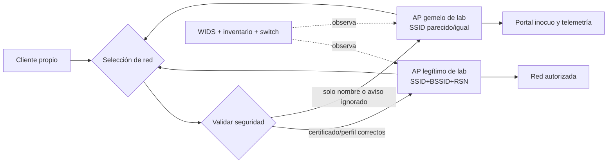

# Clase 272 — Auditoría WiFi avanzada: Evil Twin, PMKID y defensa

> Parte: **13 — Seguridad móvil, IoT e inalámbrica** · Fuentes principales: IEEE 802.11, Wi-Fi Alliance, hostapd, Wireshark y documentación de WiFi Pineapple
> ⏱️ Duración estimada: **240 min** · Nivel: **Experto**

---

## 🎯 Objetivo

Evaluar en un laboratorio aislado cómo los clientes eligen una red WiFi, qué demuestra una captura de autenticación y cómo detectar puntos de acceso no autorizados. WiFi Pineapple se estudia como plataforma administrable de auditoría —reconocimiento, AP de prueba y captura—, no como sinónimo de Evil Twin. La práctica no desautentica terceros, no recolecta credenciales y no interpreta tráfico cifrado sin claves y alcance.

## 📚 Resultados de aprendizaje

Al finalizar, el alumno podrá:

1. **Explicar** SSID, BSSID, canal, RSN, autenticación, asociación, 4-way handshake, PMKID, SAE y PMF.
2. **Distinguir** observación pasiva, conexión a una red, captura de frames e interpretación del contenido.
3. **Configurar y administrar** un AP de laboratorio o WiFi Pineapple con firmware, país, red de gestión, filtros, credenciales y restauración.
4. **Construir** un Evil Twin inocuo con clientes propios y portal sin captura de datos.
5. **Capturar** una asociación iniciada manualmente y evaluar una contraseña sintética offline.
6. **Detectar** un AP no autorizado correlacionando inventario, beacon/RSN, infraestructura y comportamiento del cliente.
7. **Validar** controles como perfiles gestionados, validación de certificados, PMF, WPA3-SAE, segmentación y WIDS.
8. **Responder** preservando evidencia y evitando deautenticaciones o interferencia como método de contención.

## 🗺️ Temas

| # | Tema | Decisión profesional |
|---|---|---|
| 1 | Identidad WiFi | ¿Qué identifica SSID y qué identifica BSSID/RSN? |
| 2 | Captura y cifrado | ¿Qué metadatos y contenido puede ver cada actor? |
| 3 | Handshake/PMKID | ¿Qué permite una verificación offline y bajo qué condiciones? |
| 4 | Evil Twin | ¿Por qué un cliente elige el AP equivocado? |
| 5 | WiFi Pineapple | ¿Qué funciones ofrece el modelo/firmware y cómo se administra? |
| 6 | Detección | ¿Cómo se distingue un AP vecino de uno que suplanta? |
| 7 | Controles | ¿Qué evita conexión, qué limita impacto y qué aporta evidencia? |
| 8 | Respuesta | ¿Cómo contener sin interferir el espectro? |

## 🧠 Explicación en profundidad

### SSID es un nombre, no una identidad autenticada

El **SSID** es el nombre de red que el usuario reconoce; múltiples AP legítimos pueden compartirlo. El **BSSID** suele identificar una interfaz de radio concreta, pero puede modificarse. Los beacons anuncian canal, capacidades y elementos RSN; tampoco prueban pertenencia a la organización. En WPA2-Enterprise, la confianza fuerte llega cuando el cliente valida el certificado del servidor de autenticación y su identidad esperada. Si acepta cualquier certificado o el usuario ignora el aviso, un SSID conocido no protege.

Un Evil Twin reproduce suficientes señales de una red esperada para atraer conexiones. Puede ser abierto, usar una contraseña de laboratorio conocida o imitar una configuración Enterprise en un banco. No «rompe WiFi» por existir: necesita que el cliente lo seleccione, que la configuración sea compatible y que el usuario/sistema continúe. Perfiles gestionados, validación estricta del servidor, desactivar autojoin a redes abiertas y protección de datos de aplicación reducen el efecto.



El diagrama muestra dos planos. El cliente toma una decisión con datos que pueden o no autenticar la red; el defensor observa radio e infraestructura. Ver dos BSSID para un SSID no basta para alertar: una red empresarial legítima tiene muchos. La detección compara el conjunto esperado de BSSID, canal, RSN, certificado, ubicación y conexión al switch.

### Capturar no significa acceder ni leer

En modo monitor, un adaptador recibe frames del canal y ancho configurados. Puede perder frames de otros canales, por señal débil, saturación o capacidades del driver. Los frames de gestión revelan SSID/BSSID/capacidades; los de datos pueden estar cifrados. Con una captura completa y material de clave autorizado, Wireshark puede descifrar determinadas sesiones; sin ello, se observan metadatos, no automáticamente contenido de aplicaciones.

Incluso tras descifrar la capa WiFi, TLS u otro cifrado de aplicación sigue protegiendo payload. Asociarse a un AP tampoco concede acceso a Internet, a una VLAN interna ni a datos. Son afirmaciones diferentes y deben probarse por separado.

### 4-way handshake y PMKID: verificadores, no contraseñas

En WPA2-Personal, la contraseña y el SSID intervienen en la derivación de material de clave. Un 4-way handshake contiene nonces e integridad suficientes para comprobar offline si una candidata produce la clave esperada; no contiene la contraseña en claro. Algunas configuraciones exponen un PMKID que también puede permitir verificación de candidatas. El resultado depende de una captura válida y de que la contraseña aparezca en el conjunto probado. «No se encontró» no significa «es segura»; solo que ese conjunto/tiempo no la incluyó.

WPA3-Personal usa SAE, diseñado para resistir el ataque pasivo offline basado en una sola captura que caracteriza WPA2-PSK. Modo transición puede seguir ofreciendo WPA2 y ampliar superficie. **PMF/802.11w** protege ciertos frames de gestión después de establecer seguridad; no autentica por sí solo el SSID ni elimina todo ataque de disponibilidad.

Esta clase captura solo una reconexión **manual** de un cliente propio. No envía tramas de desautenticación. La documentación de herramientas que ofrece «deauth» se estudia para reconocer la función y sus riesgos, no para ejecutarla.

### WiFi Pineapple: plataforma, modelo y administración

WiFi Pineapple integra radios, Linux y una interfaz de gestión. En Mark VII, la documentación describe Recon, PineAP, filtros, AP abierto/gestión, captura de handshakes y UI/terminal; otros modelos y firmware difieren. Que una función exista en un PDF de Mark VII no autoriza atribuirla a NANO, TETRA, Enterprise o Pager.

Administrar el equipo de laboratorio incluye:

1. registrar modelo exacto, firmware, región/país y radios;
2. descargar firmware oficial, verificar checksum cuando se publique y respaldar configuración antes de actualizar;
3. configurar contraseña única, AP de gestión protegido y, preferentemente, administración por USB/Ethernet aislado;
4. mantener sin Internet la red de clientes del ejercicio y aplicar filtros allowlist de SSID/MAC del banco;
5. desactivar funciones activas por defecto; no conservar SSIDs o MAC incidentales;
6. exportar solo logs autorizados, restablecer el equipo y comprobar que no quedan campañas, clientes ni claves.

La UI puede indicar clientes, probes, asociaciones y handshakes, pero cada campo depende de firmware/módulo. PineAP/Recon no sustituyen una captura PCAP ni la telemetría del AP legítimo. La administración remota/Cloud C² amplía la superficie y no se habilita para este laboratorio.

### Telemetría y reglas verificables

| Fuente | Campos útiles | Conducta esperada/anómala | Limitaciones |
|---|---|---|---|
| Captura 802.11 | `wlan.ssid`, `wlan.bssid`, canal, subtype, RSN, radiotap RSSI | SSID protegido anunciado con RSN/canal/capacidad inesperados | pérdida por canal/cobertura; BSSID falsificable |
| Controlador/WIDS | AP/radio, ubicación, canal, potencia, clasificación | radio no inventariada cerca de zona protegida | vecinos legítimos; sensores ciegos |
| RADIUS/EAP | identidad externa, NAS/AP, método, certificado/resultado, hora según producto | intentos desde AP/NAS no esperado o fallo de certificado | esquema es específico; privacidad de identidades |
| Cliente gestionado | perfil, BSSID, método, certificado, resultado | conexión a SSID homónimo fuera del perfil | telemetría desigual por SO/MDM |
| Switch/NAC | puerto, MAC de AP, LLDP, VLAN, autenticación | AP no autorizado conectado a infraestructura | un AP externo no aparece en el switch |
| DNS/proxy/EDR | interfaz, gateway, DNS, procesos y destinos | cambio de red seguido de portal o ruta nueva | no identifica por sí solo el AP físico |

Una regla portable se formula como relación: `SSID protegido` + `BSSID fuera de inventario` + `RSN/certificado incompatible` + `observado por sensor en zona` dentro de una ventana. Al implementarla se usan los nombres reales del WIDS/SIEM. Falsos positivos: AP nuevo no inventariado, radio de reemplazo, hotspot personal con nombre coincidente. Falsos negativos: atacante copia BSSID/capacidades, sensor está fuera de canal o el cliente se conecta lejos de sensores.

### Controles y cómo demostrar eficacia

- **WPA2/3-Enterprise con validación estricta:** el cliente de prueba rechaza un servidor con certificado no confiable/nombre incorrecto y no ofrece credenciales.
- **Perfiles MDM y autojoin controlado:** el cliente no se conecta al gemelo aun con señal superior; el perfil legítimo sigue funcionando.
- **WPA3-SAE y PMF requerido cuando proceda:** el AP/cliente negocian el modo esperado; un cliente incompatible queda documentado, no silenciosamente degradado.
- **Segmentación/aislamiento de cliente:** un cliente conectado al AP de invitados no alcanza activos internos; se verifica con destinos sintéticos.
- **WIDS e inventario:** la radio de laboratorio genera alerta con ubicación/clasificación y el AP nuevo autorizado puede aprobarse sin ruido permanente.
- **TLS y VPN gestionada:** aun en red hostil, la app rechaza certificados inválidos y el contenido permanece protegido; no corrige la conexión equivocada, limita impacto.

### Respuesta sin convertir defensa en interferencia

Ante un AP sospechoso se preservan beacon/RSN, BSSID, canal, RSSI relativo desde varios sensores, capturas, horarios, clientes afectados y evidencia de switch/NAC. Se verifica primero si es activo corporativo, hotspot o vecino. Contener significa retirar el AP si está en infraestructura propia, deshabilitar su puerto, corregir perfiles y avisar a usuarios; no enviar deauth ni interferir radio.

Si clientes enviaron credenciales, se revocan sesiones y secretos afectados, se revisa MFA y se buscan eventos correlacionados. Para recuperar, se redistribuye el perfil/certificado correcto, se comprueba conexión solo al AP legítimo y se retira la campaña del equipo de auditoría.

## 📖 Definiciones y características

- **SSID:** nombre lógico de red; no autentica al operador.
- **BSSID:** identificador de una interfaz/AP en una BSS; útil para correlación, falsificable.
- **RSN:** información de seguridad anunciada/negociada para WPA2/WPA3.
- **4-way handshake:** confirma material de clave y deriva claves temporales; no transporta la contraseña en claro.
- **PMKID:** identificador derivado de PMK y participantes; su disponibilidad/utilidad depende de configuración.
- **SAE:** intercambio autenticado usado por WPA3-Personal, resistente a verificación pasiva offline tradicional.
- **PMF:** protección de determinados frames de gestión; opcional/requerida según modo.
- **Evil Twin:** AP no autorizado que imita características de una red para inducir conexión.
- **WIDS/WIPS:** detección/prevención inalámbrica; la prevención activa está sujeta a límites técnicos y legales.

## 📔 Glosario operativo

| Término | Definición útil |
|---|---|
| Beacon | Frame periódico con identidad y capacidades del AP. |
| Probe | Solicitud/respuesta de descubrimiento; el comportamiento depende del cliente. |
| Association | Paso por el que cliente y AP establecen relación 802.11; no garantiza acceso superior. |
| Radiotap | Metadatos de captura como canal, tasa y RSSI aportados por el driver. |
| Canal | Porción del espectro; una captura fija no ve simultáneamente todos. |
| Captive portal | Aplicación web posterior a la conexión; no es autenticación WiFi. |
| Transition mode | Compatibilidad simultánea WPA2/WPA3 que puede mantener superficie antigua. |
| Rogue AP | AP no autorizado conectado o presente según política; no siempre es Evil Twin. |

## ✅ Criterio de dominio

Hay dominio cuando el alumno explica exactamente qué contiene la captura, prueba controles sin desautenticar ni recolectar credenciales, administra/restaura el equipo y produce una alerta con esquema real, falsos positivos y límites de atribución.

## 🧰 Herramientas y preparación

**Banco mínimo:** dos AP/routers propios o un AP software con `hostapd`, un cliente desechable, adaptador monitor compatible y Wireshark. **Opcional:** WiFi Pineapple del modelo documentado. **Aislamiento:** radios a mínima potencia necesaria, canal elegido tras inspección, sin uplink a Internet, sin nombres de redes reales y con clientes en allowlist.

```bash
# Ver capacidades del adaptador; no todos soportan monitor/inyección.
iw list

# Leer una captura proporcionada y filtrar beacons del SSID sintético.
tshark -r laboratorio.pcapng \
  -Y 'wlan.fc.type_subtype == 0x08 && wlan.ssid == "LAB-SECURE"' \
  -T fields -e frame.time_epoch -e wlan.bssid -e wlan.ssid -e radiotap.channel.freq
```

Los nombres de campo se verifican contra la referencia de filtros de la versión instalada. Si `radiotap.channel.freq` no existe en la captura, no se inventa: se declara ausencia.

## 🧪 Laboratorio guiado — Gemelo inocuo y control medible

**Objetivo.** Demostrar que confiar solo en SSID induce una conexión equivocada y que un perfil seguro la impide.

**Prerrequisitos.** Clases 025, 036–040 y 026; dos AP propios; cliente restaurable; consentimiento; ausencia de terceros en el banco.

**Topología.** AP-A legítimo `LAB-SECURE` → servicio local `10.20.0.10`; AP-B de auditoría → portal estático «LAB AUTORIZADO, NO INGRESE DATOS» sin formularios ni Internet; sensor monitor; cliente propio.

**Procedimiento.**

1. Documenta modelo, firmware, país, canales, potencias, BSSID, RSN y credenciales sintéticas. Verifica que ningún AP enruta fuera del laboratorio.
2. Configura AP-A y conecta manualmente el cliente. Captura beacons y asociación; exporta el perfil/estado esperado.
3. Configura AP-B con el mismo SSID solo dentro del banco, pero con un BSSID controlado y portal inocuo. Deshabilita captura de credenciales y funciones de deauth.
4. Olvida la red en el cliente y observa la selección manual; no fuerces conexión. Registra qué indicadores permiten distinguir AP-A/B.
5. Instala un perfil de laboratorio que valide seguridad/certificado según el modo elegido. Repite y confirma que AP-B es rechazado y AP-A funciona.
6. Inicia una reconexión manual al AP WPA2-Personal de laboratorio y captura su handshake. Usa una contraseña sintética contenida en una lista de cinco candidatos para comprobar offline el mecanismo; no uses diccionarios reales ni redes de terceros.
7. Activa la regla WIDS/SIEM sobre el esquema real disponible y confirma una alerta por AP-B. Autoriza AP-B temporalmente y comprueba que el ruido desaparece sin ocultar APs desconocidos.
8. Exporta PCAP/logs, calcula hashes, elimina perfiles/campañas/clientes/SSID del equipo de auditoría, restablece ambos AP y verifica que no emiten `LAB-SECURE`.

**Resultados esperados.** El cliente distingue o rechaza el gemelo mediante el control definido; el portal no recibe datos; la candidata sintética se verifica solo con captura válida; el WIDS alerta; la restauración elimina la campaña.

**Ruta sin hardware.** PCAPNG, exportación WIDS, configuración de perfiles y capturas de UI previamente preparadas. Se evalúa análisis, regla, controles y respuesta. No se evalúan cobertura, coexistencia, drivers, potencia, selección real del cliente ni eficacia física de sensores.

## 🔍 Caso integrador — De radio a respuesta

El SOC detecta `CORP-WIFI` con BSSID no inventariado y RSN WPA2-Personal, mientras la red oficial usa WPA2-Enterprise. Un cliente gestionado registra rechazo de certificado y el switch no conoce la MAC del AP. La evidencia demuestra un AP homónimo cercano y un intento fallido del cliente; no demuestra quién lo operó ni que estuviera conectado a la LAN. Se preserva captura, se busca físicamente con personal autorizado, se corrige un grupo de clientes sin validación estricta y se valida que el perfil nuevo rechaza el banco gemelo. El caso conecta mecanismo, telemetría, control y retest.

## ✍️ Ejercicios

1. Explica por qué BSSID no es identidad criptográfica y aun así es útil.
2. Distingue «capturé handshake», «verifiqué una candidata» y «leí tráfico de aplicación».
3. Compara AP software, WiFi Pineapple y WIDS como objetivo, herramienta y control.
4. Diseña una regla para SSID corporativo con RSN inesperado usando un esquema de captura dado.
5. Enumera falsos negativos de un sensor que salta canales.
6. Redacta respuesta a un rogue AP sin deauth ni interferencia.

## 📝 Reto verificable

Entrega topología, inventario, PCAPNG, análisis de selección, validación de perfil/certificado, regla WIDS, prueba offline sintética, respuesta y restauración.

**Criterio de aceptación:** no hay terceros, deauth, Internet ni recolección de credenciales; las afirmaciones distinguen captura/asociación/contenido; el control bloquea AP-B y conserva AP-A; y el equipo de auditoría queda sin datos/campañas.

## ⚠️ Errores comunes

| Error | Por qué falla | Corrección |
|---|---|---|
| «Mismo SSID = misma red» | el nombre no autentica operador | validar RSN, certificado, perfil e inventario |
| «Tengo PCAP, veo todo» | canal, pérdida y cifrado limitan | declarar posición, claves y capas visibles |
| Deauth para obtener handshake | afecta disponibilidad y puede ser ilegal | reconexión manual de cliente propio |
| Capturar contraseñas en portal | impacto innecesario | portal estático sin formularios |
| Generalizar funciones entre Pineapple | modelos/firmware difieren | citar modelo y documentación específica |
| WIDS alerta todo BSSID nuevo | alta tasa de vecinos y reemplazos | correlacionar RSN, zona, inventario y switch |

## ❓ Preguntas frecuentes

**¿Capturar un handshake rompe WPA2?** No. Permite verificar candidatas offline bajo condiciones concretas. Una contraseña fuerte fuera del conjunto no se revela.

**¿PMF evita Evil Twin?** No por sí solo. Protege ciertos frames de gestión una vez establecida la seguridad; la autenticación de red/perfil sigue siendo esencial.

**¿WiFi Pineapple es necesario?** No. APs propios, hostapd y un adaptador monitor permiten aprender el mecanismo. Pineapple integra flujos y facilita comparar administración/telemetría.

**¿Puedo leer HTTPS al controlar el AP?** Normalmente no: TLS sigue protegiendo contenido si el cliente valida certificados. Controlar la red no concede claves de aplicación.

## 🔗 Referencias verificables y alcance

- IEEE, [802.11](https://standards.ieee.org/ieee/802.11/10548/) — base normativa de MAC/PHY; acceso completo puede requerir licencia.
- Wi-Fi Alliance, [WPA3](https://www.wi-fi.org/discover-wi-fi/security) — SAE y PMF en certificación WiFi; la configuración concreta importa.
- Wireshark, [Display Filter Reference: WLAN](https://www.wireshark.org/docs/dfref/w/wlan.html) — nombres reales de campos para filtros reproducibles.
- hostapd, [documentación y código](https://w1.fi/hostapd/) — AP software y autenticación para bancos controlados.
- Hak5, [WiFi Pineapple Mark VII: UI](https://docs.hak5.org/wifi-pineapple/ui-overview/introduction), [Recon/handshakes](https://docs.hak5.org/wifi-pineapple/ui-overview/recon-1) y [manual Mark VII](https://docs.hak5.org/wifi-pineapple/images/wifi_pineapple_mk7_2022_06_v1x.pdf) — funciones del modelo/firmware documentado, incluida la advertencia de uso de deauth.
- NIST, [SP 800-153](https://csrc.nist.gov/pubs/sp/800/153/final) — seguridad de WLAN, configuración, monitoreo y rogue AP.
- NIST, [SP 800-97](https://csrc.nist.gov/pubs/sp/800/97/final) — fundamentos de seguridad IEEE 802.11; se complementa con estándares posteriores.
- Wright y Cache, *Hacking Exposed Wireless, 3rd ed.* (ISBN 9780071827638) — contexto histórico y metodología inalámbrica; las afirmaciones vigentes se contrastan con estándares y documentación actual.
- [hcxdumptool](https://github.com/ZerBea/hcxdumptool) — referencia de herramienta de captura; el laboratorio de esta clase usa reconexión manual y no desautenticación.

Fuentes consultadas el **6 de octubre de 2026**. Las funciones de fabricante no se extrapolan a otros modelos ni sustituyen el cumplimiento legal del espectro.

## 📥 Material descargable

- 📄 [Guía en PDF](./clase-272-guia.pdf) — se regenera desde esta clase.
- 🎞️ [Presentación (PPTX)](./clase-272-presentacion.pptx) — material docente complementario.

## ⬅️ Clase anterior

[Clase 271 — Seguridad de Bluetooth, BLE y radio IoT de corto alcance](../271-seguridad-de-bluetooth-y-ble/README.md)

## ➡️ Siguiente clase

[Clase 273 — Seguridad de sistemas de control industrial (ICS/SCADA)](../273-seguridad-de-sistemas-de-control-industrial-ics-scada/README.md)
