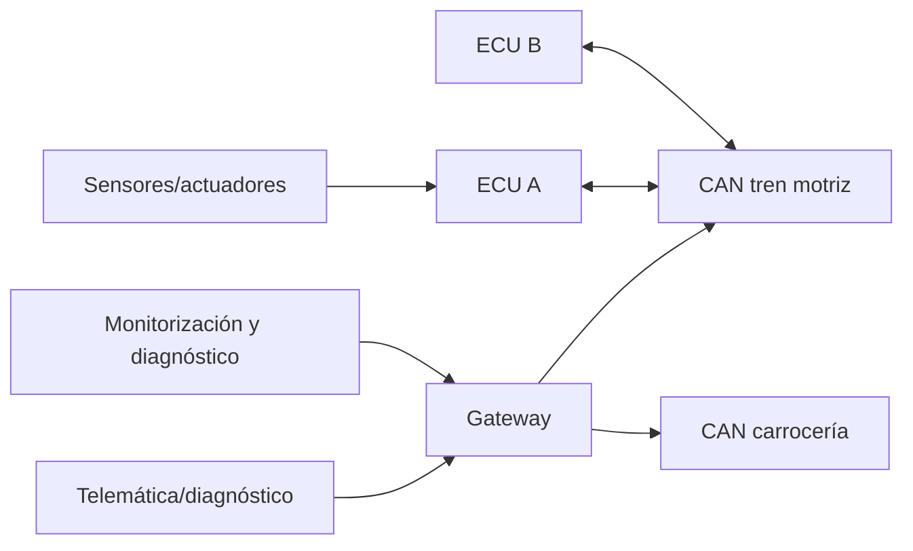

# Clase 274 — Seguridad automotriz y bus CAN

> Parte: **13 — Seguridad móvil, IoT e inalámbrica** · Fuente: *The Car Hacker's Handbook* (Craig Smith) y documentación de can-utils
> ⏱️ Duración estimada: **120 min** · Nivel: **Avanzado**

---

## 🎯 Objetivo

Entender la arquitectura de seguridad de un vehículo moderno y auditar su red interna a través del bus CAN. El alumno aprenderá cómo se comunican las ECUs, cómo interceptar y analizar tramas con `can-utils` sobre una interfaz SocketCAN, cómo hacer ingeniería inversa de mensajes para identificar funciones, y cuáles son las superficies de ataque remotas (telemática, infoentretenimiento, TPMS), practicando exclusivamente en simuladores o vehículos propios.

> ⚠️ **Nota ética y de seguridad física:** experimenta solo con tu propio vehículo (con el motor apagado y en lugar seguro) o con simuladores (ICSim, virtual CAN). Inyectar tramas en un vehículo en marcha o ajeno es extremadamente peligroso e ilegal.

## 📚 Resultados de aprendizaje

Al finalizar, el alumno podrá:

1. **Describir** la arquitectura de red de un vehículo (ECUs, buses, gateway).
2. **Explicar** la trama CAN y por qué carece de autenticación.
3. **Configurar** SocketCAN y un CAN virtual/simulador.
4. **Capturar** y filtrar tráfico CAN con can-utils.
5. **Hacer** ingeniería inversa de mensajes para mapear funciones.
6. **Identificar** superficies de ataque remotas y mitigaciones.

## 🗺️ Temas

| # | Tema | Por qué importa |
|---|------|-----------------|
| 1 | Arquitectura del vehículo | Contexto de ECUs y buses |
| 2 | Bus CAN y trama | Protocolo base sin autenticación |
| 3 | OBD-II y acceso físico | Punto de entrada estándar |
| 4 | SocketCAN y can-utils | Herramientas de captura/inyección |
| 5 | Ingeniería inversa de tramas | Mapear IDs a funciones |
| 6 | UDS y diagnóstico | Servicios y su abuso |
| 7 | Superficies remotas y defensa | Telemática, TPMS, gateway seguro |

## 🧠 Explicación en profundidad

### CAN transporta mensajes por identificador, no identidades de emisor

En CAN clásico, los nodos comparten bus y arbitran mediante identificador; los valores más dominantes ganan prioridad. El identificador describe prioridad y significado esperado, no autentica qué ECU transmitió. El protocolo detecta errores de transmisión, pero no aporta por sí solo confidencialidad ni autorización de comandos.



La seguridad moderna depende de arquitectura: gateway, separación de dominios, arranque y actualización seguros, diagnóstico autenticado, protección de claves, detección y respuesta. Añadir criptografía a cada frame puede enfrentar latencia y compatibilidad; el diseño se decide por función y riesgo de seguridad física.

Analizar tráfico busca periodicidad, contador, checksum y relación con una acción en simulador. Correlación no identifica semántica definitiva. Inyectar en un vehículo real puede accionar sistemas, distraer al conductor o dañar componentes; todo laboratorio usa `vcan` e ICSim, vehículo fuera de vía en banco autorizado o equipos aislados por profesionales.

### Caso razonado: frame correlacionado con velocidad

Un byte aumenta al mover el control de velocidad en ICSim. Puede representar velocidad, valor escalado o parte de un contador. El alumno modifica una variable por vez, repite, prueba límites y documenta hipótesis. No traslada el ID a otro modelo: DBC y diseño cambian entre vehículos.

## 📔 Glosario operativo

| Término | Definición útil |
|---|---|
| ECU | Unidad electrónica que controla una función vehicular. |
| Arbitration ID | Identificador usado para prioridad y significado, no identidad segura. |
| DBC | Descripción de señales y codificación de mensajes CAN. |
| Gateway | Componente que media tráfico entre dominios de red. |
| vcan | Interfaz CAN virtual de Linux sin bus físico. |

## ✅ Criterio de dominio

Existe dominio cuando el alumno explica arbitraje y falta de identidad, infiere una señal con experimentos repetibles en `vcan`, evita generalizar IDs y propone controles de ciclo de vida alineados con seguridad vehicular.

## 📖 Definiciones y características

- **ECU (Electronic Control Unit):** microcontrolador que gobierna un subsistema (motor, frenos, puertas). Característica: se comunica por CAN sin autenticar el origen.
- **Bus CAN:** bus serie diferencial de difusión donde toda ECU ve todos los mensajes. Característica: sin cifrado ni autenticación; prioridad por arbitraje de ID.
- **Trama CAN:** mensaje con identificador (arbitration ID), DLC y hasta 8 bytes de datos. Característica: el ID indica prioridad y semántica, no remitente.
- **OBD-II:** puerto de diagnóstico obligatorio que da acceso al/los bus(es). Característica: entrada física estándar para auditoría.
- **SocketCAN:** subsistema de Linux que expone CAN como interfaces de red. Característica: habilita can-utils (`candump`, `cansend`).
- **UDS (ISO 14229):** protocolo de servicios de diagnóstico unificado. Característica: incluye rutinas y acceso de seguridad (seed/key) a veces débil.

## 🧰 Herramientas y preparación

- **Simulador ICSim** (dashboard virtual) sobre **vcan**, o interfaz **CANtact/CANable/OBD-II a USB** en vehículo propio.
- **can-utils** (`candump`, `cansend`, `cansniffer`, `cangen`), **SavvyCAN** para análisis gráfico.

```bash
# CAN virtual + simulador (sin hardware, seguro)
sudo modprobe vcan
sudo ip link add dev vcan0 type vcan && sudo ip link set up vcan0
./setup_vcan.sh                       # de ICSim
./icsim vcan0 &                       # tablero simulado
./controls vcan0 &                    # mando para generar tráfico

# Capturar, filtrar e inyectar
candump vcan0                         # ver todo el tráfico
cansniffer vcan0                      # ver cambios por ID
cansend vcan0 244#01                  # enviar una trama (simulador)
```

## 🧪 Laboratorio guiado

1. **Monta ICSim** sobre `vcan0` para trabajar sin riesgo físico.
2. **Observa el tráfico base:** con `candump` y `cansniffer` identifica el flujo de IDs mientras el mando genera actividad.
3. **Aísla una función:** acciona un control (p. ej. intermitente/velocímetro) y usa `cansniffer` para ver qué ID/bytes cambian.
4. **Ingeniería inversa:** correlaciona la acción con la trama exacta; anota ID, offset de byte y rango de valores.
5. **Reproduce:** con `cansend` reproduce la trama para reproducir la función en el simulador (replay).
6. **Explora diagnóstico:** revisa conceptualmente UDS (seed/key) y por qué un acceso de seguridad débil permite rutinas peligrosas.
7. **Superficies remotas:** documenta cómo telemática, infoentretenimiento y TPMS amplían la superficie y cómo un gateway seguro segmenta buses.
8. **Propón defensas:** segmentación por gateway, CAN con autenticación de mensajes, IDS de bus.

## ✍️ Ejercicios

1. Configura `vcan0` y arranca ICSim.
2. Identifica el ID y byte que controla el velocímetro simulado.
3. Reproduce por replay el encendido de una señal (intermitente).
4. Explica por qué CAN no puede saber qué ECU envió una trama.
5. Describe el flujo seed/key de UDS y su debilidad típica.
6. Enumera tres superficies de ataque remotas de un vehículo y su mitigación.

## 📝 Reto verificable

En el simulador ICSim, haz ingeniería inversa de **una función** (velocímetro, intermitentes o cerraduras) y reprodúcela mediante inyección de la trama correcta. **Criterio de aceptación:** identificas el arbitration ID y el/los byte(s) responsables, y demuestras con `cansend` que reproduces la función en el tablero simulado, documentando la trama exacta.

## ⚠️ Errores comunes

| Síntoma / mensaje | Causa y cómo arreglar |
|-------------------|-----------------------|
| `vcan0` no aparece | Falta `modprobe vcan`; cárgalo y crea la interfaz |
| `candump` no muestra nada | Interfaz caída o simulador parado; `ip link set up` y arranca ICSim |
| Replay no reproduce la función | ID/byte equivocado o el simulador reescribe el valor; reidentifica con cansniffer |
| Demasiado tráfico para analizar | Usa `cansniffer` y filtros por ID en lugar de candump crudo |
| Bitrate incorrecto (hardware real) | Configura el bitrate del bus (500k típico) al levantar la interfaz |

## ❓ Preguntas frecuentes

**❓ ¿Puedo practicar sin un coche?**
Sí y es lo recomendable para empezar: ICSim sobre CAN virtual reproduce un tablero y su tráfico sin ningún riesgo físico.

**❓ ¿Por qué el bus CAN es tan inseguro?**
CAN clásico es un bus compartido sin autenticación criptográfica de origen ni confidencialidad incorporadas. Un nodo con acceso al segmento puede observar y transmitir, pero gateways, topología, validaciones y estado de las ECU condicionan qué tramas llegan y qué efecto tienen.

**❓ ¿Cómo llega un atacante remoto al CAN?**
A través de superficies conectadas (telemática celular, WiFi/Bluetooth del infoentretenimiento, TPMS) que, si no están bien segmentadas por un gateway, permiten pivotar hacia buses críticos.

## 🔗 Referencias

- *The Car Hacker's Handbook* — Craig Smith (No Starch Press): <https://nostarch.com/carhacking>
- can-utils: <https://github.com/linux-can/can-utils>
- ICSim: <https://github.com/zombieCraig/ICSim>
- SocketCAN (kernel): <https://www.kernel.org/doc/html/latest/networking/can.html>

## 📥 Material descargable

- 📄 [Guía en PDF](./clase-274-guia.pdf) — versión imprimible de esta clase.
- 🎞️ [Presentación (PPTX)](./clase-274-presentacion.pptx) — deck para proyectar en clase.

## ⬅️ Clase anterior

[Clase 273 — Seguridad de sistemas de control industrial (ICS/SCADA)](../273-seguridad-de-sistemas-de-control-industrial-ics-scada/README.md)

## ➡️ Siguiente clase

[Clase 275 — Seguridad de dispositivos médicos](../275-seguridad-de-dispositivos-medicos/README.md)
