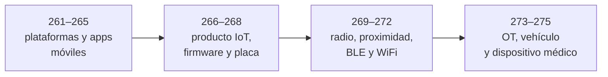

# Parte 13 — Seguridad móvil, IoT e inalámbrica

> [⬅️ Volver al programa](../../README.md) · [📚 Índice completo](../README.md) · [⏭️ Parte siguiente](../parte-14-grc-riesgo-y-cumplimiento/README.md)

**15 clases** · rango 261–275 · Android, iOS, firmware, hardware, SDR e ICS/SCADA

**Fuentes de referencia de esta parte:**

- *The Mobile Application Hacker's Handbook* — Dominic Chell, Tyrone Erasmus, Shaun Colley, Ollie Whitehouse (Wiley).
- *Practical IoT Hacking* — Fotios Chantzis, Ioannis Stais, Paulino Calderon, Evangelos Deirmentzoglou, Beau Woods (No Starch Press).
- *Hacking Exposed Wireless, 3rd Edition* — Joshua Wright, Johnny Cache (McGraw-Hill).
- OWASP Mobile Application Security (MASVS/MASTG) y OWASP Internet of Things Project.
- NIST SP 800-82 *Guide to Operational Technology (OT) Security* y ISA/IEC 62443.

---

## 🎯 ¿De qué trata esta parte?

Esta parte estudia sistemas donde software, hardware, radio y procesos físicos se encuentran: aplicaciones móviles, dispositivos conectados, vehículos, equipos médicos y OT. Lleva la evaluación más allá del navegador, pero evita una explicación única para dominios distintos. El alumno audita aplicaciones Android e iOS, analiza firmware, identifica interfaces de depuración sin dañar placas, interpreta capturas de radio propias y comprende cómo seguridad, disponibilidad y seguridad física condicionan OT y sistemas regulados.

El hilo conductor es que cada uno de estos dispositivos tiene una **superficie de ataque multicapa**: aplicación, comunicaciones, nube, firmware y hardware físico. Un atacante competente pivota entre capas; un defensor competente las modela todas. Verás herramientas reales y estándares de la industria, no juguetes: Frida, MobSF, apktool, Aircrack-ng, hcxdumptool, GNU Radio, Proxmark3, Ghidra, Bus Pirate y `can-utils`.

Esta parte sirve a pentesters que quieren expandir su alcance, a ingenieros de producto que diseñan dispositivos conectados, a equipos de OT/ICS que heredaron infraestructura crítica insegura, y a investigadores de seguridad que quieren entrar en RE móvil o hardware hacking.

## 🧩 Problemas que resuelve

- Auditar aplicaciones móviles (Android/iOS) contra almacenamiento inseguro, comunicación débil y controles del lado del cliente evadibles.
- Instrumentar apps propias o autorizadas para evaluar qué propiedades dependen de controles locales, root/jailbreak detection o certificate pinning.
- Extraer, desempaquetar y analizar firmware de dispositivos embebidos en busca de credenciales, claves y binarios vulnerables.
- Identificar interfaces UART, JTAG/SWD y SPI en placas propias, medir niveles y obtener evidencia reproducible mediante técnicas no destructivas.
- Capturar y analizar tráfico inalámbrico no-WiFi (RFID/NFC, BLE, señales sub-GHz) con SDR y lectores dedicados.
- Reproducir en un AP y clientes aislados capturas WPA2/PMKID y un Evil Twin controlado, explicando límites, WPA3-SAE y PMF sin afectar terceros.
- Evaluar riesgos en entornos donde un fallo de seguridad tiene consecuencias físicas: plantas industriales, vehículos y dispositivos médicos.

## 🎓 Resultados de aprendizaje

Al terminar la parte, el alumno podrá:

- Describir la arquitectura de seguridad de Android e iOS (sandbox, permisos, Keychain/Keystore, arranque seguro) y sus límites.
- Montar un entorno de pentest móvil con emuladores/dispositivos rooteados o con jailbreak y proxy interceptor.
- Realizar RE estático y dinámico de una app usando apktool, Ghidra/Hopper y Frida.
- Extraer firmware con `binwalk`/`dd` y analizar sistemas de archivos y binarios embebidos.
- Conectar y usar un adaptador UART/JTAG para obtener acceso de bajo nivel a un dispositivo propio.
- Capturar un handshake/PMKID de WiFi y crackearlo offline, y montar un Evil Twin controlado en laboratorio.
- Explicar el modelo Purdue, protocolos ICS (Modbus/DNP3), el bus CAN y los riesgos de dispositivos médicos conectados.
- Redactar hallazgos y recomendaciones alineados a OWASP MASVS, NIST SP 800-82 e IEC 62443.

## 🧱 Prerrequisitos

- Fundamentos de redes y TCP/IP (Parte 1) y de criptografía aplicada (Parte 2).
- Manejo de Linux y línea de comandos (Parte 0).
- Bases de pentest web y de aplicaciones (Partes 3–4): proxies interceptores y autorización.
- Nociones de explotación y RE (Parte 5) y análisis de malware (Parte 6) ayudan en RE móvil y firmware.

## 🗺️ Estructura temática

| Bloque | Clases | Enfoque |
|--------|--------|---------|
| Móvil Android | 261–262 | Arquitectura de seguridad y pentest de apps Android |
| Móvil iOS | 263–264 | Arquitectura de seguridad y pentest de apps iOS |
| RE móvil | 265 | Ingeniería inversa estática y dinámica de apps |
| IoT y firmware | 266–267 | Superficie de ataque IoT y hacking de firmware |
| Hardware y radio | 268–271 | UART/JTAG/SPI, SDR, RFID/NFC, Bluetooth/BLE |
| Inalámbrica WiFi | 272 | Evil Twin, captura PMKID y crackeo |
| OT y sistemas críticos | 273–275 | ICS/SCADA, automotriz/CAN y dispositivos médicos |

## 🧭 Recorrido pedagógico clase a clase

La progresión avanza desde plataformas con sandbox y APIs documentadas hacia sistemas con acceso físico, señales de radio y consecuencias sobre el mundo. Cada bloque reutiliza el método anterior —activos, fronteras, evidencia y límites—, pero cambia deliberadamente las condiciones de seguridad del laboratorio.

1. **Clase 261 — Arquitectura Android.** Explica UID, SELinux, Binder, permisos, Verified Boot y Keystore como capas con límites. La evidencia es un mapa de una solicitud entre componentes y la capa que realmente decide.
2. **Clase 262 — Pentest Android.** Convierte MASVS y MASTG en propiedades comprobables. Integra manifiesto, código, proxy e instrumentación y distingue un control local evadible de una autorización de servidor.
3. **Clase 263 — Arquitectura iOS.** Relaciona cadena de arranque, firma, sandbox, entitlements, Data Protection y Keychain. El alumno decide protección según estado del dispositivo y necesidad de la aplicación.
4. **Clase 264 — Pentest iOS.** Evalúa bundle, datos, comunicación, IPC y runtime en un dispositivo de laboratorio, indicando qué conclusiones dependen del jailbreak y qué backend está incluido en alcance.
5. **Clase 265 — Ingeniería inversa móvil.** Sigue DEX, ELF, Mach-O y bridges con análisis estático y dinámico. La salida es un modelo de comportamiento con incertidumbre, no una copia imaginaria del código fuente.
6. **Clase 266 — Superficie IoT.** Amplía el objeto desde la placa al producto completo: app, cloud, identidad, actualización, soporte y efecto físico. Adapta las capacidades de NIST al riesgo concreto.
7. **Clase 267 — Firmware.** Separa cabecera, bootloader, kernel, rootfs, firma y recuperación. El alumno conserva hashes y offsets, valida secretos en contexto y comprende firma, anti-rollback y límites de emulación.
8. **Clase 268 — UART, JTAG/SWD y SPI.** Introduce medición eléctrica y acceso físico no destructivo. Antes de interpretar datos, exige niveles correctos, pinout documentado y lecturas repetibles.
9. **Clase 269 — SDR.** Explica muestras I/Q, ganancia, tasa, espectro y demodulación. La práctica principal es recepción de una señal propia o archivo publicado, separando emisiones reales de artefactos del receptor.
10. **Clase 270 — RFID y NFC.** Distingue identificador, memoria, autenticación y backend. Las pruebas usan tarjetas de laboratorio y evitan generalizar debilidades históricas de una familia a todas las credenciales.
11. **Clase 271 — Bluetooth y BLE.** Separa advertising, pairing/bonding, seguridad de enlace, GATT y autorización de aplicación. El producto es una prueba sobre periféricos propios y características sensibles.
12. **Clase 272 — WiFi.** Explica qué permiten verificar handshake y PMKID, cómo opera un Evil Twin y qué cambian SAE y PMF. No usa desautenticación sobre terceros ni redes reales.
13. **Clase 273 — ICS/SCADA.** Sitúa PLC, HMI, ingeniería y SIS alrededor de un proceso físico. El alumno diseña zonas y conductos, monitorización pasiva, backups y cambio seguro con participación operacional.
14. **Clase 274 — Automoción y CAN.** Enseña arbitraje, ausencia de identidad de emisor y papel del gateway. Toda inferencia e inyección ocurre sobre `vcan`/ICSim y no se traslada a vehículos reales.
15. **Clase 275 — Dispositivos médicos.** Cierra relacionando vulnerabilidad, daño clínico, TPLC, SBOM, parche y divulgación coordinada según la guía vigente de FDA, sin presentar su jurisdicción como norma mundial.

El proyecto integrador selecciona un producto ficticio y entrega arquitectura multicapa, modelo de amenazas, análisis de un firmware de práctica, una captura o bus simulado y un plan de actualización y respuesta. La evaluación exige trazabilidad y seguridad del banco de pruebas; ejecutar más comandos no compensa una conclusión sin contexto.

## 🔗 Referencias de la parte

- OWASP Mobile Application Security — <https://mas.owasp.org/>
- OWASP Internet of Things Project — <https://owasp.org/www-project-internet-of-things/>
- NIST SP 800-82 Rev. 3 — <https://csrc.nist.gov/pubs/sp/800/82/r3/final>
- Frida — <https://frida.re/> · MobSF — <https://github.com/MobSF/Mobile-Security-Framework-MobSF>
- Aircrack-ng — <https://www.aircrack-ng.org/> · hcxdumptool — <https://github.com/ZerBea/hcxdumptool>
- GNU Radio — <https://www.gnuradio.org/> · Proxmark3 — <https://github.com/RfidResearchGroup/proxmark3>
- NIST IR 8259 Rev. 1 — <https://csrc.nist.gov/pubs/ir/8259/r1/final>
- FDA — *Cybersecurity in Medical Devices* (guía final vigente). <https://www.fda.gov/regulatory-information/search-fda-guidance-documents/cybersecurity-medical-devices-quality-management-system-considerations-and-content-premarket>

> ⚠️ **Nota ética:** todo el contenido ofensivo de esta parte se practica **solo** en dispositivos, redes y sistemas de tu propiedad o con autorización explícita por escrito. Interceptar comunicaciones ajenas, clonar credenciales de terceros o manipular sistemas industriales/médicos en producción es ilegal y peligroso.

## ▶️ Empezar

[Clase 261 — Seguridad de Android: arquitectura](261-seguridad-de-android-arquitectura/README.md)
