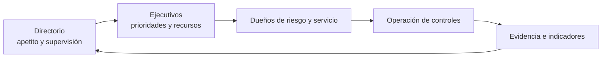
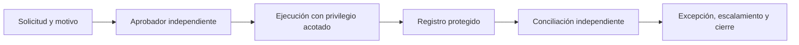

# Clase 276 — Gobernanza de la seguridad de la información

> Parte: **14 — GRC, riesgo y cumplimiento** · Fuente: *(ISC)² CISSP Official Study Guide (Chapple, Stewart, Gibson)*
> ⏱️ Duración estimada: **90 min** · Nivel: **Intermedio**

---

## 🎯 Objetivo

Comprender qué es la gobernanza de seguridad de la información y en qué se diferencia de la gestión operativa. Al terminar sabrás definir una estructura de gobierno con roles claros, alinear la seguridad con los objetivos de negocio y traducir la estrategia de la dirección en políticas y apetito de riesgo. Este es el marco que da sentido a todos los controles técnicos que has aprendido en el programa.

## 📚 Resultados de aprendizaje

Al finalizar, el alumno podrá:

1. **Distinguir** gobernanza de gestión y de operación en seguridad.
2. **Identificar** los roles clave (junta directiva, CISO, propietarios de datos, custodios) y sus responsabilidades.
3. **Definir** apetito, tolerancia y capacidad de riesgo de una organización.
4. **Alinear** un objetivo de seguridad con un objetivo de negocio concreto.
5. **Redactar** el borrador de una carta de gobierno (charter) de un comité de seguridad.
6. **Evaluar** si privilegios, excepciones y registros de aprobación permiten que una persona o grupo concentre solicitud, autorización, ejecución y supervisión.

## 🗺️ Temas

| # | Tema | Por qué importa |
|---|------|-----------------|
| 1 | Gobernanza vs. gestión vs. operación | Evita confundir estrategia con ejecución |
| 2 | Modelos: top-down y su necesidad | La seguridad falla si no la patrocina la dirección |
| 3 | Roles y responsabilidades (RACI) | Sin dueños, ningún control se sostiene |
| 4 | Apetito y tolerancia al riesgo | Fija el umbral de decisiones sobre riesgo |
| 5 | Alineación con el negocio | Seguridad como habilitador, no como freno |
| 6 | Due care y due diligence | Base legal de la responsabilidad de directivos |
| 7 | Comités y estructuras de reporte | Dónde se toman y escalan las decisiones |
| 8 | Concentración de autoridad y excepciones | Una política falla si el mismo actor puede concederse privilegios y ocultar su uso |

## 🧠 Explicación en profundidad

Gobernar seguridad significa decidir objetivos, autoridad, apetito de riesgo y rendición de cuentas; gestionar significa ejecutar esas decisiones. Un comité que recibe métricas pero no puede priorizar presupuesto no gobierna. La dirección conserva responsabilidad aunque delegue tareas al CISO. El modelo debe conectar misión, activos, riesgos, controles, excepciones y evidencia, evitando que «cumplimiento» sustituya resultados.

### Caso razonado

Una excepción de MFA permanece abierta porque nadie acepta el riesgo. El CISO documenta exposición y opciones; el dueño de negocio decide dentro de su autoridad y el comité escala si supera apetito. La trazabilidad importa más que una firma decorativa.

### FTX y Celsius: del fallo de gobierno al requisito verificable

Los casos reales son útiles solo si se conserva el estado de cada fuente. En testimonio oficial ante
el Congreso de Estados Unidos, el nuevo CEO de FTX describió una investigación todavía en curso,
con concentración de control en un grupo pequeño, acceso de alta dirección a sistemas con activos
de clientes sin controles que impidieran redirecciones, mezcla de activos, documentación incompleta
y ausencia de gobierno independiente. El informe interino presentado en la quiebra añadió hallazgos
sobre privilegios extraordinarios, registros insuficientes y falta de controles de mínimo
privilegio, detección e integridad de cambios. Son hallazgos del deudor y su equipo investigador, no
una licencia para inventar arquitectura, logs o código que esos documentos no describen.

En Celsius, la FTC llegó a un acuerdo con las sociedades y formuló cargos contra antiguos
ejecutivos. Su comunicación de 2023 distingue ambos estados procesales y atribuye a la demanda, no a
una inferencia del alumno, que Celsius careció hasta mediados de 2021 de un sistema para seguir
activos y pasivos y que se hicieron afirmaciones sobre reservas, disponibilidad y riesgo. Para GRC,
la enseñanza defendible es que la información necesaria para gobernar —exposición, liquidez,
obligaciones y excepciones— debe ser completa, conciliable y llegar a quien puede decidir. El caso
no autoriza a afirmar una vulnerabilidad informática ni un ataque.

De ambos casos se deriva una cadena de control que sí puede probarse en cualquier organización:

El diagrama no reconstruye FTX ni Celsius. Representa el diseño pedagógico: quien solicita no debe
aprobar; quien ejecuta no debe cerrar la conciliación; una excepción tiene dueño, alcance,
caducidad y revisión; y el directorio recibe evidencia que no dependa exclusivamente del equipo
operador. Si falta un eslabón, la conclusión correcta es «control no demostrado» o «diseño
insuficiente», no «fraude probado».

## 📔 Glosario operativo

| Término | Definición |
|---|---|
| Apetito de riesgo | Cantidad y tipo de riesgo que la organización está dispuesta a perseguir o retener. |
| Dueño de riesgo | Persona con autoridad para tratar o aceptar un riesgo dentro de límites. |
| Assurance | Confianza sustentada en evidencia sobre diseño y operación. |
| Segregación de funciones | Separación de capacidades incompatibles para que una acción sensible requiera control independiente. |
| Excepción | Desviación autorizada, acotada, temporal y revisable; no un permiso informal permanente. |

## ✅ Criterio de dominio

El alumno distingue gobierno de gestión y diseña una ruta completa desde riesgo hasta decisión, responsable, evidencia y revisión.

## 📖 Definiciones y características

- **Gobernanza de seguridad**: conjunto de responsabilidades y prácticas ejercidas por la dirección para dar dirección estratégica, asegurar el logro de objetivos y verificar que el riesgo se gestiona. *Característica clave*: es responsabilidad de la alta dirección, no del equipo técnico.
- **Apetito de riesgo (risk appetite)**: cantidad de riesgo que una organización está dispuesta a aceptar para perseguir sus objetivos. *Clave*: se define arriba, guía todas las decisiones de tratamiento.
- **Tolerancia al riesgo**: la variación aceptable respecto al apetito para un riesgo concreto. *Clave*: más granular que el apetito.
- **Due care**: actuar de forma razonable y prudente para proteger los intereses de la organización. *Clave*: "hacer lo correcto".
- **Due diligence**: investigar y comprender continuamente los riesgos. *Clave*: "el proceso de asegurarse de que se hace lo correcto".
- **Propietario de datos (data owner)**: responsable de clasificar la información y decidir quién accede. *Clave*: rol de negocio, indelegable.
- **Custodio de datos (data custodian)**: implementa y mantiene los controles definidos por el propietario. *Clave*: rol técnico/operativo.

## 🧰 Herramientas y preparación

La gobernanza es una disciplina documental; las "herramientas" son plantillas y marcos. Prepara:

- Un editor de texto o Markdown para redactar el charter y la matriz RACI.
- Una hoja de cálculo (LibreOffice Calc, Excel o Google Sheets) para la matriz de roles.
- Referencias abiertas: *ISO/IEC 27014* (gobernanza de seguridad), *NIST SP 800-100* (Information Security Handbook), *COBIT 2019* de ISACA.
- Opcional: una plantilla de política del *SANS Policy Templates* (<https://www.sans.org/information-security-policy/>) para inspirarte, sin copiar.

No hay laboratorio ofensivo aquí; el trabajo es de análisis y redacción, propio de un rol de gobierno.

## 🧪 Laboratorio guiado (ejercicio aplicado)

Vas a construir la estructura de gobierno de seguridad de una empresa ficticia, **"Ferretería del Sur S.A."**, PYME de e-commerce con 120 empleados que procesa pagos con tarjeta.

1. **Contexto**: anota en un documento el sector, tamaño, activos críticos (plataforma web, base de datos de clientes, pasarela de pago) y las 3 amenazas que más preocupan a la dirección.
2. **Matriz RACI de roles**: en una hoja de cálculo crea filas para 6 actividades (definir política, aprobar presupuesto, clasificar datos, operar el SIEM, aprobar excepciones de riesgo, responder incidentes) y columnas para 5 roles (Junta, CEO, CISO, Propietario de datos, Equipo SOC). Marca cada celda con **R**esponsable, **A**probador, **C**onsultado o **I**nformado. Regla: exactamente un **A** por fila.
3. **Apetito de riesgo**: redacta una declaración de apetito en una frase (p. ej., "aceptamos riesgo bajo en disponibilidad y riesgo muy bajo en confidencialidad de datos de pago").
4. **Objetivos alineados**: escribe una tabla de 3 filas que conecte un objetivo de negocio (crecer 30% en ventas online) con un objetivo de seguridad (disponibilidad 99,9%) y un control concreto (WAF + CDN).
5. **Charter del comité**: redacta media página con: propósito, miembros, frecuencia de reunión, decisiones que puede tomar y a quién reporta.
6. **Revisión**: verifica que ningún rol técnico aparezca como aprobador de decisiones estratégicas (eso es un error de gobierno).
7. **Operación sensible sintética**: agrega las actividades `solicitar transferencia`, `aprobar`,
   `ejecutar`, `conciliar` y `revisar evidencia`. Usa roles ficticios y exige que ningún usuario
   concentre las cinco capacidades.
8. **Excepción controlada**: documenta una excepción ficticia por continuidad con solicitante,
   aprobador independiente, importe máximo, vigencia de 30 minutos, alerta, log esperado y revisión
   posterior. Diseña una prueba negativa que falle si el solicitante intenta aprobarla.
9. **Límite probatorio**: recibe un evento ficticio donde `user_id=ops-07` ejecuta la transferencia
   sin `approval_id`. Registra el control incumplido y la evidencia faltante. No atribuyas identidad
   humana, intención ni fraude: una cuenta y un log no bastan para esas conclusiones.

## ✍️ Ejercicios

1. Explica con un ejemplo la diferencia entre due care y due diligence.
2. Clasifica estas tareas en gobernanza, gestión u operación: aprobar el presupuesto anual, configurar un firewall, definir el apetito de riesgo, revisar logs.
3. Diseña una matriz RACI para el proceso "gestión de parches".
4. Un directivo dice: "la seguridad es cosa del departamento de IT". Redacta una réplica de 5 líneas fundamentada en gobernanza top-down.
5. Define el apetito de riesgo para un hospital y para una startup de videojuegos; justifica por qué difieren.
6. Propón tres indicadores que un comité de seguridad debería revisar en cada reunión.
7. Para FTX y Celsius, separa en columnas `fuente`, `estado procesal`, `hecho o alegación`,
   `control derivado` y `conclusión no permitida`.

## 📝 Reto verificable

Redacta el **charter completo de un comité de seguridad de la información** (máx. 1 página) para "Ferretería del Sur S.A.", con matriz RACI adjunta.

**Criterio de aceptación**: el charter incluye propósito, composición, cadencia, autoridad de decisión y línea de reporte a la junta; la matriz RACI tiene exactamente un aprobador por actividad y ningún rol técnico aprueba decisiones estratégicas.
La ampliación de operaciones sensibles debe incluir prueba negativa, caducidad de la excepción,
evidencia de conciliación y una sección explícita sobre lo que la anomalía no permite concluir.

## ⚠️ Errores comunes

| Síntoma / mensaje | Causa y cómo arreglar |
|-------------------|-----------------------|
| "El programa de seguridad no tiene presupuesto" | Falta patrocinio de la dirección; construye caso de negocio y gobierno top-down |
| Nadie decide sobre excepciones de riesgo | No hay comité ni autoridad definida; crea el charter y asigna el aprobador |
| Controles técnicos sin dueño de negocio | Se confunde custodio con propietario; asigna propietarios de datos |
| Apetito de riesgo indefinido | Cada equipo decide por su cuenta; formaliza la declaración de apetito |
| Directivos no rinden cuentas tras un incidente | Falta due care documentado; registra decisiones y aprobaciones |
| Una excepción se vuelve privilegio permanente | No tiene caducidad, alerta o revisión; aplica alcance mínimo y cierre verificable |
| Un evento se trata como prueba de intención | El registro muestra una acción atribuida a una cuenta, no necesariamente a una persona ni su propósito |

## ❓ Preguntas frecuentes

**❓ ¿La gobernanza no es solo burocracia?**
No: es lo que da autoridad, presupuesto y dirección a la seguridad. Sin ella, los controles técnicos carecen de respaldo y se abandonan.

**❓ ¿Quién debe ser el CISO, técnico o gestor?**
Ambos perfiles existen, pero el CISO opera en la capa de gobierno y gestión: traduce riesgo técnico a lenguaje de negocio ante la dirección.

**❓ ¿Apetito y tolerancia son lo mismo?**
No. El apetito es el nivel general que aceptas; la tolerancia es la desviación admisible para un riesgo específico.

**❓ ¿Dónde encaja ISO 27001 en la gobernanza?**
ISO 27001 es el marco de gestión (SGSI); la gobernanza lo supervisa y aprueba. Lo verás en la clase 278.

## 🔗 Referencias

- (ISC)² CISSP Official Study Guide, dominio 1 (Security and Risk Management).
- ISO/IEC 27014:2020 — Governance of information security. <https://www.iso.org/standard/74046.html>
- NIST SP 800-100 — Information Security Handbook: A Guide for Managers. <https://csrc.nist.gov/pubs/sp/800/100>
- COBIT 2019 (ISACA). <https://www.isaca.org/resources/cobit>
- SANS Security Policy Templates. <https://www.sans.org/information-security-policy/>
- U.S. House Committee on Financial Services — testimonio de John J. Ray III sobre FTX; respalda concentración de control, ausencia de gobierno y controles sobre activos (2022). <https://docs.house.gov/meetings/BA/BA00/20221213/115246/HHRG-117-BA00-Wstate-RayJ-20221213.pdf>
- FTX Debtors — *First Interim Report... on Control Failures at the FTX Exchanges*, documento presentado en la causa de quiebra 22-11068-JTD (2023); respalda hallazgos técnicos y de control con las limitaciones declaradas por el propio informe. <https://document.epiq11.com/document/getdocumentbycode?docId=4200216&projectCode=FTX&source=DM>
- U.S. Federal Trade Commission — acuerdo con Celsius Network y cargos contra antiguos ejecutivos (2023); respalda el estado procesal y las alegaciones sobre información de activos, pasivos, reservas y disponibilidad. <https://www.ftc.gov/news-events/news/press-releases/2023/07/ftc-reaches-settlement-crypto-platform-celsius-network-charges-former-executives-duping-consumers>

## 📥 Material descargable

- 📄 [Guía en PDF](./clase-276-guia.pdf) — versión imprimible de esta clase.
- 🎞️ [Presentación (PPTX)](./clase-276-presentacion.pptx) — deck para proyectar en clase.

## ⬅️ Clase anterior

[Clase 275 — Seguridad de dispositivos médicos](../../parte-13-seguridad-movil-iot-e-inalambrica/275-seguridad-de-dispositivos-medicos/README.md)

## ➡️ Siguiente clase

[Clase 277 — Gestión de riesgos: cuantitativa y cualitativa](../277-gestion-de-riesgos-cuantitativa-y-cualitativa/README.md)
