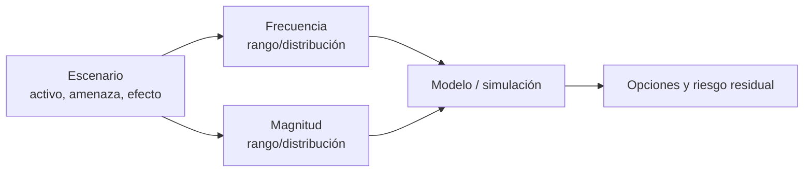

# Clase 277 — Gestión de riesgos: cuantitativa y cualitativa

> Parte: **14 — GRC, riesgo y cumplimiento** · Fuente: *How to Measure Anything in Cybersecurity Risk (Hubbard & Seiersen)*
> ⏱️ Duración estimada: **120 min** · Nivel: **Intermedio**

---

## 🎯 Objetivo

Aprender a evaluar el riesgo de seguridad de forma rigurosa, tanto con métodos cualitativos (matrices de probabilidad × impacto) como cuantitativos (SLE, ARO, ALE y modelos probabilísticos). Al terminar sabrás calcular la pérdida anual esperada de un escenario, decidir si un control se justifica económicamente y comunicar riesgo en términos que la dirección entiende: dinero y probabilidad, no colores.

## 📚 Resultados de aprendizaje

Al finalizar, el alumno podrá:

1. **Calcular** SLE, ARO y ALE de un escenario de riesgo concreto.
2. **Construir** una matriz de riesgo cualitativa 5×5 y ubicar riesgos en ella.
3. **Comparar** el ALE antes y después de un control para justificar la inversión (ROSI).
4. **Aplicar** una estimación probabilística por rangos con intervalos de confianza del 90%.
5. **Elegir** el tratamiento adecuado: mitigar, transferir, evitar o aceptar.
6. **Separar** riesgo de ciberseguridad, riesgo económico y de modelo, riesgo de liquidez, incumplimiento y alegaciones de fraude antes de seleccionar controles.
7. **Distinguir** un rug pull de un token imitador, un drainer y una caída de mercado mediante escenarios y evidencia discriminante.

## 🗺️ Temas

| # | Tema | Por qué importa |
|---|------|-----------------|
| 1 | Vocabulario: amenaza, vulnerabilidad, riesgo | Base común para razonar |
| 2 | Análisis cualitativo (matriz P×I) | Rápido para priorizar, útil como triaje |
| 3 | Análisis cuantitativo (SLE/ARO/ALE) | Traduce riesgo a euros |
| 4 | ROSI (retorno de la inversión en seguridad) | Justifica presupuesto |
| 5 | Estimación calibrada y rangos | Supera la falacia de la "medición imposible" |
| 6 | Simulación de Montecarlo | Modela incertidumbre realista |
| 7 | Tratamiento del riesgo | Del análisis a la decisión |
| 8 | Taxonomía y frontera del escenario | Evita tratar toda pérdida digital como vulnerabilidad o ataque |
| 9 | Promotor, liquidez y rug pull | El mecanismo de pérdida determina evidencia, dueño y tratamiento |

## 🧠 Explicación en profundidad

El riesgo combina escenarios, frecuencia y magnitud de pérdida bajo incertidumbre. Una matriz cualitativa facilita conversación, pero multiplicar ordinales no crea dinero ni probabilidad. El análisis cuantitativo explicita distribuciones y supuestos; tampoco elimina incertidumbre. Se selecciona método según decisión, datos y coste del análisis.



### Caso razonado

Dos riesgos quedan «altos» en una matriz. Uno puede interrumpir ventas por horas; otro generar daño regulatorio de cola larga. Rangos y escenarios separan decisiones. El resultado se presenta como distribución y sensibilidad, no como cifra exacta inventada.

### Terra/UST: una pérdida digital no identifica por sí sola un ciberriesgo

TerraUSD (UST) es un contraste útil porque su colapso no debe reescribirse como «hackeo». La SEC
describió UST como una supuesta *stablecoin* algorítmica y, después de un veredicto unánime por
fraude de valores, informó en 2024 del acuerdo y de las declaraciones falsas sobre la estabilidad de
UST y el uso de la blockchain de Terraform para liquidar transacciones. Esa fuente establece el
resultado del litigio que documenta; no identifica por sí misma una CVE, malware, credencial robada
o intrusión como causa del *de-peg*.

Antes de calcular frecuencia e impacto hay que nombrar el escenario sin mezclar mecanismos:

| Pregunta | Categoría posible | Evidencia mínima | Control que sí corresponde |
|---|---|---|---|
| ¿El mecanismo mantiene la paridad bajo ventas y contracción? | modelo, mercado y liquidez | reglas, reservas, profundidad, escenarios de estrés | límites, reservas, pruebas de estrés, gatillos de suspensión |
| ¿Una clave o cuenta puede cambiar parámetros críticos? | ciberseguridad y privilegios | IAM, aprobaciones, historial de cambios, firmas | mínimo privilegio, quórum, control de cambios, alertas |
| ¿La comunicación representa fielmente el mecanismo y sus intervenciones? | cumplimiento y conducta | versiones publicadas, evidencia independiente, aprobaciones | revisión legal, trazabilidad, divulgación y escalamiento |
| ¿Existe una discrepancia entre registro interno y estado externo? | integridad y conciliación | fuentes con semántica y fecha compatibles | conciliación independiente y gestión de excepciones |

Las categorías pueden coexistir, pero no son intercambiables. Ver un precio alejarse de la paridad
demuestra la desviación en ese mercado y momento; no demuestra cómo se produjo, quién fue responsable
ni si existió una intrusión. Del mismo modo, auditar código puede encontrar defectos técnicos, pero
no valida por sí solo reservas, liquidez, incentivos o veracidad comercial.

### Rug pull, drainer y fake token: mismo impacto, escenarios distintos

Que una persona pierda valor no define el riesgo. Un **fake token** imita nombre o símbolo pero usa
otro identificador; el control inicial es verificar red y contrato/mint. Un **wallet drainer** obtiene
capacidad de gasto mediante una firma, permiso o secreto; el control se centra en autorización,
custodia y respuesta. Un **rug pull** se refiere a promotores que retiran liquidez, venden posiciones
controladas o abandonan el proyecto en contradicción con lo comunicado. El activo puede ser el
correcto y la compra exactamente la pretendida.

| Escenario | Hecho inicial | Evidencia discriminante | Tratamientos posibles |
|---|---|---|---|
| token imitador | mismo ticker/logo, distinto ID | red, contrato/mint y canal canónico | allowlist, verificación de origen, bloqueo de suplantación |
| drainer | movimiento tras interacción | petición decodificada, firma/approval, spender, secreto y TXID | límites, revocación/migración, wallet separada, respuesta |
| rug pull de liquidez | profundidad desaparece tras promesa de lock | control de LP/admin, lock real, retiros y comunicaciones versionadas | due diligence, límites de exposición, gobierno y acción legal aplicable |
| caída de mercado | precio/volumen cambian | profundidad, concentración, noticias y flujos sin control demostrado | tolerancia, diversificación, stress y aceptación/evitación |

La alegación «liquidez bloqueada» debe traducirse en una propiedad verificable: qué activo o derecho
controla el retiro, quién lo posee, hasta cuándo y bajo qué mecanismo puede cambiar. La SEC ha descrito
en litigio cómo el control de LP tokens no bloqueados puede permitir retirar liquidez; esa fuente
explica un mecanismo alegado, no autoriza a etiquetar cualquier proyecto o caída como fraude. En un
análisis de riesgo se modelan frecuencia, magnitud, detectabilidad y dependencia de terceros; una
investigación jurídica decide responsabilidad bajo la ley aplicable.

## 📔 Glosario operativo

| Término | Definición |
|---|---|
| Escenario de pérdida | Cadena concreta que conecta amenaza, activo y consecuencia. |
| Incertidumbre | Falta de conocimiento representada y comunicada explícitamente. |
| Sensibilidad | Cambio del resultado al variar un supuesto. |
| Riesgo de modelo | Pérdida por supuestos, relaciones o implementación inadecuados para la decisión modelada. |
| Evento observable | Hecho medido; requiere análisis adicional antes de atribuir causa, intención o categoría de riesgo. |
| Riesgo de promotor | Pérdida por privilegios, concentración o conducta de quienes controlan el proyecto. |
| Riesgo de liquidez | Incapacidad de comprar o vender al tamaño/precio esperado sin impacto material. |
| LP token | Representación del aporte a un pool que puede otorgar derecho a retirar liquidez según el protocolo. |

## ✅ Criterio de dominio

Hay dominio cuando el alumno formula escenarios, evita falsa precisión, justifica método y compara tratamientos mediante riesgo residual.

## 📖 Definiciones y características

- **Riesgo**: probabilidad de que una amenaza explote una vulnerabilidad causando un impacto. *Clave*: riesgo = f(probabilidad, impacto).
- **SLE (Single Loss Expectancy)**: pérdida esperada de un único incidente. *Clave*: `SLE = Valor del activo (AV) × Factor de exposición (EF)`.
- **ARO (Annualized Rate of Occurrence)**: número esperado de ocurrencias al año. *Clave*: 0,1 significa "una vez cada 10 años".
- **ALE (Annualized Loss Expectancy)**: pérdida anual esperada. *Clave*: `ALE = SLE × ARO`.
- **ROSI**: retorno de inversión en seguridad. *Clave*: `ROSI = (ALE_antes − ALE_después − coste_control) / coste_control`.
- **Riesgo residual**: el que queda tras aplicar controles. *Clave*: nunca es cero; se acepta formalmente.
- **Estimación calibrada**: dar rangos con un intervalo de confianza (p. ej. 90%) en lugar de un punto. *Clave*: reduce el exceso de confianza del experto.

## 🧰 Herramientas y preparación

- Hoja de cálculo (LibreOffice Calc / Excel / Google Sheets) para las fórmulas SLE/ARO/ALE.
- Opcional: Python con `numpy` para una simulación de Montecarlo (`pip install numpy`).
- Referencia metodológica: *FAIR* (Factor Analysis of Information Risk) de The Open Group, y *NIST SP 800-30* (Guide for Conducting Risk Assessments).
- Una plantilla de matriz de riesgo 5×5 (la crearás tú en el laboratorio).

## 🧪 Laboratorio guiado (ejercicio aplicado)

**Escenario**: ransomware contra la plataforma de e-commerce de "Ferretería del Sur S.A.".

0. **Delimita el escenario**: registra activo, actor o fuente de incertidumbre, evento, efecto,
   horizonte y evidencia. No uses «riesgo tecnológico» como categoría única: este caso modela
   indisponibilidad por ransomware, no fraude, liquidez ni un fallo de modelo financiero.

1. **Valora el activo (AV)**: estima el valor de la plataforma en 500.000 €.
2. **Factor de exposición (EF)**: un cifrado por ransomware deja el sistema inoperante; estima EF = 0,6 (pérdida del 60%).
3. **SLE**: calcula `SLE = 500.000 × 0,6 = 300.000 €`.
4. **ARO**: según incidentes del sector estimas 0,2 (uno cada 5 años). Calcula `ALE = 300.000 × 0,2 = 60.000 €/año`.
5. **Control propuesto**: backups inmutables + EDR por 25.000 €/año, que reducen el ARO a 0,05. Nuevo `ALE_después = 300.000 × 0,05 = 15.000 €`.
6. **ROSI**: `(60.000 − 15.000 − 25.000) / 25.000 = 0,8` → 80% de retorno. El control se justifica.
7. **Matriz cualitativa**: dibuja una tabla 5×5 (probabilidad × impacto), ubica el riesgo antes (alto-alto) y después del control (bajo-alto) y colorea.
8. **Estimación calibrada**: en lugar de fijar ARO=0,2, exprésalo como rango 90%: "entre 0,1 y 0,4". Anota cómo cambia el ALE en los extremos (30.000–120.000 €).
9. **(Opcional) Montecarlo**: en Python, muestrea EF y ARO de distribuciones y calcula la distribución del ALE:

```python
import numpy as np
n = 100000
av = 500000
ef = np.random.triangular(0.4, 0.6, 0.8, n)
aro = np.random.triangular(0.1, 0.2, 0.4, n)
ale = av * ef * aro
print(f"ALE medio: {ale.mean():,.0f} €  P90: {np.percentile(ale, 90):,.0f} €")
```

10. **Contraste de clasificación**: recibe el escenario ficticio «el activo digital estable
    `SUR` cotiza a 0,82 durante dos horas». Propón por separado hipótesis de liquidez, modelo,
    operación, ciberseguridad y datos. Para cada una indica evidencia que la apoyaría y la
    refutaría. La desviación de precio es el único hecho inicial.
11. **Prueba de límites**: elimina de tu informe cualquier frase que concluya «hackeo», «fraude» o
    «código vulnerable» sin evidencia específica. Explica qué equipo —riesgo, seguridad,
    cumplimiento o auditoría— debe investigar cada hipótesis y qué decisión no puede esperar.
12. **Lanzamiento viral**: usa `liquidity_case` del [laboratorio OrbitPup](../../../labs/lanzamientos-virales/README.md). Construye dos escenarios cuantitativos separados: pérdida por drainer y pérdida por retiro de liquidez. No mezcles frecuencias, controles ni evidencias.

## ✍️ Ejercicios

1. Calcula el ALE de un robo de portátil: AV=1.500 €, EF=1, ARO=3.
2. Un control cuesta 10.000 € y baja el ALE de 40.000 a 12.000 €. ¿Cuál es el ROSI?
3. Convierte esta matriz cualitativa a decisión: probabilidad media, impacto catastrófico. ¿Aceptas o mitigas?
4. Da un intervalo de confianza del 90% para "cuántos empleados hará clic en un phishing de 100 enviados". Justifica.
5. Explica por qué el ALE puede engañar cuando el impacto es raro pero catastrófico (cola larga).
6. Diseña un Montecarlo para una brecha de datos con multa GDPR variable.
7. Explica por qué revisar un contrato inteligente no basta para evaluar liquidez, reservas,
   incentivos ni afirmaciones comerciales de una stablecoin.
8. Un token cae 85 % en una hora. Enumera la evidencia necesaria para distinguir venta concentrada, baja liquidez, token imitador, drainer y rug pull; no elijas causa con el precio solamente.

## 📝 Reto verificable

Entrega una **hoja de cálculo de análisis de riesgo cuantitativo** para tres escenarios (ransomware, brecha de datos, caída de disponibilidad) con SLE, ARO, ALE, control propuesto, ALE residual y ROSI de cada uno, más una matriz cualitativa 5×5 que los ubique.

**Criterio de aceptación**: las fórmulas están enlazadas (no números pegados), cada control muestra un ROSI calculado, y la recomendación de tratamiento (mitigar/transferir/aceptar) es coherente con el ROSI y la posición en la matriz.

## ⚠️ Errores comunes

| Síntoma / mensaje | Causa y cómo arreglar |
|-------------------|-----------------------|
| ALE ridículamente preciso (60.000,00 €) | Falsa precisión; usa rangos con intervalos de confianza |
| Matriz de colores sin acción | La matriz es triaje, no decisión final; complementa con cuantitativo |
| ROSI negativo pero se compra el control | Decisión emocional; revisa si hay factor regulatorio o reputacional no modelado |
| "El riesgo no se puede medir" | Falacia; toda reducción de incertidumbre es medición (Hubbard) |
| Ignorar el riesgo residual | Documenta y acepta formalmente lo que queda |
| Clasificar un *de-peg* como «hackeo» sin evidencia | Se confundió el efecto con la causa; abre hipótesis separadas y exige artefactos específicos |
| Usar «blockchain» como garantía de estabilidad | La integridad de ciertas transacciones no elimina riesgo de mercado, liquidez, modelo o gobierno |
| Llamar rug pull a cualquier pérdida | El efecto no identifica el mecanismo; verifica control, retiro/venta/abandono y promesas relevantes. |
| Tratar auditoría de código como due diligence completa | Código no prueba identidad, distribución, liquidez, claves administrativas ni veracidad comercial. |

## ❓ Preguntas frecuentes

**❓ ¿Cuantitativo o cualitativo?**
Ambos. El cualitativo prioriza rápido; el cuantitativo justifica inversiones y se comunica con la dirección. Empieza cualitativo, profundiza cuantitativo en los riesgos top.

**❓ ¿De dónde saco el ARO si no tengo datos?**
De informes del sector (Verizon DBIR), datos históricos internos y estimación calibrada por expertos. La incertidumbre se modela, no se elimina.

**❓ ¿Qué es FAIR?**
Un marco cuantitativo estándar que descompone el riesgo en frecuencia y magnitud de pérdida. Complementa muy bien SLE/ARO/ALE.

**❓ ¿La matriz 5×5 tiene problemas?**
Sí: distorsiona por rangos arbitrarios y "colores". Úsala como triaje, no como única base de decisión (crítica de Hubbard).

**❓ ¿Terra/UST pertenece a una clase de ciberseguridad?**
Solo como ejercicio de límites y gobierno del riesgo. El caso ayuda a no inventar una causa técnica:
la pérdida económica, el diseño de estabilización, las afirmaciones comerciales y un incidente de
seguridad requieren preguntas y evidencias distintas.

**❓ ¿Un proyecto con contrato verificado no puede hacer rug pull?**
La verificación de código responde qué fuente corresponde al bytecode publicado bajo cierto alcance.
No elimina claves de administración, control de liquidez, concentración, actualizaciones, frontends ni
afirmaciones falsas. Es una evidencia útil dentro de un escenario, no una garantía del proyecto.

## 🔗 Referencias

- Hubbard & Seiersen — How to Measure Anything in Cybersecurity Risk. <https://www.howtomeasureanything.com/cybersecurity/>
- NIST SP 800-30 Rev.1 — Guide for Conducting Risk Assessments. <https://csrc.nist.gov/pubs/sp/800/30/r1/final>
- The Open Group — FAIR Risk Analysis Standard. <https://www.opengroup.org/forum/security/fair>
- Verizon Data Breach Investigations Report (DBIR). <https://www.verizon.com/business/resources/reports/dbir/>
- U.S. Securities and Exchange Commission — acuerdo posterior al veredicto contra Terraform Labs y Do Kwon (2024); respalda el estado judicial y las afirmaciones sobre UST y el uso declarado de la blockchain, no una hipótesis de intrusión. <https://www.sec.gov/newsroom/press-releases/2024-73>
- U.S. Securities and Exchange Commission — litigio sobre Game Coin (2025); respalda el mecanismo alegado de control de LP tokens y retiro de liquidez, no una conclusión sobre otros proyectos. <https://www.sec.gov/enforcement-litigation/litigation-releases/lr-26223>
- (ISC)² CISSP Official Study Guide, dominio 1.

## 📥 Material descargable

- 📄 [Guía en PDF](./clase-277-guia.pdf) — versión imprimible de esta clase.
- 🎞️ [Presentación (PPTX)](./clase-277-presentacion.pptx) — deck para proyectar en clase.

## ⬅️ Clase anterior

[Clase 276 — Gobernanza de la seguridad de la información](../276-gobernanza-de-la-seguridad-de-la-informacion/README.md)

## ➡️ Siguiente clase

[Clase 278 — ISO/IEC 27001 e implantación de un SGSI](../278-iso-iec-27001-e-implantacion-de-un-sgsi/README.md)
