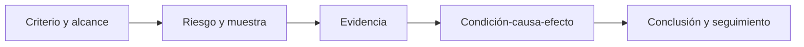

# Clase 285 — Auditoría de seguridad

> Parte: **14 — GRC, riesgo y cumplimiento** · Fuente: *(ISC)² CISSP Official Study Guide y SOC 2 (AICPA)*
> ⏱️ Duración estimada: **100 min** · Nivel: **Intermedio**

---

## 🎯 Objetivo

Aprender qué es una auditoría de seguridad, cómo se planifica y ejecuta, y cómo se sobrevive a ella desde el lado auditado. Al terminar sabrás distinguir auditoría interna de externa, recopilar y presentar evidencia, entender los informes SOC 1/SOC 2/SOC 3, gestionar hallazgos y no conformidades, y usar la auditoría como herramienta de mejora, no como examen temido.

## 📚 Resultados de aprendizaje

Al finalizar, el alumno podrá:

1. **Diferenciar** auditoría interna, externa, de primera/segunda/tercera parte.
2. **Planificar** una auditoría: alcance, criterios, plan y muestreo.
3. **Recopilar** y organizar evidencia de auditoría trazable.
4. **Interpretar** informes SOC 1/SOC 2 (Type I vs Type II).
5. **Gestionar** hallazgos, no conformidades y planes de acción correctiva.
6. **Contrastar** registros internos con confirmaciones externas y redactar conclusiones proporcionales al estado de la evidencia.

## 🗺️ Temas

| # | Tema | Por qué importa |
|---|------|-----------------|
| 1 | Tipos de auditoría y de auditor | Independencia y objetividad |
| 2 | Proceso de auditoría | Planificación, ejecución, informe, seguimiento |
| 3 | Criterios y evidencia | Contra qué se audita y con qué se prueba |
| 4 | Muestreo y pruebas | Cómo se verifica sin revisar el 100% |
| 5 | Informes SOC 1/2/3 y Type I/II | El estándar de aseguramiento de proveedores |
| 6 | Hallazgos y CAPA | Del hallazgo a la corrección |
| 7 | Auditoría continua y automatizada | Evidencia en tiempo real |
| 8 | Confirmación y conciliación independiente | Evita que la misma fuente cree la operación y certifique su resultado |
| 9 | Estado probatorio | Separa alegación, hallazgo de auditoría, condena e inferencia pedagógica |

## 🧠 Explicación en profundidad

Auditar es obtener evidencia suficiente y apropiada contra criterios acordados. Independencia, muestreo y trazabilidad condicionan la conclusión. Una entrevista describe diseño; una configuración o registro ayuda a comprobar operación; ninguna muestra permite afirmar más que su población y periodo.

### Caso razonado

Cinco tickets cerrados no demuestran el año completo. El auditor justifica población, selección y limitación antes de concluir.

### Madoff: la independencia cambia el valor de la evidencia

El informe del Inspector General de la SEC sobre la incapacidad del organismo para descubrir el
esquema de Bernard Madoff documentó que se pidieron registros de un tercero independiente, pero se
obtuvieron copias a través del propio Madoff. Ese recorrido destruye la independencia que se buscaba:
el documento puede parecer externo mientras su canal de adquisición sigue controlado por el sujeto
examinado. La respuesta de control no es «confiar más en la captura», sino confirmar directamente
con custodio, contraparte o infraestructura independiente, registrar el método y resolver
discrepancias.

La SEC explicó después que el uso de un custodio independiente y estados enviados directamente al
cliente limitan la oportunidad de uso indebido, y reforzó exámenes sorpresa y revisiones de control
para ciertos asesores con custodia. Esto no convierte toda autocustodia en fraude ni garantiza que
un tercero nunca falle. Cambia la arquitectura de confianza: separar quien administra de quien
mantiene o confirma el activo crea una fuente capaz de contradecir al operador.

### AC Inversions: contraste chileno y lenguaje procesal

En febrero de 2018, la Fiscalía de Chile comunicó una **reformalización** dentro de la investigación
de AC Inversions. Informó que peritajes contables de la Fiscalía cuantificaban fondos captados,
perjuicios y víctimas, y que existían personas formalizadas. Esa fuente oficial respalda lo que la
Fiscalía afirmó sobre la indagatoria en esa fecha; una formalización no es una condena y el texto no
documenta arquitectura informática, malware, logs ni una intrusión.

Para una auditoría, el aprendizaje es metodológico: preservar contratos y comunicaciones, obtener
cartolas y confirmaciones desde sus emisores, conciliar entradas, salidas y obligaciones, documentar
quién controla cada registro y escalar discrepancias al órgano competente. Si un pago existe, prueba
ese pago; no prueba la existencia ni rentabilidad de la inversión alegada. Si una hoja cuadra, no
demuestra que su origen sea independiente. La evidencia contable y digital se complementan, pero el
auditor de seguridad no dicta responsabilidad penal.

### Matriz de estados: no mezclar fuente con conclusión

| Etiqueta | Qué significa | Cómo debe escribirse |
|---|---|---|
| Hecho observado | El artefacto muestra un valor o evento concreto | «El registro A contiene X a la hora Y» |
| Alegación | Una parte o autoridad sostiene algo pendiente de resolución | «La demanda/Fiscalía alega X» |
| Hallazgo de examen o auditoría | Un profesional reporta evidencia y límites bajo un encargo | «El informe identificó X dentro de su alcance» |
| Condena o veredicto | Un tribunal fijó responsabilidad en el procedimiento indicado | «El tribunal declaró culpable/responsable por X» |
| Inferencia pedagógica | Control propuesto a partir del patrón, no hecho del caso | «Este patrón justifica ensayar segregación y confirmación» |

FTX, Celsius, Terra/UST, OneCoin, Madoff y AC Inversions tienen fuentes y estados procesales
distintos. No deben resumirse como una colección homogénea de «hackeos». El auditor cita el documento
exacto, su fecha, alcance y autoridad antes de derivar un control.

## 📔 Glosario operativo

| Término | Definición |
|---|---|
| Criterio | Requisito contra el que se compara evidencia. |
| Muestra | Subconjunto seleccionado mediante método documentado. |
| Hallazgo | Diferencia sustentada entre criterio y condición. |
| Confirmación externa | Evidencia solicitada y recibida directamente de una fuente independiente. |
| Procedencia | Historia del origen, adquisición y transformaciones de una evidencia. |

## ✅ Criterio de dominio

El alumno diseña una prueba, conserva evidencia y redacta un hallazgo proporcional sin actuar como dueño del control.

## 📖 Definiciones y características

- **Auditoría de seguridad**: evaluación sistemática e independiente de controles frente a un criterio. *Clave*: independencia y objetividad.
- **Auditor de primera/segunda/tercera parte**: interno, del cliente, o externo independiente. *Clave*: la certificación exige tercera parte.
- **Criterio de auditoría**: el estándar contra el que se compara (ISO 27001, PCI-DSS, política interna). *Clave*: sin criterio no hay auditoría.
- **Evidencia**: registros, entrevistas, observaciones y reejecuciones que sustentan una conclusión. *Clave*: debe ser trazable y suficiente.
- **SOC 2**: informe de aseguramiento sobre los Trust Services Criteria (seguridad, disponibilidad, confidencialidad, etc.). *Clave*: Type I evalúa el diseño; Type II, la eficacia operativa en un periodo.
- **Hallazgo / no conformidad**: incumplimiento detectado; mayor o menor. *Clave*: genera acción correctiva.
- **CAPA**: acción correctiva y preventiva. *Clave*: corrige la causa raíz, no solo el síntoma.

## 🧰 Herramientas y preparación

- Hoja de cálculo para el plan de auditoría, la matriz de evidencia y el registro de hallazgos.
- Referencia: *ISO 19011* (directrices para auditar sistemas de gestión) y los *Trust Services Criteria* de AICPA (SOC 2).
- Para evidencia técnica: capturas de configuración, logs, exportaciones de un IAM/SIEM (reutiliza lo aprendido en partes previas).
- Opcional: herramientas GRC de recolección continua de evidencia (Vanta, Drata) a nivel conceptual.

## 🧪 Laboratorio guiado (ejercicio aplicado)

Vas a preparar y "ejecutar" una auditoría interna de control de acceso en "Ferretería del Sur S.A.".
Todos los usuarios, eventos, transferencias y documentos son ficticios.

1. **Alcance y criterio**: define el alcance ("gestión de accesos a la plataforma de e-commerce") y el criterio (la política de la clase 282 y el control ISO 27001 A.5.15/A.8.2).
2. **Plan de auditoría**: redacta un plan con objetivos, criterio, áreas, entrevistados, fechas y método (revisión documental + muestreo técnico).
3. **Diseño de pruebas**: para 4 controles (MFA obligatorio, revocación de accesos al cese, principio de mínimo privilegio, revisión trimestral de permisos), define qué evidencia solicitarías y cómo la verificarías.
4. **Muestreo**: de una lista ficticia de 50 usuarios, define una muestra de 10 y comprueba (con datos de ejemplo) si tienen MFA y si los ex-empleados están deshabilitados.
5. **Registro de hallazgos**: documenta al menos 2 hallazgos (p. ej. "3 de 10 cuentas sin MFA"; "1 ex-empleado con acceso activo"), clasifícalos en mayor/menor y anota la evidencia.
6. **CAPA**: para cada hallazgo redacta la acción correctiva, la causa raíz y la fecha de cierre.
7. **Informe**: escribe un resumen ejecutivo de media página con conclusión (conforme con salvedades) y las recomendaciones priorizadas.
8. **SOC 2**: explica en 3 líneas si pedirías a tu proveedor cloud un SOC 2 Type I o Type II y por qué.
9. **Conciliación sintética**: amplía la muestra con diez transferencias ficticias. Cada fila debe
   unir `request_id`, solicitante, `approval_id`, aprobador, ejecutor, asiento, confirmación externa y
   timestamp. Incluye deliberadamente una operación sin aprobación, una confirmación ausente y una
   discrepancia de importe.
10. **Pruebas de segregación**: verifica que solicitante, aprobador, ejecutor y conciliador sean
    distintos según la política. Ensaya una prueba negativa: el mismo usuario no debe poder crear y
    aprobar. Una mera columna de rol no demuestra que la autorización técnica lo impida.
11. **Integridad y origen**: calcula el hash de los archivos de evidencia y registra adquisición.
    Escribe al lado: «el hash permite comprobar igualdad de bytes; no demuestra autoría,
    autenticidad del origen ni exhaustividad».
12. **Conclusiones limitadas**: redacta cada hallazgo con condición, criterio, evidencia, población,
    impacto y límite. La operación sin aprobación demuestra una ruptura del control en la muestra;
    no demuestra fraude, intención ni qué persona usó la cuenta.
13. **Extensión natural**: ejecuta el
    [laboratorio de custodia de activos digitales](../../../labs/custodia-activos-digitales/README.md)
    y audita su matriz maker-checker. Usa su dataset sintético, no construyas otro framework.

## ✍️ Ejercicios

1. Diferencia auditoría de primera, segunda y tercera parte con un ejemplo.
2. ¿Por qué el auditor no puede auditar su propio trabajo? Explica el principio de independencia.
3. Convierte un control ("los accesos se revisan trimestralmente") en una prueba de auditoría con evidencia concreta.
4. Explica la diferencia entre SOC 2 Type I y Type II.
5. Clasifica en mayor/menor: falta total de MFA en administradores; una excepción documentada y aprobada.
6. Redacta una CAPA para el hallazgo "logs del SIEM se retienen 7 días en lugar de 90".
7. Compara Madoff y AC Inversions sin equipararlos: identifica una lección común sobre evidencia
   externa y dos diferencias de fuente, jurisdicción o estado procesal.
8. Clasifica cinco enunciados sobre los seis casos como hecho, alegación, hallazgo, condena,
   inferencia o hipótesis pedagógica; corrige cualquier frase que los llame «hackeos» sin respaldo.

## 📝 Reto verificable

Entrega un **paquete de auditoría interna** con: plan de auditoría, diseño de pruebas para 4 controles, muestreo ejecutado con hallazgos clasificados, CAPA por hallazgo y un informe ejecutivo con conclusión.

**Criterio de aceptación**: cada hallazgo cita evidencia y criterio incumplido, cada CAPA identifica causa raíz y fecha de cierre, y el informe distingue hallazgos mayores de menores con recomendaciones priorizadas.
La muestra ampliada debe ser reproducible, señalar las tres anomalías sembradas y declarar al menos
cuatro conclusiones no soportadas: fraude, intención, identidad humana y autenticidad de origen por
el solo hecho de disponer de un hash.

## ⚠️ Errores comunes

| Síntoma / mensaje | Causa y cómo arreglar |
|-------------------|-----------------------|
| Auditar sin criterio definido | Conclusiones subjetivas; fija el estándar antes de empezar |
| Evidencia anecdótica ("me dijeron que...") | No es trazable; exige registros, configuraciones o logs |
| Auditor sin independencia | Conflicto de interés; separa quien opera de quien audita |
| Hallazgos sin causa raíz | Se repiten; en la CAPA analiza el porqué, no solo el qué |
| Confundir SOC 2 Type I con Type II | Type I es diseño puntual; Type II prueba eficacia en el tiempo |
| Pedir una confirmación «externa» al auditado | El canal sigue bajo control de la fuente examinada; solicita y recibe directamente del tercero |
| Una conciliación cuadra y se da por auténtica | Cuadrar prueba consistencia entre datos seleccionados, no procedencia, completitud ni legitimidad |
| Una anomalía se etiqueta como fraude | El hallazgo de control no establece intención ni responsabilidad penal; limita y escala la conclusión |

## ❓ Preguntas frecuentes

**❓ ¿La auditoría es lo mismo que un pentest?**
No. El pentest prueba explotabilidad técnica; la auditoría evalúa si los controles existen, están diseñados y operan según un criterio. Se complementan.

**❓ ¿SOC 2 lo emite cualquiera?**
No; lo emite un auditor CPA independiente conforme a los estándares de la AICPA. Por eso da aseguramiento a los clientes del proveedor.

**❓ ¿Una no conformidad menor bloquea la certificación?**
Normalmente no si se aborda con una CAPA; una mayor sí suele bloquearla hasta corregirse. Depende del esquema.

**❓ ¿Qué es la auditoría continua?**
El uso de herramientas que recolectan evidencia automáticamente (configuraciones, logs, controles) de forma permanente, en lugar de una foto anual.

**❓ ¿Un hash convierte un archivo en evidencia auténtica?**
No. Permite comparar bytes con un valor previo si la adquisición y el algoritmo están documentados.
La autenticidad del origen, la identidad del emisor y la completitud requieren controles y evidencia
adicionales.

## 🔗 Referencias

- ISO 19011:2018 — Directrices para la auditoría de sistemas de gestión. <https://www.iso.org/standard/70017.html>
- AICPA — SOC 2 y Trust Services Criteria. <https://www.aicpa-cima.com/topic/audit-assurance/audit-and-assurance-greater-than-soc-2>
- ISACA — IT Audit Framework (ITAF). <https://www.isaca.org/resources/itaf>
- (ISC)² CISSP Official Study Guide, dominio 6 (Security Assessment and Testing).
- NIST SP 800-53A — Assessing Security Controls. <https://csrc.nist.gov/pubs/sp/800/53/a/r5/final>
- SEC Office of Inspector General — *Investigation of Failure of the SEC to Uncover Bernard Madoff's Ponzi Scheme* (2009); respalda el fallo de confirmación independiente y los límites de las revisiones. <https://www.sec.gov/oig/oig-reports-investigation-failure-madoff-ponzi-scheme>
- U.S. Securities and Exchange Commission — declaración sobre reglas de custodia posteriores a Madoff; respalda la función de custodio independiente, estados directos y exámenes sorpresa. <https://www.sec.gov/newsroom/speeches-statements/spch121609mls-custody-statement-sec-open-meeting-custody-rules-investment-advisers>
- Fiscalía de Chile — reformalización e información de peritajes contables en la investigación de AC Inversions (2018). La referencia respalda alegaciones y estado de la indagatoria en esa fecha, no una conclusión técnica ni una condena. <https://www.fiscaliadechile.cl/actualidad/noticias/regionales/caso-ac-inversions-fiscalia-de-alta-complejidad-reformalizo>

## 🔬 Aplicación transversal

Audita diseño y operación de la matriz maker-checker del
[caso de custodia de activos digitales](../../../labs/custodia-activos-digitales/README.md).
No aceptes capturas de la UI como única prueba: ensaya permisos negativos por API,
revisa sesiones PAM y muestrea retiros contra aprobación, firma, asiento y TXID.

## 📥 Material descargable

- 📄 [Guía en PDF](./clase-285-guia.pdf) — versión imprimible de esta clase.
- 🎞️ [Presentación (PPTX)](./clase-285-presentacion.pptx) — deck para proyectar en clase.

## ⬅️ Clase anterior

[Clase 284 — Gestión de riesgo de terceros y proveedores](../284-gestion-de-riesgo-de-terceros-y-proveedores/README.md)

## ➡️ Siguiente clase

[Clase 286 — Concienciación y cultura de seguridad](../286-concienciacion-y-cultura-de-seguridad/README.md)
