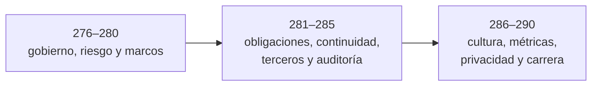

# Parte 14 — GRC, riesgo y cumplimiento

> [⬅️ Volver al programa](../../README.md) · [📚 Índice completo](../README.md) · [⏭️ Parte siguiente](../parte-15-seguridad-de-ia-y-machine-learning/README.md)

**15 clases** · rango 276–290 · Gobernanza, ISO 27001, NIST, PCI-DSS, auditoría y carrera

**Fuentes de referencia de esta parte:**

- Chapple, Stewart, Gibson — *(ISC)² CISSP Official Study Guide*, 9.ª ed. (Sybex).
- Douglas Hubbard, Richard Seiersen — *How to Measure Anything in Cybersecurity Risk*, 2.ª ed. (Wiley).
- *ISO/IEC 27001:2022* e *ISO/IEC 27005:2022* — Sistemas de Gestión de Seguridad de la Información y gestión de riesgos.
- *NIST Cybersecurity Framework 2.0* y *NIST SP 800-37 / SP 800-53 / SP 800-30* (Risk Management Framework).
- *CIS Critical Security Controls v8.1* (Center for Internet Security).
- *PCI DSS v4.0* (PCI Security Standards Council) y *Reglamento (UE) 2016/679 (GDPR)*.

---

## 🎯 ¿De qué trata esta parte?

Hasta aquí el programa ha sido eminentemente técnico: explotación, defensa, forense, cloud, redes. Esta parte cambia de altitud y aborda **cómo se gobierna la seguridad como función de negocio**. GRC son las siglas de *Governance, Risk & Compliance* (gobernanza, riesgo y cumplimiento), el marco que conecta la estrategia de una organización con sus controles técnicos, sus obligaciones legales y su tolerancia al riesgo. Sin GRC, la ciberseguridad es un conjunto de herramientas sin dirección; con GRC, es una disciplina medible y auditable que la dirección puede financiar y rendir cuentas.

Aquí aprenderás a pensar como un CISO, un auditor o un analista de riesgo: a traducir amenazas técnicas en riesgo cuantificado en euros, a implantar un SGSI conforme a ISO 27001, a mapear controles contra NIST CSF y CIS, a cumplir GDPR, HIPAA y PCI-DSS sin morir en el intento, y a redactar las políticas y planes (BCP/DRP) que sostienen la resiliencia del negocio. También cubrimos disciplinas emergentes como el riesgo de terceros, los ciberseguros y la privacidad como derecho.

Sirve a quien aspire a roles de gestión (CISO, GRC analyst, auditor, DPO, risk manager), pero también al técnico que quiere entender *por qué* existe un control y cómo defender su presupuesto ante la dirección. La parte cierra con una clase de certificaciones y carrera para orientar tu siguiente paso profesional.

## 🧩 Problemas que resuelve

- Cómo justificar la inversión en seguridad ante la dirección con lenguaje de negocio y riesgo, no de miedo.
- Cómo decidir **qué controles priorizar** cuando el presupuesto y el tiempo son finitos.
- Cómo cumplir simultáneamente varias regulaciones (GDPR, HIPAA, PCI-DSS) sin duplicar esfuerzo.
- Cómo demostrar cumplimiento a auditores, clientes y reguladores con evidencia trazable.
- Cómo mantener la operación tras un incidente grave, un ransomware o un desastre físico (BCP/DRP).
- Cómo gestionar el riesgo que introducen proveedores y terceros en tu cadena de suministro.
- Cómo medir si el programa de seguridad realmente mejora, con KPIs y KRIs accionables.
- Cómo separar token imitador, drainer, rug pull y caída de mercado antes de asignar controles o responsabilidad.

## 🎓 Resultados de aprendizaje

Al terminar esta parte, el alumno podrá:

1. Diseñar una estructura de gobernanza de seguridad con roles, comités y apetito de riesgo definidos.
2. Ejecutar un análisis de riesgo cuantitativo (SLE, ARO, ALE) y cualitativo, y elegir el tratamiento correcto.
3. Planificar la implantación de un SGSI conforme a ISO/IEC 27001:2022, incluido el SoA.
4. Mapear los controles de una organización contra NIST CSF 2.0 y los CIS Controls v8.1.
5. Identificar los requisitos aplicables de GDPR, HIPAA y PCI-DSS a un escenario concreto.
6. Redactar políticas, estándares y procedimientos coherentes y auditables.
7. Construir un BCP/DRP con BIA, RTO y RPO calculados y estrategias de recuperación.
8. Definir un cuadro de mando de métricas (KPI/KRI) y evaluar la cobertura de un ciberseguro.
9. Evaluar privilegios, segregación, trazabilidad y evidencia externa sin atribuir fraude o causa técnica más allá de la fuente.
10. Formular escenarios distintos para riesgo técnico, de promotor, liquidez y mercado aunque produzcan una pérdida parecida.

## 🧱 Prerrequisitos

Esta parte asume las bases técnicas del programa completo (Partes 1–13): fundamentos de redes y sistemas (Partes 0–1), criptografía (Parte 2), detección (Parte 8), respuesta a incidentes y forense (Parte 9) y seguridad en la nube (Parte 10). No requiere programación avanzada, pero sí madurez para razonar sobre procesos, personas y negocio, no solo tecnología.

## 🗺️ Estructura temática

## 🧭 Recorrido clase a clase

Las clases 276–280 construyen autoridad, escenarios de riesgo y selección contextual de ISO 27001, CSF y CIS. Las clases 281–285 convierten obligaciones en evidencia, documentos operables, continuidad probada, gobierno de proveedores y auditoría independiente. Las clases 286–290 cierran con conducta, métricas, transferencia financiera, privacidad y desarrollo profesional. Cada clase produce una decisión o evidencia que alimenta la siguiente; ningún marco se enseña como checklist universal.

1. **[Clase 276 — Gobernanza de la seguridad de la información](276-gobernanza-de-la-seguridad-de-la-informacion/README.md).** Separa gobierno, gestión y operación; asigna autoridad, apetito de riesgo y rendición de cuentas. FTX y Celsius se usan con fuentes y estados procesales explícitos para convertir concentración de privilegios, excepciones e información incompleta en requisitos verificables. La evidencia es una RACI, un charter y una excepción sintética con prueba negativa y revisión.
2. **[Clase 277 — Gestión de riesgos cuantitativa y cualitativa](277-gestion-de-riesgos-cuantitativa-y-cualitativa/README.md).** Convierte escenarios en frecuencia, magnitud, incertidumbre y tratamiento. Terra/UST sirve para separar riesgo económico, de modelo, liquidez, cumplimiento y ciberseguridad; el caso viral contrasta token imitador, drainer, retiro de liquidez y caída de mercado. La evidencia es una hoja enlazada y una clasificación de hipótesis con datos que podrían confirmarlas o refutarlas.
3. **[Clase 278 — ISO/IEC 27001 e implantación de un SGSI](278-iso-iec-27001-e-implantacion-de-un-sgsi/README.md).** Toma riesgos y decisiones de las dos clases anteriores y los integra en alcance, liderazgo, tratamiento, Declaración de Aplicabilidad y mejora continua. La evidencia es un diseño de SGSI cuyo control seleccionado conserva justificación, dueño y revisión.
4. **[Clase 279 — NIST Cybersecurity Framework](279-nist-cybersecurity-framework/README.md).** Organiza resultados de ciberseguridad con las seis funciones de CSF 2.0 y compara perfil actual con objetivo. La evidencia es un perfil priorizado que comunica brechas sin convertir el *Tier* en una certificación.
5. **[Clase 280 — Controles CIS](280-controles-cis/README.md).** Pasa del lenguaje de resultados a salvaguardas priorizadas mediante Implementation Groups y Benchmarks. La evidencia es una selección contextual de controles con criterio técnico de verificación, no la adopción ciega de un catálogo.
6. **[Clase 281 — Cumplimiento: GDPR, HIPAA y PCI-DSS](281-cumplimiento-gdpr-hipaa-y-pci-dss/README.md).** Determina aplicabilidad antes de mapear obligaciones a controles. La evidencia es una matriz requisito-control-evidencia que declara jurisdicción, alcance y vacíos, y prepara la jerarquía documental siguiente.
7. **[Clase 282 — Políticas, estándares y procedimientos](282-politicas-estandares-y-procedimientos/README.md).** Convierte obligaciones y decisiones en documentos distintos, versionados, aprobados y operables. La evidencia es una política acompañada de estándar y procedimiento cuya ejecución pueda auditarse.
8. **[Clase 283 — Continuidad de negocio y recuperación](283-continuidad-de-negocio-y-plan-de-recuperacion-ante-desastres/README.md).** Usa BIA, MTD, RTO y RPO para diseñar continuidad y recuperación, y exige pruebas en lugar de planes de estantería. La evidencia es un BCP/DRP ejercitado con resultados, desviaciones y acciones.
9. **[Clase 284 — Riesgo de terceros y proveedores](284-gestion-de-riesgo-de-terceros-y-proveedores/README.md).** Extiende gobierno y continuidad al ciclo de vida del proveedor, desde diligencia y contrato hasta salida. La evidencia es una evaluación proporcionada al servicio, cláusulas verificables y respuesta ante cambios del riesgo.
10. **[Clase 285 — Auditoría de seguridad](285-auditoria-de-seguridad/README.md).** Comprueba diseño y operación mediante criterio, muestreo, procedencia y confirmación independiente. Madoff y AC Inversions enseñan por qué evidencia interna, externa y procesal no son equivalentes; el laboratorio existente de custodia aporta transferencias ficticias, maker-checker y conciliación. La evidencia es un paquete de auditoría que detecta anomalías sin atribuir intención, identidad humana o fraude.
11. **[Clase 286 — Concienciación y cultura](286-concienciacion-y-cultura-de-seguridad/README.md).** Trata conducta y contexto como parte de un sistema y diseña formación segmentada con reporte seguro. La evidencia es una intervención medible que no culpa a la víctima ni confunde clic con compromiso.
12. **[Clase 287 — Métricas de seguridad](287-metricas-de-seguridad-kpis-y-kris/README.md).** Distingue rendimiento, riesgo y eficacia de control, y conecta indicadores con umbrales y decisiones. La evidencia es un cuadro de mando con dueño, fuente, frecuencia, límites y acción esperada.
13. **[Clase 288 — Seguros cibernéticos](288-seguros-ciberneticos/README.md).** Evalúa la transferencia financiera del riesgo después de cuantificarlo y controlarlo. La evidencia es un análisis de cobertura, exclusiones, retención y controles exigidos que no presenta la póliza como sustituto de seguridad.
14. **[Clase 289 — Privacidad y protección de datos](289-privacidad-y-proteccion-de-datos/README.md).** Profundiza desde cumplimiento hacia privacidad por diseño, minimización y evaluación de impacto. La evidencia es una DPIA que separa necesidad, riesgo para personas, medidas y riesgo residual.
15. **[Clase 290 — Certificaciones y carrera](290-certificaciones-y-desarrollo-de-carrera/README.md).** Cierra traduciendo las competencias y artefactos producidos en un plan profesional. La evidencia es una ruta de 12–24 meses y un portfolio que demuestra trabajo verificable, no solo credenciales.

| Bloque | Clases | Enfoque |
|--------|--------|---------|
| Gobernanza y riesgo | 276–277 | Estructura de gobierno y análisis de riesgo cuanti/cualitativo |
| Marcos y estándares | 278–280 | ISO 27001/SGSI, NIST CSF, CIS Controls |
| Cumplimiento legal | 281, 289 | GDPR, HIPAA, PCI-DSS, privacidad y protección de datos |
| Documentación y resiliencia | 282–283 | Políticas/estándares/procedimientos, BCP/DRP |
| Riesgo extendido y verificación | 284–285 | Riesgo de terceros, auditoría de seguridad |
| Cultura y medición | 286–287 | Concienciación, métricas KPI/KRI |
| Transferencia de riesgo y carrera | 288, 290 | Ciberseguros, certificaciones y desarrollo profesional |

## 🔗 Referencias de la parte

- (ISC)² CISSP Official Study Guide — <https://www.wiley.com/en-us/CISSP+Official+Study+Guide>
- How to Measure Anything in Cybersecurity Risk — <https://www.howtomeasureanything.com/cybersecurity/>
- ISO/IEC 27001 — <https://www.iso.org/standard/27001>
- NIST Cybersecurity Framework — <https://www.nist.gov/cyberframework>
- CIS Critical Security Controls — <https://www.cisecurity.org/controls>
- PCI Security Standards Council — <https://www.pcisecuritystandards.org/>
- GDPR (texto oficial) — <https://eur-lex.europa.eu/eli/reg/2016/679/oj>
- U.S. House Committee on Financial Services — testimonio de John J. Ray III sobre controles de
  FTX (2022). <https://docs.house.gov/meetings/BA/BA00/20221213/115246/HHRG-117-BA00-Wstate-RayJ-20221213.pdf>
- U.S. Federal Trade Commission — acuerdo con Celsius Network y cargos contra antiguos ejecutivos
  (2023). <https://www.ftc.gov/news-events/news/press-releases/2023/07/ftc-reaches-settlement-crypto-platform-celsius-network-charges-former-executives-duping-consumers>
- U.S. Securities and Exchange Commission — acuerdo posterior al veredicto de Terraform/UST
  (2024). <https://www.sec.gov/newsroom/press-releases/2024-73>
- SEC Office of Inspector General — investigación sobre los fallos para descubrir el esquema de
  Bernard Madoff (2009). <https://www.sec.gov/oig/oig-reports-investigation-failure-madoff-ponzi-scheme>
- Fiscalía de Chile — reformalización y peritajes contables informados en el caso AC Inversions
  (2018). <https://www.fiscaliadechile.cl/actualidad/noticias/regionales/caso-ac-inversions-fiscalia-de-alta-complejidad-reformalizo>

## ▶️ Empezar

[Clase 276 — Gobernanza de la seguridad de la información](276-gobernanza-de-la-seguridad-de-la-informacion/README.md)
