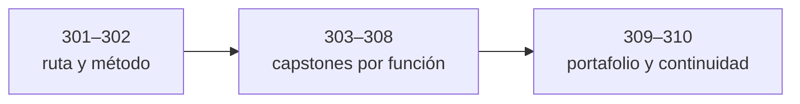

# Parte 16 — Capstones y preparación de certificaciones

> [⬅️ Volver al programa](../../README.md) · [📚 Índice completo](../README.md) · [⏮️ Parte anterior](../parte-15-seguridad-de-ia-y-machine-learning/README.md)

**10 clases** · rango 301–310 · Roadmap OSCP/CISSP, proyectos integradores y aprendizaje continuo

**Fuentes de referencia de esta parte:**

- Georgia Weidman, *Penetration Testing: A Hands-On Introduction to Hacking* (No Starch Press).
- Offensive Security, *PEN-200 / OSCP Course Guide* y filosofía "Try Harder".
- (ISC)², *CISSP Official Study Guide* (Chapple, Stewart, Gibson) — los 8 dominios del CBK.
- NIST SP 800-115, *Technical Guide to Information Security Testing and Assessment*.
- MITRE ATT&CK® y el *Penetration Testing Execution Standard (PTES)*.
- OWASP *Web Security Testing Guide (WSTG)* y *Testing Guide*.

---

## 🎯 ¿De qué trata esta parte?

Esta es la **última parte del programa** y funciona como puente entre el aprendizaje y la carrera profesional. Aquí no se introduce un dominio nuevo: se **integra todo** lo construido en las Partes 1–15 mediante capstones end-to-end que reproducen trabajo real —una operación Red Team, una cacería Blue Team, una investigación DFIR, una campaña de bug bounty— con objetivos, entregables y criterios de aceptación explícitos.

Además, esta parte traza el **roadmap de certificaciones** que ordena tu progresión profesional (CompTIA Security+/PenTest+/CySA+, OSCP, CISSP y más), con planes de estudio concretos para OSCP y CISSP. Las certificaciones no son el objetivo final, pero son señales de mercado que abren puertas y estructuran el conocimiento.

Sirve a quien terminó el temario y necesita **demostrar competencia**: convertir 300 clases en un portafolio verificable, un home lab permanente y un plan de aprendizaje continuo que sostenga la carrera durante años. Cada capstone referencia las clases previas por su número para que sepas exactamente qué reforzar.

## 🧩 Problemas que resuelve

- No saber **qué certificación** perseguir primero ni en qué orden según tu perfil (ofensivo, defensivo, GRC).
- Tener conocimiento fragmentado en clases sueltas sin un **proyecto integrador** que lo demuestre.
- Llegar al examen OSCP sin **metodología ni gestión del tiempo**, y rendirse ante máquinas difíciles.
- Enfrentar el CISSP sin un mapa claro de los **8 dominios** y su peso relativo.
- No tener **evidencia empleable**: writeups, informes, repos y un home lab que un reclutador pueda revisar.
- Carecer de un **plan sostenible** para mantenerse actualizado tras terminar el curso.
- Confundir "hacer laboratorios" con **producir entregables profesionales** (informes con criterios de aceptación).

## 🎓 Resultados de aprendizaje

Al terminar la parte, el alumno podrá:

- Diseñar un **roadmap de certificaciones** personalizado con hitos, costes y tiempos realistas.
- Ejecutar un **examen simulado tipo OSCP** aplicando metodología, toma de notas y gestión del tiempo.
- Completar un **pentest end-to-end** entregando un informe con hallazgos, CVSS y remediaciones.
- Mapear los **8 dominios del CISSP** y autoevaluar su preparación con un plan de estudio.
- Conducir una **operación Red Team** completa (recon → C2 → movimiento lateral → objetivos → informe).
- Construir una **detección Blue Team** end-to-end con reglas, alertas y métricas de cobertura ATT&CK.
- Realizar una **investigación DFIR** con cadena de custodia, línea de tiempo y reporte ejecutivo.
- Ejecutar una **campaña de bug bounty** ética con triage, PoC y reportes aceptables.
- Publicar un **portafolio** y un **home lab permanente** reproducibles.
- Redactar un **plan de aprendizaje continuo** con fuentes, cadencia y comunidad.

## 🧱 Prerrequisitos

Esta parte asume **haber cursado las Partes 1–15**. En concreto: fundamentos y redes (Partes 1–3), Linux/Windows y scripting (Partes 4–5), pentest web y de infraestructura (Partes 6–8), Red Team y C2 (Parte 9), Blue Team, SIEM y threat hunting (Partes 10–11), DFIR y análisis de malware (Partes 12–13), cloud y DevSecOps (Parte 14) y seguridad de IA (Parte 15). Los capstones reutilizan esas técnicas; ten a mano tu laboratorio (Clase 010 y equivalentes) funcionando.

## 🗺️ Estructura temática

## 🧭 Recorrido clase a clase

Las clases 301–302 traducen rol y diagnóstico en una preparación verificable. Las clases 303–308 integran pentest, CISSP, red team, blue team, DFIR y bug bounty mediante entregables y límites propios de cada función. Las clases 309–310 convierten resultados en portafolio sanitizado y en un sistema sostenible de aprendizaje. Fechas, precios, versiones y requisitos de credenciales se consultan siempre en el organismo emisor.

### Capítulos enlazados

**[Clase 301 — Roadmap de certificaciones: CompTIA, OSCP, CISSP y más](301-roadmap-de-certificaciones-comptia-oscp-cissp-y-mas/README.md).** Que el alumno construya un **roadmap de certificaciones personalizado**, entendiendo qué credencial demuestra qué competencia, cuál es el orden lógico según su perfil (ofensivo, defensivo o de gestión), y cuánto cuesta en dinero, tiempo y esfuerzo.

**[Clase 302 — Preparación OSCP: mentalidad Try Harder](302-preparacion-oscp-mentalidad-try-harder/README.md).** Que el alumno interiorice la **metodología y la mentalidad** que exige el OSCP: enumeración exhaustiva, toma de notas disciplinada, gestión del tiempo bajo presión y persistencia ("Try Harder") sin caer en la frustración improductiva.

**[Clase 303 — Capstone: laboratorio completo de pentest](303-capstone-laboratorio-completo-de-pentest/README.md).** Ejecutar un **pentest end-to-end** contra un laboratorio propio multi-máquina, siguiendo una metodología profesional (PTES / NIST SP 800-115) y entregando un **informe formal** con hallazgos, puntuación CVSS y recomendaciones de remediación.

**[Clase 304 — Preparación CISSP: los 8 dominios](304-preparacion-cissp-los-8-dominios/README.md).** Que el alumno obtenga un **mapa completo de los 8 dominios del CISSP**, entienda su peso relativo en el examen y la mentalidad "manager" que exige (pensar en riesgo y negocio antes que en la solución técnica), y elabore un **plan de estudio** con autoevaluación por dominio.

**[Clase 305 — Capstone: operación Red Team end-to-end](305-capstone-operacion-red-team-end-to-end/README.md).** Ejecutar una **operación Red Team completa** contra tu laboratorio, simulando un adversario con objetivos de negocio (no solo "hackear máquinas"): reconocimiento, acceso inicial, establecimiento de C2, movimiento lateral, escalada, consecución de objetivos y evasión, todo mapeado a **MITRE ATT&CK**.

**[Clase 306 — Capstone: detección Blue Team end-to-end](306-capstone-deteccion-blue-team-end-to-end/README.md).** Construir una **capacidad de detección Blue Team end-to-end**: instrumentar hosts y red, centralizar logs en un SIEM, escribir reglas de detección, generar alertas y medir la **cobertura ATT&CK** frente a la operación Red Team de la Clase 305.

**[Clase 307 — Capstone: respuesta a incidentes DFIR end-to-end](307-capstone-respuesta-a-incidentes-dfir-end-to-end/README.md).** Conducir una **investigación DFIR completa** sobre un incidente simulado: desde la detección y contención hasta la adquisición forense, el análisis (disco, memoria, línea de tiempo), la erradicación, la recuperación y el informe con lecciones aprendidas.

**[Clase 308 — Capstone: campaña de bug bounty](308-capstone-campana-de-bug-bounty/README.md).** Ejecutar una **campaña de bug bounty ética y estructurada**: elegir un programa, leer y respetar su alcance, hacer reconocimiento eficiente, priorizar vectores de alto impacto, validar hallazgos con PoC reproducibles y **redactar reportes aceptables** que maximicen la probabilidad de triage positivo.

**[Clase 309 — Construcción de portafolio y home lab permanente](309-construccion-de-portafolio-y-home-lab-permanente/README.md).** Convertir el trabajo de las 308 clases anteriores en **evidencia empleable**: un portafolio público (writeups, informes anonimizados, repos) y un **home lab permanente y reproducible** donde seguir practicando.

**[Clase 310 — Plan de aprendizaje continuo y comunidad](310-plan-de-aprendizaje-continuo-y-comunidad/README.md).** Cerrar el programa con un **plan de aprendizaje continuo** que sostenga tu carrera durante años: fuentes de calidad, una cadencia de práctica, participación en comunidad, contribución (charlas, blog, open source) y una hoja de ruta de especialización.

| Bloque | Clases | Enfoque |
|--------|--------|---------|
| Roadmap y mentalidad | 301, 302 | Certificaciones y preparación OSCP |
| Capstones ofensivos | 303, 305, 308 | Pentest, Red Team, bug bounty |
| Certificación de gestión | 304 | CISSP y los 8 dominios |
| Capstones defensivos | 306, 307 | Blue Team y DFIR |
| Carrera y continuidad | 309, 310 | Portafolio, home lab y aprendizaje continuo |

## 🔗 Referencias de la parte

- CompTIA — rutas de certificación: <https://www.comptia.org/certifications>
- Offensive Security — OSCP / PEN-200: <https://www.offsec.com/courses/pen-200/>
- (ISC)² — CISSP: <https://www.isc2.org/certifications/cissp>
- NIST SP 800-115: <https://csrc.nist.gov/pubs/sp/800/115/final>
- MITRE ATT&CK®: <https://attack.mitre.org/>
- OWASP WSTG: <https://owasp.org/www-project-web-security-testing-guide/>
- PTES: <http://www.pentest-standard.org/>

## ▶️ Empezar

[Clase 301 — Roadmap de certificaciones: CompTIA, OSCP, CISSP y más](301-roadmap-de-certificaciones-comptia-oscp-cissp-y-mas/README.md)
